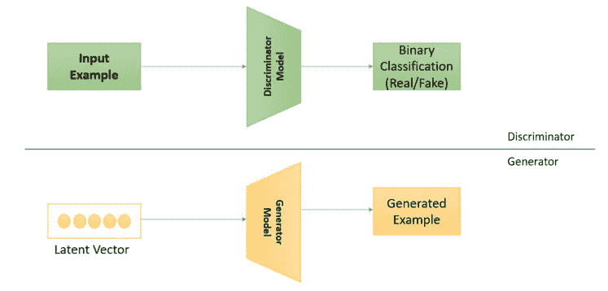
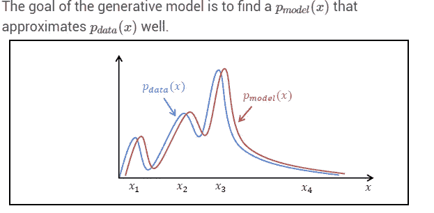
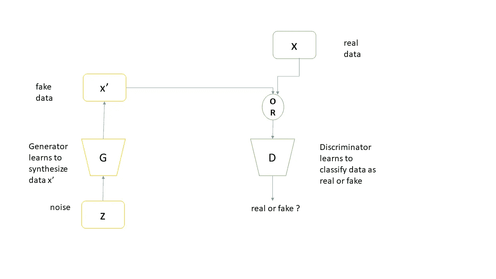
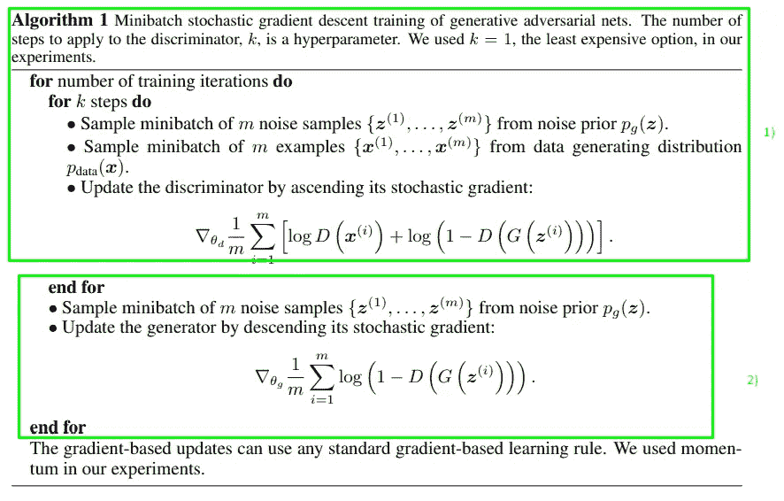
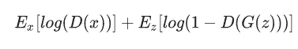
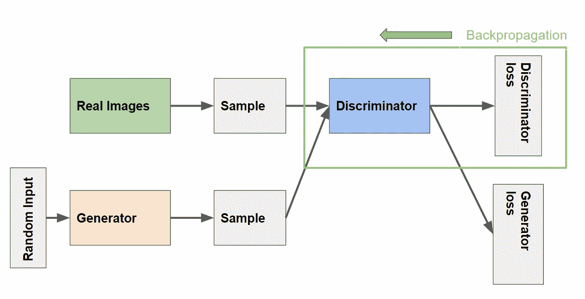
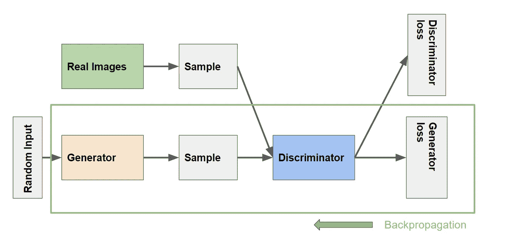
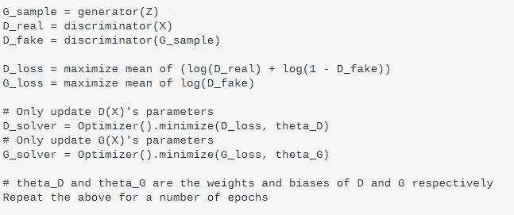
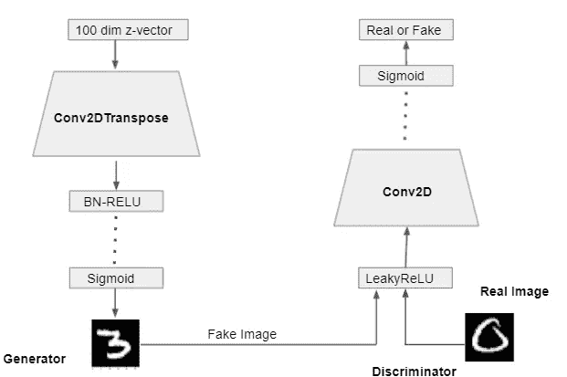
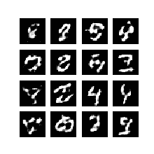

# 初学者 GANs 背后的直觉

> 原文：<https://pub.towardsai.net/intuition-behind-gan-for-beginners-bb4da5c54480?source=collection_archive---------0----------------------->

## [深度学习](https://towardsai.net/p/category/machine-learning/deep-learning)

照片来自 Unsplash

Y 你可能听说过[深度造假视频](https://www.youtube.com/watch?v=T76bK2t2r8g)或者访问过[这个人不出境](https://thispersondoesnotexist.com/)，在那里甘被用来创造那些。很有趣吧。在这篇文章中，我们将深入讨论 GAN 背后的基本直觉，以及它在 Tensorflow 中的实现。让我们开始吧。

简而言之，GAN 是一种使用深度学习方法(如卷积神经网络)进行生成建模的方法。生成建模是机器学习中的一项无监督学习任务，其目标是找到输入数据中的隐藏模式，并产生与输入数据具有相似特征的似是而非的图像。

GAN 能够通过训练称为**生成器**和**鉴别器**(也称为**鉴别器**)的两个竞争(和合作)网络来学习如何对输入分布建模。生成器的任务是不断找出如何生成假数据或信号来欺骗鉴别器。最初，一些噪声输入被提供给发电机以对其进行处理。另一方面，训练鉴别器来区分假信号和真信号。

GAN 的主要概念很简单。GAN 模型架构包括两个子模型:用于生成新示例的生成器模型和用于对所生成的示例是真实的(来自域)还是虚假的(由生成器模型生成)进行分类的鉴别器模型。让我们把它看成:

鉴别器和发生器模型

*   **鉴别器**:学习如何将输入分类为真实(来自域)或虚假(生成)的模型。
*   **生成器**:从问题域生成新的相似图像的模型。

生成器尝试生成类似于输入分布的可信图像

# 甘是怎么工作的？

构成 GAN 的两个神经网络被称为生成器和鉴别器。GAN 生成器生成新的数据实例，鉴别器验证它们是属于数据集(真实的)还是生成的(虚假的)。鉴别器是一个全连接的神经网络，它将输入的示例分类为真实(1.0)或虚假(0.0)。每隔一段时间，生成器将假装其输出是真正的数据，并要求鉴别器将其标记为 1.0。当假数据随后被呈现给
鉴别器时，自然会被归类为标签接近 0.0 的假数据。

总的来说，整个过程是两个网络在相互合作的同时相互竞争。最后，当 GAN 训练收敛时，最终结果是一个生成器，它可以生成看似真实的似是而非的数据。鉴别器认为这个合成的数据是真实的，并将其标记为 1.0。

GAN:两个网络->生成器和鉴别器

发生器的输入是噪声，输出是合成数据。同时，鉴别器的输入将是真实的或合成的数据。真实数据来自真实的采样数据，而假数据来自发生器。所有真实数据被标记为 1.0(即 100%真实概率)，而所有合成数据(虚假数据)被标记为 0.0(即 0%真实概率)。下面是 GAN 作者的一个算法:

原始论文中的算法:Goodfellow，Ian 等[1]

如您所见，鉴别器更新了 k 步，然后生成器才更新。这个过程不断重复。k 可以设置为 1，但通常值越大越好(Goodfellow 等人，2014)。任何基于梯度的学习规则都可以用于优化。

上述算法中显示的损失函数称为最小最大损失。因为生成器试图最小化函数，而鉴别器试图最大化函数。它可以写成:

最小最大损失方程

一些批注是:

d(x)→鉴别器判定给定真实数据实例 x 为真实的概率。

Eₓ →总体实例的期望值。

G(z) →发电机输出给出噪声矢量 z。

D(G(z)) →鉴别器给出的假数据实例 z 为真的概率。

E𝓏 →期望值总体生成虚假实例。

发电机不能直接影响函数中的`log(D(x))`项，所以，对于发电机来说，最小化损耗就相当于最小化`log(1 - D(G(z)))`。

总而言之，生成模型和判别模型之间的区别在于:

*   一个**判别**模型学习一个函数，该函数将输入数据( *x* )映射到某个期望的输出类标签( *y* )。用概率术语来说，他们直接学习条件分布 *P(y|x)* 。
*   **生成型**模型试图同时学习输入数据和标签的联合概率，即 *P(x，y)* 。这可以通过贝叶斯规则转换为 *P(y|x)* 用于分类，但是生成能力也可以用于其他事情，例如创建可能的新 *(x，y)* 样本。

**训练鉴别器**

鉴别器连接到两个损失函数。在鉴频器训练期间，鉴频器忽略发电机损耗，仅使用鉴频器损耗。我们在发电机培训中使用发电机损耗。

**鉴别器训练中的反向传播**

鉴别器的训练数据来自两个来源:

*   **真实数据**实例，如人的真实照片。鉴别器在训练中使用这些实例作为正面例子。
*   **假数据**实例由生成器创建。鉴别器在训练中使用这些实例作为反面例子。

在上图中，两个“样本”框代表这两个输入鉴别器的数据源。在鉴别器训练期间，发电机不训练。它的权重保持不变，同时为鉴别器提供训练样本。

在鉴频器训练期间:

1.  鉴别器对来自生成器的真实数据和虚假数据进行分类。
2.  鉴别器损失惩罚将真实实例误分类为假实例或将假实例误分类为真实实例的鉴别器。
3.  鉴别器通过鉴别器网络从鉴别器损耗反向传播来更新其权重。

**训练生成器**

GAN 的发生器部分通过接受来自鉴别器的反馈来学习创建假数据。来自鉴频器的反馈有助于发生器随着时间的推移改善其输出。它学习使鉴别器将其输出分类为真实的。

**发电机培训中的反向传播**

上图描述了发电机的训练。它包括鉴别器和发生器的组合。发生器的输出传递到鉴别器网络，鉴别器与实际输出和输出损耗进行比较。发生器损耗惩罚发生器产生被鉴别器网络分类为假的样本。

反向传播通过计算权重对输出的影响，在正确的方向上调整每个权重。鉴别器参数被冻结，但梯度被传递到发生器。因此，反向传播从输出端开始，通过鉴频器流回发生器。

发生器训练要求发生器和鉴别器之间的集成比鉴别器训练要求的更紧密。训练生成器的一次迭代包括以下过程:

1.  样本随机噪声。
2.  从采样的随机噪声产生发电机输出。
3.  获取生成器输出的鉴别器“真实”或“虚假”分类。
4.  计算鉴别器分类的损失。
5.  通过鉴别器和发生器反向传播以获得梯度。
6.  使用渐变仅更改发生器权重。(鉴别器重量被冻结)

训练 GAN 的伪代码:

GAN 训练的伪代码

现在你明白甘的基本直觉了。让我们尝试在 Tensorflow 2 中实现一个 DCGAN。

**张量流中的简单 DC 甘 2**

DCGAN 模型

发生器接受从均匀分布中采样的 100 维 z 矢量噪声。然后使用具有批量归一化和 RELU 激活函数的多层 Conv2DTranspose。基本上，conv 2d 将样本图像从 100 个暗淡向量转置到给定的形状。批量归一化用于收敛和快速训练。最后一层有 sigmoid 激活，生成 28 x 28 x 1 的假 MNIST 图像。

**代码:**

完整的代码可以在这个协作笔记本[链接](https://colab.research.google.com/drive/1rAc9fyQbyT7daw4YL2Y5ZRNDin8GlHPI?usp=sharing)中找到。

鉴别器类似于 CNN 图像分类器。它需要 28x28x1 的图像。它获取真实和虚假的图像，并将它们连接起来。它由具有 leakyRELU 激活功能的 CONV2D 层组成。最后一层是 sigmoid，它输出 1(真)或 0(假)输出。

首先建立鉴别器模型，然后实例化生成器模型。最后，我们将鉴别器和生成器组合成对抗模型，并对它们进行训练。

输出:

**参考文献**

古德菲勒，伊恩，等着，〈生成性对抗性网络〉。神经信息处理系统进展。2014.

[2]阿蒂恩萨，罗威尔。*使用 Tensorflow 2 和 Keras 的高级深度学习:应用 DL、Gans、Vaes、Deep RL、无监督学习、物体检测和分割等等*。帕克特出版有限公司，2020 年。

*如果你喜欢，请分享并点击我非常欣赏的绿色图标。*

