# 通过将预测性分析转变为规范性分析来改进财务指标

> 原文：<https://pub.towardsai.net/inventory-management-with-the-help-of-predictive-and-prescriptive-analytics-helps-businesses-improve-a5838009bd85?source=collection_archive---------1----------------------->

零售、制造和供应链环境下的库存管理决策对企业的成功至关重要。库存管理不当会增加费用和管理费用，从而对公司的利润产生重大影响。虽然库存管理有很多方面，这篇文章将集中在使用运筹学方法优化库存成本。


来源:[图片来自 freepik 上的 vanit Jan](https://www.freepik.com/free-photo/interior-warehouse-logistic-center-3d-rendering_20500113.htm#query=inventory%20management&position=21&from_view=search)

## 介绍

持有成本，也称为库存持有成本，是决定公司整体盈利能力的关键指标。这一指标至关重要，因为它表明您的运营是否得到了优化。高持有成本可能只是表明你的公司手头上的库存超过了需求。这表明经理们应该调整下订单的频率。在本帖中，我们还将看一个全面的例子，并学习如何解决和优化决策。简而言之，假设你拥有一家零售店，出售易腐和不易腐的商品。储存存货或仓储的成本是为了储存这些物品而发生的。还有一个机会成本，因为当你订购剩余商品时，这些资本可能被投资到更有生产力的东西上。也有更多的成本，如行政和材料处理费用。因此，经理做出合理的采购决策以满足需求同时避免库存过剩是至关重要的。

人们认为，存货的持有成本是每天每单位 1 美元。如上所述，持有成本包括与持有货物相关的所有成本，如储存、服务、库存风险和其他机会成本。

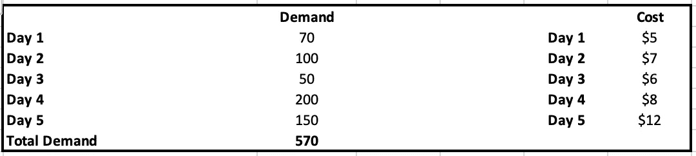

表 1:作者图片

表 1 显示了未来几天的需求。这就是需求预测可能有所帮助的地方。首先，您需要一个预测模型来预测每天的需求，具体取决于组织。在做出购买决定时，这是必要的。当管理层做出选择时，可以考虑以下因素:

1.我们今天购买和储存产品是否是为了在某一天/季节低价出售。

2.价格可能会上涨。

3.每天的存储容量是多少？

还有其他几个问题需要经理去解决。

根据表 1，在第一天，我们可以以比其他日子更低的价格购买商品，所以经理一定在想，为什么不在那天购买所有的东西呢？让我们计算一下成本:

全天的总需求为 570。

**$ 5 * 570+$ 1 * 100+$ 2 * 50+$ 3 * 200+$ 4 * 150 = $ 4250**

如果我们在一天内购买 570 件商品，我们将有一个较低的费率 5 美元，但我们将有一个较高的库存持有成本。如您所见，第二天有 100 件商品出售，因此将有 1 美元的持有成本。类似地，第 3 天的 50 个项目将在两天内产生 2 美元的持有成本。因此，在生产/购买成本和持有成本之间存在权衡。当我们关注购买成本时，我们可能最终会增加持有成本，当我们关注持有成本时，我们可能不得不牺牲购买成本。

让我们考虑另一个场景，我们在同一天购买和销售，而不持有任何库存。在这种情况下，不会有库存持有成本。

**$ 5 * 70+$ 7 * 100+$ 6 * 50+$ 8 * 200+$ 12 * 150 = 4750 美元**

在这种情况下，即使没有持有成本，总成本也比上一个高 4750 美元。

因此，我们必须找到库存水平的最佳组合，以降低总成本。

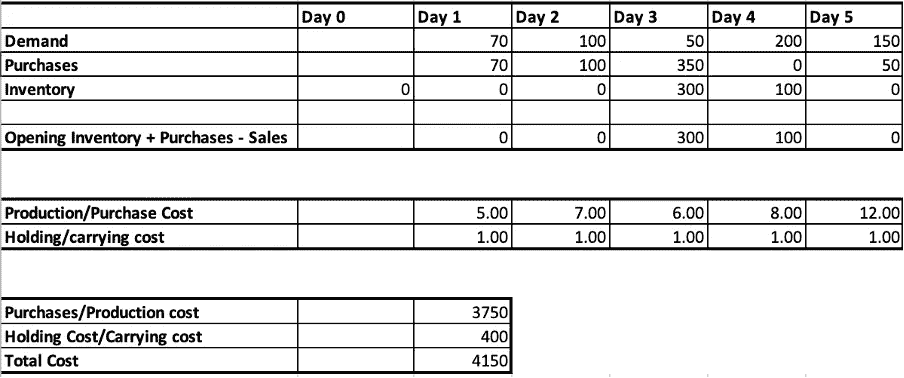

表 2:作者图片

总成本由两个因素决定:

**购买成本:**由当天的价格决定。

**持有成本:**持有成本为每天 1 美元，由期末库存决定。例如，如果第 3 天的期末库存是 300，持有成本将是 300 * $1=$300。然后，在第四天，假设没有进一步的采购，期末库存将是 100，因为当天将售出 200 件商品。因此，持有成本将是 100 美元。这等于 100 美元+300 美元= 400 美元。上表对此进行了总结。

这里的关键点是理解库存平衡约束。这是因为存货持有成本是根据期末存货计算的。此外，期末库存必须等于期初库存，加上采购减去销售。现在让我们来定义如何计算期末存货:

**期末库存=期初库存+采购—销售**

下图会帮助你理解。

## 优化方程

既然我们理解了概念，让我们定义目标函数和约束

**决策变量:**

设 **q** 为每天需要采购/生产的物品

假设 **e** 是每天的期末存货

因此，我们总共有 10 个决策变量。

**目标函数:**

我们需要把总成本降到最低。

总成本=采购成本+持有成本


作者方程式

让我们用更正式的数学符号来写:

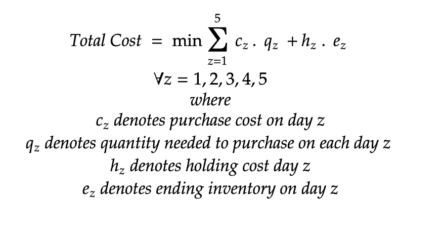

等式(I):作者

**库存平衡约束:**

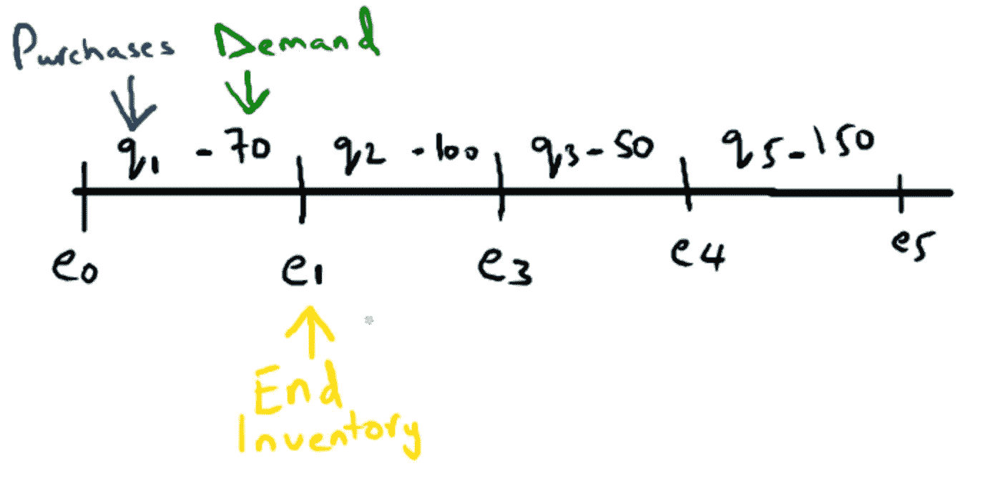

作者图片

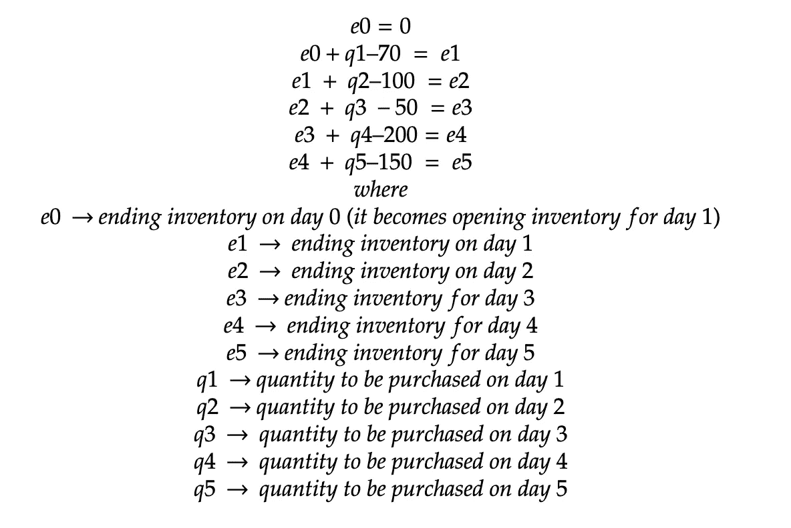

等式(ii):作者

让我们用更正式的数学符号来写:

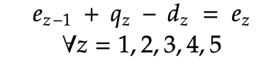

**完成方程式**

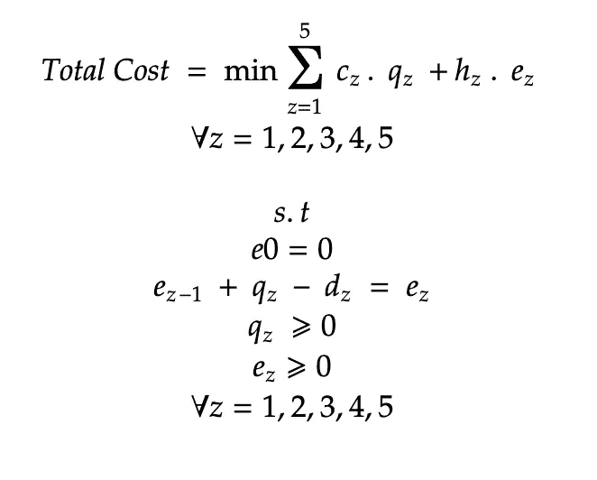

最终方程式(三):作者

总的来说，我们只是试图在库存平衡约束下最小化总成本。此外，采购数量和期末库存不能为负。

## 使用不同工具求解(Excel 和 Python)

让我们先用 Microsoft excel 解决这个问题，然后用 python 来解决。

## **使用 Excel**

**第一步:初始化并定义**


表 3:作者图片

正如您在这里看到的，我们已经定义了每天的需求。购买是我们每天都期望找到的东西；我们还不知道每天需要购买多少东西。期末库存将由约束条件定义，该约束条件将由第 15 行中定义的库存平衡约束条件来满足。也可以看看公式。例如，在第 1 天，我们使用前一天的期末库存作为第 1 天的期初库存( **C13** ，加上采购量( **D12)** ，减去销售/需求量( **D11** )。这相当于我们在上面的***等式(ii)*** 中定义的。

**第二步:目标函数**

我们的目标是最小化总成本，总成本由两部分组成:持有成本和购买成本。

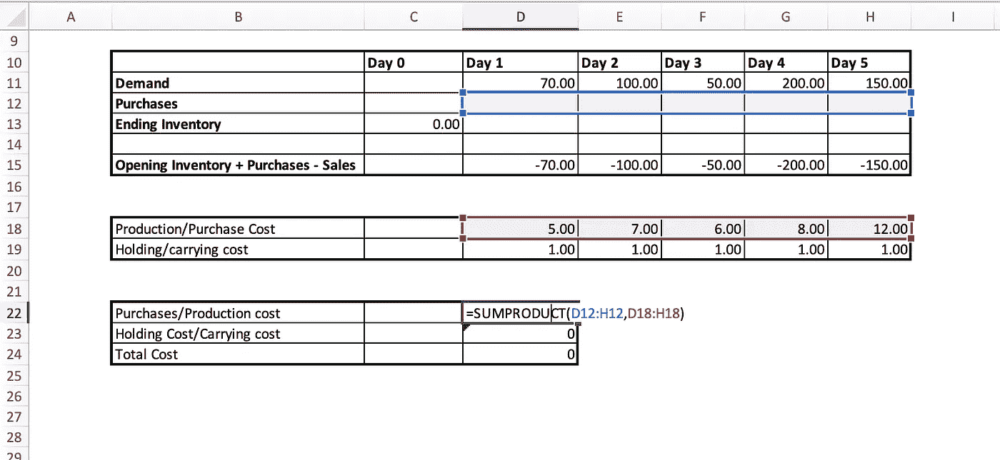

表 4:作者图片

我们在这里定义了购买成本、持有成本和总成本。如果您注意到采购成本公式，我们在这里所做的只是将每天的采购量乘以当天各自的采购成本。同理，我们也会为了持有成本而这么做。总成本就是购买和持有成本的总和。这相当于我们在 ***中定义的等式(i)***

**步骤 3:设置解算器**

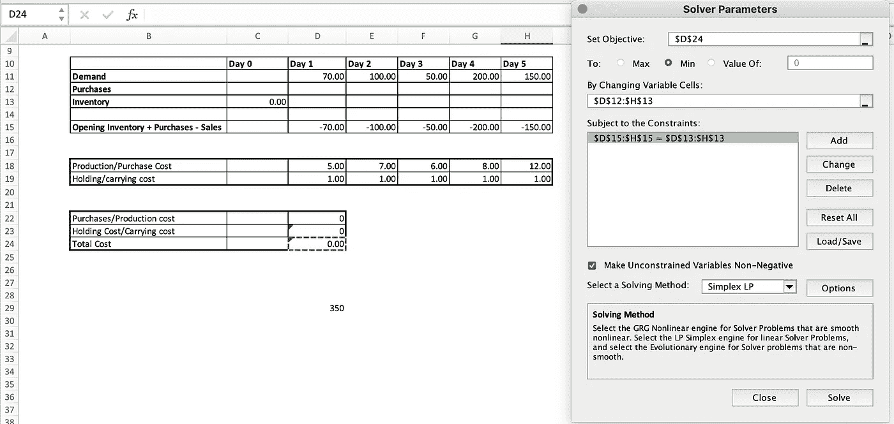

表 5:作者图片

D24(总成本)是我们的目标最小化。这是我们在**“设定目标部分”**中提供的。

决策变量是我们基于约束和目标函数求解的采购量和期末库存。这就是我们在**中提供的“通过改变可变单元格”**

约束条件是期末库存必须等于期初库存+采购-销售。这就是我们在**“受约束部分”**中提供的内容，即第 13 行(期末库存)必须等于第 15 行(期初库存+采购-销售)。

确保你标记了**“使无约束变量非负”。**这是因为我们不想要负库存值。

可以参考 ***方程(三)*** 进行理解。

**第四步:求解并获得使总成本最小的值**

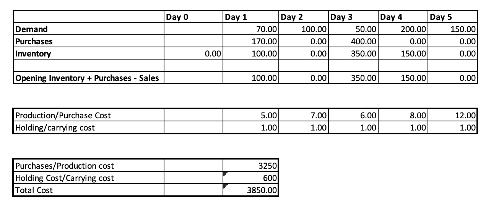

表 6:作者图片

这是整体解决方案的外观。也就是说，在第一天，我们必须购买 170 件，第二天 0 件，第三天 400 件，第四天 0 件，第五天 0 件。这种解决方案使总成本(购买成本+持有成本)最小化。

## **使用 Python**

现在，我们已经对所有细节有了直观的理解，我们将编写一些 Python 代码(pyomo 包)来做同样的事情，看看我们是否会得到相同的结果。

```
import numpy as np
from pyomo.environ import *model = ConcreteModel()days=6# demand
d = [None, 70,100,50,200,150]# holding cost
h = [None,1,1,1,1,1]# unit purchase cost
c = [None,5,7,6,8,12]# quantity needed to purchase
model.q = Var(range(days),domain=NonNegativeReals)# ending inventory
model.e = Var(range(days),domain=NonNegativeReals)# model objective function includes both holding cost and purchase cost
model.objective = Objective(expr = sum( (model.q[day] * c[day]) + (model.e[day] * h[day]) for day in range(1,days,1)), sense=minimize)# add model constraints
model.constraints = ConstraintList()# ending inventory is 0 on day 0 so would be the opening for day 1
model.constraints.add(model.e[0]==0)# inventory balancing constraints
for day in range(1,days,1):
    model.constraints.add(model.e[day] == model.e[day-1] + model.q[day] - d[day])# create a solver
solver = SolverFactory('glpk')# solve
solver.solve(model)
```

代码中已经提到了注释，我们已经详细讨论过了。现在让我们看看我们是否能取得同样的结果。

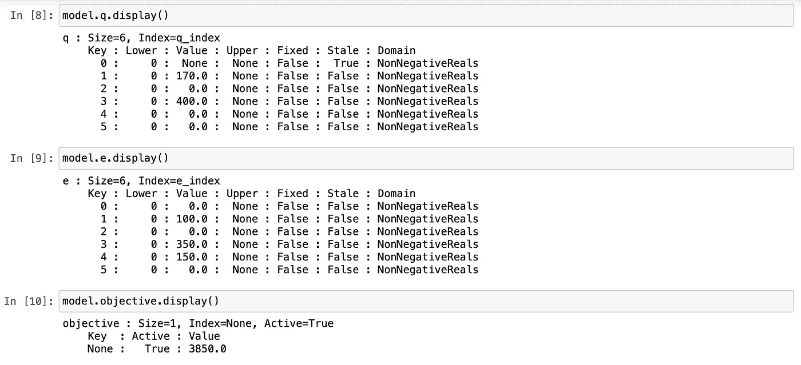

作者图片

正如我们所看到的，需要采购的数量(q)和期末库存(q)完全相同，并且具有相同的优化成本值 3850。

## 结论

在这篇文章中，我们详细讨论了如何将预测模型与运筹学结合使用，将预测分析转化为规范分析，让决策者做出实际决策。这个问题对企业至关重要，因为它对损益表和会计比率有直接影响。

## 参考

[1]https://www.investopedia.com/terms/h/holding-costs.asp

[2]https://www.accountingtools.com/articles/holding-costs

[3][https://www . trade gecko . com/inventory-management/introduction-to-carrying-costs](https://www.tradegecko.com/inventory-management/introduction-to-carrying-costs)

[4][http://www . Columbia . edu/ITC/SIPA/u 6033/client _ edit/LEC 4 . pdf](http://www.columbia.edu/itc/sipa/U6033/client_edit/lectures/lec4.pdf)