# 使用主题建模调查与新冠肺炎相关的风险

> 原文：<https://pub.towardsai.net/investigation-into-the-risks-associated-with-covid-19-using-topic-modeling-2c4ed3ed6267?source=collection_archive---------3----------------------->

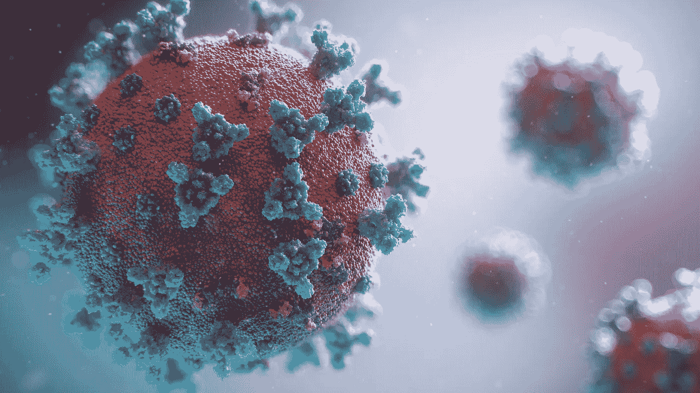

由 [Unsplash](https://unsplash.com/collections/9770056/coronavirus?utm_source=unsplash&utm_medium=referral&utm_content=creditCopyText) 上的[融合医学动画](https://unsplash.com/@fusion_medical_animation?utm_source=unsplash&utm_medium=referral&utm_content=creditCopyText)拍摄的照片

“我们越能追踪病毒，就越能战胜它。”

# **目标**

> 自新型冠状病毒(新冠肺炎)爆发以来，它已成为对全球健康的重大和紧迫威胁。在疫情爆发的几个月内，数千篇关于其影响、风险和治疗的研究论文已经发表。研究进行的速度正在快速增长。但是对于那些想要寻找答案的人来说，这也带来了一个新问题。这为我们这些数据科学家创造了一个机会，通过开发数据挖掘工具来展示我们的专业知识，这些工具可以帮助医疗界找到非常重要的科学问题的答案。

# **接近**

我们可以从几个不同的角度来看待与新冠肺炎有关的不同因素。我决定通过一种无人监督的方法来关注风险因素。 [**主题建模**](https://en.wikipedia.org/wiki/Topic_model) 是一种统计建模技术，用于识别文档集合中出现的抽象“主题”。 [LDA](https://en.wikipedia.org/wiki/Latent_Dirichlet_allocation) 和 [LSA](https://en.wikipedia.org/wiki/Latent_semantic_analysis) 是两种突出的主题建模技术，我将使用 LDA。利用它，我可以找到我们感兴趣的最相关的主题和文档。最后，我将通过交互式可视化展示我希望的最佳主题模型。

1.  **新冠肺炎数据加载和准备**

最近，Kaggle 向世界人工智能专家发出了行动呼吁，艾伦人工智能研究所(T21)已经提供了超过 60，000 篇学术文章，以及 JSON 格式的元数据，它们正在定期更新。

这里的 请参考 [**数据加载**上的内核*处理、清理、删除重复*，然后将 JSON 中的文本数据加载到 pandas 中。下面是整个语料库的一个片段。](https://www.kaggle.com/piyushrumao/covid-19-json-dataset-loader)

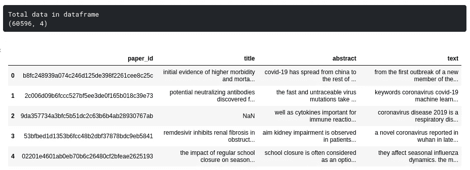

超过 60，000 件物品被装载进行处理

但是，在['text '，' title '，' abstract']下有许多空值

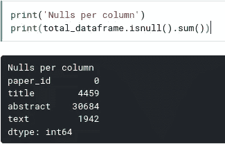

正如我们看到的，超过 30k 行的摘要是空的，这对于我们后面的分析来说是不理想的。

我们拥有的数据越多，我们将获得的主题覆盖面就越广，所以我决定将所有文本数据合并到一个列中，如下所示。

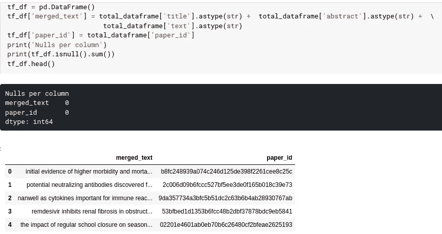

现在我们将使用“merged_text”列，它由每个 paper_id 的文本数据组成

2.**训练无监督 LDA 模型**

[潜在狄利克雷分配(LDA)](http://latent Dirichlet allocation (LDA)) 是一种生成统计模型，它将每个文档视为主题的混合，因此在主题建模分析中非常有效。

现在基于马修·霍夫曼、大卫·布雷和弗朗西斯·巴赫的著名论文[“潜在狄利克雷分配的在线学习”。](https://papers.nips.cc/paper/3902-online-learning-for-latent-dirichlet-allocation) LDA 已经在 [**Gensim**](https://radimrehurek.com/gensim/models/ldamulticore.html#module-gensim.models.ldamulticore) 和 [**Scikit-learn**](https://scikit-learn.org/stable/modules/generated/sklearn.decomposition.LatentDirichletAllocation.html) 中实现。

基于 Gensim 的 LDA 具有更多内置功能，如[主题一致性管道](https://radimrehurek.com/gensim/models/coherencemodel.html)或[动态主题建模](https://radimrehurek.com/gensim/models/dtmmodel.html)，这将使其成为理想的选择，因为一致性分数可用于精确检测给定语料库的多个主题。然而，缺点是，与 sklearn 基于 Cython 的 LDA 实现相比，它非常慢。由于需要处理大量数据，并且收敛速度至少快 4 倍，因此它是最终训练的理想选择。假设我们知道要选择的精确主题号，那么我将首先训练基于 gensim 的 LDA 来检测精确主题，然后使用该主题号运行基于 sklearn 的实现来进行我们的其余分析。

**2.1 使用 gensim 运行潜在狄利克雷分配**

我将首先从基于 gensim 的 LDA 开始，通过处理输入数据，然后训练 LDA 来查看主题，最后利用一致性分数来决定多个主题的最佳值。

**2.1.1 让我们为我们的模型**准备输入数据

让我们为主题建模准备输入数据。第一步是数据清理，包括创建标记、删除停用词、删除 3 个字符以下的词，然后将这些标记附加到每个文档的列表中。我们可以通过将记号词干化/词尾化为词根形式并生成 n 元语法来使事情变得更有趣。

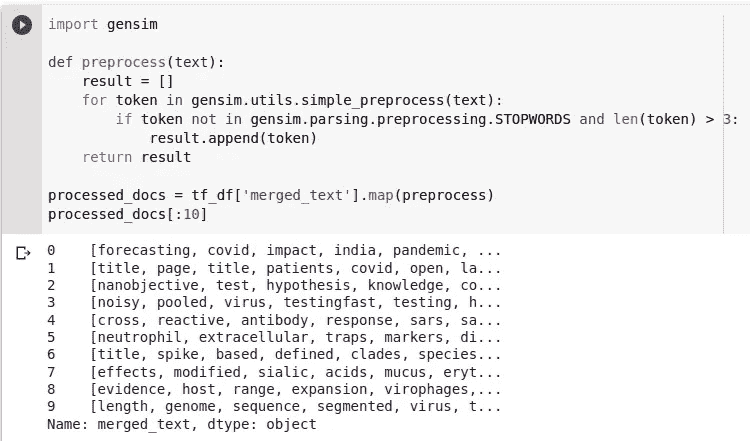

删除停用词并为每个输入行创建一个标记列表

**2.1.2 生成字典和特征数据**

机器学习模型无法像我们人类一样直接理解文本数据，所以这些文本数据需要通过专门的翻译器来转换成机器可以理解的格式。这个过程称为矢量化或特征提取。我将使用 tf-idf 作为一个特征生成器，映射一个单词对文档集合中的一个文档有多重要，而不像单词包方法那样只重视频繁出现的单词。

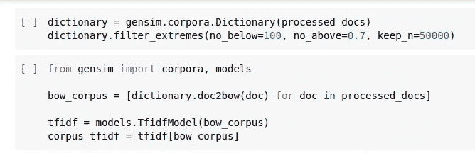

正如我们在上面看到的，我使用之前创建的已处理列表创建了一个字典，然后过滤掉了:

I .在 60，000 个文档中出现不到 100 个

二。出现在 70%以上的语料库中

三。保留前 50k 代币

然后创建 tf-idf 模型并在整个语料库上应用向量变换，词典和 tf-idf 模型都可以被保存(pickle.dump)以供将来使用。

**2.1.3 并行潜在狄利克雷分配训练**

Gensim 提供了[gensim . models . LDA multi core](https://radimrehurek.com/gensim/models/ldamulticore.html)类，该类利用最多的内核来并行化和加速模型训练

基于单核的实施。

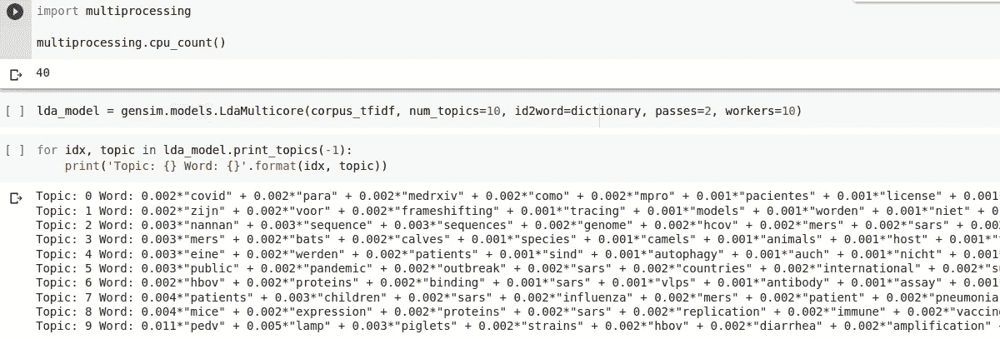

为了更快地进行培训，我设置了 workers = 10 和 pass = 2，让我们检查一下当主题数= 10 时创建的主题类型

**2.1.4 计算模型的困惑度和一致性**

困惑和一致性分数是用于决定我们的学习模型有多好的评估指标。困惑和连贯性是成反比的，困惑分数越低，连贯性分数越高，模型越好。

让我们快速地看一下它们中的每一个，以了解它们代表了什么，困惑度量了未见过的数据被分配给之前学习过的主题的概率。然而，困惑作用于对数似然，对数似然不能很好地概括，这导致了主题一致性度量的发展。主题一致性衡量主题中高分单词之间的语义相似性。这些计算有助于区分语义上可解释的主题。

让我们计算一下，看看我们的模型得分有多高。

**2.1.5 寻找 LDA 模型的最佳主题数量**

使用上述相同的一致性指标，我们将选择 4 到 40 之间的主题值范围，并观察不同主题值的模型性能。

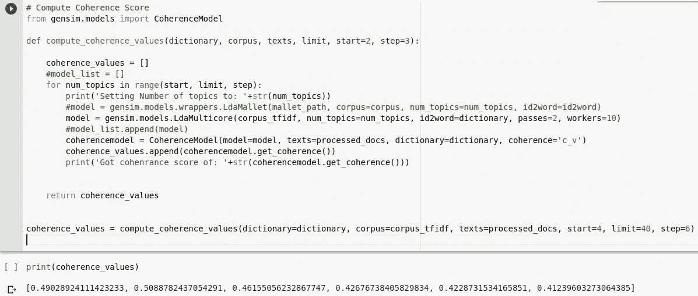

使用上面的代码，我们可以计算相干值并绘制它们，如下所示。

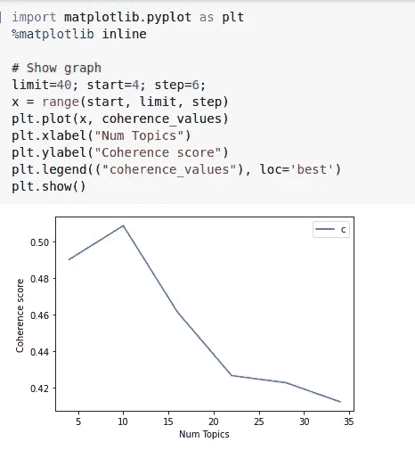

正如我们在上面看到的，连贯性分数在主题编号 4-10 之间上升，然后从主题大小 15 到 40 持续下降，没有改善的迹象，所以使用 4 到 12 之间的主题编号是明智的，它显示了最高的连贯性分数，所以我决定使用主题编号 10。

2.2.**基于 Sklearn 的潜在狄利克雷分配**

与 gensim 不同，基于 sklearn 的 LDA 使用起来更加简单快捷。

2.2.1 **使用 tf-idf 矢量化**为 LDA 准备输入数据

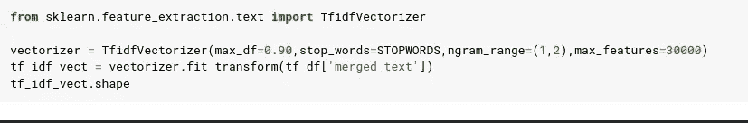

我们的 tf-idf 矢量器忽略停用词以及出现在语料库中超过 90%的文档中的词，然后创建一元词和二元词，并从语料库中选择前 30k 个词进行特征生成。

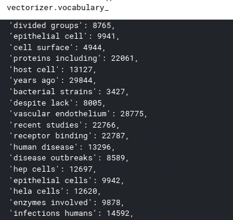

快速浏览我们的矢量器选择的词汇

2.2.2 **训练潜在狄利克雷分配**

我基于 gensim 的基于一致性的优化器选择 number_of_topics = 10，然后在从整个语料库生成的 tf-idf 向量上训练它。

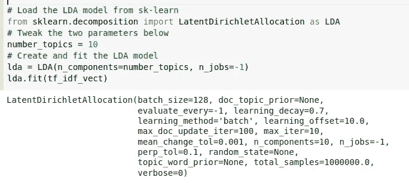

你可以在上面看到我的基于 scikit-learn 的训练过的 LDA 模型。

2.2.3 使用 LDA 创建的**主题**

让我们看看每个主题下的前 10 个单词，以了解这些主题下的文档类型的要点。

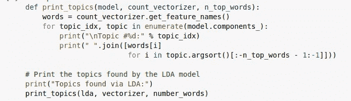

打印每个主题的热门词汇

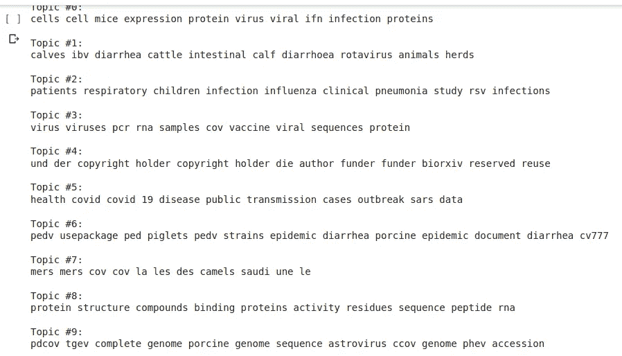

正如你在上面看到的，我已经打印了每个主题的前 10 个单词

3.**寻找与新冠肺炎相关风险最相关的主题**

> 这里的所有部分对我们的整个分析都是至关重要的。毕竟，如果我们不能从中获得商业价值，我们为训练模型所做的努力将毫无价值，而这是任何数据科学项目成功的关键因素。

我将首先创建一个与冠状病毒风险因素相关的看不见的文件的字典。

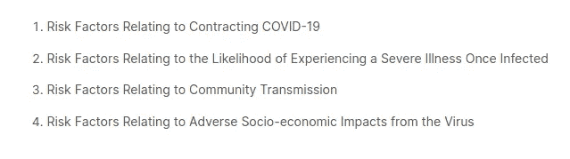

与新冠肺炎相关的风险有多种类型，我将重点关注以上 4 种类型。

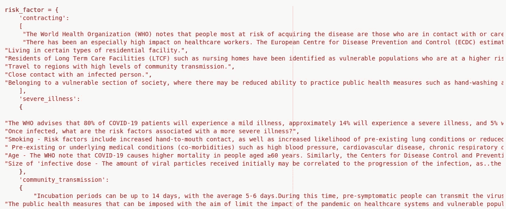

字典中有 4 个关于上述突出风险因素的关键词，每个关键词都包含一个支持文件列表。

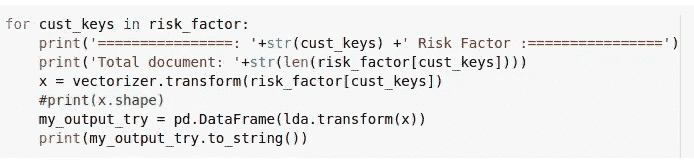

使用我们训练过的 tf-idf 矢量器，我们将把文本转换成矢量，然后运行 LDA 模型，找出哪些主题与每个风险因素高度相关。

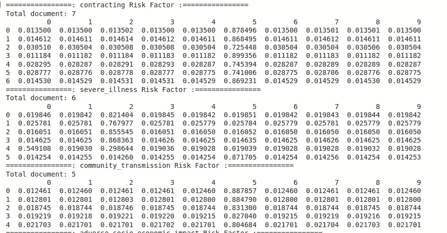

列(0-9)是我们的 10 个主题，行是每个风险类型下的单独文档。

> 关于 ***签约风险*** 的全部 7 份文件和关于 ***社区传播*** 的 5 份文件在**主题 5** 中排名最高，而 ***重疾*** 相关风险被发现包含在**主题 2** 和**主题 5 中。**因此，寻找新冠肺炎收缩相关答案的医学研究人员应该只查看主题 5 下的文档，而寻找冠状病毒相关疾病的人应该在主题 2 下的文档中获得大部分答案。

4.**使用余弦距离度量寻找最相关的文档**

现在，让我们考虑一个案例，某人发现了他/她感兴趣的一篇伟大的文章，并想知道是否有更多与它最相似的文章。为此，我们将首先计算语料库中文档的主题分布(每篇文章总计为 1)，然后在该主题空间分布中使用余弦距离度量来查找前 K 篇最接近的文章。

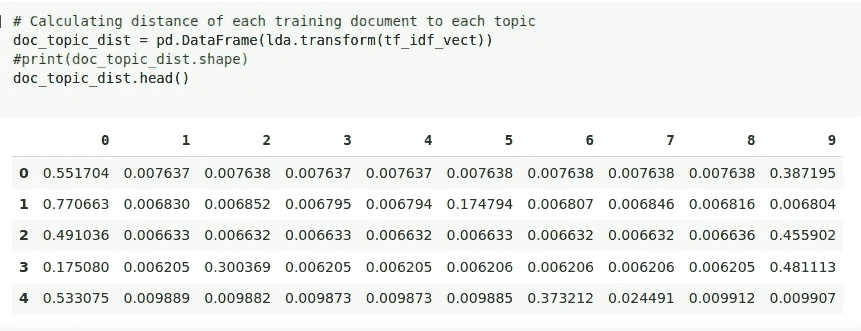

我们将计算每个输入文档到我们训练模型的每个主题的距离。

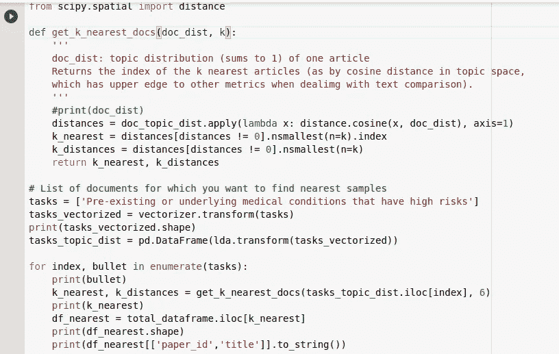

现在，我需要创建一个包含文本数据的列表(任务),我们要搜索最近的邻居，然后使用经过训练的 tf-idf 矢量器将文本转换为特征向量，并将该特征集与 K 值(要查找的最近邻居的数量)一起传递给函数 get_k_nearest_docs()，该函数计算输入文档与整个语料库的余弦相似性，并返回前 K 个相似文档以及距离。

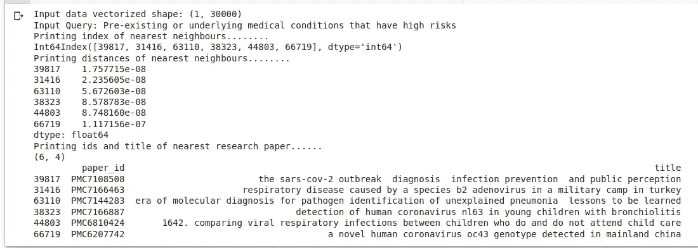

正如我们在上面看到的，我们的输入文档的输出是在包含关于新冠肺炎的研究文章的整个语料库中找到的最相似的研究论文的前 6 名(用户给出的 K 值)。

5.**互动话题可视化**

可视化使得检测模式、趋势和异常值变得更加容易，所以最后我将为我们检测到的主题添加两种不同的可视化。

对于主题建模，[**pyl Davis**](https://pypi.org/project/pyLDAvis/2.1.1/)**是一个很棒的工具，可以从拟合的 LDA 模型中提取主题，并生成交互式仪表盘进行解释。**

**此外，我将使用 [**t-SNE**](https://scikit-learn.org/stable/modules/generated/sklearn.manifold.TSNE.html) 工具构建一个仪表板，该工具用于在 [**布克**](https://docs.bokeh.org/en/latest/) 图的帮助下可视化高维数据。**

**5.1 **pyLDAvis 可视化****

**如果你滚动单个气泡，那么决定它所涵盖的主题类型的顶部单词就会出现。**

**如果你点击上面的 Run Pen，它将加载一个可视化的 10 个独特的主题，我们已经确定显示在左边的圆形气泡中。每个主题涵盖的研究文章数量由气泡的大小来表示。代表特定主题的独特单词显示在右侧。我们有兴趣了解专题 5 和专题 2 下显示的可视化内容，这些内容独特地确定了与新冠肺炎相关的风险。**

**5.2 **使用 t-SNE 对主题中出现的研究论文标题进行可视化****

**由于 pyLDAvis 库为我们处理上面的可视化，并且只显示每个主题的唯一单词，我们在显示主题方面的自由度很小，我想为我们训练的主题模型尝试更多的可视化。我将高维空间中表示的主题转换为二维空间，然后将单个研究论文 id 和标题映射到每个转换后的向量，最后使用散景图将它们可视化为人脑的形状，其中独特的大脑颜色表示我们的模型学习的每种类型的主题。请参考下面的代码以及显示可视化工作的视频。**

**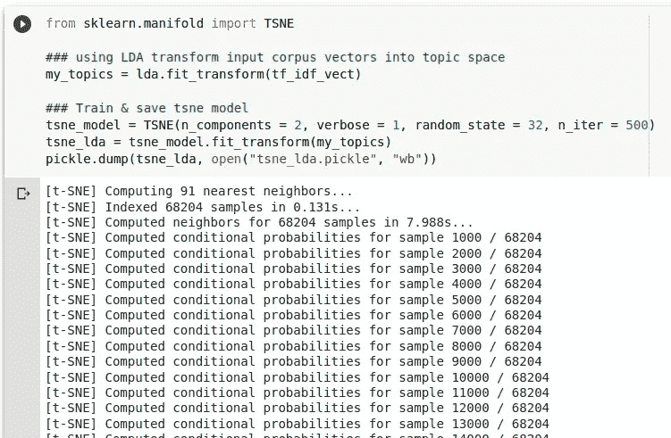**

**首先，我们将为输入语料库建立 ld a 主题分数分布模型，然后使用 t-SNE 将其映射到 2d 空间**

**包含特定主题的论文 id 和标题的图形可视化快速视频**

**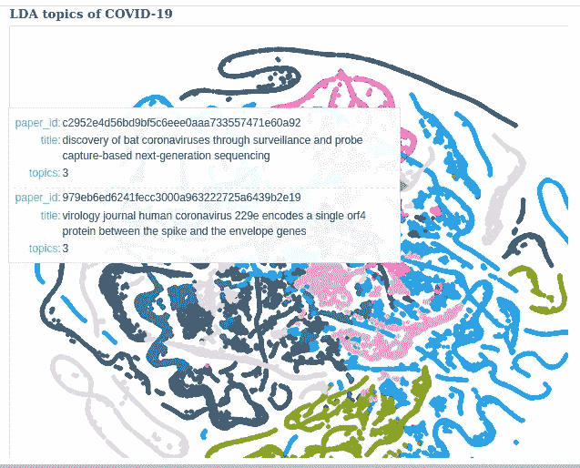**

**上面大脑的不同颜色代表我们的模型学习的不同主题，每个主题都由不同的论文 id 和标题代表。**

**6.**结论****

**让我快速总结一下整个工作流程:**

1.  **我最初的目标是在新冠肺炎数据集上进行主题建模，以找出关于相关风险的有趣文章。**
2.  **我首先加载数据，并对其进行处理以供进一步分析。**
3.  **然后使用这些数据，我训练了两个不同的 LDA 实现，一个使用 gensim，另一个使用 sklearn。**
4.  **使用连贯性评价指标和范围在 4 到 40 之间的主题数量，我发现了新冠肺炎语料库覆盖的独特主题的最佳数量。**
5.  **后来，我通过创建一个与风险因素相关的文档字典，并评估我们训练的 LDA 模型将它们分类到哪些主题，来进行风险相关分析。**
6.  **一旦确定了这些主题，在这些主题下出现的文档就是我研究的主要焦点。我甚至更进一步，使用余弦相似性度量来查找 K 个最近邻，即 K 个与给定输入文档主题相同的最相似文档。**
7.  **最后，我使用 pyLDAvis 资源工具可视化了这些发现，并在 t-SNE 和 bokeh 的帮助下建立了自己的可视化。**

**有希望的是，这一过程可能导致从现有数据中提取有用信息的更有效的方法。**

> ***数据科学在医疗保健行业有着巨大的应用，我们今天采取的每一小步都将有助于从应对风险到预防风险的转变。***

**你可以在 [GitHub](https://github.com/Piyush1416/Topic-modeling-on-COVID-19-data) 上找到源代码。我期待着知道你对它的想法，也欢迎你的建议和反馈。**