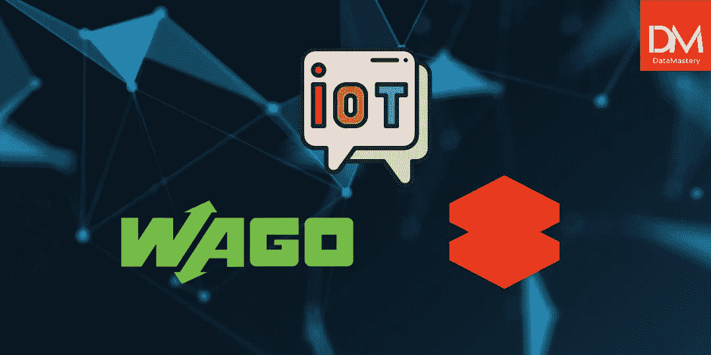
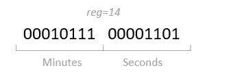
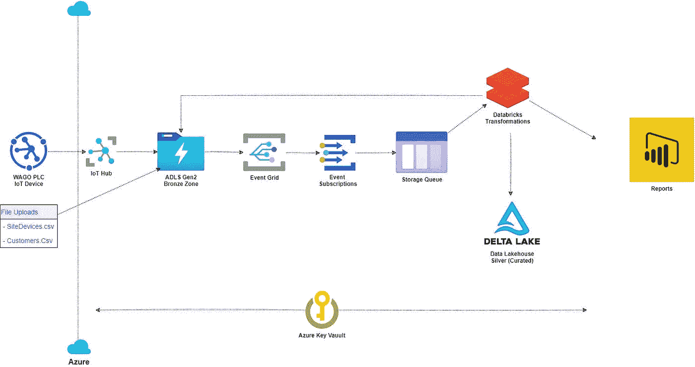
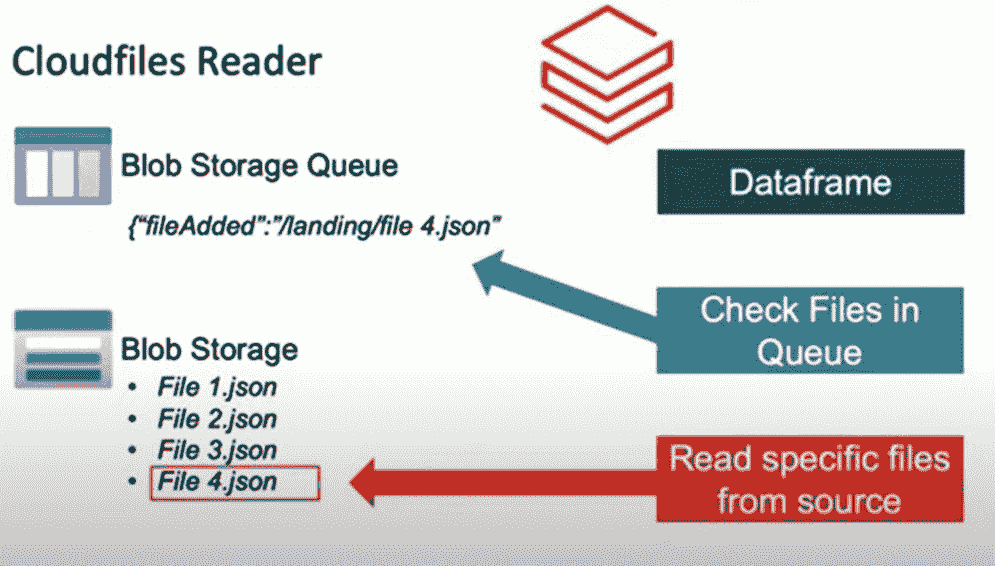
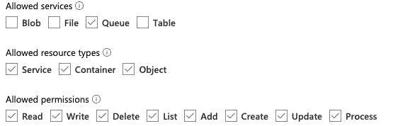
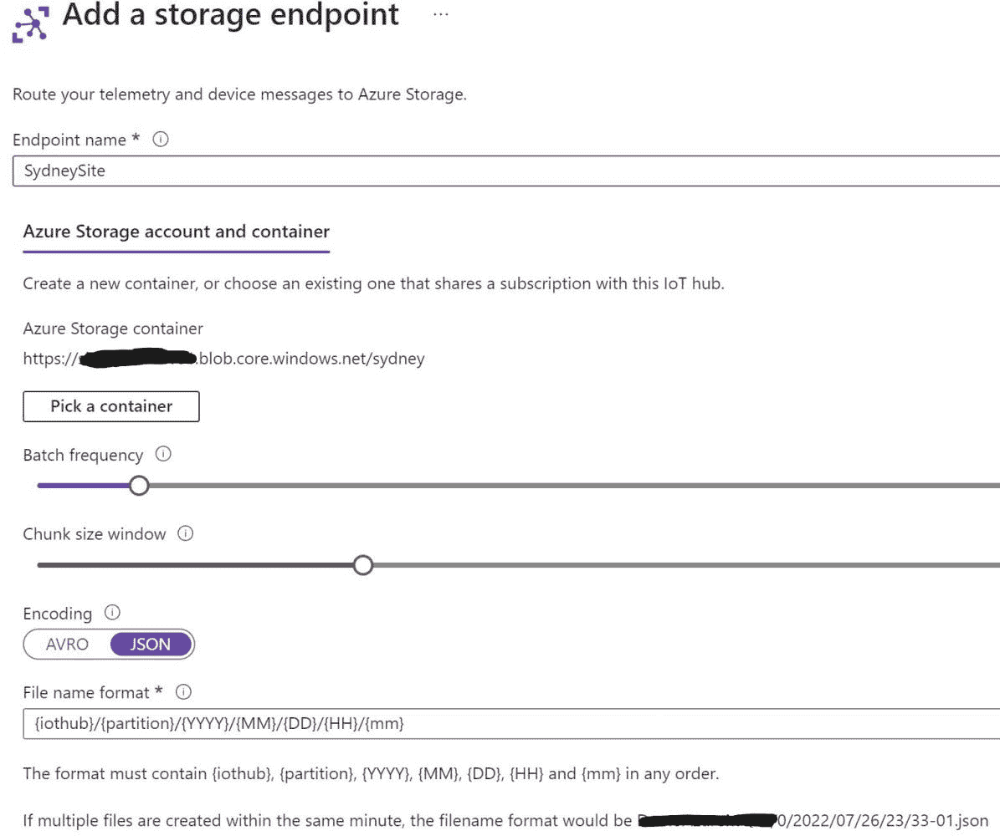
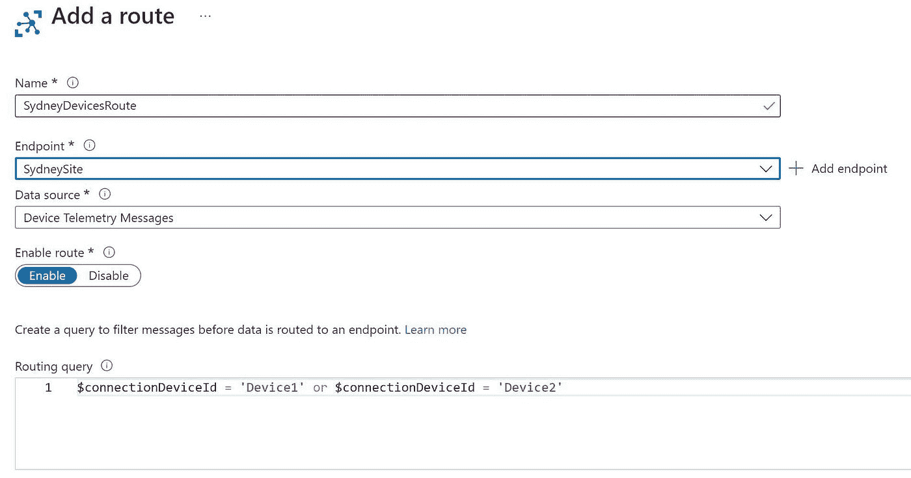
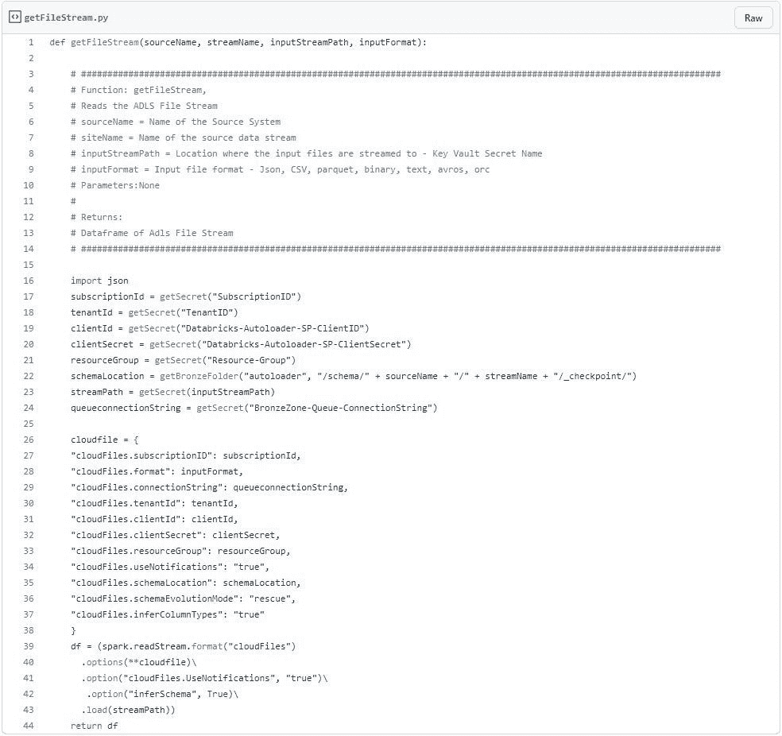
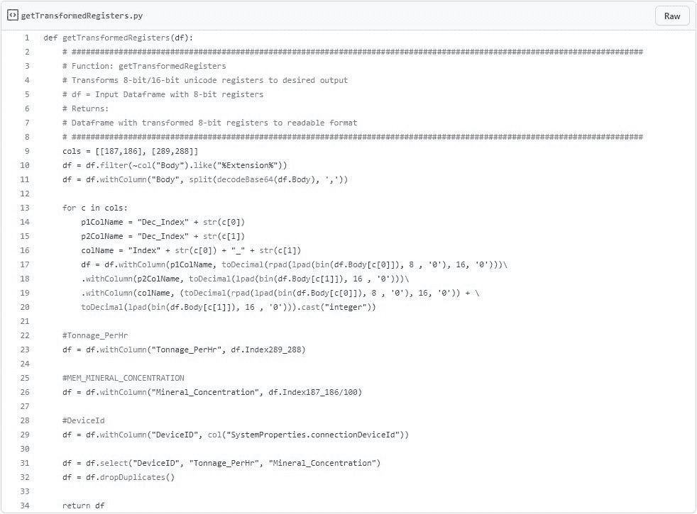

# 物联网实时分析— WAGO PLC 和 Databricks 自动加载器

> 原文：<https://pub.towardsai.net/iot-real-time-analytics-wago-plc-with-databricks-auto-loader-4cd9d3c8de15?source=collection_archive---------0----------------------->

现代企业拥有大量来自大量物联网设备和应用程序的数据，这些数据的文件格式多种多样。接收这些数据并将其转换为可读、有用的格式非常耗时且复杂。Auto Loader 是 Databricks 的一款出色工具，它简化了解决方案，确保了流程的完全自动化，并支持实时决策。

Databricks 是一个可扩展的大数据分析平台，旨在用于数据科学和数据工程，以及与主要云平台亚马逊 Web 服务、微软 Azure 和谷歌云平台的集成。

Auto Loader 是 Databricks 的一项功能，每小时从数据湖中读取新到达的文件，以流形式或增量方式接收和转换数百万个文件。有关 Databricks 自动加载器的详细说明，请点击[此处](http://linkedin.com/pulse/what-databricks-auto-loader-rory-mcmanus/)。

Data Mastery 最近与采矿行业的 OEM 合作部署了一个自动加载器解决方案，以接收和转换 WAGO PLC 设备到物联网中心的遥测数据。以前，OEM 在现场手动下载数据文件，然后使用 excel 手动转换数据文件以生成可读的报告。Auto Loader 完全自动化了这一过程，并自动提供可读的报告，消除了每班一个工时的手动数据处理，每个站点每周节省超过 21 个工时(24 小时运行)。不用说，我们的客户对结果非常满意！

# 如何摄取和转换 WAGO PLC 设备数据

在本文中，我将解释我们如何创建一个流解决方案来接收和转换从多个站点和设备发送到物联网中心的 WAGO PLC 数据。

数据从 1000x 16 位 Unicode 寄存器开始。这用于 MRA 和 PLC 使用的 ARM 汇编语言中的计算。

在这种情况下，二进制寄存器内的编码被细分，以携带多条信息。日期和时间编码就是一个例子，秒和分钟在同一个 16 位寄存器中进行编码。

虽然数据作为 16 位寄存器存储在 WAGO PLC 设备上，但它作为 2000x 8 位 Unicode 寄存器发送到物联网集线器，以减少发送的数据包大小。因此，作为转换为可读格式的一部分，它需要从 8 位寄存器转换回 16 位寄存器。

# 解决办法

使用的解决方案遵循以下高级步骤:

1.  WAGO PLC 消息被发送到 Azure IoT Hub，在那里这些消息根据它们的 DeviceId 以 JSON 格式被路由到特定的 Azure 存储容器。
2.  当文件到达存储容器时，事件网格创建的订阅者在 Azure 存储队列上创建一条消息，包含新文件的位置和名称。
3.  Databricks 自动加载程序检查存储队列中的新消息，并在新消息到达时将文件流读入数据帧。

1.  然后，输入数据帧从 2000×8 位 Unicode 寄存器转换回 1000×16 位 Unicode 寄存器，并随后转换成所需的格式，例如，吨/小时、天、月/年等。
2.  然后将转换后的数据帧附加到功耗 BI 的增量表中。

# 先决条件

*   配置 WAGO PLC 设备向 Azure IoT Hub 发送消息
*   注册一个 [Azure 服务主体](https://docs.microsoft.com/en-us/azure/databricks/ingestion/auto-loader/file-detection-modes) —用于自动创建事件网格/订阅和存储队列。或者，如果需要，您可以手动创建服务
*   生成具有以下权限的存储队列[共享访问签名](https://docs.microsoft.com/en-us/azure/storage/common/storage-sas-overview)

*   为 [SubscriptionId](https://docs.microsoft.com/en-us/azure/azure-portal/get-subscription-tenant-id) 、 [TenantId](https://docs.microsoft.com/en-us/azure/azure-portal/get-subscription-tenant-id) 、Bronze-Queue-ConnectionString(上面创建的)、服务主体 ClientId & ClientSecret(上面创建的)创建以下 Azure 密钥库机密

# 要创建自动加载器流解决方案，必须完成以下步骤。

1.  配置 WAGO PLC 设备向 Azure IoT Hub 发送消息
2.  通过在 DeviceId 上过滤，将传入的物联网集线器消息路由到特定的存储容器
3.  创建一个 PySpark 函数，使用 Spark 结构化流源 cloudFiles 从输入 ADLS Gen2 存储容器中读取数据
4.  创建一个 PySpark 函数，将输入文件流转换成所需的输出列
5.  将流或批处理数据帧写入数据块增量表
6.  测试:)

# 详细步骤:

1.  配置 WAGO PLC 向 Azure 物联网中心发送消息
2.  根据设备 Id 将传入的物联网集线器消息路由到特定的存储容器

2.1.为 ADLS 第二代存储容器创建自定义端点

物联网中心🠮消息路由🠮自定义端点🠮添加

2.2.创建一个路由并添加一个查询以按设备 Id 进行筛选

物联网中心🠮消息路由🠮路由🠮添加

3.创建一个 PySpark 函数来读取存储队列中新到达的文件

4.创建一个 PySpark 函数，将输入文件流 dataframe 转换为所需的输出列。

注意:由于大量的转换，我只添加了一个样本转换

6.测试:)

端到端地运行该流程，以检查数据是否已经插入到表中。

# 结论

Auto Loader 是一款出色的工具，可应用于任何行业的任何业务，以获得简单、省时的解决方案和实时数据。

我希望您已经发现这是有帮助的，并将节省您的公司的金钱和时间开始使用 Databricks 自动装载机，我希望它将有助于推动见解，给你的业务带来价值。

如果你想要一份我的代码，请在 LinkedIn 上给我留言，或者如果你像我一样喜欢阅读和写作，请与你的朋友分享。