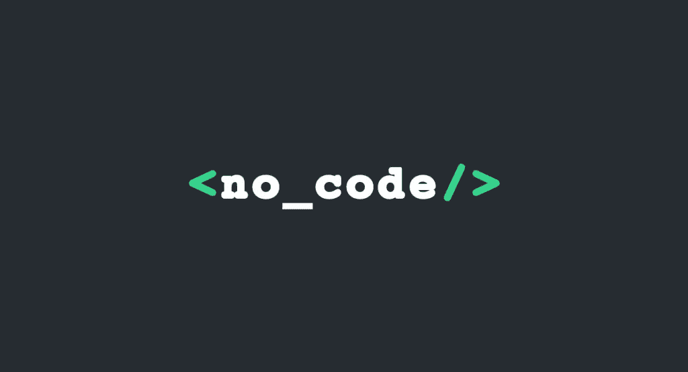
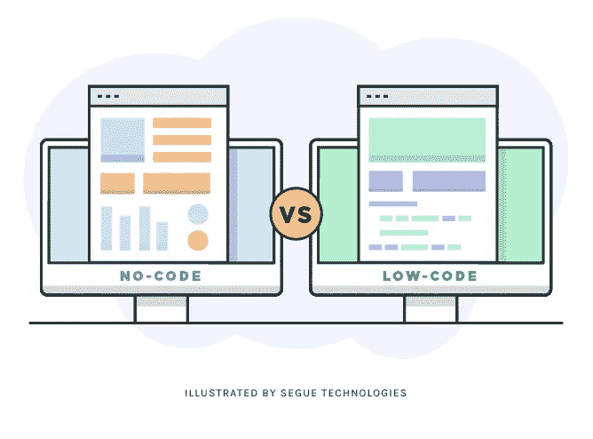
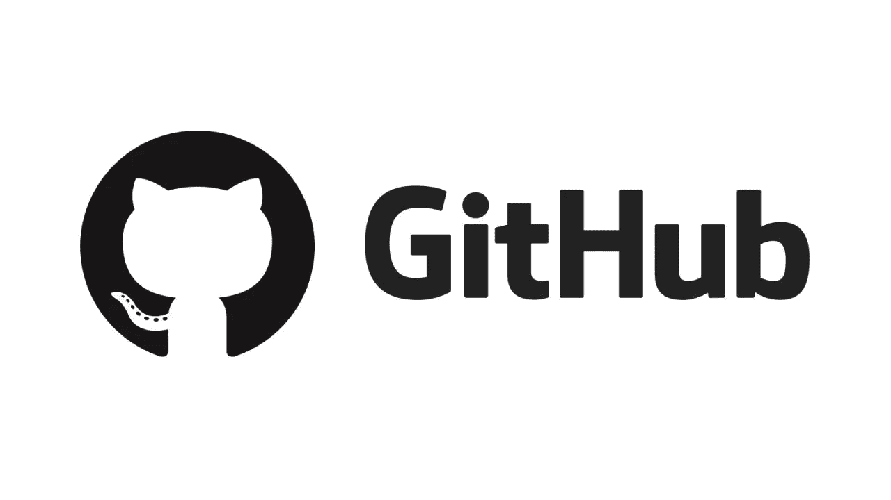

# 编码是不是要死了？

> 原文：<https://pub.towardsai.net/is-coding-dying-f12bb55645f5?source=collection_archive---------0----------------------->

## [编程](https://towardsai.net/p/category/programming)

## 对使编码需求看起来正在消退的原因的深入分析

> 加入我们在 discord 上的[免费编程社区，在 Python Kai 中结识其他程序员！](https://discord.com/invite/dG2D2zXeXB)

在过去的几个月里，对低代码接口的大肆宣传已经大大增加，这主要是由于新软件打破了仍然需要编码来制作任何产品的领域。

从 https://www.getbeamer.com/blog/no-code-tools-for-saas[取回](https://www.getbeamer.com/blog/no-code-tools-for-saas)

## 无代码接口

例如，Bubble 已经开始通过向人们提供在没有任何编码知识的情况下创建灵活原型的可能性来颠覆原型行业。该界面甚至可以整合 API 并连接到不同的数据源，它被广泛用于为投资者创建演示。在 Bubble 之前，创建一个完整的演示需要整个团队来管理后端，再加上一个人在前端工作。

同样的事情也发生在网站上:有了像 WordPress、WebFlow 和 Wix 这样的平台，创建一个网站非常简单，不需要为它编写任何冗长的代码(因为每个程序员都无法忍受 HMTL+CSS 的组合，也许这是最好的)。

开发其他一些无代码接口的目的是替代高级分析用例，如对象检测甚至机器学习培训。类似平台的一个例子是 Datature，这是一个新兴的初创公司，允许用户在不使用任何代码的情况下创建计算机视觉模型，以及 RelevanceAI，这是一个基于向量的初创公司，允许用户充分利用向量场的潜力，除了其 API 之外，还有一个无代码接口。

## 代码正在消亡吗？

似乎无编码接口已经能够颠覆整个行业。这是否意味着对编码的需求正在消退，或者说使用编码来生成相同输出的需求减少了？

在一定程度上，是的。一个程序员的心态应该是尽可能的优化和改善身边的一切，尽可能的高效。这意味着，逐渐地，一些现在需要编码的应用程序将会寿终正寝。

在不计其数的编程应用中，有许多可以自动化，并可以带给公众。基本上，所有可能被破坏的东西都将被破坏。

## 低代码与无代码

从应用程序中去除编码接口有两种主要的范例:低代码和无代码解决方案。

检索自:[https://www . seguetech . com/difference-between-no-code-and-low-code-platforms/](https://www.seguetech.com/difference-between-no-code-and-low-code-platforms/)

**低代码解决方案**无法摆脱所有代码。通常，它们保持了用户输入参数的必要性，并且它们仍然是高度可定制的，其优点是不需要整个团队来完成一个项目。例如，像 Google Form 或 Typeform 这样的表单平台就是低代码接口的例子，因为它们仍然需要用户输入定义的参数，有时还需要处理逻辑。然而，这些平台管理部署、数据库、数据收集、数据集成所需的所有代码…它们会处理您不想自己管理的所有代码…但需要付费。

**无代码接口**到达了另一个层次:它们致力于取代所有需要任何编码或参数化的用户交互。你可以想象，这个软件的输出只能在一定程度上定制，因为你不能改变它的基本组件。但是，您可以大幅提高部署速度。无代码解决方案在 Wix 或 WebFlow 等网站编辑器中非常流行。

# 无代码最终会吃掉行业吗？

有一点是肯定的，这是不会发生的。我坚持这个结论，并不是因为我是一个超级编程爱好者，而是因为在无代码接口的好处中，也有无法解决的严重缺点(可能永远不会解决)。

## 规则因平台而异

你可能觉得这没什么大不了的。确实是。这是低代码接口面临的最紧迫的问题。一旦你学会了如何编码，你就可以用一种语言做任何事情(有时你可能想学第二种语言，就像在现实生活中一样)。因此，只要有合适的库，你想解决的任何问题都可以用算法来表达。

然而，无代码接口只能解决有限的问题。例如，power-bi 用于业务分析(主要用于数据可视化)。任何超出其范围的用例都是不可能的。我不能用这个软件进行蒙特卡罗模拟。相反，我需要找到并学习另一个无代码平台，它将为我提供执行这个算法的能力。这一过程既费时又费钱。

## 接口比代码慢得多

关于无代码和有代码接口的竞争，最大的误解是低代码更快。在国内，大部分时间他们比代码慢很多。例如，如果你知道如何很好地编码，你已经知道如何使用一个算法来陈述你的问题，而不需要任何点击和拖放。此外，如果你不知道如何使用你的无代码平台解决问题，你可能会陷入几个小时寻找解决方案。

## 接口不允许灵活性

通过使用代码，这并不意味着与无代码接口相比，你必须花费更多的时间来建立一个任务。为了降低复杂性，您可以使用 API 来参数化代码。API 作为一个接口来控制已经编写好代码，但是你不希望处理它的复杂性。例如，当编写人工智能时，我不会从头开始创建神经网络，这将花费我几天的时间。相反，我可以通过 API 访问已经准备好的数万行代码。这在使用库时很常见。

然而，当出现问题时，我可能需要进入比 API 更低的级别来查看发生了什么，最终解决问题。通过避免使用代码，您被 API 所困，并且您无法自己解决任何出现的问题。如果你不能用界面迫使你做的方式解决问题，你可能没有任何 b 计划。根据经验，总是提供解决方案的能力在人工智能行业已经被证明是相当有利可图的。

## 他们的社区比编码社区小得多

例如，使用像 Python 这样的计算机语言的最大优势是它的社区。人们只是继续在任何可能的范围内生产任何类型的内容，从 web 应用程序到人工智能。首先，我可以免费访问其他人提供的所有开源代码，没有任何限制。对于专业人士来说，最大的代码源是 GitHub，它包含了编码社区制作的数百万个项目。

[https://github.com/](https://github.com/)

使用流行的编码语言的另一个很大的好处是，对于你可能想到的任何事情，都有现成的解决方案。例如， [StockOverflow](https://stackoverflow.com/) 允许程序员公开发布他们的问题，如果有人愿意回答，几分钟后就会得到答案。每一个值得尊敬的程序员都有自己的 StackOverflow 账户和一些信誉点。

相反，低代码界面可能缺少解决问题背后的社区。如果有人遇到一个问题，他无法找到答案，他可以在论坛上问，但不能保证他会得到回答，而且肯定不会比编码相关的问题更快。

## …您需要购买它们！！！

大概，这就是编码需求永远不会消退的主要原因吧。当您使用无代码解决方案时，您必须购买另一家公司生产的产品。事实上，虽然大多数代码都是开源的，但大多数无代码软件都是创作者专有的。

购买图标

虽然单个用户可能不在乎必须付费来节省处理巨大复杂性的需求，最终节省资金，但这是不可扩展的。规模越大，购买预制软件能省的就越少。如果可以，你会自己创造一个。

# 结论

总之，只有编码的某些方面被替换了。我将永远记得一个平台，它允许用户不用一行代码就能完成计算机视觉。但是，这些解决方案可能只能替代某个行业的某些部分或方面。尽管无编码接口兴起，但对工程师和编码专家的需求却在上升，这个缺口会一直存在。

另外，您需要编写代码来开发无代码接口:)