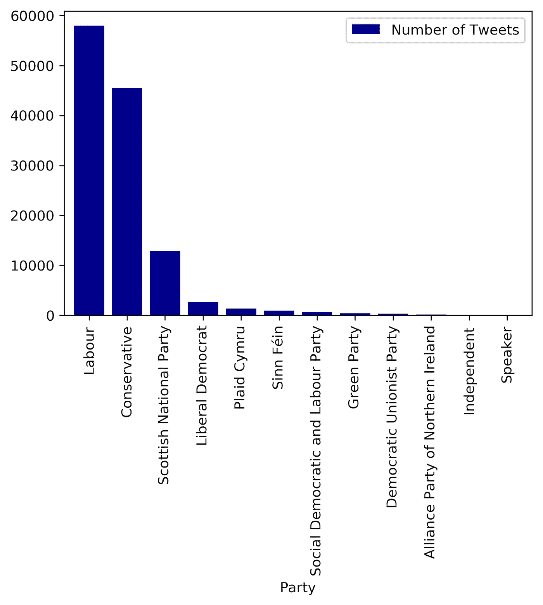
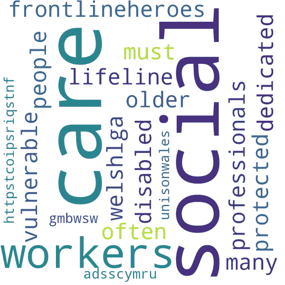
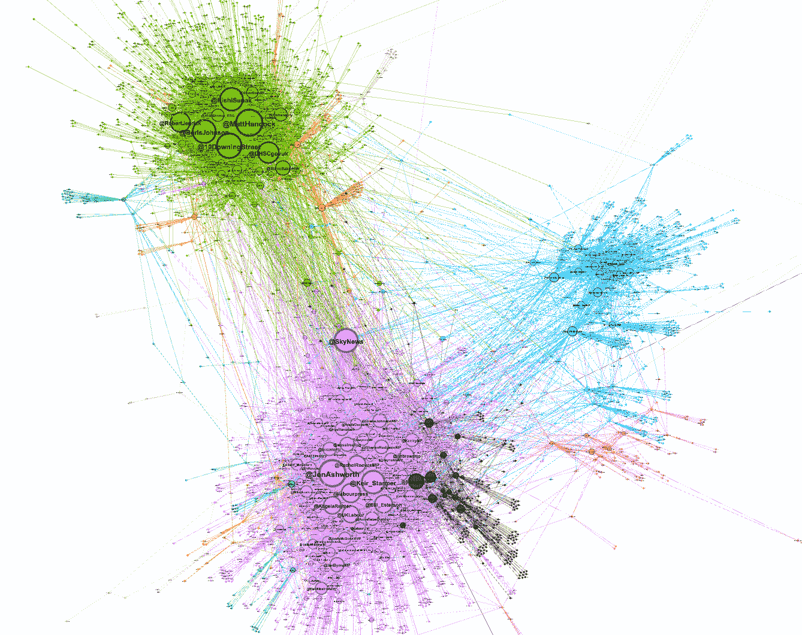

# 新冠肺炎有党派倾向吗？数据驱动的故事

> 原文：<https://pub.towardsai.net/is-covid-19-partisan-a-data-science-driven-story-27e6edd6ecbf?source=collection_archive---------4----------------------->

## [自然语言处理](https://towardsai.net/p/category/nlp)，[意见](https://towardsai.net/p/category/opinion)

艾对疫情有什么看法？这种政治分析是由网络分析、自然语言处理和主题建模驱动的。

由[拍摄的布拉尼米尔·巴洛戈维奇](https://unsplash.com/@brandaohh?utm_source=unsplash&utm_medium=referral&utm_content=creditCopyText)在 [Unsplash](https://unsplash.com/s/photos/virus?utm_source=unsplash&utm_medium=referral&utm_content=creditCopyText)

公众从他们的议员和英国政治家那里获得了哪些关于改变 COVID 限制和政策的信息？在英国，关于 COVID 的意见在政治上有多两极分化？这些都是值得探讨的重要而及时的问题，尤其是在越来越多的措施出台以刺激当地企业和防止疫情扩散的情况下。

在这个项目中，我们利用国会议员的推文来揭示整个疫情对不同措施和情况的政治情绪。这项研究试图回答的主要问题是:“政府如何处理 COVID，政府是否以党派方式行事，或者政党之间是否存在明显的政治分歧？”。使用 EDA、情感分析和无监督机器学习算法来分析和得出结论。

# 数据集

这些数据是从英国议员推文网站[获得的，该网站拥有英国议员推文的数据集。我们获得了大约 40 个在与新冠肺炎相关的推文中最常用的标签。大约 122，907 个值的数据集，每个值有 18 个变量，从这些 hashtags 中导出。](https://www.mpsontwitter.co.uk/)

# 探索性数据分析

84%的推文来自工党和保守党议员，而苏格兰民族党占总数的 10.4%(如下图 1 所示)。因此，我们将分析的重点放在了呼声最高的三个政党上。

议员们推文中最常见的单词显示在单词云中。这个词的大小表明了它的受欢迎程度和用法。“社会”、“护理”、“工人”这些词构成了我们数据集的主题。有趣的是，我们注意到，与金融和经济相比，重点更多地集中在卫生部门。

# 推文的覆盖范围和有效性

我们可以通过转发次数来估计推文的影响范围和有效性。平均转发次数为 639 次，变化很大(标准偏差约为 6900 次)。转发次数从 0 到 84200 不等。

# 其他有趣的事实

*   转发次数最多的帖子:鲍里斯·约翰逊(Boris Johnson)领先，他转发次数最多的一条推文详细描述了他在感染冠状病毒后的自我隔离。
*   已删除推文的共同主题:已删除推文中出现频率最高的词是“愤怒”、“bame”(黑人、亚裔、少数族裔)、“社区”。
*   最活跃的用户:史蒂夫·贝克维康比的保守党议员是我们数据集中最活跃的用户，共有 2229 条推文。十个最活跃的推特成员中有六个来自工党。

# 统计分析和机器学习

为了理解推文、用户和趋势之间的联系，我们使用了网络分析和社区检测策略。以用户为节点，转发者为边，构建了一个加权的有向转发网络。 **Louvain 社区检测**(一种无监督的算法)用于理解网络是如何构造的，并对网络中有意义的集群进行分类。

下图显示了转发网络，不同的颜色代表社区，这些社区是经常互相转发的用户组。

转发网络中最大的社区是工党(标有紫色)、保守党(标有绿色)和苏格兰民族党(标有蓝色)。工党聚类是最大的，拥有超过 35%的节点，其次是保守聚类，拥有 24%的节点，最后是 SNP 聚类，拥有大约 16%的节点。

我们可以从网络中看到，政党之间存在高度的分离，这表明 Twitter 上的 COVID 信息流具有高度的党派性。

# 自然语言处理和情感分析

为了了解疫情期间的公众意见和普遍感受，使用了情绪分析。对于推文中的每个词，都会给出一个分数，表明该词的积极、消极或中立程度。对于每条推文，通过推文中每个词的平均值来计算平均正面、负面和复合得分。考虑到大写字母、表情符号、感叹号和问号等，分数可能会急剧增加和减少。

从分析的推文来看，工党的情绪一直比保守党和苏格兰民族党更消极，后者的 y 轴表示积极的水平。**工党是反对党。因此，与制定和执行政策决定的保守派当权者相比，他们更倾向于直言否定。**

> 上述情况表明了健康民主的迹象，因为它表明官方反对执政党，而执政党可能对有关新冠肺炎疫情的政策发表不同意见。

# 主题建模

当查看来自所有三个政党的推文时，我们想了解每个政党在主要话题上是否有差异。为了实现这一点，我们使用了潜在的狄利克雷分配(LDA)主题建模。这个工具允许我们通过基于潜在主题自动组织大量文档档案来分析推文的内容。这些被测量为单词出现和共现的模式。

这三个政党提出的话题绝大多数都是以健康为重点的，如“covid”、“健康”和“支持”所反映的那样。疫情的经济影响也是所有政党高度关注的话题，因为保守党、工党和苏格兰国民党在他们的推文中使用“就业”、“经济”和“商业”相关的词汇。

## 苏格兰民族党

COVID 疫情；测试；说；需要；今天；健康；拿；案例；范围

## 工党

疫情；COVID 限制；统治；家；新的；学生；打电话；知道；部长

## 保守党

AMP 疫情；需要；工作；今天；感谢；疫苗；看到了；背；投票

# 结论和未来工作

在我们的研究中，我们发现新冠肺炎话题在国会议员和政党中存在分歧。在新冠肺炎执政期间，国会议员中的主要影响者主要集中在工党和保守党阵营，许多被转发次数最多的人物都集中在保守党(不出所料，Boris Johnson 是被转发次数最多的用户)。

在对国会议员转发网络的分析中，我们发现存在高度的党派偏见。同一党派的人倾向于互相转发，群体间联系很少。虽然梅塔克萨斯(2017)对已发表的 Twitter 文献进行的元分析表明，转发通常表明用户之间的一致或信任，但我们研究的一个局限是，这不太可能在 100%的情况下都是真的。

在我们对政党的情绪分析中，工党比保守党平均表现出更多的负面情绪。这种情绪与英国反对党意在批评执政党的观点是一致的。类似地，虽然政党之间围绕 COVID 的大部分言论都是相似的，但保守派比其他政党更有可能提出围绕企业和经济的话题，工党和苏格兰民族党议员平均起来可能会对“保守党”政策发表批评言论。最后，我们可以看到 COVID 在议员中引发了相当多的情绪化和有争议的评论，许多推文在发布到账户后被删除。

# 未来的工作

虽然我们的工作探索了英国 COVID 周围的信息流，但进一步的研究可以使用本报告中概述的技术来调查 COVID 周围的社交媒体上的党派偏见与疫情的政策选择之间是否存在任何关系。也就是说，在政策反应与英国截然不同的瑞典，我们会看到同样程度的两极分化吗？最终，我们的工作揭示了疫情时期的党派偏见和社交媒体，并为进一步研究新冠肺炎时期的信息流动奠定了基础。

# 非常感谢你的阅读！

更多类似的文章，请在 Medium [这里](https://towardsdatascience.com/medium.com/@alejandra.vlerick)找到我！

如果您有任何关于如何改进的**问题**、**建议、**或**想法**，请在下面留下评论或通过 LinkedIn [这里](https://www.linkedin.com/in/alejandra-g-283595b8)取得联系。