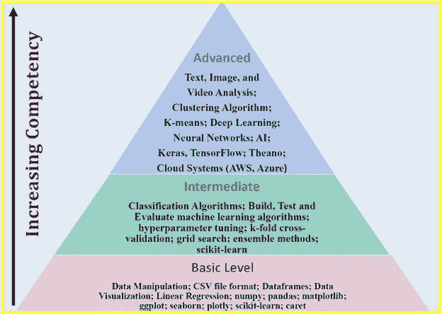
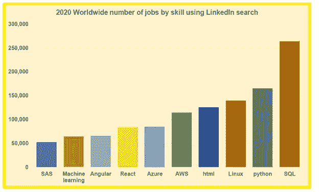
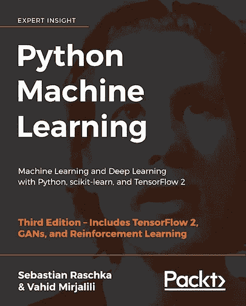

# 数据科学适合我吗？需要考虑的 14 个自测题

> 原文：<https://pub.towardsai.net/is-data-science-for-me-14-self-examination-questions-to-consider-45287205c1a9?source=collection_archive---------0----------------------->

## [数据科学](https://towardsai.net/p/category/data-science)

## *在进入数据科学领域之前，这些问题将帮助您评估自己是否准备好迎接挑战和机遇*

由[克里斯多佛·高尔](https://unsplash.com/@cgower?utm_source=medium&utm_medium=referral)在 [Unsplash](https://unsplash.com?utm_source=medium&utm_medium=referral) 拍摄的照片

数据现在被认为是增长最快、价值数十亿美元的行业之一。因此，企业和组织正试图充分利用他们已经拥有的数据，并确定他们仍然需要捕获和存储哪些数据。此外，对于数据科学家来说，理解这些数字并发现混乱的业务问题的隐藏解决方案仍然是一个不可思议的需求。最近使用 LinkedIn 求职工具进行的一项研究表明，2020 年大多数顶级技术工作都需要数据科学技能。

面对数据科学中所有令人兴奋的机会，自学数据科学是获得在这个竞争激烈的领域脱颖而出所需的技能和经验，并让您的雇主获得竞争优势的一个好方法。在进入数据科学领域之前，检查以下问题以评估数据科学是否真的适合您非常重要。

**1。什么是数据科学？**

数据科学是一个如此广阔的领域，包括几个细分领域，如数据准备和探索；数据表示和转换；数据可视化和显示；预测分析；机器学习、深度学习、人工智能等。可以考虑三个级别的数据科学能力( *3 个级别是根据最好的机器学习教科书之一中涵盖的主题定义的:Sebastien Raschka 的 Python Machine Learning，第 3 版*)，即:**级别 1** (基础级别)；**二级**(中级)；以及 l**level 3**(高级水平)。能力从 1 级增加到 3 级，如下图**图 1** 所示。

**图一**。数据科学能力的三个层次。Benjamin O. Tayo 的图片

**2。数据科学家是做什么的？**

数据科学家处理数据，得出有意义、有见地的结论，推动机构或组织的决策。他们的工作职责包括数据收集、数据转换、数据可视化和分析、构建预测模型、根据数据结果提供行动建议。数据科学家在医疗保健、政府、工业、能源、学术、技术、娱乐等不同领域工作。一些聘请数据科学家的顶级公司有亚马逊、谷歌、微软、脸书、LinkedIn、Twitter、网飞、IBM 等。

**3。数据科学家的就业前景如何？**

数据科学家的就业前景非常乐观。 [IBM 预测](https://www.forbes.com/sites/louiscolumbus/2017/05/13/ibm-predicts-demand-for-data-scientists-will-soar-28-by-2020/#7e46c7607e3b)到 2020 年，对数据科学家的需求将飙升 28%。最近使用 LinkedIn 求职工具进行的一项 [**研究**](https://medium.com/towards-artificial-intelligence/top-10-tech-skills-in-2020-worldwide-ecef27c8d8ad) 显示，2020 年大多数顶级技术工作都需要数据科学、商业分析、机器学习和云计算方面的技能(见下面的**图 2** )。

**图二**。使用 LinkedIn 的工作搜索工具按技能划分的全球工作数量。图像由本杰明·欧·塔约拍摄。

**4。数据科学家挣多少钱？**

作为一名数据科学家，你的收入取决于你工作的组织或公司、你的教育背景、经验年限以及你的具体工作角色。数据科学家的收入从 5 万美元到 25 万美元不等，平均工资约为 12 万美元。这篇 [**文章**](https://towardsdatascience.com/how-much-do-data-scientists-make-cbd7ec2b458) **(** [**数据科学家挣多少钱**](https://towardsdatascience.com/how-much-do-data-scientists-make-cbd7ec2b458) **)** 讨论的更多的是数据科学家的薪水。

**5。我如何为数据科学的职业生涯做准备？**

大多数数据科学或业务分析计划需要以下内容:

A)高水平的定量能力

b)解决问题的心态

c)编程能力

d)有效沟通的能力

e)团队工作能力

因此，为了准备在数据科学领域的职业生涯，你可以从攻读定量学科的学士学位开始，如**科学**、**技术**、**工程**、**数学**、**商业**或**经济学**。

**6。应该重点学习哪些编程语言？**

如果你有兴趣学习数据科学的基础知识，你需要从某个地方开始。不要被数据科学家招聘广告中提到的[荒谬的编程语言清单所淹没。虽然学习尽可能多的数据科学工具很重要，但建议从一两种编程语言开始。一旦你在数据科学方面打下了坚实的基础，你就可以挑战自己，学习不同的编程语言或不同的平台和生产力工具，以增强你的技能。根据这篇](https://towardsdatascience.com/ridiculous-requirements-from-data-scientist-job-ads-d84fa716af73)[文章](https://towardsdatascience.com/python-and-r-unequivocal-champions-of-data-science-31ab4d1fa45e)，Python 和 R 仍然是数据科学中使用最多的两种编程语言。我建议从 Python 开始，因为越来越多的学术培训项目和行业将它作为数据科学的默认语言。

**7。成为一名数据科学家需要多久？**

如果你在**物理学**、**数学**、**工程学**、**计算机科学**、**经济学**，或者**统计学**等分析学科有扎实的功底，基本上可以自学数据科学的基础知识。你可以从像 **edX** 、 **Coursera** 或 **DataCamp** 这样的平台上免费学习在线课程开始。**一级**能力(见**图 1** )可在 6 至 12 个月内达到。**2 级**能力可以在 7 到 18 个月内达到。第三级能力可以在 18 到 48 个月内达到。获得一定水平的能力所需的时间取决于你的背景以及你愿意在数据科学研究上投入多少时间。通常，具有分析学科(如物理、数学、科学、工程、会计或计算机科学)背景的个人需要的时间比没有数据科学背景的个人少。

8。我是否有足够的耐心继续工作，即使项目似乎遇到了障碍？

数据科学项目可能会很长，要求也很高。从问题框架到模型构建和应用，这个过程可能需要几周甚至几个月，这取决于问题的规模。作为一名实践数据科学家，项目遇到障碍是不可避免的。耐心、坚韧和毅力是成功的数据科学职业生涯的关键素质。

9。我是否具备商业头脑，能够从模型中得出有意义的结论，从而为我的组织做出重要的数据驱动的决策？

数据科学是一个非常实用的领域。请记住，你可能非常擅长处理数据以及构建良好的机器学习算法，但作为一名数据科学家，现实世界的应用才是最重要的。每一个预测模型都必须产生有意义的、可解释的现实生活结果。预测模型必须根据实际情况进行验证，才能被认为是有意义和有用的。作为数据科学家，您的职责是从数据中提取有意义的见解，用于数据驱动的决策，从而提高您公司的效率或改善业务开展方式，或帮助增加利润。

**10。我有良好的沟通技巧吗？**

数据科学家需要能够与团队的其他成员或组织中的业务管理员交流他们的想法。良好的沟通技巧将在这里发挥关键作用，能够向很少或根本不了解数据科学技术概念的人传达和展示非常技术性的信息。良好的沟通技巧将有助于培养与其他团队成员(如数据分析师、数据工程师、现场工程师等)团结一致的氛围。

**11。我是一个终身学习者吗？**

数据科学是一个不断发展的领域，所以要做好接受和学习新技术的准备。与该领域的发展保持联系的一种方式是与其他数据科学家建立联系。一些促进网络的平台是 LinkedIn、GitHub 和 medium ( [**面向数据科学**](https://towardsdatascience.com/) 和 [**面向 AI**](https://towardsai.net/) 出版物)。这些平台对于获取该领域最新发展的最新信息非常有用。

**12。我是团队成员吗？**

作为一名数据科学家，你将在一个由数据分析师、工程师和管理员组成的团队中工作，因此你需要良好的沟通技巧。您还需要成为一名优秀的倾听者，尤其是在早期项目开发阶段，您需要依靠工程师或其他人员来设计和构建一个优秀的数据科学项目。成为一名优秀的团队成员有助于你在商业环境中茁壮成长，并与团队中的其他成员以及组织的管理人员或主管保持良好的关系。

**13。我有道德吗？**

道德和隐私考虑是数据科学中必须的。你需要理解你的项目的含义。对自己诚实。避免操纵数据或使用有意造成结果偏差的方法。从数据收集到分析，再到模型构建、分析、测试和应用的所有阶段都要符合道德规范。避免为了误导或操纵你的观众而捏造结果。在解释你的数据科学项目的发现时要合乎道德。

**14。有哪些学习数据科学的资源？**

如果你的环境允许，你可以攻读数据科学或商业分析的硕士学位。如果你负担不起攻读硕士学位的费用，你可以通过自学来学习数据科学。一般来说，如果你在物理、数学、经济、工程或计算机科学等分析学科方面有坚实的背景，并且你有兴趣探索数据科学领域，最好的方法是从大规模开放在线课程(MOOCs)开始。在建立了坚实的基础后，您可能会寻求其他方法来增加您的知识和专业技能，例如从教科书中学习、参与项目以及与其他数据科学有志者建立联系。

下面是推荐的 MOOCs 和教科书，可以帮助你掌握数据科学的基础知识。

**推荐慕课:**

[数据科学专业证书(HarvardX，通过 edX)](https://www.edx.org/professional-certificate/harvardx-data-science)

[分析:基本工具和方法(Georgia TechX，通过 edX)](https://www.edx.org/micromasters/analytics-essential-tools-methods)

[Python 专业的应用数据科学(密歇根大学，通过 Coursera)](https://www.coursera.org/specializations/data-science-python)

**推荐书籍:**

从教科书中学习提供了比你从在线课程中获得的更精炼和更深入的知识。这本书对数据科学和机器学习提供了很好的介绍，包括代码:“Python 机器学习”，作者 Sebastian Raschka。[https://github . com/rasbt/python-machine-learning-book-第三版](https://github.com/rasbt/python-machine-learning-book-3rd-edition)

开源图书链接: [GitHub 资源库](https://github.com/rasbt/python-machine-learning-book-3rd-edition)

作者以一种非常容易理解的方式解释了机器学习的基本概念。此外，代码也包括在内，因此您实际上可以使用提供的代码来练习和构建您自己的模型。我个人认为这本书在我作为数据科学家的旅程中非常有用。我会向任何数据科学爱好者推荐这本书。你所需要的是基本的线性代数和编程技能，以便能够理解这本书。

还有许多其他优秀的数据科学教科书，如韦斯·麦金尼的《 [Python for Data Analysis](https://sushilapalwe.files.wordpress.com/2018/04/python-for-data-analytics-book.pdf) 》、库恩·约翰逊的《[应用预测建模](https://vuquangnguyen2016.files.wordpress.com/2018/03/applied-predictive-modeling-max-kuhn-kjell-johnson_1518.pdf)》、伊恩·h·威滕的《[数据挖掘:实用机器学习工具和技术](https://www.wi.hs-wismar.de/~cleve/vorl/projects/dm/ss13/HierarClustern/Literatur/WittenFrank-DM-3rd.pdf)》、艾贝·弗兰克&马克·a·霍尔的《数据挖掘:实用机器学习工具和技术》等等。

# **总结与结论**

总之，我们讨论了 14 个针对数据科学有志者的重要常见问题。根据个人背景的不同，通往数据科学的旅程可能会有所不同，但本文提供的答案可以为考虑数据科学领域的个人提供一些指导。

# 其他数据科学/机器学习资源

[数据科学需要多少数学？](https://medium.com/towards-artificial-intelligence/how-much-math-do-i-need-in-data-science-d05d83f8cb19)

[数据科学课程](https://medium.com/towards-artificial-intelligence/data-science-curriculum-bf3bb6805576)

[进入数据科学的 5 个最佳学位](https://towardsdatascience.com/5-best-degrees-for-getting-into-data-science-c3eb067883b1)

[数据科学的理论基础——我应该关心还是仅仅关注实践技能？](https://towardsdatascience.com/theoretical-foundations-of-data-science-should-i-care-or-simply-focus-on-hands-on-skills-c53fb0caba66)

[机器学习项目规划](https://towardsdatascience.com/machine-learning-project-planning-71bdb3a44349)

[如何组织你的数据科学项目](https://towardsdatascience.com/how-to-organize-your-data-science-project-dd6599cf000a)

[大型数据科学项目的生产力工具](https://medium.com/towards-artificial-intelligence/productivity-tools-for-large-scale-data-science-projects-64810dfbb971)

[数据科学作品集比简历更有价值](https://towardsdatascience.com/a-data-science-portfolio-is-more-valuable-than-a-resume-2d031d6ce518)

***如有疑问和咨询，请发邮件给我***:benjaminobi@gmail.com