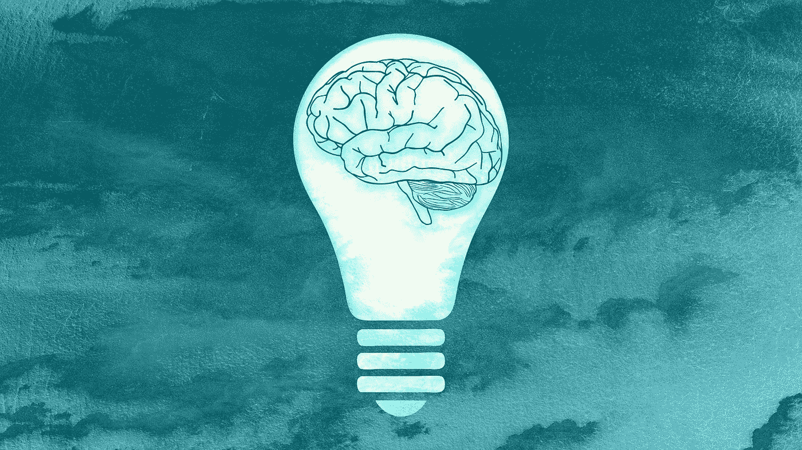

# 数据科学让我们的大脑变得更懒了吗？

> 原文：<https://pub.towardsai.net/is-data-science-making-our-brains-lazier-c63732c82db6?source=collection_archive---------1----------------------->

## [数学](https://towardsai.net/p/category/mathematics)

## 我给一些数据科学家发送了三个数学问题，看看他们是否会解决它们或者只是模拟它们

来自 Pixabay

经常阅读我的文章的人都知道我对数据科学和统计编程有多大的热情。但我最近开始思考，今天方便和流行的编程选项是否正在使我们不太可能从基本原理中找到数学问题的解决方案，而这些解决方案实际上可能更快找到。有没有可能在我们匆忙解决问题的过程中，我们已经变得不擅长用铅笔和纸来解决问题了？

20 世纪 90 年代末，当我还是一名博士生时，数学编程的选择是有限的，因此，如果我们真的很难找到纸和笔的方法，我们通常只会朝那个方向努力。但是今天，编程模拟一个问题的选择是广泛的，在某些情况下，我担心它已经成为解决问题的默认方式。

最近我开始阅读马丁·李贝克的*纯数学简明介绍*来帮助我更新一些基本的数学概念。它包含了一些有趣的问题，任何一个有能力的高中生都应该能够理解。作为一项实验，我选取了其中的三个问题，并请一组数据科学家尝试解决它们。他们来了，事情是这样的。

## 问题 1

问题是这样的:

在一家餐馆，账单是 x 美元和 y 美分，其中 x 和 y 是大于 1 的整数，满足等式 y^(4/3) = x^(5/6).账单多少钱？

我请了三位数据科学家来回答这个问题，他们都执行了某种形式的代码，计算从 2 到 99 的 *y* 的值的 *y* ^(4/3，然后将答案幂到 3/4，看它是否是一个整数。这包括编写代码，然后检查结果，可能要花一点时间，但它确实能给你答案。

然而，这很容易用铅笔和纸来解决。如果我们将指数转换为分母为 6，我们得出结论:( *y⁸)^(1/6) = (x⁵)^(1/6)，*所以 *y* ⁸ = *x⁵.*现在既然 *y* 一定小于 100，我们可以用 2 的幂，这样(2⁵)⁸ = (2⁸)⁵.所以账单是 256.32 美元。

## **问题二**

问题是这样的:

*给定 n 和√(n-2)+√(n+2)都是整数，求 n.*

两位数据科学家选择模拟这两个值的范围为 *n.* 在这种情况下，他们很快找到了解决方案。人们能够通过快速猜测和检查来确定解决方案。然而，这仅仅回答了问题的一半，因为一个模拟或猜测无法证明 *n* 只有一个解。我们可以证明，似乎不太可能有一个以上的解决方案，但模拟并不能证明这一点。

要找到解决方案并证明它是唯一的，可以如下进行。请注意， *n-2* 必须大于零，因为我们是平方根，所以 *n* 必须大于或等于 2。还要注意( *√(n-2)+√(n+2))* 是整数。通过展开它，我们得到:

2( *n + √(n -4)* )

是一个整数。由此我们可以得出结论， *√(n -4)* 一定是整数。现在，对于所有从 4 开始的平方数，连续平方数之间的间隔都大于 4。所以 *n -4* 只能有一个小于或等于 2 的整数值给 *n* 。所以 *n* ≥2， *n* ≤2。因此 *n = 2。*

## 问题 3

这一个可能是三个中最难的。问题是这样的:

在一个荒岛上，有 30 条火蜥蜴。15 个是红色，7 个是蓝色，8 个是绿色。当两种不同颜色的蝾螈相遇时，它们都会变成第三种颜色。当两条相同颜色的蝾螈相遇时，它们各自会变成与其他两种颜色不同的颜色。例如，如果一条绿色和蓝色的蝾螈相遇，它们都会变成红色，如果两条红色的蝾螈相遇，一条会变成绿色，另一条会变成蓝色。在未来的某个时刻，所有的蝾螈有可能都是红色的吗？

模拟再次成为数据科学家的首选。两个人进行了多达一百万次的随机模拟，但没有发现任何一种情况下所有的蝾螈都是红色的。另一个程序设计了一个循环，当所有的火蛇都是红色时就停止。这个过程不会很快停止。

这就是统计学和纯数学的区别。根据上面的模拟，统计学家可能会满意地认为，他们已经确定不可能所有的蝾螈都是红色的，因为统计学家通过将概率降低到零假设被认为“太不可能是真的”的程度来确定事情。但这并不是真正的证据。这绝不会带你百分百确定不可能所有的蝾螈都是红色的。

为了证明这一点，考虑每种颜色除以 3 后的余数。所以红色蝾螈是 0，蓝色是 1，绿色是 2。现在想想任何一对火蜥蜴相遇时会发生什么。如果两个红色相遇，红色余数将增加到 2，蓝色和绿色余数将分别减少到 0 和 1，所以我们仍然有余数 0，1，2。很容易看出，所有六种可能的蝾螈组合都是如此。

所以，无论蝾螈遇到多少种不同的组合，剩下的 0，1，2 的结构总是被保留下来。然而，如果所有 30 条蝾螈都是红色的，剩余的结构将是 0，0，0。因此，不可能在任何时候阅读所有的 30 条蝾螈。

你会如何处理这些问题，你对数据科学是否让我们的数学大脑变得懒惰有什么看法？欢迎发表评论。