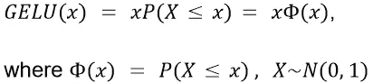
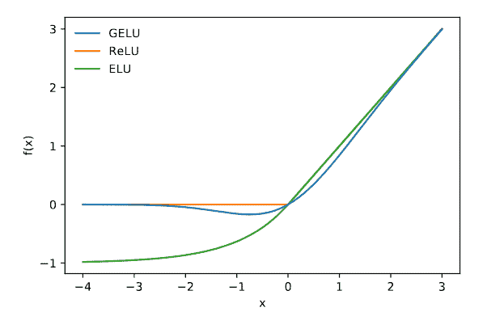
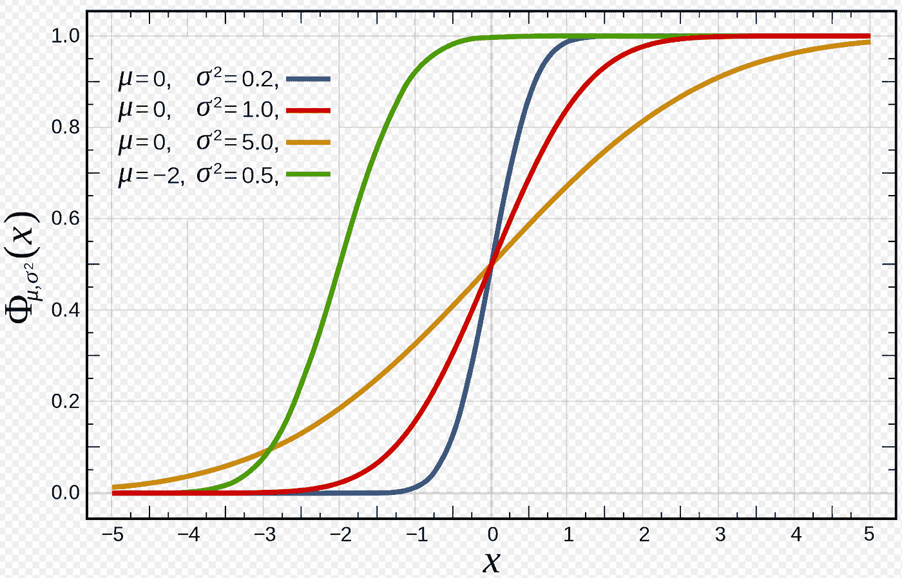
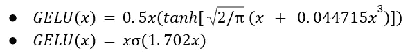
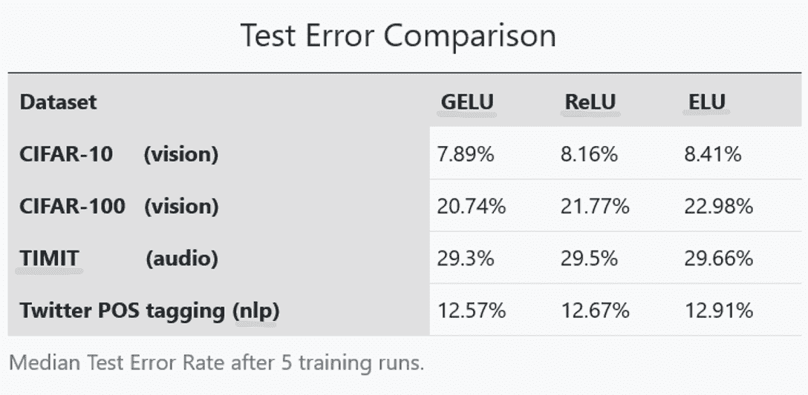

# 葛鲁，热鲁接班人？高斯误差线性单位解释

> 原文：<https://pub.towardsai.net/is-gelu-the-relu-successor-deep-learning-activations-7506cf96724f?source=collection_archive---------0----------------------->

[威利安 B.](https://unsplash.com/@willbassi?utm_source=medium&utm_medium=referral) 在 [Unsplash](https://unsplash.com?utm_source=medium&utm_medium=referral) 上的照片

在本教程中，我们旨在全面解释 ***高斯误差线性单元*** 、 ***GELU*** 激活如何工作。

我们能结合正则化和激活函数吗？2016 年，作者丹·亨德里克斯和凯文·金佩尔发表了一篇论文。从那以后，这份报告已经更新了 4 次。作者引入了一个新的激活函数**，**，**，*高斯误差线性单元，GELU。***

# 揭秘格鲁派

GELU 激活背后的动机是用非线性(即激活函数)来桥接随机正则化因子，例如丢弃。

**退出正则化**将一个神经元的输入与 0 随机相乘，随机地使它们不活动。另一方面， **ReLU** 激活确定性地将输入乘以 0 或 1，这取决于输入的值。

**GELU** 通过将输入乘以一个从 0 到 1 的值来合并两种功能。然而，这个 0-1 掩码的值虽然是随机确定的，但也取决于输入的值。

在数学上，GELU 激活函数被公式化为:

φ(x)是标准正态分布的[累积分布函数(CDF)。](https://en.wikipedia.org/wiki/Normal_distribution#Cumulative_distribution_functions)该函数的选择源于这样一个事实，即神经元输入往往遵循正态分布，尤其是在使用批量标准化时。因此，本质上 **GELU 有更高的概率丢弃一个神经元(乘以 0)，而 X 减少**，因为 P(X ≤ x)变得更小。请花点时间想一想，让它沉下去。因此，GELU 应用的变换是随机的，但它依赖于通过φ(x)输入的值。

图 1:高斯误差线性单位(μ=0，σ=1)、校正线性单位和指数线性单位(ELU) (α=1)。来源[ [1](https://arxiv.org/pdf/1606.08415v3.pdf) ]

由于 CDF P(X≤x)几乎等于 0，因此观察 GELU(x)如何从零开始。然而，在值-2 附近，P(X≤x)开始增加。因此我们看到 GELU(x)偏离零。对于正值，由于 P(X≤x)向值 1 靠拢，GELU(x)开始逼近 ReLU(x)。下图中，红线代表标准正态分布 N(0，1)即 P(X≤x)的 CDF。

图 2:不同高斯分布的累积分布函数。红线代表标准法线 N(0，1)的 CDF。[来源维基百科](https://en.wikipedia.org/wiki/Normal_distribution#/media/File:Normal_Distribution_CDF.svg)。

## **葛鲁约计**

葛陆也可以通过公式来近似

如果更大的前馈速度值得精确的代价。

## **葛鲁变奏曲**

还可以通过使用不同的 CDF 来修改 GELU。例如，如果使用逻辑分布 CDF (x ),那么我们将得到 Sigmoid 线性单位(路斯)x(x)。此外，我们可以选择一个 CDF N(μ，σ),其中μ和σ是可学习的超参数。

## **GELU 激活功能的优点**

在[1]中，作者在 3 个不同的基准数据集上实验了针对 ReLU 和 ELU 激活函数的 GELU 的使用，这些数据集涵盖了计算机视觉(CIFAR 10/100 分类)、自然语言处理(Twitter 语音标记部分)和音频音素识别( [TIMIT](https://catalog.ldc.upenn.edu/LDC93s1) 帧分类)的任务。

在整个实验过程中，他们观察到与 ReLU 和 ELU 相比，使用 GELU 在准确性上有持续的提高。分析上:

上表显示了 4 个数据集中的测试错误率。GELU 始终实现最低的测试错误率，成为 ReLU 和 ELU 的神经网络激活函数的一种有前途的替代方法。

## GELU 激活函数的 Python 代码

如果你对用 Python 编写 GELU 或者用 PyTorch 或 Tensorflow 来使用它感兴趣，可以看看这篇简短的编码教程。

 [## GELU:高斯误差线性单位码(Python，TF，Torch)

### 代码教程为 GELU，高斯误差线性单位激活函数。包括 bare python，Tensorflow 和 Pytorch…

pub.towardsai.net](/gelu-gaussian-error-linear-unit-code-python-tf-torch-neural-network-bert-de539517edef) 

## **关于 GELU 激活的有趣事实**

著名的论文[“一幅图像相当于 16x16 个字:大规模图像识别的变形金刚”](https://arxiv.org/abs/2010.11929)使视觉变形金刚(vit)流行起来，它利用了编码器变形金刚模块(3.1 节)的全连接神经网络(MLP)中的 GELU 激活。这表明，高质量的研究人员认为 GELU 是一个很好的选择。

其他大型变形金刚模型，如伯特和 GPT，也使用 GELU 作为激活函数。由于这些模型是巨大的，正则化变得非常重要，因此 GELU 成为如此巨大的变压器模型如此受欢迎的激活。

## **参考文献**

[1] [高斯误差线性单位(GELUs)](https://arxiv.org/abs/1606.08415)

[2]https://en.wikipedia.org/wiki/Normal_distribution

[3] [一幅图像相当于 16x16 个字:大规模图像识别的变形金刚](https://arxiv.org/abs/2010.11929)

*如果你学到了有用的东西，请关注我，获取更多深度学习内容和技术教程。使劲鼓掌也让我感觉很棒:)*

如果你喜欢我的博客，你可以通过我的推荐链接加入 Medium 来支持我。我会得到一半的奖励，不需要你额外付费:)

 [## 通过我的推荐链接加入 Medium-Konstantinos Poulinakis

### 阅读深度学习，数据科学，技术和媒体上的想法。您的会员费直接支持…

medium.com](https://medium.com/@poulinakis.kon/membership) 

*感谢阅读，随意伸手！*

**我的链接:** [中](https://medium.com/@poulinakis.kon)|[*LinkedIn*](https://www.linkedin.com/in/konstantinos-poulinakis-4554821a3/)*|[GitHub](https://github.com/Poulinakis-Konstantinos)*