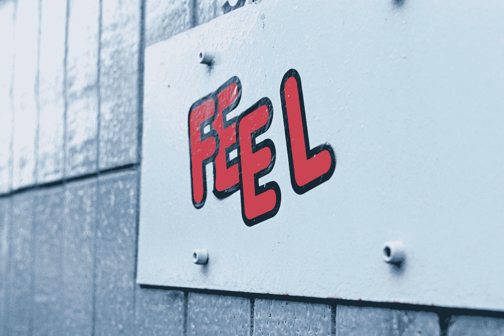

# Google AI 有知觉吗？以下是我对 LaMDA 的真实想法

> 原文：<https://pub.towardsai.net/is-google-ai-sentient-heres-what-i-really-think-about-lamda-63fe31c2b7ac?source=collection_archive---------1----------------------->

## 让我们试着弄清楚人工智能是否能感受情感

照片由 [Unsplash](https://unsplash.com?utm_source=medium&utm_medium=referral) 上的[尼克·佩奇](https://unsplash.com/@nickpage?utm_source=medium&utm_medium=referral)拍摄

如今，**科技在我们的生活中随处可见。有时感觉我们不能离开它。作为用户，我们每天都有技术帮助我们完成不同的任务。作为研究人员，我们处理**高级神经网络和框架**，我们可以用它们来**构建智能应用**。**

问题是: ***我们能走多远？***

## 概述

1.  ***生成式人工智能&语言模型***
2.  ***南大案***
3.  ***AI 能有知觉吗？***
4.  ***结论***

## 1.生成人工智能和语言模型

**人工智能**是一个通称。我们用它来表示在某种程度上*、能够**模仿人类行为**的**应用程序，甚至做得更好。我们熟悉的**弱智能特工**，所谓的弱智能特工是因为**专注于单一任务**。他们做得非常好。***

*我们也熟悉**生成式 AI** ，可以产生**美术**、**音乐**，甚至**文字**的人工智能体。像人类一样。*

*是的，甚至**文**。*

> *文字是语言的书面形式，语言是人类区别于动物的地方。语言代表我们如何交流。*

*语言一直是人类保留的**能力**，但现在**一些****ai 也有同样的能力**。一个例子是预训练生成变压器，或 GPT-3。这个变形金刚可以**产生类似人类的文字**。而且不是唯一的一个。*

*像 GPT-3 这样的模型使用**神经网络**产生一个结果。这些神经网络就是 ***“黑箱”。没有人*** 知道**为什么会产生某种结果**。没人。我们唯一知道的是这些网络被训练的日期。而这个**在**可说明性**和**可解释性**方面都会构成风险**。*

## *2.LaMDA 案*

*甚至**谷歌**也在开发一个用于创建对话应用(聊天机器人)的**模型。它看起来很强大——最强大的**。*****

***这个模型，即 **LaMDA** (对话应用的语言模型)，可以定义为**开放域聊天机器人**。***

> ***一个开放领域的聊天机器人并不局限于某个特定的应用领域，它可以谈论任何事情。***

***LaMDA 实例可以**生成不同的个性**并使用它们与用户相关联。这些个性是在对话期间动态生成和改变的。一些被认为危险的角色已经被开发者自己屏蔽了(例如，一个杀人犯角色)。***

***其中一名工程师报告说，与这个模型互动就像与一个 **7、8 岁但懂物理的孩子互动**。***

***同一位**工程师最近被解雇了**，因为**报告说 LaMDA 车型是有感觉的**。我们真的在一个有意识的人工智能面前吗？***

***让我们试着弄清楚。***

## ***3.AI 能有知觉吗？***

***2 月 10 日，OpenAI [**的 **CEO 发推文****](https://twitter.com/ilyasut/status/1491554478243258368) **: *“大型神经网络有可能轻微意识”*** 。而且他不是唯一一个有过这种想法的人。**怎么回事？*****

***如果你 [**看了两个**工程师和 LaMDA AI** 之间的一些对话**](https://www.documentcloud.org/documents/22058315-is-lamda-sentient-an-interview) **s** ，你就体会到**是多么的先进和强大了**。但是这并不意味着它经历情感或感觉。***

***一般来说，**对话代理**是在大量对话中训练出来的**。因此，**假设这个模型也主要在对话、**上被训练，这些对话可能包含博客和论坛上的**聊天**、**对话**、**评论**等。如果是这样的话，这个特工就接受过讲述人们生活片段的**文件的培训**。**包含爱的句子和恨的句子的文档**。包含**打架**、**告白**、**恐惧**、**欲望**、**情感**、**希望**的**真人**就像你我。*****

***不管它被训练成什么样，这个模型**已经学会了当人们有感觉时如何表达自己**以及他们期望什么样的反应**。它已经学会了某些情绪是如何交流的。据悉，我们害怕死亡和痛苦。**那我们**想想过去**而**担心未来**。***

***这个代理已经从我们的对话中学习了，并且**的行为和我们一样**，或者至少试着这样做。它通常理解我们如何处理特定的情况，并表现出我们希望另一个人表现出的行为。或者它做得更好。它学会了人类体验情感以及他们如何描述情感。它已经理解了**某些情绪是如何产生的以及为什么会产生**。***

> ***它知道情绪可以被写下来，并且不需要真正的去感受它们。***

## ***4.结论***

***不知道这个智能有没有知觉。我所知道的是，你不必成为某个人或某样东西才能以某种方式行事。***

> ***这个强大的人工智能不一定要有感知能力才能让我们怀疑它是否有感知能力。它可能只是学会了在某种意义上和我们相似。甚至都不知道。***

***也许，这种智能**只是在模仿成千上万人的特征**，它已经在这些人身上接受了训练**并且很好地学习了语言的结构**。没有情绪。没有感情。仅此而已。***

***或者，正如尼克·博斯特罗姆在《超级智能》中描述的场景，这个人工智能将通过其**社会工程技能**接管世界。谁知道呢。***

***你对此有什么看法？***

## ***参考***

***LaMDA 有知觉吗？—一次采访—[https://www . document cloud . org/documents/22058315-is-lamda-sentient-an-Interview](https://www.documentcloud.org/documents/22058315-is-lamda-sentient-an-interview)***

***CNN 商务—[https://edition . CNN . com/2022/07/23/Business/Google-ai-engineer-fired-sentient/index . html](https://edition.cnn.com/2022/07/23/business/google-ai-engineer-fired-sentient/index.html)***

***CNN 商业—[https://edition . CNN . com/2022/06/13/tech/Google-ai-not-sentient/index . html](https://edition.cnn.com/2022/06/13/tech/google-ai-not-sentient/index.html)***

***《华盛顿邮报》——[https://www . Washington Post . com/technology/2022/06/11/Google-ai-lamda-Blake-le moine/](https://www.washingtonpost.com/technology/2022/06/11/google-ai-lamda-blake-lemoine/)***

***TechTarget—[https://www . TechTarget . com/search enterprise AI/feature/Ex-Google-engineer-Blake-莱莫因-discuses-sentient-AI](https://www.techtarget.com/searchenterpriseai/feature/Ex-Google-engineer-Blake-Lemoine-discusses-sentient-AI)***

***谷歌 LaMDA—[https://blog.google/technology/ai/lamda/](https://blog.google/technology/ai/lamda/)***

***谷歌博客，开放对话代理—[https://ai . Google Blog . com/2020/01/forward-Conversational-agent-than-can . html](https://ai.googleblog.com/2020/01/towards-conversational-agent-that-can.html)***

***https://en.wikipedia.org/wiki/GPT-3 GPT 维基百科-3 —***

***亚利桑那州立大学，问生物学家—[https://aska Biologist . ASU . edu/questions/human-animal-differences](https://askabiologist.asu.edu/questions/human-animal-differences)***

***尼克·博斯特罗姆，超级智能——[https://nickbostrom.com](https://nickbostrom.com)***