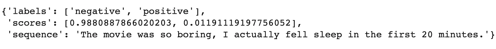

# 有没有可能在无标签数据上做文本分类？(壮举。零射击分类)[实验]

> 原文：<https://pub.towardsai.net/is-it-possible-to-do-text-classification-on-unlabeled-data-feat-zero-shot-classification-8caa584a1661?source=collection_archive---------0----------------------->

## [自然语言处理](https://towardsai.net/p/category/nlp)


由[马库斯·斯皮斯克](https://unsplash.com/@markusspiske?utm_source=medium&utm_medium=referral)在 [Unsplash](https://unsplash.com?utm_source=medium&utm_medium=referral) 上拍摄的照片

几个月前，我做了一个实验来回答这个问题:如果我们没有目标标签，有可能进行情感分析吗？该过程是使用无监督算法来生成标签，这些标签将用于微调 BERT 模型。该实验产生了具有 71.1%准确度的微调的 BERT 模型。([点击这里](https://nlpiation.medium.com/is-it-possible-to-do-sentiment-analysis-on-unlabeled-data-using-bert-feat-vader-experiment-357bba53768c)阅读全文)

在这篇文章中，我们将尝试使用零炮分类法来获得更好的精度。当我们没有足够的训练数据时，这些模型非常方便。它们可以通过将输入序列(在我们的例子中是评论)和自定义标签(正面、负面、中性……情绪)传递给一个完全不同目标的训练模型来使用。互联网上的许多例子使用这些模型将序列(如推文)分类成不同的类别(如经济、政治、体育等)。但是让我们看看他们实际上做得有多好，我们应该使用他们吗？

# 数据集

我们将使用 50K IMDB 情感数据库(来自 [Kaggle](https://www.kaggle.com/lakshmi25npathi/imdb-dataset-of-50k-movie-reviews) )。它是由用户电影评论和他们的正面/负面情感标签组成的数据集。在本实验中，使用相同的测试集(最后 5K 个样本)以获得与前一篇文章相当的结果是非常重要的。请记住，我们不需要训练/验证集，因为在使用零触发分类器时没有训练/微调步骤。(这才是重点！)

加载 IMDB csv 文件，并将最后 5K 个样本用作测试集。

# 加载模型

我们可以使用 Huggingface 的[管道](https://huggingface.co/transformers/main_classes/pipelines.html)来加载零镜头分类器模型。默认模型设置为 BART，但是您可以从他们的[中枢](https://huggingface.co/models?pipeline_tag=zero-shot-classification&sort=downloads)中选择任何预先训练的模型。在这个实验中，我们将使用默认的 BART 模型，第一步是下载/加载预训练的模型。

加载预训练模型的代码。

上面的代码将创建一个模型并自动下载权重。下一步是试图根据给定的评论得出正面/负面的预测。

从分类器获取预测的代码。



上面代码的输出。

如你所见，模型以 98.8%的确定性预测了负面标签。需要注意的是，库会根据分数自动对标签进行排序，所以我们总能得到第一个索引作为预测的标签。除非我们在调用分类对象时，通过将 **multi_label** 标志设置为 True，出现了多标签分类问题。让我们编写代码来循环测试集并对它们进行分类。

示例推理循环的代码。

上面的代码将对所有的样本进行分类，并使用 Sklearn 库计算准确率得分。这个简单的代码，没有任何预先训练，将导致 **88.2%** 的准确率！太不可思议了！还有一步可以提高精度。

# 零拍模特是如何训练的？

该模型在自然语言推理(NLI)语料库上进行了训练。它是一个数据集，由称为“前提”和“假设”的序列对组成，带有真/假标签，用于确定给定前提时假设是否为真。这里有一个例子:

```
Premise    : Cars are racing in the track.
Hypothesis : A car race is happening.
Label      : True
```

该模型将通过尝试预测正确的标签来学习序列之间的关系。通过同样的逻辑，我们可以使用如下的序列对来确定一个序列是否应该被归类为一个特定的标签。

```
Premise    : The movie was so boring, I actually ...
Hypothesis : This example is negative.
```

基于给定的序列，一个好的模型将返回 True。这和 Huggingface 用的是同一个概念。它实际上使用了同样提到的模板“这个例子是{}”评估每个自定义标签。

# 更改假设模板

理想情况下，在假设模板中提供更多关于任务的信息会导致更准确的结果。理论上，如果我们使用模板“文本主题是关于{}”有望得到更好的结果。当试图预测文本主题(如经济、政治、体育……)而不是默认的“这个例子是{}”时让我们看看改变模板序列是否会增加准确性。

假设模板必须有一个“{}”占位符，该占位符将在评估过程中被替换为候选标签。我使用新模板“这篇评论的观点是{}”重新运行相同的测试循环。并且将准确率从 **3.5%** 提高到 **91.7%** ！

# 结论

零触发分类器工作得如此之好，这是值得注意的。我从[之前的实验](https://nlpiation.medium.com/is-it-possible-to-do-sentiment-analysis-on-unlabeled-data-using-bert-feat-vader-experiment-357bba53768c)中获得的最佳精度是 **71%** 这确实不是一个干净的方法。现在，我们得到了 **91.7%** ，甚至没有在特定数据集上对模型进行微调。

> 我每周给 NLP 的书呆子发一份时事通讯。如果您想了解自然语言处理的最新发展，可以考虑订阅。
> [阅读更多，订阅](https://nlpiation.github.io/) —加入酷孩子俱乐部，立即报名！