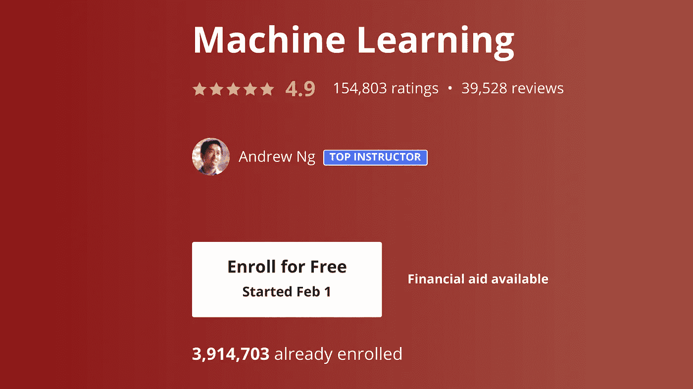

# 现在学 AI 还来得及吗？

> 原文：<https://pub.towardsai.net/is-it-too-late-to-learn-ai-dcd86e8f0c57?source=collection_archive---------0----------------------->

## [教育](https://towardsai.net/p/category/education)

## 你错过火车了吗？

由 [Wynand van Poortvliet](https://unsplash.com/@wwwynand?utm_source=medium&utm_medium=referral) 在 [Unsplash](https://unsplash.com?utm_source=medium&utm_medium=referral) 上拍摄

# AI 饱和度

我定期分享学习 AI 和数据科学的资源，无论是谷歌或哈佛的课程，还是完整长度的 YouTube 教程。

同时听到关注:*“现在学 AI 和数据科学还来得及吗？”*

令人担忧的是，随着数百万学生学习机器学习，该领域正变得饱和。毕竟，人工智能的工作是有限的，尤其是在全球经济衰退期间。

吴恩达在 Coursera 上著名的机器学习课程拥有近 400 万学生。

截至发稿时，如果你在 LinkedIn 上搜索“机器学习”，你会找到刚刚超过 10 万份工作。

很明显，学生的数量远远超过了公开招聘的数量——仅从一门 Coursera 课程的学生数量来看，这一比例就接近 40:1。

# 为什么它仍然值得

也就是说，学习人工智能仍然是值得的，原因有很多。

## 内部企业家精神

首先，我们来谈谈内部创业。人工智能已经变得比以往任何时候都更容易和更快地构建和部署——特别是考虑到像[这样的无代码人工智能工具。人工智能](http://obviously.ai)——这意味着员工可以通过将人工智能加入他们的技能组合来增加更多价值。

这些在组织中寻找人工智能用例的内部创业者并没有增加 LinkedIn 上的空缺职位数量，但有无数的例子。

对于任何员工来说，成为人工智能内部企业家都有巨大的激励:自动化重复、枯燥的工作部分的潜力，以及专注于创造性的、以人为中心的任务的潜力。更不用说，人工智能技能可以提高你的工资和职业生涯。

例如，营销人员可以使用人工智能来预测客户行为，建立人物角色并识别顶级人口统计数据。零售员工可以优化商品组合、预测库存消耗、预测员工需求等等。保险员工可以使用人工智能来预测保险索赔、诉讼风险、代位求偿机会等。

人工智能内部创业者的可能性是无限的。

## 企业家精神

大约 10 万份机器学习工作中还不包括另一个巨大的机会领域:创业。

创业是内部创业中风险更大的一面。这意味着走自己的路，寻找新的方式来增加市场价值，通常没有任何形式的支持、帮助或稳定性。

同时，这种高风险伴随着高回报的潜力。

假设你以第 30 名员工的身份加入了一家硅谷初创公司(这还是在早期)，你是所在领域的顶尖工程师之一。根据 Holloway 的说法，你可以期待[0.25%–0.5%的股权](https://www.holloway.com/g/equity-compensation/sections/typical-employee-equity-levels)。

如果你独自创业，作为一个单独的创始人，你有 100%的资本。通过带来自己的联合创始人、员工和投资者，这个数字会减少，但还有更多潜力。

## 不断学习

即使你对内部创业、企业家精神或获得一个新职位不感兴趣，也有必要不断学习。

人工智能现在出现在每个行业，从你在亚马逊、Spotify、网飞或 Tinder 上获得的推荐，到你在谷歌或 YouTube 上看到的搜索结果，甚至到新冠肺炎跟踪、疫苗开发和疫苗推广。

为了跟上最新技术，并真正了解当今世界，学习人工智能是必须的。

# 结论

学习 AI 是值得的，永远值得。即使就业市场已经饱和(现在还没有饱和，因为仍然有适合那些合格的人的工作机会)，创造性的内部企业家和企业家总是有潜力的。为了保持相关性，人工智能技能正迅速成为必备技能。