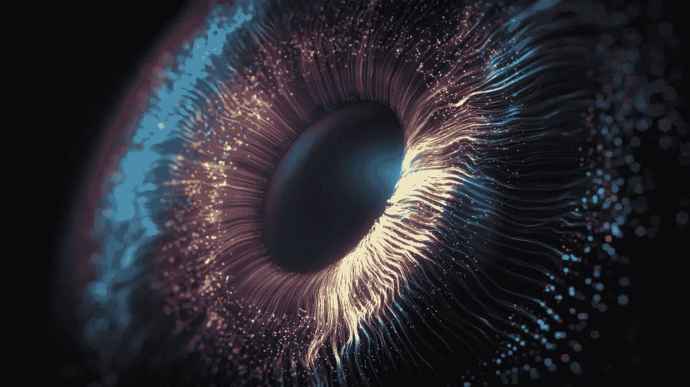
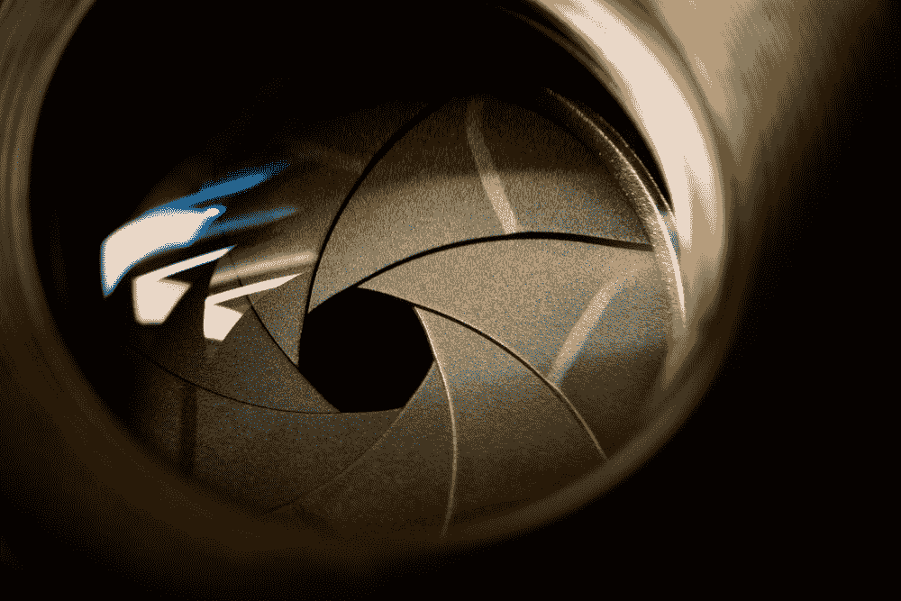
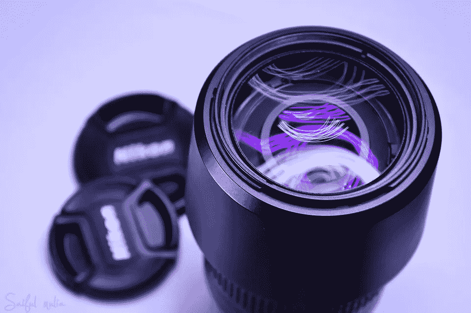

# 这是 AI 获得人类视力的方式吗？

> 原文：<https://pub.towardsai.net/is-this-the-way-ai-gains-human-sight-b830a1f9c9d5?source=collection_archive---------2----------------------->

## 眨眼，你就会错过。

资料来源:[塞尔曼·凯尔斯，伊斯托克](https://www.istockphoto.com/photos/selman-keles)

一场革命即将在机器视觉领域展开。随着相机技术最近令人难以置信的突破，一个基本的范式转变正在出现，这是我们以前没有见过的。

这种受生物启发的全新感知模式正在我们(人类)眼前迅速展现出各种可能性。有大玩家在这场竞赛中领先。

> “感知和处理之间的界限将会消失，就像它们已经在我们的眼睛和大脑中消失一样。”来源:[索尼 AI](https://www.sony.com/en/SonyInfo/sony_ai/technology/evs.html) ，2022

# 重新思考相机

相机(正如我们所知)让我们可以做不可思议的事情。它们让我们的记忆和特殊的场合不朽，分享世界的辉煌美丽，并在一个框架内贴合和准确地适合时间的独特肖像。一切都发生在科迪亚克时刻。

但是它们也给了机器视觉。

相机技术是赋予无人机、机器人和无人驾驶汽车感知和导航世界的能力的桥梁，动物王国多年来一直利用这种能力。授予机器移动性。当然，声纳、雷达和昂贵的激光雷达能够提供在动态世界中感知和移动的能力。但是现在，随着数据和图像处理的不断创新，光学传感器的丰富性和深度无可匹敌。然而，相机永远不会像人眼一样好。这是为什么呢？

来源:[万圣业](https://unsplash.com/@wansan_99)-[-T11【Unsplash】-](https://unsplash.com/photos/tLK02oHjT8c)

尽管光学传感器从智能手机游戏的先驱那里继承了令人难以置信的进步——更多的百万像素、更高的动态范围、硬件加速——但它们都很笨重。被信息密度所诅咒。

当前基于框架的光学传感器充斥着大量信息。太过分了。

模仿人类视网膜的传感器将解决这个问题。

# 移出框架。

**以无人驾驶汽车为例。**传感模式的选择需要权衡。相机为视野中的物体提供了令人难以置信的大量数据和细节。但是对于机载计算机来说，解释这些数据是及时且昂贵的。相机可以通过快门在一帧中捕捉如此多的信息，以至于板载处理器通常无法快速利用这些信息，因此替代传感器可能仍然是最鲁棒、最快速、成本最优的解决方案。

直到最近，随着神经网络的发明，机器才被赋予了像人类一样阅读一英寸以内图像的能力。但是对于那些熟悉的人来说，这需要一圈又一圈。一个令人印象深刻的漫长而昂贵的操作流水线，只是为了一遍又一遍地处理有时数百万个像素，只是为了达到家蝇可能认为理所当然的语义理解水平。对于机器来说，在有用的程度内访问光学信息，这注定需要先进的深奥的硬件(例如 GPU)和算法复杂的软件。但奇怪的是，人眼根本不是这样工作的。

人眼按需处理光学信息。当神经节细胞(位于眼睛后面的视网膜壁上)上的光强度发生变化时，就会出现电压尖峰。理论上，电压波可以一直发送到每个给定的细胞，但这是多余的——过度是进化的敌人。人类的大脑比那更聪明…

场景没有变化意味着电压没有尖峰。

就这么简单。

来源:[赛芙蓉花](https://pixabay.com/users/saifulmulia-122995/)——[皮萨贝](https://pixabay.com/photos/camera-lens-lens-camera-equipment-240966/)

尽管有数十亿个神经元，人类大脑的运作方式是优先考虑效率。因此，大脑的视觉皮层只喜欢处理它*需要*处理的事情。没有一次处理大量像素，也没有连续转换突触电压浆的高速公路和高速公路。在大多数情况下，它只关注场景中重要和相关的部分——正在变化的部分。

**这就是基于事件的摄像机的目标。也称为动态视觉传感器(DVS)。**目标:对于传感器阵列上的给定细胞，仅当检测到光强度变化时，才释放电流尖峰。一个概念被称为辐射对称传感。换句话说，只对帧中的相关事件做出反应。

我们最终得到的数据流比同等的传统 CMOS 相机传感器小 1000 倍，快 10000 倍。

曾经，活动摄像机价格昂贵，难以实现。但随着 2020 年末[发现的一项创新](https://aip.scitation.org/doi/abs/10.1063/5.0030097?journalCode=apl)允许仅使用串联电容器和电阻器的特定排列进行电路的可扩展设计，闸门已经打开。就在几个月前，这项技术的先驱，预言家，与索尼合作发布了他们的第一个“基于事件”的芯片。

有了这样的芯片(目前售价为 5000 美元)，无人驾驶汽车可以以惊人的速度实时处理信息。尽快激活 AEB 至关重要。独立像素提供的更大的动态范围允许更快地适应照明条件的变化，例如在晴天离开隧道时。这就是为什么仅在自动驾驶领域，就有大量原始设备制造商和一级供应商正在利用该技术实施 R&D 计划。随着成本的迅速降低，这项技术可以继续拯救生命。

据他们说，不仅仅是汽车:

> *“基于事件的 Metavision 在众多领域实现下一代性能和效率:工业、机器人、安全、医疗和科学测量、物联网、AR/VR/XR、移动等。”*

从基于框架的视觉转移到基于事件的视觉是一个游戏改变者。但也有其自身的局限性。显然，数据细节的减少会使利用事件摄像机执行需要密集信息级别的任务(如分类)变得更加困难。权宜之计的代价。但至少随着这一转变，人工智能的视觉能力将会前所未有地接近人类；这仅仅是个开始。

真是柯达时刻。

