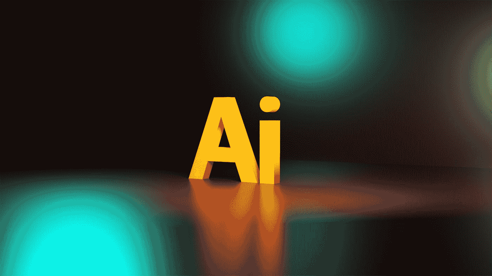

# 你的生意在 AI 面前安全吗？:一个关于你的企业是否免受人工智能威胁的博客

> 原文：<https://pub.towardsai.net/is-your-business-safe-from-ai-a-blog-on-whether-your-business-is-safe-from-ai-or-not-3c583607e93e?source=collection_archive---------5----------------------->

## [人工智能](https://towardsai.net/p/category/artificial-intelligence)

## 你的生意真的安全吗？点击此处了解更多信息

照片由[杰克森索](https://unsplash.com/@jacksonsophat?utm_source=medium&utm_medium=referral)在 [Unsplash](https://unsplash.com?utm_source=medium&utm_medium=referral) 上拍摄

是时候思考人工智能将如何影响你的业务了。似乎每天我们都会听到一些即将问世的新东西，它们将改变我们做生意的方式。那么，这项新技术对您的企业有多安全呢？

# 如何准备 AI

人工智能每天都在获得越来越多的关注。不幸的是，它也获得越来越多的恐惧和偏执。多年来，人工智能一直是工程师和科幻迷的梦想。现在，它正在变成一件真实的事情。虽然这可能会令人害怕，但有许多方法可以让您的企业为日益增长的威胁做好准备。随着你的商业生活在互联网上如此之多，你将会想要开始考虑如何保护你的商业免受人工智能的侵害。这似乎是一个巨大的问题，但有一些方法可以保护你自己免受这种日益增长的威胁。

近年来，我们看到了人工智能的兴起。人工智能不再是未来的事情，它正被用于各种领域。然而，关于人工智能是什么和不是什么，仍然有很多困惑。第一，AI 不是一个东西。这是一个致力于帮助计算机像人类一样思考的研究领域。现在，人工智能这个术语被用来描述各种不同的事物。有人用它来形容自动驾驶汽车或最新的聊天机器人，也有人用它来形容会做微积分的计算机。它们的共同目标是让计算机的思维和反应更像人类。人工智能正在扩展到生活的所有领域，从医学和科学到艺术和体育，现在是我们谈论它的时候了。

人工智能(AI)已经在接管世界。从 Siri 和谷歌助手到自动驾驶汽车和人工医生，AI 正在崛起。然而，大多数人都没有意识到这样一个事实，即人工智能也可以应用于几乎任何行业，这就是为什么人工智能如此可怕——又如此令人兴奋。当谈到人工智能时，一个主要的问题是，大多数人都不知道它是如何工作的，以及它会对我们的生活产生什么影响。那么，什么是人工智能，它如何应用于我们的业务？AI 有什么好处和坏处？AI 如何改变我们的生活？所有这些问题都将在本文中得到解答。

[附身摄影](https://unsplash.com/@possessedphotography?utm_source=medium&utm_medium=referral)在 [Unsplash](https://unsplash.com?utm_source=medium&utm_medium=referral) 上拍照

# 如何避免被 AI 取代

市场充斥着人工智能(AI)是带来下一次工业革命的下一件大事的说法。但是，AI 不是科幻。人工智能是一个现实，它会一直存在，并且能够做很多事情。人工智能基本上是一个行为像人一样的计算机系统。它有能力在没有指令或程序的情况下自己学习和做决定。这是一种让计算机表现得更像人类的技术。如果你认为人工智能是遥不可及的东西，那么你需要再想想。就目前而言，人工智能已经是你日常生活的一部分。它是驱动你的 GPS、你的数字个人助理、甚至你的在线搜索结果的技术。这不再是一个疯狂的理论了。这是一个无法改变的现实。

《终结者》期待已久的一天终于来了。机器人可以独立思考并接管世界的那一天！不完全是。彭博最近的一份报告显示，第一批能够独立思考的机器人将在未来五年内取代人类司机，并且已经在加利福尼亚州和内华达州等州进行了测试。尽管有更多的行业将受到人工智能(AI)的影响，但首先受到影响的将是卡车司机。所以，如果你在卡车运输行业工作，是时候温习一下你的简历了。但是说实话，这会影响你的工作吗？你的工作会被 AI 取代吗？几乎所有有望被人工智能取代的工作都是涉及危险或重复性任务的工作。所以，如果你在办公室或管理岗位上工作，你的工作可能是安全的。如果你的工作是开卡车或做类似的事情，你可能要开始找一份新工作。话说回来，这些机器人可能会开始取代很多其他工作，但由于我们的方式，我们永远不会让任何东西取代我们自己的工作。

答案是否定的。人工智能已经被用来制作高质量的假视频，没有理由相信这项技术不会变得更好。如果你在做一份可以被机器自动化的工作，你应该感到担心。即使不可能让你在工作中做的所有事情都自动化，你仍然很有可能被一台机器取代。这可能现在看起来没什么大不了的，但值得思考一下你的工作(以及你周围人的工作)如何能被机器自动化。也许你个人不会被人工智能取代，但这并不意味着你的工作不能被取代。如果你担心你的工作和你周围人的工作的未来，是时候开始考虑你能做些什么来保持相关性了。

你担心被 AI 取代吗？嗯，有几件事你可以做，以确保你不是。事实上，即使在人工智能(AI)成为常态之后，你也可以很好地确保你能够在余生中谋生。不过，你还是需要做一些事情。你需要做的第一件事是成为你所在领域的专家。无论你是律师、医生、卡车司机还是教师，你都需要在自己的工作中做到最好。这可以通过不断学习和提高来实现，或者你可以学习一项新技能。无论哪种方式，你都需要成为你所在行业的佼佼者，因为人工智能无法做你所做的事情。你需要做的第二件事是成为一名企业家。人工智能也许能做你的工作，但它不能做你的工作，也不能做其他工作。所以，你需要能够做你的业务需要的一切。这意味着你需要能够设计，营销，经营你的业务，做所有必须做的工作。最后，你需要成为一个多面手。如果你能成为一个万事通，你就能在大多数情况下生存下来。只要你能做需要做的事。

[附身摄影](https://unsplash.com/@possessedphotography?utm_source=medium&utm_medium=referral)在 [Unsplash](https://unsplash.com?utm_source=medium&utm_medium=referral) 上拍照

# 如何成为人工智能的早期使用者

人工智能(AI)和机器学习(ML)是最近的热门话题。它们越来越成为我们日常生活的一部分。什么是人工智能？人工智能是指计算机可以做通常需要人类智能的事情，例如识别图片中的对象，进行商业预测和玩游戏。机器学习是人工智能的一个子集。它是计算机在没有明确编程的情况下从数据中学习的能力。机器学习最流行的例子可能是面部识别软件。计算机科学家正在非常努力地将人工智能带到下一个水平。他们想创造能被大众使用的人工智能。他们想为大众创造人工智能。他们想为大众创造人工智能。

人工智能是一个已经在媒体上广泛讨论的话题，也是许多科幻电影的主题。这项技术已经在现实生活中使用，并且已经存在了几十年。但我们现在正处于人工智能几乎应用于我们生活的方方面面的时刻。从搜索引擎的工作方式，到算法如何影响股市。人工智能革命已经发生了很长时间，但它的发展速度正在加快。随着它继续接管世界，我们将看到它越来越多的实际应用。目前，只有最大的公司能够实现人工智能。但是你可以做一些事情来成为这项技术的早期采用者之一。这里有几个步骤，你可以采取，成为第一批将人工智能集成到你的业务中的人。

人工智能是一个非常常见的名字，近年来变得非常流行。但是，什么是人工智能？人工智能(AI)是计算机科学的一个领域，它强调创造像人类一样工作和反应的智能机器。人工智能是计算机系统的理论和发展，能够执行通常需要人类智能的任务，如视觉感知、语音识别、决策和语言之间的翻译。目前，人工智能技术的进步正在改变各行各业的工作性质，从制造到制药，从农业到客户支持，从运输到零售，从基础科学到工程。

由 [Unsplash](https://unsplash.com?utm_source=medium&utm_medium=referral) 上的 [Alexas_Fotos](https://unsplash.com/@alexas_fotos?utm_source=medium&utm_medium=referral) 拍摄的照片

> **结论**

随着技术的不断发展，跟上最新趋势和进步非常重要。人工智能(AI)是目前备受关注的技术进步之一。我们希望这篇文章能帮助你理解人工智能的潜力以及它对当今企业的意义。如果您对贵公司如何防范 AI 有任何疑问，请联系我们。

感谢您的阅读！