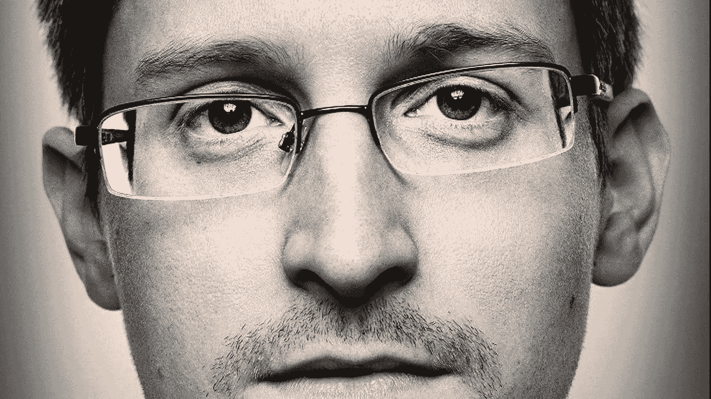
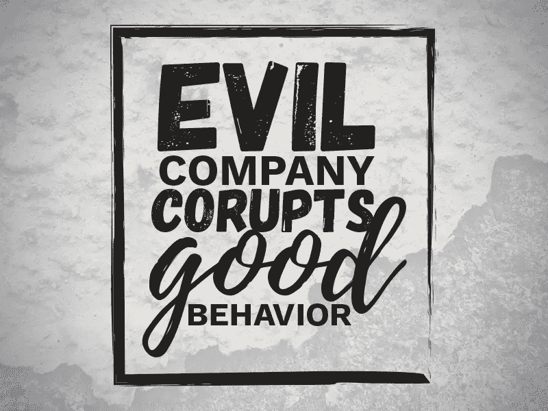

# 你的手机真的在听你说话吗？

> 原文：<https://pub.towardsai.net/is-your-phone-really-listening-to-you-effafbd71a1d?source=collection_archive---------1----------------------->

## [观点](https://towardsai.net/p/category/opinion)、[隐私和安全](https://towardsai.net/p/category/privacy-and-security)、[技术](https://towardsai.net/p/category/technology)

## 与爱德华·斯诺登一起重温这一令人担忧的现象背后的真相

爱德华·斯诺登——来源: [Walldesk](https://wallsdesk.com/)

阅读和聆听——为了更好的体验

在最近由*Joe Rogan Experience*(JRE)Clips 进行的一次采访中，前中情局雇员、美国告密者爱德华·斯诺登(Edward Snowden)广泛讨论了智能手机是否在监听人们的对话，还是只是一个骗局？如果是，那么它们是如何损害用户的数字福祉的？

有太多的例子表明，全球智能手机用户在与某人谈论同一话题后不久，就会在他们的社交媒体订阅中注意到“**精准定向广告**”。

例如，人们目睹了在与朋友或家人谈论去度假后不久，他们就看到了关于最佳旅游目的地的特定广告。

想象一下，和你的朋友谈论买一双新鞋，然后看着鞋子相关的广告轰炸你的脸书、推特和 Instagram。

> 这个我也经历过。

听起来令人毛骨悚然？你打赌！但是等等，还有更多。

# 是间谍活动还是仅仅是技术进步？

随着技术的发展，手机和其他物联网设备变得越来越智能，因为它们不断与网络塔和卫星相连。像脸书、Instagram、Gmail 等移动应用程序正利用这一事实与各自的服务器保持联系。

毫无疑问，你看到的广告是专门针对你的需求、偏好和兴趣的，这不是巧合。

社交媒体平台和其他企业正在积极投入大量资源开发更复杂的算法和营销策略(如广告定位),这些不仅可以影响用户的购买行为，还可以改变客户对自己的看法和感受。

根据 Edward 和 factual studies 的研究，这仅仅是对这种进步负责的数据收集。全球几乎所有的公司都这么做，而这也被认为是这个行业的正常做法。

资料来源:dribbble.com

[研究显示](https://www.smartinsights.com/internet-advertising/behavioural-ad-targeting/always-on-behavioural-marketing/#:~:text=A%20new%20Adobe%20sponsored%20Razorfish,behavioural%20data%20in%20their%20marketing.)，全球 76%的营销人员未能利用客户的行为数据，通过这些新的营销技巧和广告策略来增加销售额。很自然，这些先进的算法只能由科技巨头开发，他们可以利用这种大量收集的数据的力量。

*也就是说，为了使用现代技术，我们必须在移动和其他网络应用程序的开发中采用伦理和道德规范。*

东北大学的研究人员对此事进行了为期 12 个月的调查，结论是 17000 个流行的移动应用程序确实记录并向其他第三方发送用户的行为和分析数据。

不仅如此，在由 Eset security 进行的一项调查中发现，80%的参与者认为他们的手机/应用程序在监视他们的谈话和活动，而只有 20%的人持相反观点。

# 语音助手应用程序的作用

Siri、Alexa、谷歌助手——我们都知道这些所谓的“智能”语音助手软件/扬声器/机器人。但是他们真的值得信任吗？对着这些 AI 驱动的智能扬声器或内置的移动应用说话真的没问题吗？

*大概不会！*

与其他收集行为数据的移动应用不同，这些类型的助手实际上可以偷听你的谈话。据专家透露，这些智能语音助手**总是在监听**用户配置为“唤醒词”的特定单词或短语。

同样，这些助手记录、分析用户的语音数据，并将其传输到第三方服务器，以获取与他们的问题相关的信息。并且只有对制造公司有利的是，使用记录的用户语音数据来相应地“改进”他们的产品。

# 这合法吗？我应该担心吗？

爱德华在采访中迅速总结道，公司如何制定了广泛的法律形式的数字协议， ***声明并撤销设备或应用程序所有者的权利，即“某些”类型的收集数据将是公司的财产。***

根据 Edward 的说法，在使用技术(物联网(loT)设备和智能手机)时，你永远不会太安全，除非有一个开关或机制可以让你控制什么应用程序连接到什么类型的数据服务器以及连接多长时间。不幸的是，这些公司永远不会允许这样的选项存在于他们的平台上。

> 为什么？因为今天，数据是新的石油。

在当今的情报收集市场上，正确的数据可以以高价卖给正确的买家。你的个人信息对大公司和恶意黑客都很有价值。然而，如果黑客损害了你的数字隐私，这是一种非法行为，但如果公司使用你的行为数据来改进他们的产品，那么这是一种创新。

事情就是这样。如果不利用客户的偏好和需求，公司改进产品或服务的能力有限。除此之外，**公司**通常**不会通过窥探来侵犯用户隐私，因为他们真的不需要**。

> 在注册脸书等社交媒体平台时，通过配置您的个人设置，指定您的兴趣、爱好和激情，上传您的照片，将签到信息发送到不同的位置等。你已经向这些科技巨头泄露了大量信息。这不仅使他们更容易展示有针对性的广告，还允许他们利用你的信息来创造更多创新的营销方法；这显示了基于广告的收入最大化的前景。

# 不喜欢这样怎么办？

没有人喜欢自己的隐私被侵犯，不管入侵者是黑客还是公司。但是，只要你继续使用现代应用程序和设备，你就不得不牺牲至少一些个人信息。

> 就当是使用现代科技的代价吧。

但是，您仍有办法限制或控制公司处理和使用您的个人信息的方式。学会保护您的隐私将有助于您实现健康的数字福祉。

*感谢您的阅读，祝您上网安全！*

如果你喜欢阅读这些故事，我相信你会很乐意成为一名中等付费会员。每月只需 5 美元，你就可以无限制地接触成千上万的故事和作家。你可以通过 [***注册使用此链接***](https://nishu-jain.medium.com/membership) ，*来支持我，我将赚取一点佣金，这将帮助我成长并出版更多像这样的故事。*

**其他一些你可能喜欢的文章—**

 [## 你需要对你的职业进行“实验”,以逃避这场激烈的竞争

### 聪明地打破你朝九晚五的工作链。

medium.datadriveninvestor.com](https://medium.datadriveninvestor.com/you-need-to-experiment-with-your-career-to-escape-this-rat-race-464fa143999b)  [## 通过玩电子游戏，你可以学到 4 种有价值的生活技能

### 当数字人才转化为现实生活中的技能时

medium.com](https://medium.com/curious/4-valuable-life-skills-you-can-learn-by-playing-video-games-df7d8c299dd0)  [## 如何找到适合自己的网络安全职业？

### 开始网络安全之旅的分步指南

pub.towardsai.net](/how-to-find-out-which-cybersecurity-career-is-right-for-you-6ded18478789)