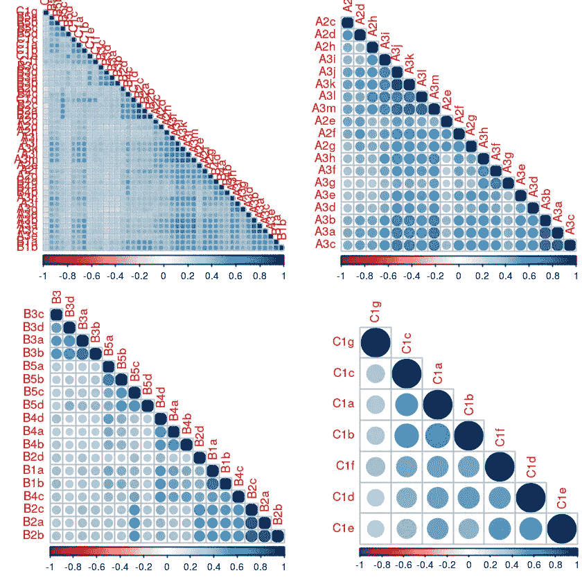
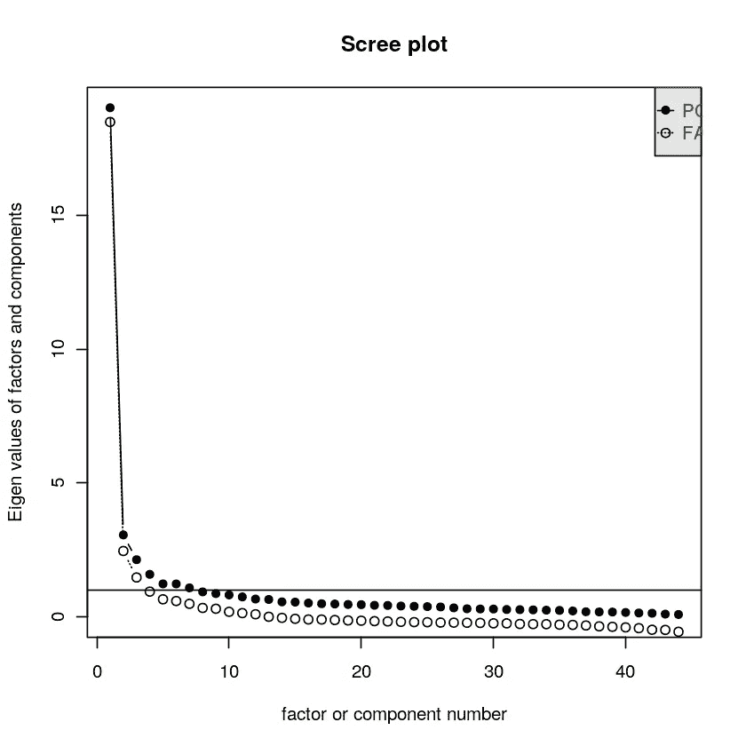
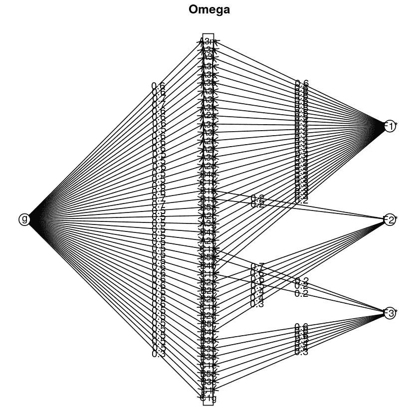
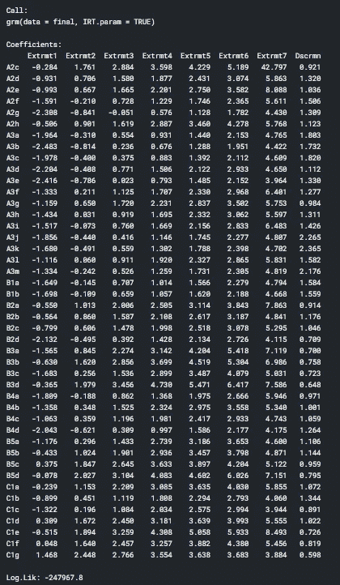
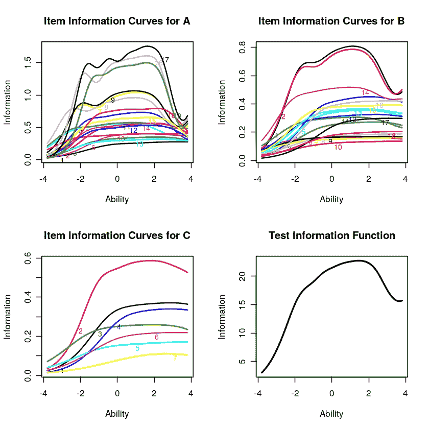
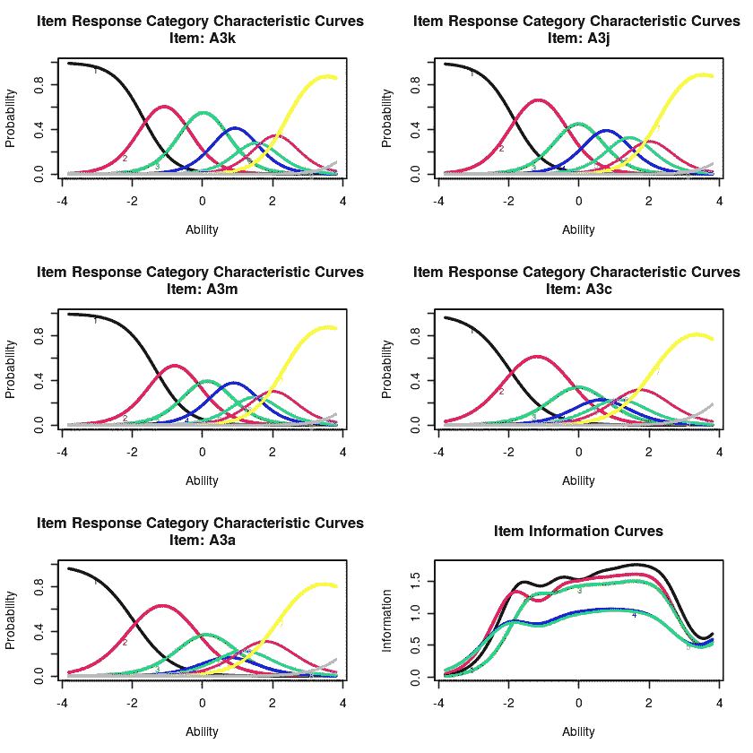
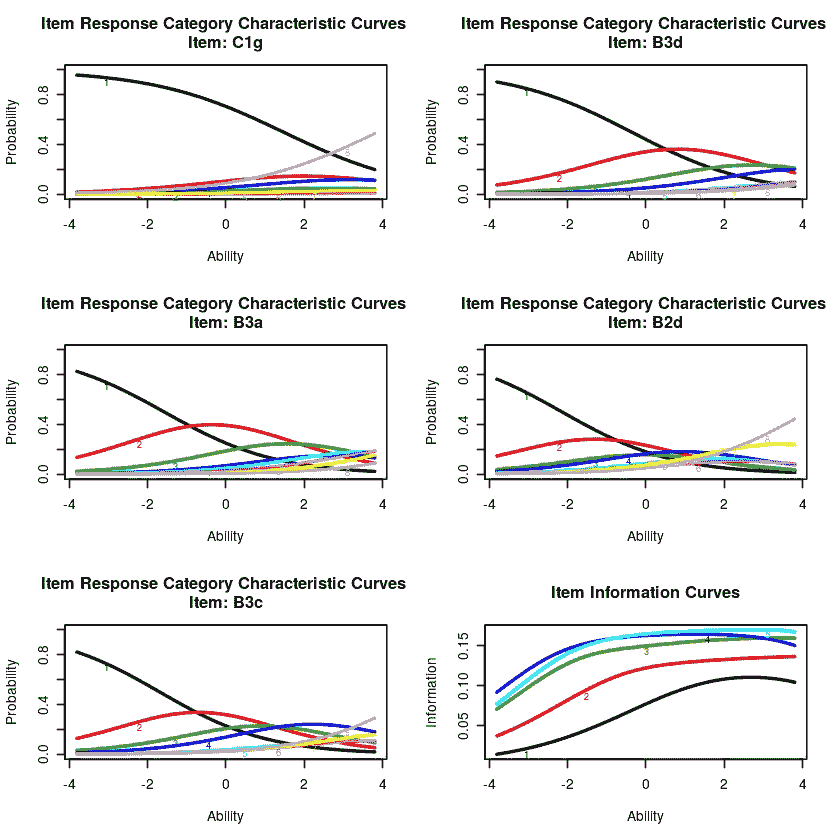

# 项目反应理论:心理测量学与数据科学的分级反应模型(GRM)

> 原文：<https://pub.towardsai.net/item-response-theory-psychometrics-meets-data-science-with-graded-response-model-grm-9ff182aff3e1?source=collection_archive---------3----------------------->

## [数据科学](https://towardsai.net/p/category/data-science)

GIF 来源:GIFY—【https://giphy.com/gifs/A7Gpt39kH5sAg 

我们已经看到了许多与数据科学的跨学科交叉。这是我的最爱之一。为什么？当心理测量遇到行为分析时，用例是无限的！会像 gif 里看到的跨界一样伟大吗？

嗯，让我们看看😉

# 什么是项目反应理论？

> 在心理测量学中，项目反应理论是一种用于测试、问卷和类似的测量能力、态度或其他变量的工具的设计、分析和评分的范式——维基百科[1]

我们来分析一下这个！

# 为什么项目和响应？

好吧，让我们想象一下。你和你的搭档被主持人蒙上眼睛，并被要求猜你面前的食物，但只能通过舔来猜。记得这是哪里的吗？😂

*顺便感谢艾伦创作了这一集！*😂

是啊！这正是将要发生的事情。你描述一件物品的方式和你的伴侣会如何描述会有很大的不同。如果我必须分析这个，我该怎么做？因此，主要目标围绕着*项*的理论。把它想象成试图在原子水平上分析一些东西。

GIF 来源:GIFY — [GIFY 工作室原创](https://giphy.com/gifs/studiosoriginals-26xBKJclSF8d57UWs)

# 但是如果每一项都不一样呢？我们如何达成共识？

有很多方法可以做到这一点。它可以是预先定义了错误/正确答案的多项选择，可以根据您的答案进行修改，也可以是根据 a 级或 Likert 等级测试您的答案的陈述。

因此，本质上，这些反应在它们的原子水平上，在概率的帮助下，将个体和他/她自己的项目反应联系起来。简而言之，IRT 模型试图通过分析他们的反应来联系不可观察的特征。这些模特比你更能说明你的问题！

# 为什么不把整个测试作为一个单元？

经典测试理论将整个测试视为分析的单位，而不是 IRT 的每个项目的概念。当您的回复包含较长的条目列表时，前者肯定比它的替代品更可靠。

GIF 来源:GIFY — [回旋镖官方](https://giphy.com/gifs/boomerangtoons-boomerang-care-bears-unlock-the-magic-8vyZOffhDWG4eF15lh)

*   但是，如果您没有提出一长串问题的奢侈，那该怎么办呢？
*   此外，我们都知道我们在填写长表格/问卷时的感受！它会影响你的用户体验，反过来你的用户故事也会崩溃。
*   此外，如果您发布了一款新的尖端产品，您预计会用它来扰乱市场，但由于没有代表性的样品可以使用，所以没有经过验证，该怎么办？
*   最后但同样重要的是，可伸缩性和灵活性！当你冒险尝试新事物时，你可能不知道你所不知道的。因此，如果你可以自由地拥有不同的反应类别来衍生特征，那就太好了。

> 有了 IRT 模型，具有较少条目**的测量可以**比它们的对应物更可靠，它们不依赖于代表性样本，并且测量的条目可以有不同的响应类别。——哥伦比亚 Edu [2]

# 太好了！那么我可以在没有假设的情况下使用这个模型吗？没有。

与任何其他模型一样，IRT 也假设了一些可以采用的概念:

GIF 来源:GIFY — [网飞](https://giphy.com/gifs/netflix-babysittersclub-thebabysittersclub-U7DA2su6IuTT9Lro9r)

## 1.显性特征

我们寻找一个好的领导者，并希望这个领导者能指引我们找到自己的需求和幸福。类似地，该模型假设有一个特征是占主导地位的，并且它主要是激励措施的所有其他响应的力量。

## 2.不变性

还记得上面提到的灵活性吗？是啊！您可以从您选择的项目响应曲线的任何点估计/推断项目的参数。

GIF 来源:GIFY — [周六夜现场](https://giphy.com/gifs/snl-saturday-night-live-season-45-eh7nOwlu16eq7mXd0b)

## 3.地方独立

每个单独项目的响应都是相互独立的，只要有很大程度的能力。

## 4.单调的

继续增加！这是模特的座右铭。因此总是固有地假设特质的能力总是在增加，这意味着“正确”反应的概率也在增加！

# 好吧。但是十字架在哪里呢？

行为分析是你的答案！

> B 行为分析是商业分析领域的最新进展，揭示了消费者在电子商务平台、在线游戏、网络和移动应用以及物联网上的行为的新见解——维基百科[3]

正确的问题会引导你走向正确的十字路口。这两个概念的联系回答了广泛的使用案例，例如:

*   我的产品愿景和增长是否更符合我的受众客户的期望？
*   我的产品的新版本与我的 A/B 测试团队合作得好吗？
*   我的员工快乐吗？作为一家公司，我们是否符合每位员工的期望？
*   对于高度依赖于用户偏好和感知形容词的产品，我是否能够有效地将我的产品分类以改进我的推荐？

这些是 IRT 可以为你解答的一些用例，只要你有一个精心制作的独特的测试用例。

# 但是这些参数、曲线是什么，我们如何实现这个模型呢？

让我们通过著名的 PSC 工作满意度数据集[4]来看一个例子。该数据集按照 Likert 等级组织，等级从 1 到 8，从完全同意到完全不同意，8 表示不适用于一系列陈述调查问题。它采用 A、B、C 三个系列的形式，目的是了解他们的工作满意度的影响。

这些情节和代码是我的 Kaggle 笔记本的一个片段。你可以在这里找到整个分析[。我使用 R 来开发这个分析。](https://www.kaggle.com/annettecatherinepaul/irt-analysis-using-job-satisfaction-survey)

## 模型前检查 1:相关性

(图片由作者提供)显示系列间关系和跨系列关系的相关图

一般原则是，当我们还没有定义响应变量时，我们可以求助于相关性，同时测量两个变量之间关系的定性强度。在下面的图中，可以看到所有三个系列作为一个实体以及作为单个系列本身的相互关系的可视化。存在很强的正相关性。它建立了一个显性潜在特征和与该显性潜在特征相关的所有项目的假设。

## 模型前检查 2:主成分分析(PCA)

让我们来看看各自的 PCA 图和 Scree 图。

PCA 是一种用于降低数据维数的方法。我们还可以用它来分析哪个组件包含了转换后的大部分信息。这样，我们就知道我们是需要用一维还是多维的方式来接近。

(图片由作者提供)根据 PCA 描绘 PC1 和 PC2 中持久信息的散点图和散点图

> 在多元统计中，scree 图是分析中因子或主成分的特征值的线图，用于确定探索性因子分析(FA)中保留的因子数或主成分分析(PCA)中保留的主成分数— Wikipedia [5]

这两个图都表明一维方法在数学上是支持的。一般来说，基于对这种特殊情况的多年研究，40%或更高的 PC1 分量足以得出这一结论。然而，这个阈值是非常主观的。

数据的结构呢？

## 预模型检查 3:基础结构的因子模型

(图片由作者提供)数据集结构的因子图

该图描述了数据集的基础结构。很容易看出，负载系数分布在三个系数(A、B、C 系列)中。但是 IRT 没有考虑这三个潜在的结构，而是试图遵循一个显性特质假设，即*“潜在特质”。*

此外，如果仔细观察该图，您会发现 B2a 项似乎具有比一般趋势更高的负载，这可能表明该项目可能会被超级泛化，但它不能被泛化到序列中。如果我决定删除 B2a 商品会怎样？那么，整个结构将再次不同，分析将重复进行。进一步确立了对基于项目的方法，即定性方法进行充分思考的重要性。

## 分级响应模型

由于李克特量表有一个特定的顺序，我们想要测量一个单一的基本维度，我们将使用 GRM 模型。

GIF 来源:GIFY — [好友](https://giphy.com/gifs/Friends-friends-tv-the-one-where-rosita-dies-gdNasnNQD4h21SMBki)

> 它允许我们评估/估计特定测试对象的能力水平或潜在特质的概率，即测试问题衡量潜在特质或能力的程度——Statisticshowto.com[6]

在理想的情况下，该模型应该产生高的辨别能力，以便得出一个良好的潜在特征分析的结论。模型输出如下所示:

(图片由作者提供)GRM 模型拟合的输出快照(R 中的 LTM 包)

关于此输出的一些见解:

*   这些系列中观察到的项目反应是潜在特质的函数。
*   评级标准被视为有序集，而不是区间集。
*   我们可以观察到，A 系列的辨别能力很高，C 系列的辨别能力较低，b 系列的辨别能力一般。
*   负系数是由于反向缩放造成的。
*   系列 C 中的低辨别能力可能表明调查是冗长的，并且个体的注意力范围已经丧失到能够集中。同样的原因，为什么 A 可以反映高分辨能力。

(图片由作者提供)系列 A、B、C 的项目信息曲线和测试信息曲线

x 轴标签是“能力”,因为该模型将其描述为一项技能测试。在这种情况下，能力是我们提出的潜在特征。

正如我们正确解释的那样，我们可以注意到系列 A 的信息能力较高，其次是系列 B 的信息能力相对较高，而系列 c 的信息能力最低。因此，我们可以得出结论，该数据集对理解工作满意度的潜在特征有重要作用。

(图片由作者提供)从 A、B 和 C 系列中选择的项目的项目响应曲线

如果我们关注系列的第一个情节，具有最高辨别能力的情节，我们可以看到，随着内在评级从强烈同意到强烈不同意，它谈到了工作不满意度。因此，个人强烈同意他们不满意，即潜在的特质。然而，对于 B 系列，这些图没有很高的区分度，因为它们弯得很低，这可能意味着特定项目的信息很少。这可以通过不概括陈述和改进陈述的定性方面来避免。

就这样，我结束了对我所遇到的数据科学的一个惊人交叉的讨论！你们对数据科学的其他令人惊讶的跨学科主题感兴趣吗？请随意发表评论！

希望这篇文章有趣。很高兴看到您将如何在用例中使用 IRT😊

谢谢！

# 参考

[1]维基百科，[条目反应理论](https://en.wikipedia.org/wiki/Item_response_theory)
【2】哥大 Edu，[人口健康方法](https://www.publichealth.columbia.edu/research/population-health-methods/item-response-theory#:~:text=Courses-,Overview,outcomes%2C%20responses%20or%20performance).)
【3】维基百科，[行为分析](https://en.wikipedia.org/wiki/Behavioral_analytics)
【4】卡格勒， [IRT 分析利用工作满意度调查](https://www.kaggle.com/annettecatherinepaul/irt-analysis-using-job-satisfaction-survey)
【5】维基百科， [Scree 情节](https://en.wikipedia.org/wiki/Scree_plot)
【6】Statisticshowto.com，[分级反应模型](https://www.statisticshowto.com/graded-response-model-ordered-categorical/#:~:text=Graded%20response%20model%20(or%20Ordered,%2C%20or%20ranking%2C%20of%20responses.)
【7】走向数据科学(中)，脸书