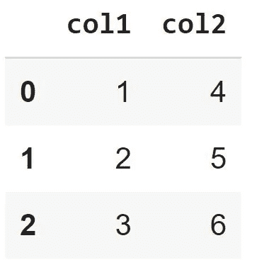
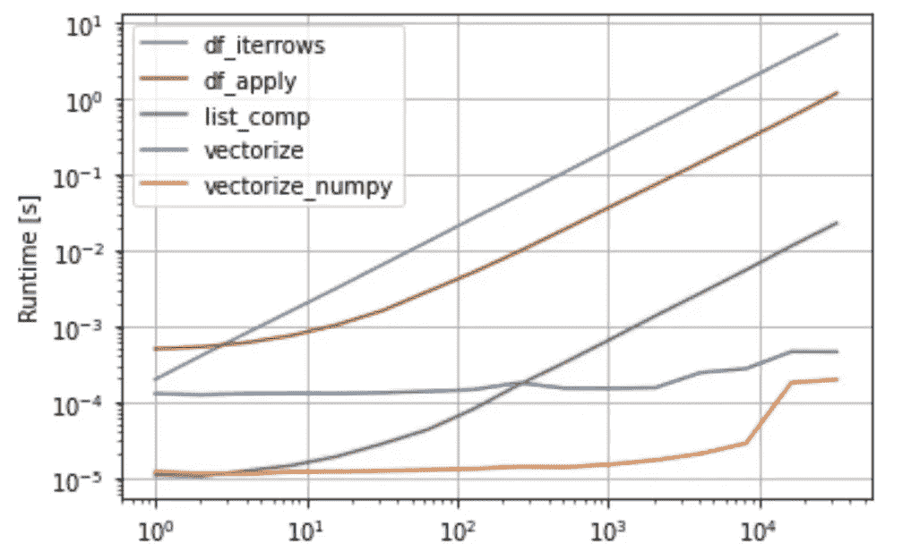

# 如何在 Python Pandas 中迭代数据帧

> 原文：<https://pub.towardsai.net/iterating-a-dataframe-in-python-pandas-16812526d943?source=collection_archive---------0----------------------->

## [编程](https://towardsai.net/p/category/programming)

## 就性能而言，哪种方式最好？


来自[壁纸深渊](https://wall.alphacoders.com/big.php?i=370118)

Pandas 是处理数据的最流行的 Python 包之一。如果你是一名数据分析师\科学家或任何需要你处理数据的角色，你可能每天都会用到熊猫。

假设 Github stars 和 forks 在一定程度上准确地模拟了一个包的受欢迎程度，那么让我们来看看 pandas 与它的一些替代品相比表现如何

*   [熊猫](https://github.com/pandas-dev/pandas) — 30.7k 星，12.9k 叉
*   [火花](https://github.com/apache/spark) — 30.6k 星，24.3k 叉
*   [Dask](https://github.com/dask/dask) — 8.7k 星，1.3k 叉
*   [Polars](https://github.com/pola-rs/polars) — 2.2k 星，120 叉
*   [Vaex](https://github.com/vaexio/vaex) — 6.5k 星，505 叉

所以是的，熊猫很受欢迎，我们现在可以继续了。

创建一个 DataFrame 相当容易，下面一行就足够了

```
import pandas as pddf = pd.DataFrame({'col1': [1, 2, 3], 'col2': [4, 5, 6]})
```



现在假设我们实际上不需要这两列，我们只关心它们相乘的结果。

“未受过训练的数据帧”想到的最天真的解决方案是——让我们迭代每一行，并在列值之间相乘。

对于这个解决方案，我们先用`[iterrows](https://pandas.pydata.org/docs/reference/api/pandas.DataFrame.iterrows.html)()`来介绍一下自己。
从文档中，*以(索引，序列)对的形式迭代数据帧行。*"，
所以在每次迭代中，我们得到行的索引和行本身。

```
def df_iterrows(df):
  result = []
  for index, row in df.iterrows():
    result.append(row['col1'] * row['col2'])
return result
```

这当然不是唯一的方法，实际上，这是最糟糕的方法。

## [数据帧应用](https://pandas.pydata.org/docs/reference/api/pandas.DataFrame.apply.html)

第二种方法是对数据帧的行应用函数。在这种情况下，我们不需要自己迭代这些行，这已经很好了。

```
def df_apply(df):
  func_to_apply = lambda row: row['col1'] * row['col2']
  return df.apply(func_to_apply, axis=1)
```

(是的，你可以用一行代码完成，但是我觉得这个版本可读性更强)

## 列表理解

我认为列表理解是 Python 中最好的特性之一，它对我们的情况也有帮助

```
def list_comp(df):
    return [x * y for x, y in zip(df['col1'], df['col2'])]
```

## …向量化…

矢量化是将标量程序转换为矢量程序的术语。矢量化程序可以从一条指令中运行多个操作，而标量程序一次只能对成对的操作数进行操作。

到目前为止，我们讨论的所有方法都是标量函数——它们只对两个操作数执行运算。

我们将把“col1”和“col2”的所有列值收集到一个向量中，然后执行我们的操作，而不是乘以每行每列的元素。

```
def vectorize(df):
    return df['col1'] * df['col2']
```

我将要介绍的*下一个也是最后一个*方法包括一个小小的变化——我们将把 Series 对象转换成 NumPy 数组。

```
def vectorize_numpy(df):
    return df['col1'].to_numpy() * df['col2'].to_numpy()
```

# 特性试验

现在剩下的就是检查这些方法的表现。

在[熊猫文献](https://pandas.pydata.org/pandas-docs/stable/user_guide/basics.html#iteration)上写着

> 遍历熊猫对象通常很慢。在许多情况下，不需要手动迭代这些行，并且可以避免

因此，当我们看到迭代方法表现最差时，我们不会感到非常惊讶。



对数标度的两个轴

# 结论

正如 Pandas 文档中所建议的，您应该尝试并避免迭代数据帧。
总是试图寻找一个矢量化的解决方案，如果你有一个函数不能在完整的数据框架上工作，使用`apply()`而不是迭代。

我想向你介绍我的博客，在那里我每周上传计算机科学中相似和不同的主题。

最后，如果你考虑订阅 Medium，并希望支持我，请注册我的[推荐链接](https://eliran9692.medium.com/membership)。