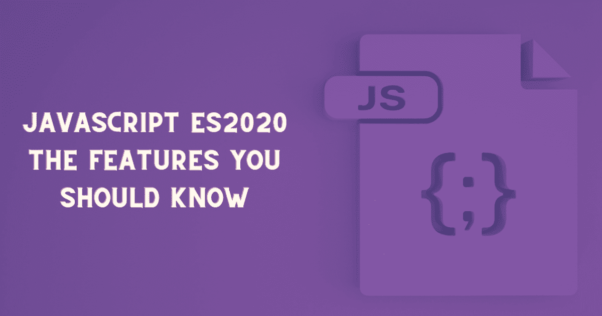

# JavaScript ES2020 —您应该知道的特性

> 原文：<https://pub.towardsai.net/javascript-es2020-the-features-you-should-know-5b4f483ed001?source=collection_archive---------3----------------------->

## [编程](https://towardsai.net/p/category/programming)



ES2020 或 ECMAScript 2020 为 JavaScript 带来了激动人心的特性。在本文中，我想谈谈我最喜欢的 ES2020 特性。这意味着本文没有涵盖所有的新增内容。因此，让我们看看我最喜欢的新增内容:

*   动态导入
*   零融合算子
*   可选链接运算符
*   私有类变量
*   承诺。都解决了

要了解更多信息和所有新增内容，请看官方的 [ECMAScript 语言规范](https://tc39.es/ecma262/2020/)。另外，你可以看看[完成的提案](https://github.com/tc39/proposals/blob/master/finished-proposals.md)。

# 动态导入

其中一个新增功能是我们可以用 async/await 动态导入依赖项。这意味着我们不必在之前导入所有内容，我们可以只在需要的时候导入依赖项。因此，通过在运行时加载模块，应用程序的性能得到了提高。

它是如何提高性能的？对于传统的模块系统，我们在程序开始时静态地导入模块。无论我们现在还是以后需要它们，我们都必须首先导入它们。此外，来自导入模块的所有代码都在加载时进行评估。因此，它不必要地降低了应用程序的速度。为什么？因为它下载导入的模块，并在执行您的代码之前评估每个模块的代码。

让我们看一个例子。

```
if (calculations) { 
    const calculator = await import('./calculator.js'); 
    const result = calculator.add(num1, num2);     console.log(result); 
}
```

在上面的代码片段中，您可以看到我们只在想要执行计算时才导入 calculator 模块。因此，我们不会因为在运行时之前加载所有代码而不必要地降低应用程序的速度。因此，动态导入是一个方便的补充。

# 零融合算子

“零化合并运算符(？？)是一种逻辑运算符，当其左侧操作数为空或未定义时，返回右侧操作数，否则返回左侧操作数。[资料来源:MDN](https://developer.mozilla.org/en-US/docs/Web/JavaScript/Reference/Operators/Nullish_coalescing_operator%22)

基本上，Nullish 合并操作符允许我们检查一个值是否为空或未定义，如果是这样，就提供一个回退值。让我们看一个例子:

```
let score = 0;
let pass = score ?? 60;

console.log(pass);
```

在上面的代码片段中，`pass`的值是 0。原因是`??`操作符不会将零强制为假值。只有当变量`score`为`undefined`或`null`时，变量`pass`才会被赋值 60。

但是，双管“||”和这个运算符有什么区别呢？当使用双管“||”时，它总是返回一个真值，这可能会导致一些意想不到的结果。当使用 nullish 合并操作符时，我们可以更加严格，因此只允许当值为 null 或未定义时使用默认值。

例如，假设我们有以下代码:

```
let score = 0;
let pass = score || 60;

console.log(pass);
```

在上面的例子中，当使用`||`时，值 0 被视为假值。在上面的代码片段中，`pass`的值是 60，这不是我们想要的。因此，双问号允许我们检查一个变量是否为 null，也就是说一个变量是否未定义或者为 null。

# 可选链接运算符

"当访问链接属性时，当引用可能丢失时，表达式更短更简单."[资料来源:MDN](https://developer.mozilla.org/en-US/docs/Web/JavaScript/Reference/Operators/Optional_chaining)

使用可选的链接操作符，我们可以从一个对象中访问深度嵌套的属性。如果属性存在，运算符将返回其值。如果属性不存在，运算符将返回 undefined。

```
const person = {
 name: "Catalin Pit",
 employer: {
  name: "Catalins Tech",
 }
};

console.log(person?.employer?.name);
```

上面的代码片段展示了一个访问深层嵌套对象属性的例子。然而，我们可以在数组和函数调用中使用它。在下面的代码片段中，你可以看到我们检查数组是否存在，如果存在，我们访问第三个值。此外，您可以看到检查来自 API 的函数是否存在，如果存在，它就调用它。

```
const allowedValues = [1, 5, 10, 13, 90, 111];
console.log(allowedValues?.[2]);

// functional call
const response = myAPI.getData?.();
```

总之，可选的链接操作符很方便，它还帮助我们使代码更易读、更简短。

# 保证。全部解决

新方法 Promise.allSettled()等待所有承诺被结算。也就是说，它接受一组承诺，并且只有当这些承诺得到解决(拒绝或解决)时才返回。

当这个函数返回时，我们可以循环每个承诺，看看它是被实现了还是被拒绝了，以及为什么。让我们看一个这个功能的例子。

```
const promise1 = Promise.resolve(5);
const promise2 = Promise.reject("Reject promise");
const promises = [promise1, promise2];

Promise.allSettled(promises)
    .then(results => console.log(`Here are are your promises results`, results))
    .catch(err => console.log(`Catch ${err}`));
```

上面的代码返回一个对象数组，每个对象代表一个承诺。如果承诺被履行，则对象具有状态和值，如果承诺被拒绝，则对象具有状态和原因。因此，`Promise.AllSettled`在你想完成所有承诺时是有用的，不管它们是被拒绝还是被履行。

# 私有类变量

从现在开始，我们也可以用 JavaScript 在类中创建私有变量。要创建私有变量，只需在变量前面添加散列符号。例如，`#firstName`是一个私有变量，不能在类外访问。

试图在类外调用变量会导致语法错误。

```
class Person {
  #firstName = "Catalin";
  getFirstName() 
  { 
      console.log(this.#firstName) 
   }
}

const person1 = new Person();
person1.getFirstName() // "Catalin"

console.log(person1.firstName); // Returns "undefined"
console.log(person1.#firstName); // Returns "Uncaught SyntaxError: Private field '#firstName' must be declared in an enclosing class"
```

在上面的代码中，您可以看到一个私有类变量在起作用。试图访问类外的变量`firstName`，我们得到一个错误。因此，当我们不想将数据暴露在类之外时，这种添加是很方便的。

# 结论

文章中的补充并不是唯一的。还有更多，我鼓励你看看官方的 [ECMAScript 语言规范](https://tc39.es/ecma262/2020/)来了解所有的规范。此外，我鼓励您尝试一下这些特性。

总之，在本文中，您了解了:

*   动态导入
*   零融合算子
*   可选链接运算符
*   承诺。都解决了
*   私有类变量

*如果对 JavaScript 教程感兴趣，我推荐* [*前端高手*](https://catalins.tech/frontend-masters-membership-is-it-worth-it) *！*

*如果你想用技术写作赚钱，就去查查* [*那些付钱让你写*](https://catalins.tech/websites-that-pay-you-to-write-technical-articles) *技术文章的网站吧！*

*如果你想学习 JavaScript，我推荐这些* [*5 资源作为初学者学习 JavaScript*](https://catalins.tech/5-best-resources-to-learn-javascript-as-a-beginner)*！*

*谈判你的工资是必不可少的——学习* [*作为一名开发者如何谈判你的工资*](https://catalins.tech/how-to-negotiate-your-salary-as-a-developer) *！*

*用* [*Git 别名*](https://catalins.tech/git-aliases-what-are-they-and-how-to-use-them) *加速你的开发。*

*如果你想* [*以开发者的身份开博*](https://catalins.tech/how-to-start-your-blog-as-a-developer) *，我推荐你阅读《* [*如何以开发者的身份开博*](https://catalins.tech/how-to-start-your-blog-as-a-developer) *》一文！*

你是否很难跟上科技领域的最新消息？参见 [*作为开发者保持最新状态的一种方法*](https://catalins.tech/one-way-to-stay-up-to-date-as-developer) *！*

*学习* [*如何在 JavaScript*](https://catalins.tech/how-to-use-asyncawait-in-javascript) *中使用 Async/Await！*

GitHub 简介目前风靡一时。了解 [*如何创建 GitHub 个人资料页面*](https://catalins.tech/how-to-create-a-kickass-github-profile-page) *！*

*查看这 7 个* [*资源，帮你通过求职面试*](https://catalins.tech/7-github-repositories-to-help-you-crush-your-job-interviews) *！*

*查看*[*JavaScript ECMAScript 2021 es 2021*](https://catalins.tech/javascript-es2021-you-need-to-see-these-ecmascript-2021-features)*即将推出的新功能！*

*你是初学程序员吗？查看这些* [*编程项目思路适合初学者*](https://catalins.tech/10-programming-project-ideas-for-beginners) *！*

你是在学习编码还是打算做编码？查看 [*免费学习编程的最佳去处*](https://catalins.tech/20-best-places-to-learn-programming-for-free) *！*

[*用这 9 个浏览器扩展提高你的开发者生产力*](https://catalins.tech/my-9-must-have-browser-extensions-for-increased-developer-productivity) *！*

*如果你是 Node.js 的开发者，我建议你去 Node.js* *查看这些* [*4 个创造性的设计模式！*](https://catalins.tech/the-4-creational-design-patterns-in-nodejs-you-should-know)

*查看这些惊人的*[*JavaScript ECMAScript 2020 特性*](https://catalins.tech/javascript-es2020-the-features-you-should-know) *！*