# Tableau 中的连接数据:Tableau 桌面专家认证之路

> 原文：<https://pub.towardsai.net/joining-data-in-tableau-a-road-to-tableau-desktop-specialist-certification-eae58200260?source=collection_archive---------0----------------------->

## 第 5 章:Tableau 中关系、连接、联合和融合的综合指南

欢迎来到第五章，在这一章中，我们将学习 Tableau 中的连接数据，以及应该选择哪一个。

> 如果你想浏览其他章节，请访问: [Tableau](https://medium.com/u/fcbe60d0bf8b?source=post_page-----eae58200260--------------------------------) **:这是什么？为什么它是最好的？；Tableau 桌面专家认证之路。**

> 如果你想直接上 Tableau 桌面专家笔记，请在这里访问→[https://dakshtrehan . comment . site/Tableau-Notes-c 13 fceda 97 b 94 BDA 940 edbf 6751 cf 30](https://dakshtrehan.notion.site/Tableau-Notes-c13fceda97b94bda940edbf6751cf303)
> 
> 使用链接访问免费 Tableau 认证转储(有效期至 2022 年 7 月 6 日):
> 
> [https://www . udemy . com/course/tableau-desktop-specialist-certification-dumps-2022/？coupon code = e3f 08189 fa 4 bafae 72 BC](https://www.udemy.com/course/tableau-desktop-specialist-certification-dumps-2022/?couponCode=E3F08189FA4BAFAE72BC)

当我们连接数据时， [Tableau](https://medium.com/u/fcbe60d0bf8b?source=post_page-----eae58200260--------------------------------) 让我们以不同的方式连接数据，每种方式对于特定的数据类型和用例都是唯一的。

每当我们向 Tableau 添加数据源时，我们就创建了一个数据模型。顾名思义，它指定了 Tableau 应该如何查询不同的表来组合数据。一个数据模型可以包含一个表或多个表，这些表使用不同的关系、连接、联合组合。

数据模型的分解视图

# 目录

*   **逻辑层&物理层**
*   **关系**
*   **加入**
*   **工会**
*   **数据混合**
*   **选哪个？**
*   **本题的样题**

# 逻辑层和物理层

Tableau 数据模型由两层组成:

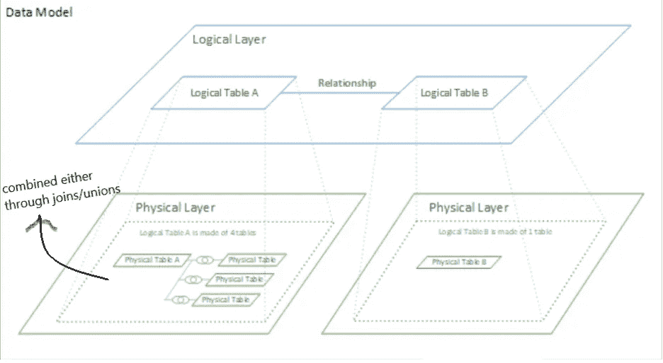

**逻辑层** →我们的数据源页面中默认的数据画布视图就是我们的逻辑层。它能够使用*关系(或面)*来连接数据。当组合来自多个表的数据时，我们不指定逻辑层中的连接，而是执行关系，其中 Tableau 基于数据和分析自动选择适当的连接类型。在逻辑层中形成的表被称为逻辑表。

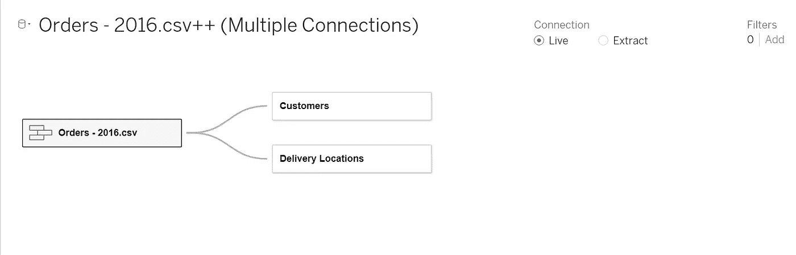

逻辑层

在早期的 Tableau 版本中，只有物理层，但从 v2020.2 开始，Tableau 引入了*关系&逻辑层*。逻辑层中的表不会合并，而是保持不同。

逻辑层由合并的物理表和其他逻辑表组成。逻辑表可以包含一个或多个与联合或连接相关联的物理表。

**物理层** →这可以看作是一个子逻辑层，要访问它，双击一个逻辑表。它支持使用连接/联合来组合数据。在物理层连接的表被称为物理表，在转换后被合并成一个平面表。

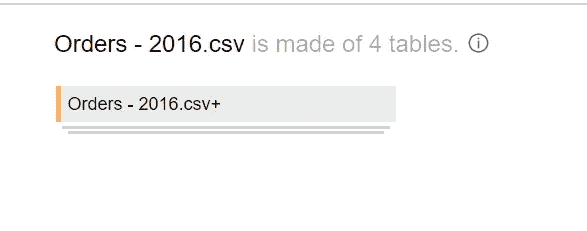

逻辑层中的联合

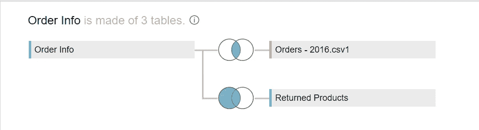

逻辑层中的联接

# 关系

Tableau 中关系的视觉提示。

关系是 Tableau 刚刚推出的 USP。它使得数据连接对所有人来说都很容易，*，并且不特别需要连接/联合的知识。这些用面条状的结构表示，在数据画布页面上很容易找到。*

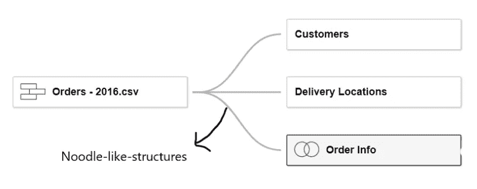

**只能在逻辑层建立关系。**这就像两个基于匹配字段的表之间的契约，contact Tableau 自动执行适当的连接并组合数据。

匹配字段必须具有相同的数据类型，匹配列是否来自相同的数据源并不重要。**关系不支持地理数据类型作为匹配字段。**

**关系需要至少一个数据源。**

**关系保留原来的表结构。**

**不能在已发布的数据源上定义关系。**

**关系在本地计算。**

**发布数据源后，不能编辑关系。**

当我们使用关系连接多个表时，Tableau 会自动检测同名字段并创建一个关系。如果数据源有不同的字段名，Tableau 会要求用户定义匹配的列。

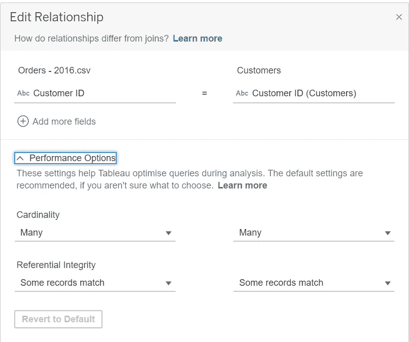

为了提高性能，我们可以修改基数并研究引用完整性。但是，大多数时候，最好是把它留给画面。

# 连接

Tableau 中连接的可视提示

连接是一种基于特定条件组合数据的传统方法。在 Tableau 中，**连接只能在物理层**中完成。要创建连接，请双击逻辑表。

**连接总是会创建一个新表。**

**连接将数据组合起来，然后进行聚合。**

连接是静态的。

**至少需要一个数据源。**

**可适用于多种数据连接。**

将不同聚合或不同细节级别的数据连接在一起会导致数据重复。

Tableau 支持四种类型的连接:**内、外、左、右。**

举例来说，我们拿两个表:名字和标记。

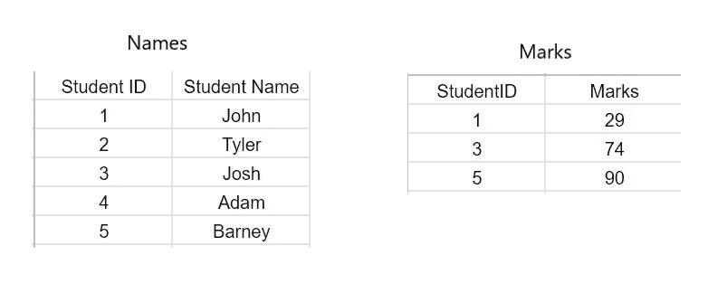

**内部连接→** 它只表示两个表中相同的值。如果一个值在任一表中不完全匹配，它将被立即删除。

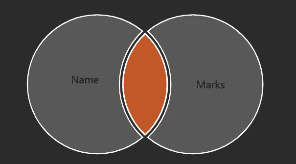

在我们的示例中，我们刚刚标记了 StudentID 1、3、5，因此，我们分别为这些 ID 获得了*学生姓名*。

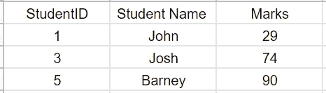

**外部连接→** 它代表两个表中的所有值，如果任何一个表中的值不匹配，那里就会有一个空值。

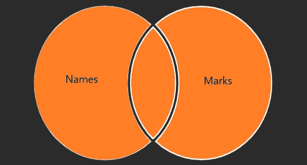

在我们的例子中，因为我们在两个表中只有 3 个匹配的行，其他表的*标记*被指定为 *null* 。

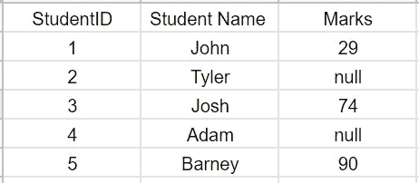

**右连接→** 它代表右表中的所有值，如果左右表中的某个值不匹配，它将被赋值为 *null* 。

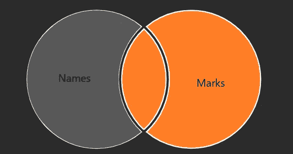

如果我们对表 **Name & Marks** 执行右连接，结果会有点像内连接*(内连接和右连接的每次结果不一定都相同)*。

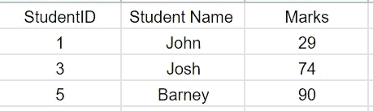

但是，如果我们在**标记&名称**之间执行右连接，结果将完全不同，即类似外连接。

**Left Join →** 它代表左表中的所有值，如果右表中的某个值不匹配，它将被赋值为 *null* 。

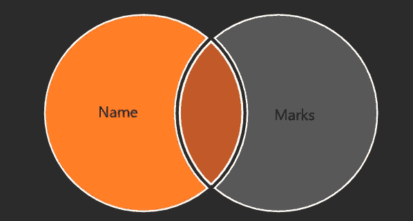

如果我们在表 **Name & Marks** 上执行左连接，结果会有点像外连接*(外连接和左连接的每次结果不一定都相同)*。

但是，如果我们在**标记&名称**之间执行左连接，结果将完全不同，即类似于内连接。

## 跨数据库联接

跨数据库联接需要从多个连接中设置数据源

要创建跨数据库联接:

第一步:点击“添加”。

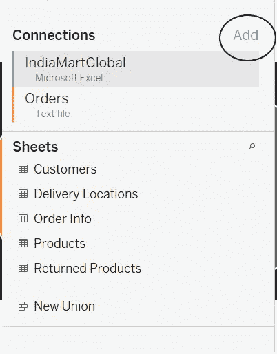

步骤 2:添加另一个连接。

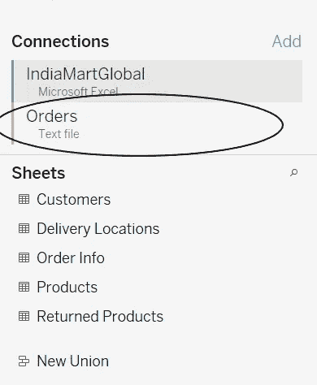

第三步:一旦我们进入工作表，我们就可以在一个单一的数据源中找到所有的数据。我们可以在它们之间切换。

# 联盟

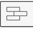

画面中结合的视觉线索

Union 是一种追加两个具有相同列数和数据类型的数据连接的方法。**这发生在物理层**，可以通过双击一个逻辑表来访问。

**Union 总是会创建一个新表。**

**不同数据源的数据不能联合。**

**在联合中，Tableau 添加引用字段来帮助识别数据源。**

**联合表可用于创建连接。**

可以通过两种方式完成联合:手动、通配符搜索

## 人工联合

要创建手动联合，请进入物理层并单击“新建联合”。

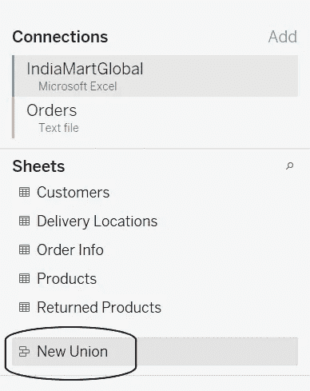

## 通配符联合

该方法自动创建表之间的联合。通配符将有助于找到表名的特定模式。

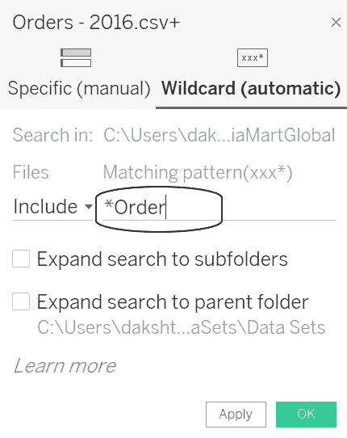

它将创建一个名称中包含“Order”的所有文件的联合。

## 匹配字段名称或字段排序

如果两个字段有不同的名称或者没有名称，我们可以要求 Tableau 根据表中数据的排序执行联合。

## 合并不匹配的值

当两个表中的值不匹配时，它们将被联合表中的空值替换。我们可以将所有不匹配的字段合并在一起，以消除空值。

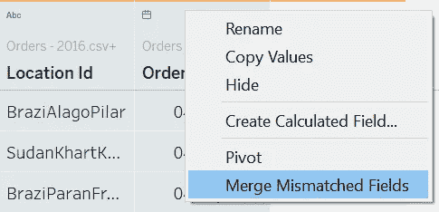

# 数据混合

Tableau 中数据混合的可视提示

数据混合是连接 Tableau 中多个连接的数据的另一种方法。这最适合连接不同细节层次的数据，或者简单地说，连接不同文件格式的数据。

**混合需要两个连接，即初级和次级**。首先选择的连接将被认为是主要的，随后将是次要的。**主要连接将由蓝色表示，而次要连接将由橙色表示。**

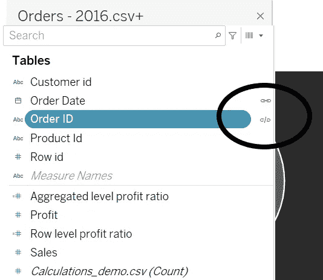

**一个混合体聚集然后结合。**

**混合保留原来的表结构。**

**数据混合是主表和辅助表之间的左外连接，辅助表中可能存在一些缺失数据。**

**数据混合特定于工作表，即不同的工作表有所不同。**

**数据源之间必须有一个共同的维度才能创建数据混合。**

**数据从未真正在 Blend 中组合，但每个数据源都被独立查询，结果被聚合并一起呈现。**

**混合数据不能发布到 Tableau Online 或 Tableau Server。**

**围绕非加性总量有一些数据混合限制，如 COUNTD、MEDIAN 和 RAWSQLAGG。**

# 选哪个？

在回答这个问题之前，让我们回顾一下所有的加入类型:

**关系&连接需要一个数据源，而混合需要至少两个数据源。**

Relationship、Join、Blend 是在特定条件下绑定数据的方法，但 Union 只是追加数据。现在，竞争和困惑归结为三个竞争者: ***关系，加入&交融。***

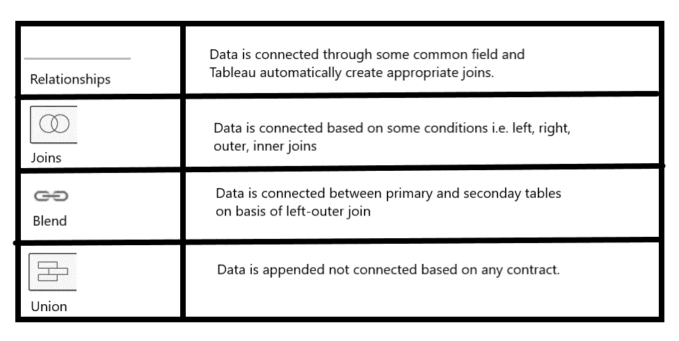

## 总结一下:

> "如果可以，利用关系；如果必须，加入；如果绝对必须，融合."多纳贝尔·桑托斯

# 本主题的试题示例

**地理字段/计算字段可以连接关系？**

1.  真实的
2.  错误的

**解**:假

**____ 和 ____ 保留原有的表格结构。**

1.  连接
2.  关系
3.  混合
4.  联盟

**解决方案**:融合与关系

**____ 和 _ _ _ _ _ 将始终创建一个新表。**

1.  加入
2.  联盟
3.  关系
4.  混合

**解决方案**:连接和联合

**使用哪种连接方法会导致添加参考字段？**

1.  加入
2.  联盟
3.  混合
4.  关系

**解决方案**:联合

**混合中的所有次要数据都必须汇总？**

1.  真实的
2.  错误的

**解**:真

> 使用链接访问免费 Tableau 认证转储(有效期至 2022 年 7 月 6 日):
> 
> [https://www . udemy . com/course/tableau-desktop-specialist-certification-dumps-2022/？coupon code = e3f 08189 fa 4 bafae 72 BC](https://www.udemy.com/course/tableau-desktop-specialist-certification-dumps-2022/?couponCode=E3F08189FA4BAFAE72BC)

# 参考资料:

[1] [Tableau 帮助| Tableau 软件](https://www.tableau.com/support/help)

[2] [个人笔记](https://dakshtrehan.notion.site/Tableau-Notes-c13fceda97b94bda940edbf6751cf303)

[3] [Tableau 桌面专家考试(新花样— 2021) — Apisero](https://apisero.com/tableau-desktop-specialist-exam-new-pattern-2021/)

[4] [sqlbelle](https://www.youtube.com/watch?v=FtyVMvfzn1I)

# 感谢阅读！

请随意鼓掌，这样我就知道这篇文章对你有多有帮助，并在你的社交网络上分享它，这对我会很有帮助。

如果你喜欢这篇文章，想了解更多**机器学习，数据科学，Python，BI。请考虑订阅我的时事通讯:**

> [达克什·特雷汉的简讯](https://mailchi.mp/b535943b5fff/daksh-trehan-weekly-newsletter)。

在网上找到我:[www.dakshtrehan.com](http://www.dakshtrehan.com/)

在 LinkedIn 与我联系:[www.linkedin.com/in/dakshtrehan](http://www.linkedin.com/in/dakshtrehan)

阅读我的科技博客:[www.dakshtrehan.medium.com](http://www.dakshtrehan.medium.com/)

在 Instagram 和我联系:【www.instagram.com/_daksh_trehan_ 

# 想了解更多？

[YouTube 是如何利用人工智能推荐视频的？](/how-is-youtube-using-ai-to-recommend-videos-38a142c2d06d)
[利用深度学习检测新冠肺炎](https://towardsdatascience.com/detecting-covid-19-using-deep-learning-262956b6f981)
[逃不掉的 AI 算法:抖音](https://towardsdatascience.com/the-inescapable-ai-algorithm-tiktok-ad4c6fd981b8)
[GPT-3 向一个 5 岁的孩子解释。](/gpt-3-explained-to-a-5-year-old-1f3cb9fa030b)
[Tinder+AI:一场完美的牵线搭桥？](https://medium.com/towards-artificial-intelligence/tinder-ai-a-perfect-matchmaking-b0a7b916e271)
[一个内部人士的使用机器学习卡通化指南](https://medium.com/towards-artificial-intelligence/an-insiders-guide-to-cartoonization-using-machine-learning-ce3648adfe8)
[谷歌是如何做出“哼哼来搜索？”](/how-google-made-hum-to-search-865f224b70d0)
[单行神奇代码执行 EDA！](/one-line-magical-code-to-perform-eda-f83a731fbc35)
[给我 5 分钟，我给你深度假！](/give-me-5-minutes-ill-give-you-a-deepfake-ce83a645b0f9)

> *欢呼*