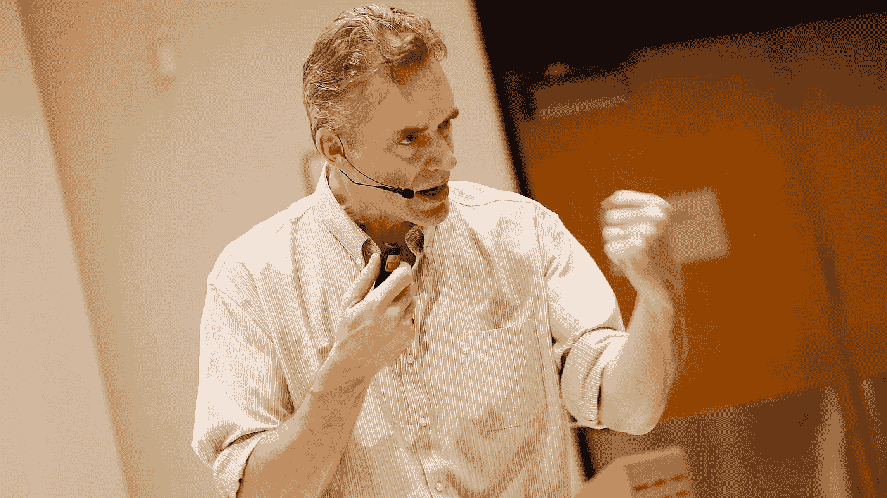
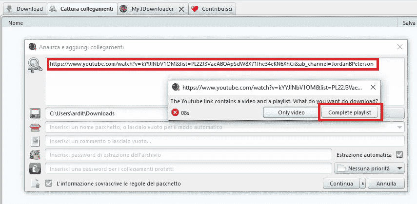
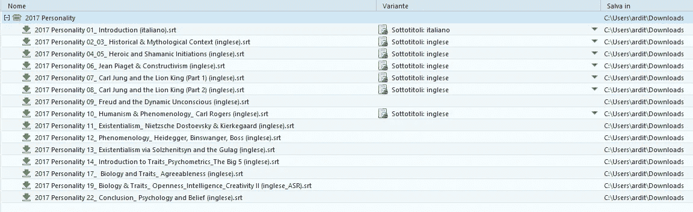
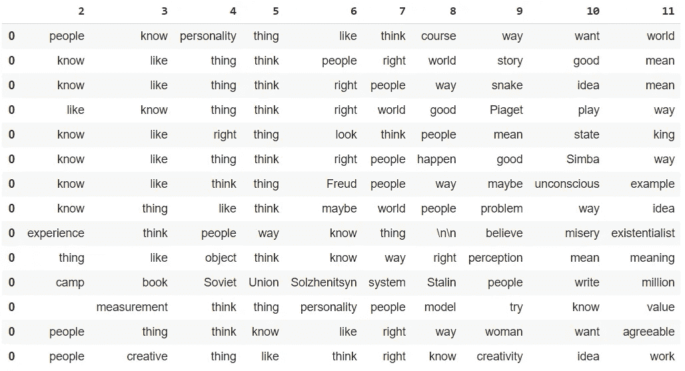
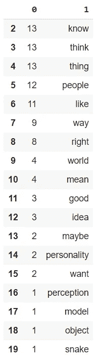

# 乔丹·彼得森自然语言处理词频分析

> 原文：<https://pub.towardsai.net/jordan-peterson-nlp-word-frequency-analysis-b18642205311?source=collection_archive---------0----------------------->

## [人工智能](https://towardsai.net/p/category/artificial-intelligence)，[自然语言处理](https://towardsai.net/p/category/nlp)

## 在同一课程中，他的语言使用是否有所不同？完整的代码使用空间可用[在我的 Github 回购](https://github.com/arditoibryan/Projects/tree/master/20200730_NLP_word_frequency)

在这篇文章中，我将使用多伦多大学 30 小时的乔丹·彼得森人格课程来进行 NLP 分析。我的目标是找出哪些是他用得最多的词:

*   在 30 小时内
*   每节课

结果会有所不同吗？从理论上讲，乔丹·彼得森可能会在一节课中使用一些术语，然后在不同的课上换成一套不同的术语，也许是受不同情绪的驱使。



图片:Rene Johnston /多伦多星报

为了进行这个实验，我需要他整个课程的文本内容。因为我需要使用 Youtube API 来访问字幕(这需要一篇文章来解释如何使用 python 连接到 Youtube)，所以我将使用第三方软件:JDownloader。如果你想在类似的视频上复制这个实验，你可以在。srt 格式。



JDownloader 的屏幕截图

我将只选择字幕，并将所有内容下载到同一文件夹下:



列表。srt 下载

# 创建函数

为了执行这个实验，我需要预处理文本数据:

*   清除标点符号、符号和停用词中的数据
*   将每个单词词条化:将它们转换为原始词根

```
!pip install spacy
!pip install pysrt #per sottotitoli#find top words
def top_frequent(text, num_words):
  #frequency of most common words
  import spacy
  from collections import Counternlp = spacy.load("en")
  text = text#lemmatization
  doc = nlp(text)
  token_list = list()
  for token in doc:
    #print(token, token.lemma_)
    token_list.append(token.lemma_)
  token_list lemmatized = ''
  for _ in token_list:
    lemmatized = lemmatized + ' ' + _
  lemmatized#remove stopwords and punctuations
  doc = nlp(lemmatized)
  words = [token.text for token in doc if token.is_stop != True and token.is_punct != True]
  word_freq = Counter(words)
  common_words = word_freq.most_common(num_words)
  return common_words
```

使用函数**top _ frequency(text，num_words)，**我可以输入任何一串文本(如果我愿意，甚至可以输入整本书)，我将得到按升序排列的词汇数。使用参数 **num_words** ，我可以指定我想要返回的单词数(例如，返回 2000 个单词的整个列表没有多大用处)。

# 整个课程的分析

一个有趣的实验是对整个课程进行分析，然后将结果与单独的课程进行比较。

为什么要对全文和不同分区进行实验？最重要的是，为什么我有足够的信心声称彼得森使用的最频繁的词汇可能在所有课程中都不相同？通过分析整个课程，我不知道单词分布的概念，因为它代表所有的单个课程。通过从所有单独的课程中获取数据，并分别分析它们，我可以建立一个词频分布，它可以告诉我结果是否一致。

```
#   parse sub
#total words of JP in the course
import pysrttotal_string = ''
for text_n in range(1, 10):
  subs = pysrt.open('/content/drive/My Drive/Colab Notebooks/Projects/20200729_NLP_frequency/JP_'+str(text_n)+'.srt')
  for sub in subs:
    #print(sub.text)
    total_string += sub.text
total_stringlen(total_string)
```

## 输出

我让软件将所有字幕组合在一起，并对彼得森最常用的 1000 个单词进行排序:

```
common_words = top_frequent(total_string, 1000)
common_words
[('-PRON-', 13496),  
('know', 1133),  
('like', 924),  
('thing', 592),  
('think', 495),  
('people', 397),  
('right', 361),  
('way', 294),  
('world', 272),  
('happen', 235),  
('mean', 225),  
('good', 223),  
('look', 219),  
('time', 192),  
('want', 185),  
('maybe', 185),  
('tell', 183),  
('idea', 181),  
('sort', 168),  
('little', 156),  
('come', 145),  
('story', 143),  
('actually', 142),  
('kind', 134), 
('problem', 133),
...
```

# 个别课程的分析

有了这个代码分区，我将构建一个值的分布，看看它是否遵循均匀分布。如果是这样的话，我可能会说，独立于演讲的内容，乔丹·彼得森将保持一致的词频。

```
def find_common_factors(X):
  #flat everything in one list
  one_row = list()
  for k in X.values:
    for n in k:
      one_row.append(n)
  one_row = pd.DataFrame(one_row)
  one_row#labeled list
  from sklearn.preprocessing import LabelEncoder
  le = LabelEncoder()
  le.fit(one_row[0])
  one_row_labeled = le.transform(one_row[0])
  one_row_labeled#rebuild the original dataset and convert it to DataFrame
  import numpy
  X_labeled = numpy.array_split(one_row_labeled, (X.shape[0]))
  X_labeled = pd.DataFrame(X_labeled)
  X_labeledm = [[0 for x in range(max(one_row_labeled)+1)] for x in range(len(X_labeled))]#turn each corresponding label to 1
  for row in range(len(X_labeled.values)):
    for num in range(len(X_labeled.values[1])):
      m[row][X_labeled.values[row][num]] = 1
  m = pd.DataFrame(m)
  moriginal_shape = m.shape
  original_shape#convert column num in corresponding text
  m.loc[original_shape[0]] = [0 for x in range(0, original_shape[1])]
  mfor _ in range(original_shape[0]):
    m.loc[original_shape[0]] += m.loc[_] 
  m#rename columns with label values
  m.columns = a = le.inverse_transform(m.columns)
  m#isolate count of columns
  m.loc[m.shape[0]] = m.columns #we add last col with names
  f = m.transpose().drop([x for x in range(m.shape[0]-2)], axis=1).transpose() #we only save the last 2 cols
  f = f.reset_index()
  f.pop('index')#sorting values
  f = f.transpose().reset_index().drop(['index'], axis=1)
  return f.sort_values(0, axis=0, ascending=False, inplace=False, kind='quicksort', na_position='last')#parse individual lesson
#total words of JP in the course
import pysrt
import pandas as pd
```

现在算法已经准备好了，我可以访问所有的字幕，并将实验结果收集到熊猫的数据帧中。**记得更改路径文件夹。**我将使用我的 Google Drive 来存储我的代码。您将把数据存储在不同的位置。

```
total_subs = list()
for text_n in range(1, 15):
  subs = pysrt.open('/content/drive/My Drive/Colab Notebooks/Projects/20200729_NLP_frequency/JP_'+str(text_n)+'.srt')
  top_words = top_frequent(subs.text, 12) #n_words qui, metto 12 perchè le prime 2 si eliminano
  df = pd.DataFrame([top_words[x][0] for x in range(10)])
  total_subs.append(df)X = pd.concat(total_subs, axis=1)
X = X.transpose()
X
X[[x for x in range(2, 12)]]
```

## 每个单独课程的输出:



我去掉了前两列，因为它们计入了文本中的-PRON-和\ an，这可能是一个 spacy bug。

# 实验的结论

结果简直不可思议！所用词的分布似乎是均匀的。我们对词汇的选择在未来保持一致。

```
find_common_factors(X).reset_index().drop(['index'], axis=1).iloc[2:20]
```

通过计算数据集中的单词，结果如下:

