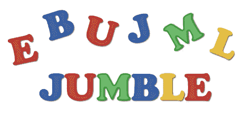

# jumbed Word—使用 Python 和 Jupyter IPyWidget 的游戏

> 原文：<https://pub.towardsai.net/jumbled-word-game-3fc416829fe4?source=collection_archive---------4----------------------->

## [编程](https://towardsai.net/p/category/programming)



冗杂的文字游戏|来源:图片由作者提供。

# 介绍

这个游戏可以由单个用户玩，它涉及到字典中的一个随机单词，这个单词是杂乱无章的。用户必须猜测并在定时器控制的游戏环境中输入相同的内容。

# 规则

玩家可以从下拉菜单中选择一个级别，即初级、中级和高级。当玩家单击开始按钮时，会出现以下结果:

*   基于所选择的级别，根据所选择的级别，随机弹出长度为 4，5，6 的单词。
*   一个计时器在底部启动，根据选择的级别，启动时间为 80、100 和 120 秒。
*   “继续”和“暂停”按钮已启用。
*   提示按钮根据所选的级别启用。
*   如果选择的级别是初学者，则提示按钮被禁用。
*   如果选择的级别是中级或高级，则提示按钮将启用默认提示文本。
*   单击开始按钮后，下拉菜单被禁用。
*   当玩家单击暂停按钮时，会出现以下结果:
*   提示按钮被禁用。
*   暂停按钮被禁用，以防止多次点击。
*   用户输入答案的文本框被禁用。
*   无论等级如何，分数都会减少 1。但是，当它为 0 时，它不会减少。
*   底部的计时器会暂停。

4.当玩家单击“继续”按钮时，会出现以下结果:

*   用户输入答案的文本框被启用。
*   暂停按钮已启用。
*   提示按钮基于以下约束被启用。
*   如果选择的级别是初级，则禁用该级别。
*   如果选择的等级是中级或高级，如果玩家使用了所有的提示，那么它将被禁用。
*   否则它被启用。
*   底部的计时器从暂停的地方继续计时。

5.当玩家单击退出按钮时，会出现以下结果:

*   开始、暂停、继续和退出按钮被禁用。
*   下拉菜单、文本框和提示按钮被禁用。
*   基本上，它会使所有相关的控件失效，用户必须重新运行游戏。

6.分数是根据所选的级别决定的。内容如下:

*   如果选择的级别是初级，分数会增加 1。
*   如果选择的级别是中级，分数会增加 2。
*   如果选择的级别是高级，分数会增加 4。

7.提示的数量取决于所选的级别。内容如下:

*   如果选择的级别是初学者，则为 0。
*   如果选择的级别是中级，则为 1。
*   如果选择的级别是高级，则为 2。

8.要猜测的随机单词的长度是根据所选的级别决定的。内容如下:

*   如果选择的级别是初级，则为 4 级。
*   如果选择的级别是中级，则为 5。
*   如果选择的级别是高级，则为 6。

9.定时器值根据所选的级别决定。内容如下:

*   如果选择的等级是初级，则为 80 秒。
*   如果选择的级别是中级，则为 100 秒。
*   如果选择的级别是高级，则为 120 秒。

# 游戏部分

混乱的单词是小写的，玩家必须用小写输入文本。根据输入的文本，如果它匹配随机词，那么计时器停止，在底部的“右”的消息生成，分数得到更新。否则游戏继续进行，直到计时器倒计时结束。如果玩家尝试了一次，但是不正确，那么在底部会产生一个“错误”的信息。在没有尝试的情况下，完成后仅显示计时器倒计时值。

# 密码

```
!pip install ipywidgets
!pip install requestsimport copy
import random
import threading
import time
import ipywidgets
import requests
from IPython.display import display

random_word = ''
score = 0
random_word_length = 0
no_of_hints = 0
data = []
hint_letter = ''

jumbled_text = ipywidgets.Label(value='Jumbled Text : ')
text_entered = ipywidgets.Label(value='Text Entered : ')
text = ipywidgets.Text(description="Text", disabled=True)
score_label = ipywidgets.Label(value='Score : ')
hint_text = ipywidgets.Label(value='Hint Text : ')
hint_remaining = ipywidgets.Label(value='Hints Remaining : ')
btn_hint = ipywidgets.Button(description='Hint', disabled=True)
high_score_label = ipywidgets.Label(value='High Score : ')
time_remaining = 0

def text_change(change):
    """
    Changing text entered label value when the user enters text through the text box.
    When the text entered is equal to the random word, the textbox is rendered empty.
    :param change: Handling change event from the text box.
    """
    if change["new"] == "Expected":
        text.value = ""
    text_entered.value = "Text Entered : " + change["new"]

text.observe(text_change, names='value')

w = ipywidgets.Dropdown(
    options=['Beginner', 'Intermediate', 'Advanced'],
    value='Beginner',
    description='Choose Level:',
)

def set_hint_text():
    """
    Set the default hint text for the intermediate and advanced level.
    The default hint text is '__'*{word_length} based on the level selected.
    """
    initial_hint_text = ''
    if random_word_length > 4:
        for i in range(random_word_length):
            initial_hint_text += '__'
            if i < random_word_length - 1:
                initial_hint_text += " "

    hint_text.value = 'Hint Text : ' + initial_hint_text

def jumble_random_word():
    """
    Jumbling the random word of a given length depending on the level selected.
    The random.shuffle() method is sometimes giving same string thus a while loop to re-iterate the same.
    Also the random word generated by the above might be a word in data obtained from json so it is also re-iterated.
    :return: jumbled_word.
    """
    set_word_length_on_level()
    set_random_word()
    temp_word = random_word
    random_word_list = list(random_word)
    temp = copy.deepcopy(random_word_list)
    while temp == random_word_list or temp_word in data:
        random.shuffle(random_word_list)
        temp_word = ''.join(random_word_list)
    jumbled_word = ''.join(random_word_list)
    return jumbled_word

def set_random_word():
    """
    Setting the random word based on the level selected by user.
    """
    global data
    global random_word
    words_with_length_k = []
    response = requests.get("http://raw.githubusercontent.com/sindresorhus/mnemonic-words/master/words.json")
    data = response.json()
    for _, value in enumerate(data):
        if len(value) == random_word_length:
            words_with_length_k.append(value)
    random_word = random.choice(words_with_length_k)

def set_word_length_on_level():
    """
    Setting random word length based on the level selected.
    """
    global random_word_length
    if w.value == 'Beginner':
        random_word_length = 4
    elif w.value == 'Intermediate':
        random_word_length = 5
    elif w.value == 'Advanced':
        random_word_length = 6

display(w)
display(score_label)
display(jumbled_text)
b = ipywidgets.HBox([hint_text, btn_hint, hint_remaining])
display(b)
display(text_entered, text)

btn_start = ipywidgets.Button(description='Start')
btn_pause = ipywidgets.Button(description='Pause',disabled=True)
btn_resume = ipywidgets.Button(description='Resume',disabled=True)
btn_exit = ipywidgets.Button(description='Exit')
left_box = ipywidgets.VBox([btn_start, btn_pause])
right_box = ipywidgets.VBox([btn_resume, btn_exit])
a = ipywidgets.HBox([left_box, right_box])
display(a)

def on_pause_button_clicked(b):
    """
    On Click Event for the Pause Button.
    The timer thread is notified to stop through threading.
    The text box and hint button is disabled.
    The pause button is disabled.
    The score is decremented based on the constraint.
    :param b: pause button.
    """
    global score
    e.clear()
    b.disabled = True
    text.disabled = True
    btn_hint.disabled = True
    if score > 0:
        score -= 1
        score_label.value = 'Score : ' + str(score)

btn_pause.on_click(on_pause_button_clicked)

def on_exit_button_clicked(b):
    """
    On Click event for the exit button.
    The timer thread is notified to stop.
    The controls are invalidated.
    :param b: exit button.
    """
    e.clear()
    text.disabled = True
    btn_start.disabled = True
    btn_resume.disabled = True
    btn_pause.disabled = True
    b.disabled = True
    w.disabled = True
    btn_hint.disabled = True

btn_exit.on_click(on_exit_button_clicked)

def on_hint_button_clicked(b):
    """
    On Click event for the hint button.
    The hint text is updated based on the level selected.
    The hints remaining label value is updated.
    The hint button is disabled based on the remaining hints.
    :param b: hint button.
    """
    global no_of_hints
    global hint_letter
    s_upd = ''

    if no_of_hints == 0:
        s_upd += random_word[0]
        hint_letter = random_word[0]
        s_upd += " "
        for i in range(random_word_length - 1):
            s_upd += '__'
            if i < random_word_length - 2:
                s_upd += " "
    elif no_of_hints == 1:
        for i in range(random_word_length):
            if i > 0:
                if i == 3:
                    s_upd += random_word[3]
                else:
                    s_upd += '__'
            else:
                s_upd += hint_letter
            if i < random_word_length - 1:
                s_upd += " "

    hint_text.value = 'Hint Text : ' + s_upd
    no_of_hints += 1
    set_hint_remaining()
    btn_hint.disabled = disable_hint_button_based_on_hints()

btn_hint.on_click(on_hint_button_clicked)

def on_resume_button_clicked(b):
    """
    On Click Event for the resume button.
    The timer thread is notified to resume again.
    The text box is enabled.
    The pause button is enabled if it is disabled.
    The hint button is enabled/disabled based on the number of hints remaining.
    :param b: resume button.
    """
    e.set()
    text.disabled = False
    if(btn_pause.disabled):
        btn_pause.disabled = False
    btn_hint.disabled = disable_hint_button_based_on_hints()

def disable_hint_button_based_on_hints():
    """
    Disabling the hint button based on constraints for the game levels.
    :return: True indicating the button can be disabled else False.
    """
    return (random_word_length == 4) or (random_word_length == 5 and no_of_hints == 1) or (random_word_length == 6 and no_of_hints == 2)

btn_resume.on_click(on_resume_button_clicked)

def set_timer_based_on_level():
    """
    Setting the timer based on the game level.
    """
    global time_remaining
    if w.value == 'Beginner':
        time_remaining = 80
    elif w.value == 'Intermediate':
        time_remaining = 100
    elif w.value == 'Advanced':
        time_remaining = 120

def set_hint_remaining():
    """
    Setting the hint remaining label value based on the number of hints for each game level.
    """
    value = 0
    if random_word_length == 5:
        value = 1 - no_of_hints
    elif random_word_length == 6:
        value = 2 - no_of_hints

    hint_remaining.value = 'Hints Remaining : ' + str(value)

def on_start_button_clicked(b):
    """
    On Click Event for the start button.
    Setting the timer function based on level is called.
    The jumbled random word function is called.
    The set hint text and hints remaining function is called.
    The threading mechanism is called to start the countdown timer.
    The start button is disabled while pause and resume buttons are enabled.
    The textbox is enabled and the dropdown menu is disabled.
    The hint button is disabled based on the random word length.

    :param b: start button.
    """
    set_timer_based_on_level()
    jumbled_word = jumble_random_word()
    jumbled_text.value = "Jumbled Text : " + jumbled_word
    set_hint_text()
    set_hint_remaining()
    thread = threading.Thread(target=countdown, args=(e,))
    thread.start()
    e.set()
    btn_start.disabled = True
    text.disabled = False
    btn_pause.disabled = False
    btn_resume.disabled = False
    w.disabled = True
    if random_word_length > 4:
        btn_hint.disabled = False

btn_start.on_click(on_start_button_clicked)

def update_score_on_level():
    """
    Updating the game score based on the correct answer for the selected game level.
    """
    global score
    if w.value == 'Beginner':
        score += 1
    elif w.value == 'Intermediate':
        score += 2
    else:
        score += 4

def print_result_on_console(result):
    """
    Printing the result after game finishes.
    :param result: The message to be printed on the console after the game finishes which is Right/Wrong.
    """
    print(result, end='\r')
    text.value = ""

def countdown(event):
    """
    Running timer based on game level and handling thread to notify the timer to start/stop based on user action.
    The user action here denotes the click on resume/pause button.
    Printing the result message on the console function is called.
    The update score function is called.
    The timer countdown is printed on the bottom of the screen.
    The dropdown menu is enabled post game completion while other controls are invalidated.
    The start button is enabled.
    :param event: Denoting it as a target function for threading.
    """
    global time_remaining
    global no_of_hints
    global data
    event_is_set = True

    while time_remaining >= 0 and event_is_set:
        event_is_set = e.wait()
        if text.value == random_word:
            print_result_on_console("Right")
            time_remaining = 0
            update_score_on_level()
            break

        minutes, secs = divmod(time_remaining, 60)
        time_format = '{:02d}:{:02d}'.format(minutes, secs)
        print(time_format, end='\r')
        time.sleep(1)
        time_remaining -= 1

    if text.value != "" and text.value != random_word:
        print_result_on_console("Wrong")

    score_label.value = 'Score : ' + str(score)
    hint_remaining.value = 'Hints Remaining : '
    jumbled_text.value = "Jumbled Text : "
    btn_start.disabled = False
    w.disabled = False
    text.disabled = True
    hint_text.value = 'Hint Text : '
    btn_hint.disabled = True
    btn_pause.disabled = True
    btn_resume.disabled = True
    no_of_hints = 0
    data = []

e = threading.Event()
```