# Jupyter 扩展改进您的数据工作流程

> 原文：<https://pub.towardsai.net/jupyter-extensions-to-improve-your-data-workflow-9126bc3c3036?source=collection_archive---------0----------------------->

## 使用这些扩展改进您的工作流程


克里斯托夫·高尔在 [Unsplash](https://unsplash.com?utm_source=medium&utm_medium=referral) 上拍摄的照片

[Jupyter](https://jupyter.org/) 是许多数据科学家用来开展工作的平台，主要是为数据人开发的。Jupyter 在数据社区中广受欢迎，因为它的环境比其他编程 IDE 更直观，并且可以在任何级别访问。

尽管 Jupyter 环境很好，但是使用社区开发的扩展可以进一步增强它的工作。有许多旨在改进数据工作流和创建更愉快的工作环境的扩展。

这些 Jupyter 扩展是什么？让我们开始吧！

# 1.艾丽拉

[Elyra](https://elyra.readthedocs.io/en/stable/getting_started/overview.html) 是一款专注于数据科学和 AI 环境的 JupyterLab 笔记本扩展。该扩展提供了各种功能来改进我们的工作流，包括但不限于以下内容:

*   管道可视化编辑器
*   代码片段
*   目录
*   Git 集成

Elyra 扩展还有许多功能，但我想把重点放在可能会用到的常用功能上。

在我们继续这个例子之前，让我们安装 Elyra 扩展。我们将使用下面的代码来安装 Elyra 扩展的所有功能。

```
pip install --upgrade "elyra[all]"
```

打开 Jupyter Lab，你会发现边栏上有一个额外的按钮，还有 Jupyter Lab 启动器上的各种按钮。

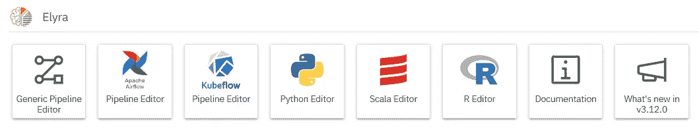

作者图片

让我们来看看 Elyra 提供的各种功能。除了我在这里介绍的特性之外，还有很多其他特性，您可以在文档中查看。

## 管道可视化编辑器

Pipeline visual editor 是 Jupyter 实验室中简化管道创建的工具。管道编辑器使用相互连接的节点来定义整个管道。节点可以表示任何任务，例如加载数据、预处理数据、机器学习模型训练、模型部署等等。

例如，Jupyter 实验室中的管道编辑器如下图所示。

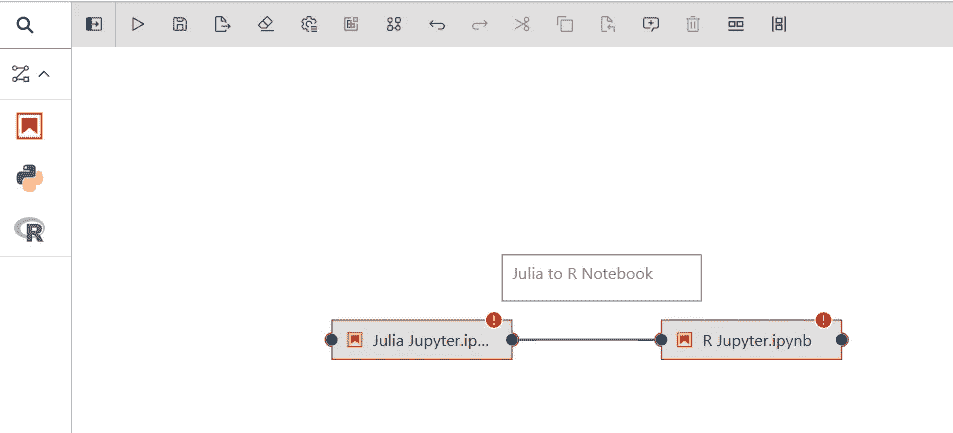

作者图片

管道编辑器有两种管道:使用通用组件的通用管道和特定于运行时的管道，如 Apache Airflow 或 Kubeflow。它将根据您的需要供您使用。如果你需要更多的细节，你可以在这里阅读文档。

## 代码片段

Elyra 提供了定制的代码片段侧边栏来存储各种可以添加到文件编辑器中的代码。这允许用户重用代码，避免每个项目中的重复工作。

例如，下图显示了代码片段功能。

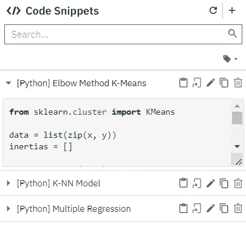

作者图片

## **目录**

Elyra 提供了一个从笔记本自动导航降价标题识别，这允许目录生成。该功能为用户带来了增强的导航。

要访问目录，请打开一个笔记本，然后从边栏中选择目录选项卡。例如，下图显示了我的笔记本的目录。

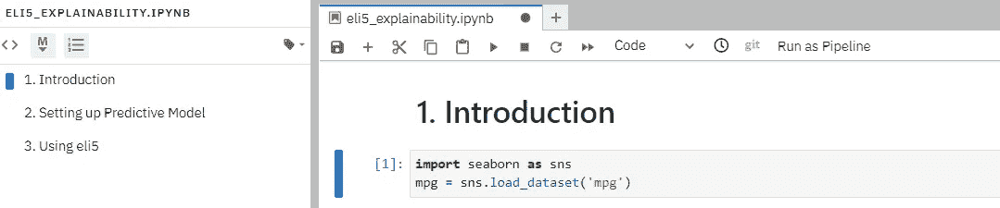

作者图片

## **Git 集成**

有了 Elyra，Git 集成到版本控制我们的数据活动成为可能。Git 侧边栏选项卡将管理我们的存储库的所有变更和历史。UI 也足够直观，我们可以很快知道我们的存储库中发生了什么。

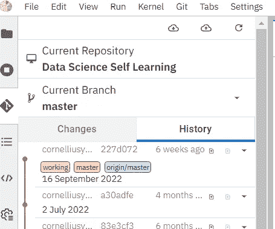

作者图片

# 2.Jupyter Contrib Nbextension

[Jupyter Contrib nb extensions](https://jupyter-contrib-nbextensions.readthedocs.io/en/latest/index.html)是一个包含社区贡献的 Jupyter 扩展的包，它允许在 Jupyter 笔记本中有更多种类。集合启用就像点击按钮一样简单，这使得每个人都可以很好地访问。

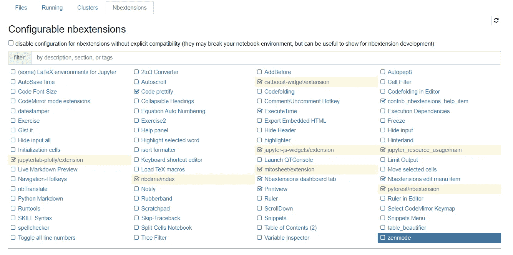

作者图片

您可以运行下面的代码来访问 Jupyter 环境中的 Nbextensions。

```
pip install jupyter_contrib_nbextensions && jupyter contrib nbextension install
```

安装完成后，重启你的 Jupyter 笔记本，返回 Jupyter。如果软件包安装成功，您将看到名为 nbextensions 的附加选项卡，类似于上图。

nbextensions 中有大量的扩展，尽管我想推荐一些可以改进您的数据工作流的特性。

## 执行时间

执行时间延长是我向任何使用 Jupyter Notebook 的人建议的延长之一。这个扩展简单而有价值，因为数据科学家喜欢测试各种代码组合，以找到运行速度最快的代码，并在我们执行代码时进行追溯。

每次我们运行当前单元格时，扩展都会出现，并且会一直保持在那里，直到我们再次运行单元格或重置笔记本。下面我用一个例子来展示一下。


作者图片

## 便条簿

Scratchpad 是一个扩展，它可以创建一个独立的环境，用于在我们的主笔记本之外执行 Jupyter 单元代码。

如果我们需要一个地方进行代码实验，但又不想弄乱我们当前的 Jupyter 环境，那么 scratchpad 扩展是很有帮助的。

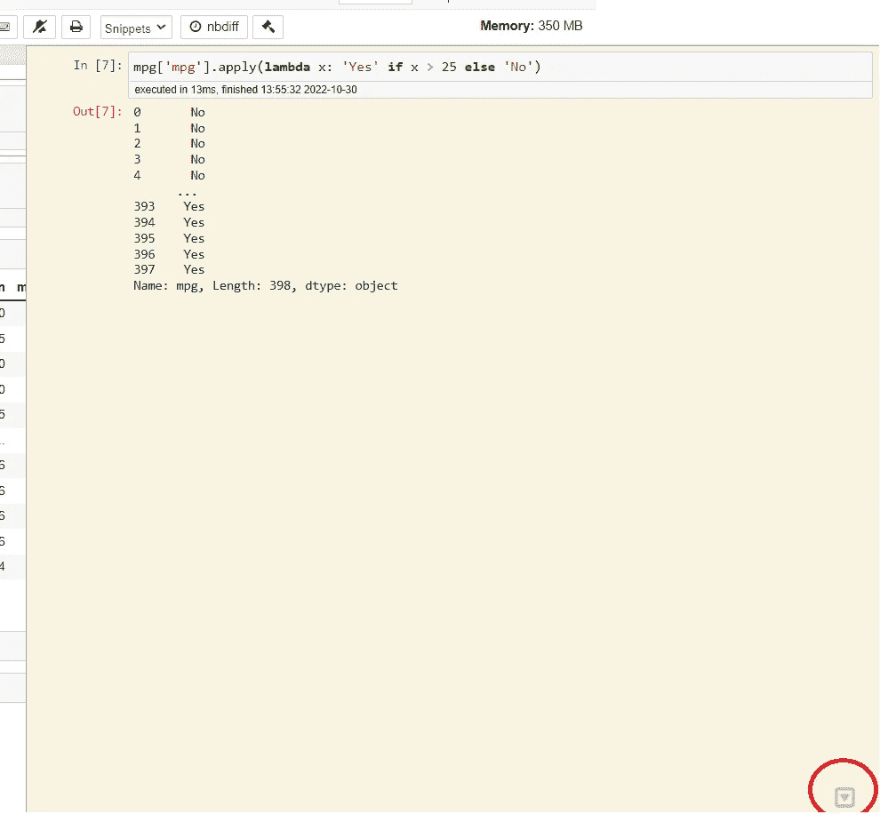

作者图片

## 代码片段菜单

Snippets Menu 是一个 Jupyter 扩展，它为我们提供了各种常见的代码片段。该模板易于导航，因为它是按包和功能分类的。

例如，下图是创建一个简单类的 Python 代码模板片段。

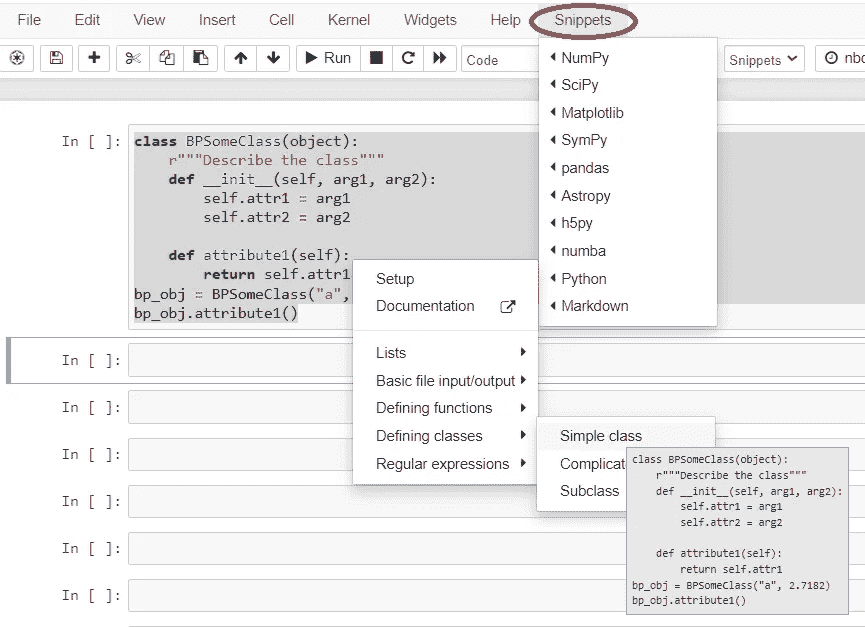

作者图片

## 变量检查器

顾名思义，Variable Inspector 是 Jupyter 的扩展，用于检查我们在 Jupyter 笔记本中创建的所有变量。

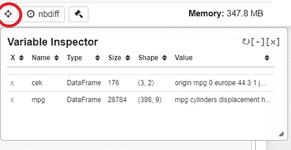

作者图片

通过选择一个类似于上图的按钮，我们获得了一个表，该表给出了变量信息，包括它们的名称、数据类型和许多其他信息。

## 荧光笔

荧光笔是一个 Jupyter 扩展，用于在减价文本中突出显示颜色。这是一个简单的功能，但是当我们想要提供特定信息的焦点时，听起来就足够了。

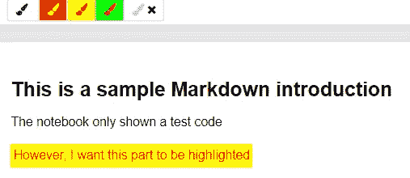

作者图片

# **3。各种单 Jupyter 扩展包**

在前面的列表中，我们已经看到了提供 Jupyter 扩展集合的包。然而，仍然有许多扩展可以用来改进工作流。

## **Jupyterthemes**

[Jupyterthemes](https://github.com/dunovank/jupyter-themes) 是改变 Jupyter 整体主题的扩展。也许你厌倦了默认的主题，想要更多的颜色或者更暗的模式；那么 Jupytertheme 扩展将为您提供这些。

作为初学者，我们需要先安装必备模块。

```
pip install jupyterthemes
```

首先，让我们访问所有可用的主题。

```
jt -l
```

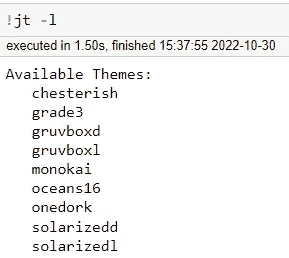

作者图片

要改变主题，我们需要使用下面的命令。

```
#select the theme you want
jt -t chesterish
```


作者图片

我们可以通过输入以下命令恢复到默认主题。

```
#Reset the theme
jt -r
```

## **Nbzip**

nbzip 扩展是一个简单的 Jupyter 扩展，它提供了一个按钮来压缩和下载 Jupyter 服务器文件夹。

要安装这个包，我们需要运行下面的代码。

```
pip install nbzip
```

然后使用下面的代码启用扩展。

```
jupyter serverextension enable --py nbzip --sys-prefix
jupyter nbextension install --py nbzip
jupyter nbextension enable --py nbzip
```

启用扩展后，您将在服务器上看到一个附加按钮。

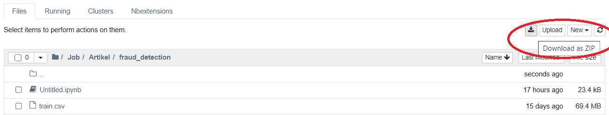

作者图片

## pyforest

pyforest 扩展是一个 Jupyter 扩展，它将在您的环境中提供包自动导入。例如，如果您不喜欢在 Jupyter 笔记本中键入您将使用的每个基本库，我们可以使用 pyforest 扩展来代替该活动。

要启用 pyforest 扩展，我们需要运行以下代码。

```
pip install --upgrade pyforest
python -m pyforest install_extensions
```

重启 Jupyter 服务器，pyforest 自动导入就可以使用了。例如，我会运行 Pandas 包来读取 CSV 文件。结果类似于下图。

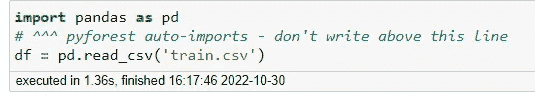

作者图片

我只运行`df = pd.read_csv('train.csv')`代码，pyforest 自动将包导入 Jupyter 环境。

如果想了解 pyforest 自动导入的所有包，可以在这里访问源代码[。](https://github.com/8080labs/pyforest/blob/master/src/pyforest/_imports.py)

## **粘性世界**

Stickyland 是一个简单的 Jupyter Lab 扩展，它提供了创建类似于便笺的代码便笺的能力。我们可以创建一个 Jupyter 实验室环境，其中包含所有必要的代码，并在需要时自动运行这些代码。

我们需要使用下面的代码为启动程序安装这个包。

```
pip install stickyland
```

之后，你会在你的 Jupyter 实验室找到一个新的 stickyland 按钮。

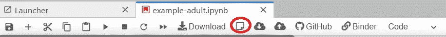

作者图片

按下按钮，stickyland GUI 就会出现，您就可以将单元格代码传递到注释中了。

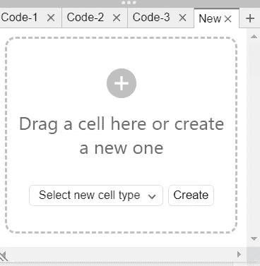

作者图片

您可以在每个笔记中创建或拖放笔记本中的代码。例如，我将我的一个代码拖到便笺上。

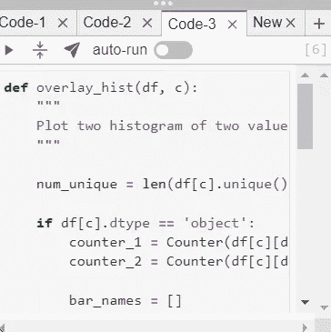

作者图片

这个代码仍然连接到我原来的细胞；如果我运行它，结果会立即显示出来。此外，如果我们想要在我们的环境中收集代码的便笺，我们可以这样做。该示例如下图所示。

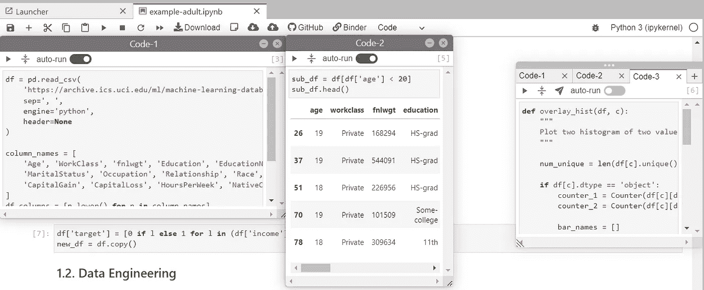

作者图片

## **画图**

[Drawio](https://github.com/QuantStack/jupyterlab-drawio) 或 Jupyterlab-Drawio 是一个扩展，可以在我们的环境中嵌入 [drawio](https://www.draw.io/index.html) chart maker。对于我们的工作流程来说，它简单而强大，尤其是在与多人协作时。

要安装这个包，我们需要运行下面的代码。

```
pip install jupyterlab-drawio
```

之后，我们会找到一个新的图表标签来初始化画板。

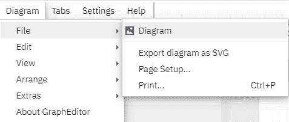

作者图片

通过创建图表文件，我们可以在 Jupyter 实验室中制作我们想要的图表。

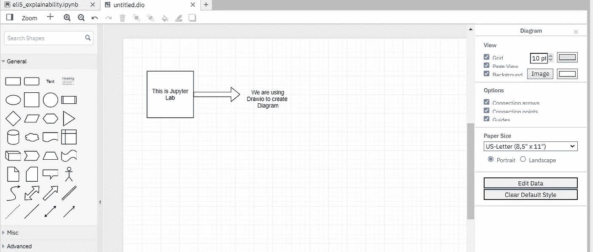

作者图片

# **结论**

数据专业人员广泛使用 Jupyter，因为该环境比其他编程 IDE 直观得多，并且可以在任何级别访问。然而，我们可以通过引入 Jupyter 扩展来进一步增强环境。

在本文中，我提供了几个 Jupyter 扩展建议来改进我们的数据工作流。它们是:

1.  艾丽拉
2.  nb 扩展
3.  Jupyterthemes
4.  Nbzip
5.  pyforest
6.  粘性土地
7.  绘图

希望有帮助！

> 如果您没有订阅为中等会员，请考虑通过[我的推荐](https://cornelliusyudhawijaya.medium.com/membership)订阅。