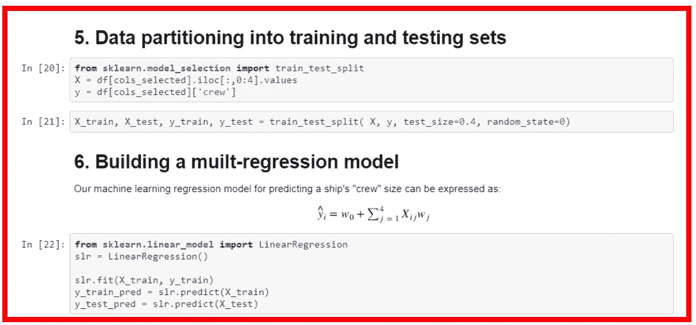

# 用于数据科学编码练习的 Jupyter 笔记本

> 原文：<https://pub.towardsai.net/jupyter-notebook-for-data-science-coding-exercise-393d66ef353a?source=collection_archive---------2----------------------->

## 一些编码挑战问题会指定一个正式的项目报告与一个 Jupyter 笔记本或 R 脚本文件一起提交

图片来源:Pexels

# 一.导言

带回家的挑战问题或编码练习是数据科学家面试流程中最重要的一步。这通常是一个数据科学问题，例如机器学习模型、线性回归、分类问题、时间序列分析等。一些编码挑战问题会指定一个正式的项目报告与一个 Jupyter 笔记本或 R 脚本文件一起提交。在本文中，我们展示了一个 Jupyter 笔记本样本，用于解决一个带回家的挑战问题。

# 二。项目说明

这个编码练习应该用 python(团队使用的编程语言)来完成。你可以自由使用互联网和任何其他图书馆。 ***请将您的作品保存在 Jupyter 笔记本中，并通过电子邮件发送给我们进行审核*** *。*

*数据文件:cruise_ship_info.csv(该文件将通过电子邮件发送给您)*

***目标:*** *建立一个回归器，为潜在的船舶买家推荐“船员”规模。请执行以下步骤(提示:使用 numpy、scipy、pandas、sklearn 和 matplotlib)*

*1。读取文件并显示列。*

*2。计算数据的基本统计数据(计数、平均值、标准差等)。)并检查数据和陈述你的观察结果。*

*3。选择对预测“团队”规模可能很重要的列。*

*4。如果您删除了列，请解释为什么要删除这些列。*

*5。对分类特征使用一次性编码。*

6。创建训练集和测试集(将 60%的数据用于训练，其余用于测试)。

7。建立一个机器学习模型来预测“船员”的规模。

*8。计算训练集和测试数据集的皮尔逊相关系数。*

*9。描述模型中的超参数，以及如何更改它们来提高模型的性能。*

*10。什么是正规化？你的模型中的正则化参数是什么？*

*为测试和训练集绘制正则化参数值与皮尔逊相关性的曲线图，并查看您的模型是否有偏差问题或方差问题。*

# 三。Jupyter 笔记本示例

这个练习的数据集和 Jupyter 笔记本可以从这个 GitHub 存储库下载:[ML _ Model _ for _ Predicting _ Ships _ Crew _ Size](https://github.com/bot13956/ML_Model_for_Predicting_Ships_Crew_Size)。

 [## bot 13956/ML _ Model _ for _ Predicting _ Ships _ Crew _ Size

### 作者:Benjamin O. Tayo 日期:2019 年 4 月 8 日我们使用 cruise_ship_info.csv 数据集构建了一个简单的模型来预测…

github.com](https://github.com/bot13956/ML_Model_for_Predicting_Ships_Crew_Size) 

该笔记本分为八个部分，如下所示:

1.  **读取数据集并显示列**
2.  **计算数据的基本统计**
3.  **预测“船员”规模的变量选择**
4.  **分类特征的一键编码**
5.  **将数据划分为训练集和测试集**
6.  **建立多元回归模型**
7.  **功能标准化、交叉验证和超参数调整**
8.  **降维技术**

**注释和评论**:确保以机器学习工作流程(数据的导入/清理、探索性数据分析、特征工程、模型构建、测试和评估)明显可见的方式组织您的 Jupyter 笔记本。它的组织方式也应与说明中提供的问题顺序保持一致。准备 Jupyter 笔记本时，使用 markdown 工具向您的 Jupyter 笔记本添加分区和子分区是非常重要的。还可以嵌入方程式和简短描述(见下图)。这将使你的笔记本易读易懂。

**准备 Jupyter 笔记本时，使用 markdown 工具向您的 Jupyter 笔记本添加分区和子分区非常重要。你也可以嵌入方程式和简短的描述。**

# 四。总结和结论

编码挑战为您提供了一个绝佳的机会来展示您在数据科学项目中的工作能力。你需要在这里展示出非凡的能力。在编码挑战中取得成功的一个方法是确保你的 Jupyter 笔记本文件有良好的组织和结构。它应该清楚地展示机器学习的工作流程。

# 参考

1.  数据科学编码练习的 R 脚本。
2.  [https://github . com/bot 13956/ML _ Model _ for _ Predicting _ Ships _ Crew _ Size](https://github.com/bot13956/ML_Model_for_Predicting_Ships_Crew_Size)。