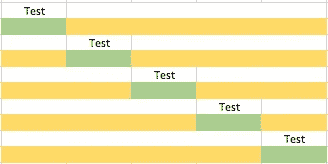
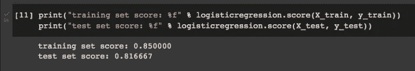
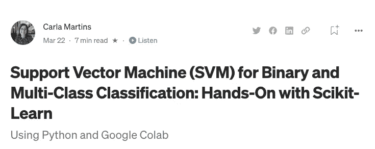
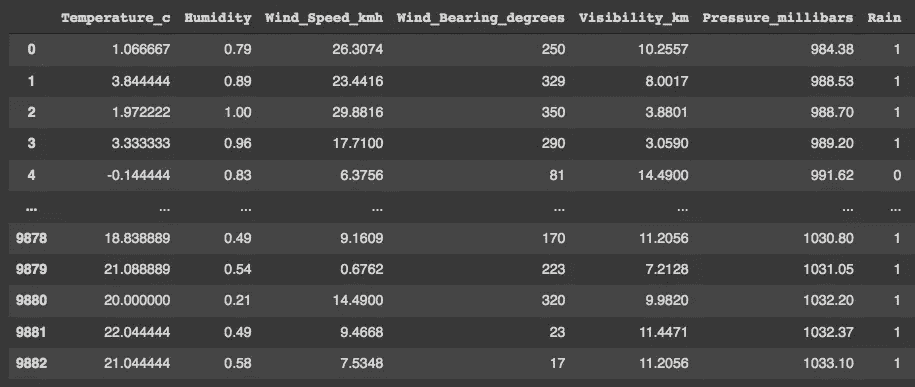
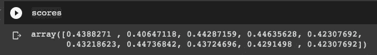
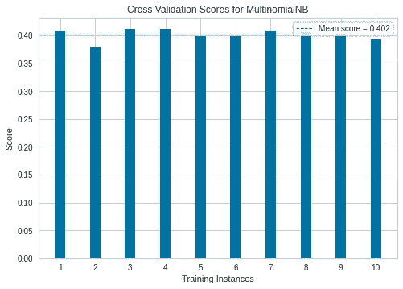

# 解释了 k 倍交叉验证

> 原文：<https://pub.towardsai.net/k-fold-cross-validation-explained-ec99bec8e2b6?source=collection_archive---------3----------------------->

## 使用 SciKit-Learn 和 Yellowbrick 库



k 倍交叉验证

## 过度拟合问题

机器学习最大的问题之一是过度拟合的风险。但是什么是**过拟合**？

当我们的模型的结果(准确性)在训练数据中非常好，但模型在测试或验证数据中未能获得相同的结果时，就会发生过度拟合。



在上面的图像中，我们可以看到训练集中的分数是 85%，但是在测试集中，它只有 81%。虽然差别不大，但这是一个过拟合的例子。测试集是专门创建的，用于检查我们的机器创建的模型是否过拟合。最常见的方法是为此使用部分数据，即，例如，80%的数据用于训练模型，20%的数据用于测试过拟合，并更好地了解模型的实际性能。功能

## 训练/测试分割

Scikit-Learn 的`[**train_test_split**](https://scikit-learn.org/0.17/modules/generated/sklearn.cross_validation.train_test_split.html#sklearn.cross_validation.train_test_split)`函数用于对两组数据进行随机划分，从而保持随机性，如有必要，还保持每组结果的比例。

然而，在机器学习中，自动生成的模型需要研究人员进行一些优化(如 SVM 算法中的 C 参数)。对于这种优化，算法需要“看到”测试集中的一些数据，以便知道如何优化模型。

从模型“看到”测试集数据的那一刻起，它就开始了解它们，我们再次面临过度拟合的风险。在有大量数据的许多情况下，解决方案是创建第三个集合，即验证集。因此，模型的最终评估在验证集中进行。

## 但是如果你的数据很少怎么办呢？

如果可用数据量不是很大，那么将数据库分成三个集合会产生相反的效果，因为训练数据会急剧减少，这会损害模型的性能。

## K 倍解

交叉验证是一种在数据有限时使用的技术，它将数据重新用于训练和测试集。一种交叉验证方法中的 K-Fold，它将数据分成随机选择的 K 个子样本，然后使用 k-1 个样本进行训练，1 个样本进行测试。例如，如果我们选择 5 倍，在有 100 个条目的数据集中，我们的机器将生成 5 个子样本，每个子样本有 20 个条目。姑且称之为:

```
Dataset n=100**#Generate 5-fold samples:**S1 (n=20)
S2 (n=20)
S3 (n=20)
S4 (n=20)
S5 (n=20)**#Train and evaluate model:**K1:
Train with: S2+S3+S4+S5 (n=80)
Test: S1 (n=20)
K2:
Train with: S1+S3+S4+S5 (n=80)
Test: S2 (n=20)
K3:
Train with: S1+S2+S4+S5 (n=80)
Test: S3 (n=20)
K4:
Train with: S1+S2+S3+S5 (n=80)
Test: S4 (n=20)
K5:
Train with: S1+S2+S3+S4 (n=80)
Test: S5 (n=20)**#Overall accuracy:**
Test accuracy: (test **S1** + test **S2** + test **S3** + test **S4** + test **S5**)**/5**
```

对于我所解释的，一个直观的解释是:


现在我们来玩一些代码和数据。我将使用我在上一篇文章中已经使用过的数据集。你可以在 这里找到 [**的下载和探索性数据分析的链接。**](/support-vector-machine-svm-for-binary-and-multiclass-classification-hands-on-with-scikit-learn-29cdbe5cb90e)



[https://pub . toward sai . net/support-vector-machine-SVM-for-binary-and-multi-class-class-class-class ification-hands-on-with-sci kit-learn-29 cdbe 5 CB 90 e](/support-vector-machine-svm-for-binary-and-multiclass-classification-hands-on-with-scikit-learn-29cdbe5cb90e)

与任何其他项目一样，我们从导入必要的库开始:

```
import numpy as np
import pandas as pdfrom sklearn.model_selection import StratifiedKFold
from sklearn.naive_bayes import MultinomialNB
from sklearn.model_selection import cross_val_scorefrom yellowbrick.datasets import load_occupancy
from yellowbrick.model_selection import CVScores
```

接下来，我们将导入、读取和检查我们的数据库。

```
df = pd.read_csv("/content/weather.csv")
df
```



我们的目标是使用除“**温度 _ 温度**”之外的所有其他参数，对结果“**描述**”进行二元分类。因此，让我们创建 X 和 y 变量，排除这两个参数:

```
X = df.drop('Description', axis=1)
X = X.drop('Temperature_c', axis=1)
y = df['Description']
```

现在是时候选择我们的交叉验证策略了，这里我们要用 k 倍法，k=10。

```
cv = StratifiedKFold(n_splits=10, shuffle=True, random_state=42)
```

在这个例子中，我们将使用多项式朴素贝叶斯作为机器学习方法。我们需要定义和构建我们的模型。

```
model = MultinomialNB()
clf = model.fit(X,y)
```

现在我们可以得到所有 10 次折叠的分数(准确度):

```
scores = cross_val_score(clf, X, y, cv=cv)
scores
```



如果我们愿意，我们还可以构建一个图形可视化:

```
visualizer = CVScores(model, cv=cv, scoring='f1_weighted')
visualizer.fit(X, y)        
visualizer.show() 
```



现在我们可以看到平均分是 0.402。这不是一个好的精度，但这是一个例子，现在你知道如何做到这一点，以及如何应用到你的数据！

感谢您的阅读！如果你有建议要添加到这个列表中，请告诉我，不要忘记订阅以接收关于我未来出版物的通知。

如果:你喜欢这篇文章，别忘了关注我，这样你就能收到所有关于新出版物的更新。

否则如果:你想了解更多，你可以通过[我的推荐链接](https://cdanielaam.medium.com/membership)订阅媒体会员。它不会花你更多的钱，但会支付我一杯咖啡。

Else:谢谢！