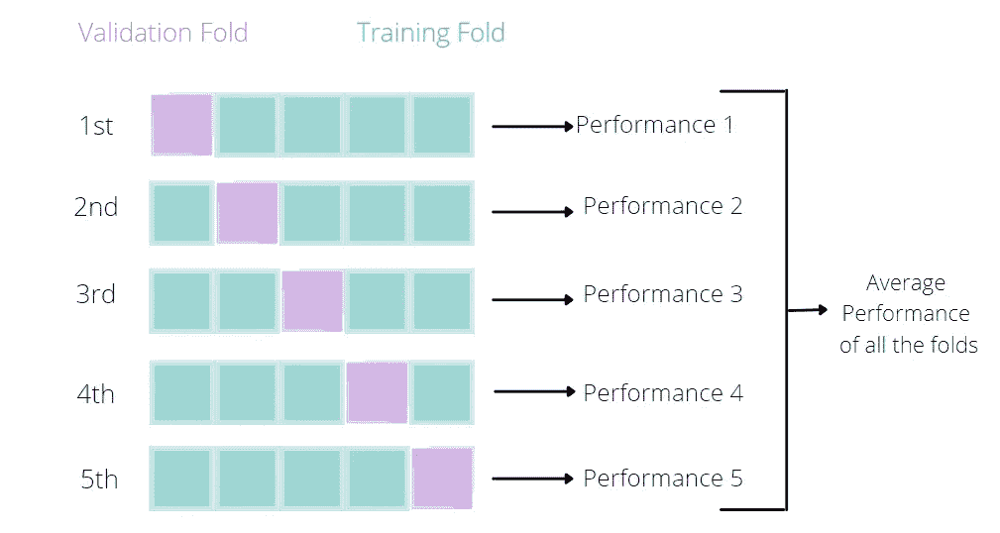
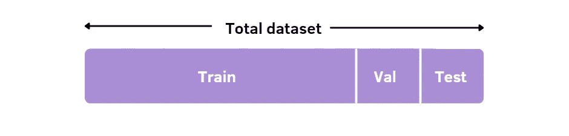
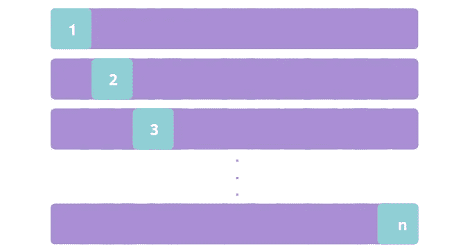
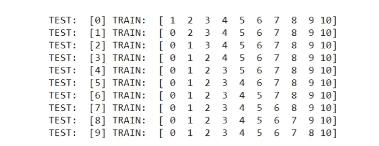
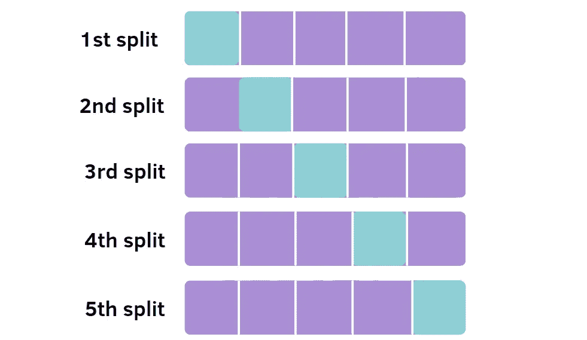
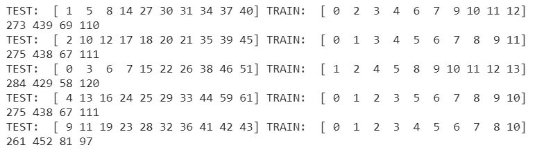
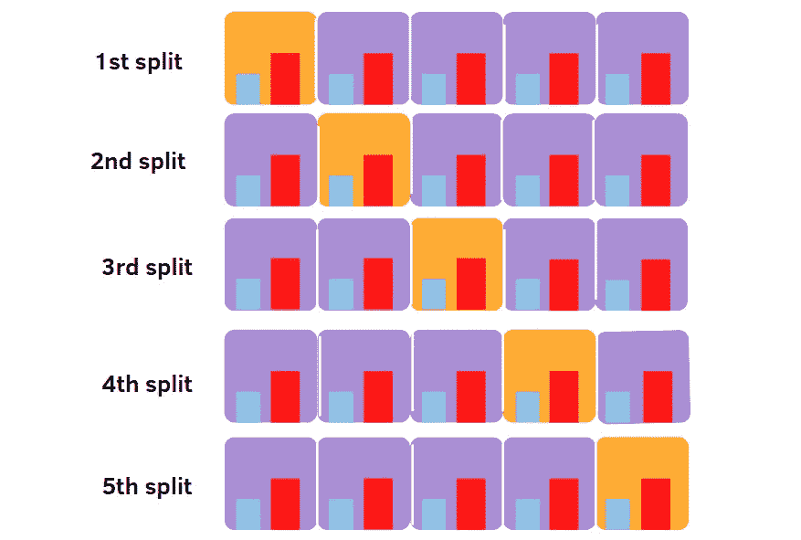
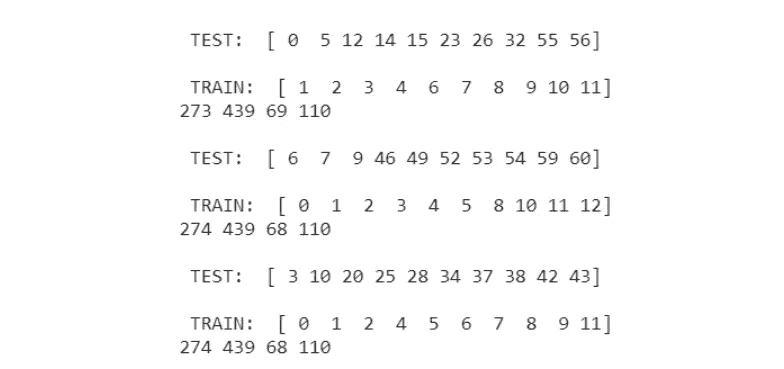
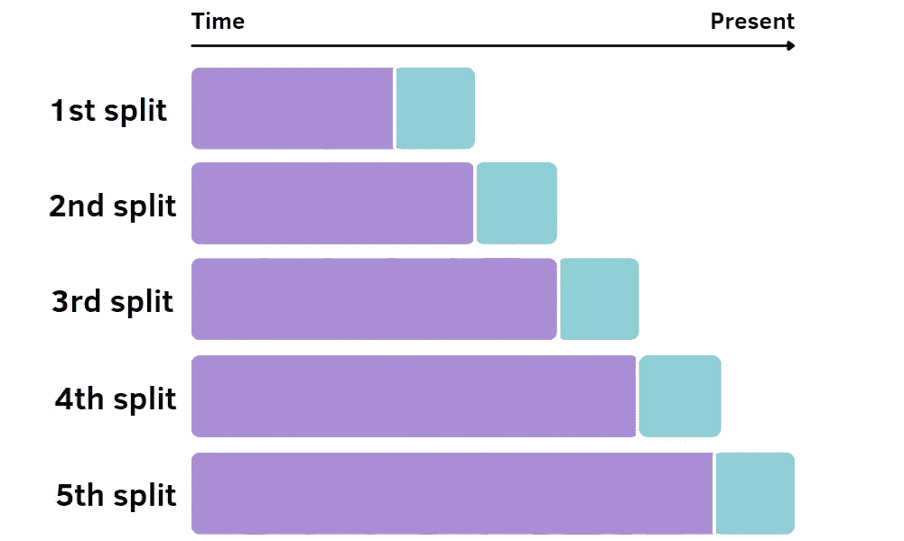
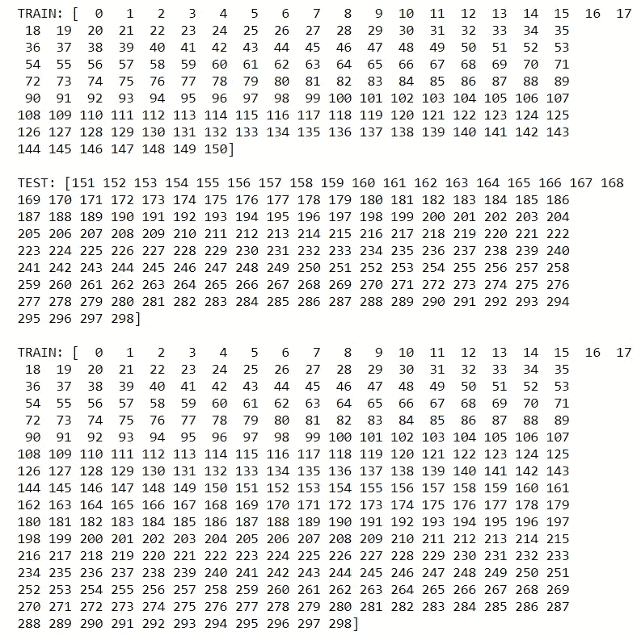

# 机器学习模型的 k 重交叉验证

> 原文：<https://pub.towardsai.net/k-fold-cross-validation-for-machine-learning-models-918f6ccfd6d?source=collection_archive---------0----------------------->

## 使用 sklearn 的交叉验证技术概述

作者制作的图像

机器学习方法通常不能对数据建模，因为它们学习训练集的特定特征，而这些特征不存在于测试集中。所以这些特征不具有代表性，我们处于**过度拟合**的情况。当模型符合太多的训练数据，但无法在新样本中推广时，就会发生这种情况。有许多方法可以解决这个问题，正则化，选择最佳超参数，以及 **K 折叠交叉验证**。

在本文中，我将重点放在最后一个主题上，因为我认为公正地执行模型有着重要的作用。简单地将数据分成训练集和测试集并不能让我们真正了解模型的性能。你可以说“哇”，在训练集上有 90%的准确率，但在你看到 60%的测试准确率之后。肯定出了什么问题。

总的想法是将数据集分成 k 个部分，k-1 个用于训练，一个用于验证/测试。例如，我们可以将数据集拆分为 5 个折叠，因此 4 个折叠将用于训练模型，而剩余的折叠用于评估模型的性能。因此，如果我们决定这个分区，我们需要重复这个过程 5 次，每次都要改变用于评估模型的折叠位置。

为了更好地了解要使用的所有工具，我将使用来自 [Kaggle](https://www.kaggle.com/c/titanic/data) 的**泰坦尼克号数据集**展示最常用的交叉验证技术。完整代码是[这里是](https://github.com/eugeniaring/sklearn-tutorial/blob/main/titanic-kcv.ipynb)。在本教程中，我将只使用训练集，因为测试集不包括目标标签。此外，这是避免过度拟合的更好方法，我们将使用更少的训练数据来训练模型，并在验证集中对其进行评估。

# 内容:

1.  [**交叉验证**](#b027)
2.  [**留一交叉验证**](#974e)
3.  [**K 倍交叉验证**](#bbf6)
4.  [**分层 K 折交叉验证**](#f07d)
5.  [**时间序列交叉验证**](#35f5)

# 1.交互效度分析

图 1:交叉验证。作者图片

传统的老式方法包括将数据集分成 3 个固定的子集:通常的选择是将 60%用于训练，20%用于验证，20%用于测试。您可以根据数据集的大小来决定这些比例。对于一个小的数据集，这个比例是可以的。

当有更多数据时，您可以考虑为定型集增加更大的百分比，为验证集和测试集减少更小的百分比。现在，我将使用带有已处理要素的 Titanic 数据集来展示这种方法。在训练模型之前，我们将训练数据分成训练集和验证集。

一旦数据被拆分，我们就训练决策树分类器，并在验证集中对其进行评估。

# 2.留一交叉验证

图 2:遗漏一项的简历。作者图片

第二种方法将观察值集分成两部分:n-1 个观察值用于拟合模型，其余的观察值用于评估模型。这个操作将重复 n 次。下面我展示了函数 LeaveOneOut 是如何工作的，遵循同样的推理。

现在我使用 cross_val_score 函数来应用留一法。cv 是决定使用不同方法分割数据集的策略的参数。在这种情况下，它采用留一个对象。

我们得到每次分裂的预测和精度，然后计算所有获得值的平均值。准确度低于通过交叉验证获得的准确度。这可能是因为每次分割数据集并使用不同的验证折叠不会高估验证准确性。但是这通常不是优选的方法，因为在分割中没有随机性，并且计算量很大。所以，我们需要尝试其他方法。

# 3.k 倍交叉验证

图 3: K 折叠交叉验证。作者图片

如前所述，在 K 折叠交叉验证中，我们将数据集分成 K 个折叠，k-1 用于训练模型，剩下的一个用于评估模型。我们不断重复这个操作 k 次。下面有一个很好的例子来说明这种方法是如何分割数据集的。为了简单起见，我们仅使用 5 次折叠，并且我们指定 shuffle 等于 True 以进行随机拆分。

有可能观察到在每个折叠中具有阳性和阴性类别(存活/未存活)的样本数量是不同的。这是由于泰坦尼克号数据集有不平衡的类。我们来看看模型的性能会如何。这一次，我们在函数 cross_val_score 中应用了 **KFold** 对象。

性能比以前的方法获得的性能好得多。但是还有一个问题。正如我说过的，带有正类和负类的观察值的数量是不同的:

幸存的人数少于死亡的人数。作为故事和电影的见证人，莱昂纳多·迪卡普里奥和凯特·温斯莱特。还有一种更好的方法来管理不平衡的类，称为分层 K 折叠交叉验证。

# 4.分层 k 折叠交叉验证

图 4:层状 K 型褶皱 CV。作者图片

分层 K 折叠交叉验证的工作方式与 K 折叠交叉验证相同。唯一的区别是，它确保每个分类值的观察百分比相同。在这种情况下，幸存和未幸存的两个阶级。

在下面的示例中，分层 K 交叉验证根据变量 Survival 划分数据集。

现在，我们可以看到，从一个折叠到另一个折叠，不同类别的样本数量没有变化或变化很小。这是因为我们根据目标变量对数据集进行了分层。

所有褶皱的平均准确率为 79.79%。它比以前的方法得到的略小。但是我仍然认为这种方法更适合这种类型的数据。

# 5.时间序列交叉验证

图 5:时间序列 CV。作者图片

我将展示的最后一种方法是时间序列交叉验证。当数据在时间上相关时，这很有用，因此我们需要保持数据的顺序。通过随机化，我们将失去观察之间的相关性。在第一步中，我们不像其他方法那样需要所有的样本来训练和评估模型，而只是一个子集。在第一步之后，每个训练集都是来自之前的训练集和验证集的组合，我们每次都添加更小的数据来评估模型。只有在最后一次拆分中，我们才能使用所有数据。在这个例子中，我们使用了 5 个 folds，没有指定，因为它是 TimeSeriesSplit 中的默认参数。

现在，我们按照之前完成的相同程序。

平均性能不是很好，因为数据中没有时间相关性。因此，对 Titanic 数据集更有效的方法是 K 折交叉验证和相应的分层版本。

# 最终想法:

恭喜你！现在，您已经了解了将数据分成子集的最常见方法。这不是一个容易做到的步骤。我建议你用同一个数据集尝试更多的方法，看看哪种效果更好。

最好的方法通常是 K-Fold 交叉验证和分层 K-Fold 交叉验证。我希望它能帮助你通过例子和图像理解这些概念，这些有时比文字更直接。谢谢你阅读它。祝您愉快！

你喜欢我的文章吗？ [***成为会员***](https://eugenia-anello.medium.com/membership) ***每天无限获取数据科学新帖！这是一种间接的支持我的方式，不会给你带来任何额外的费用。如果您已经是会员，*** [***订阅***](https://eugenia-anello.medium.com/subscribe) ***每当我发布新的数据科学和 python 指南时，您都可以收到电子邮件！***