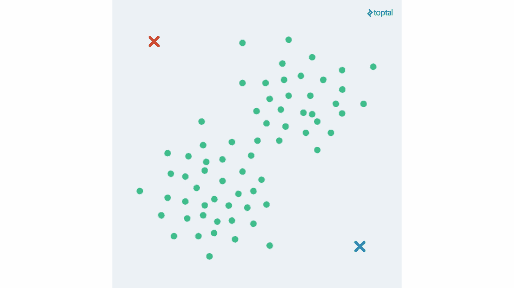
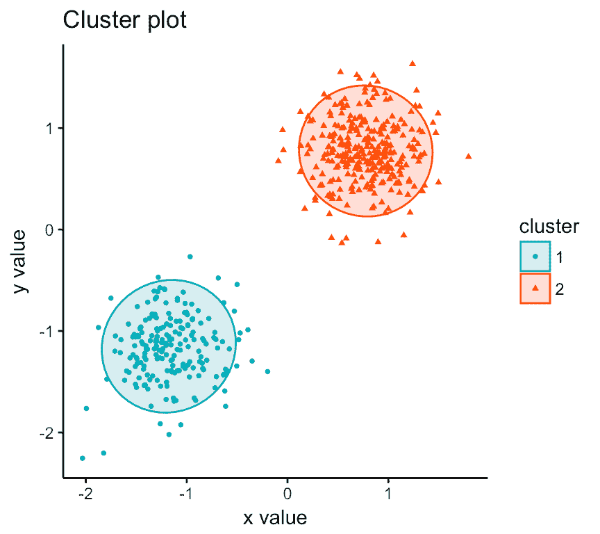
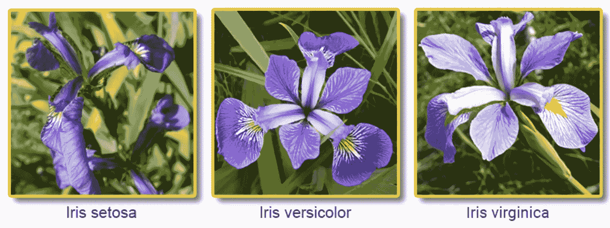
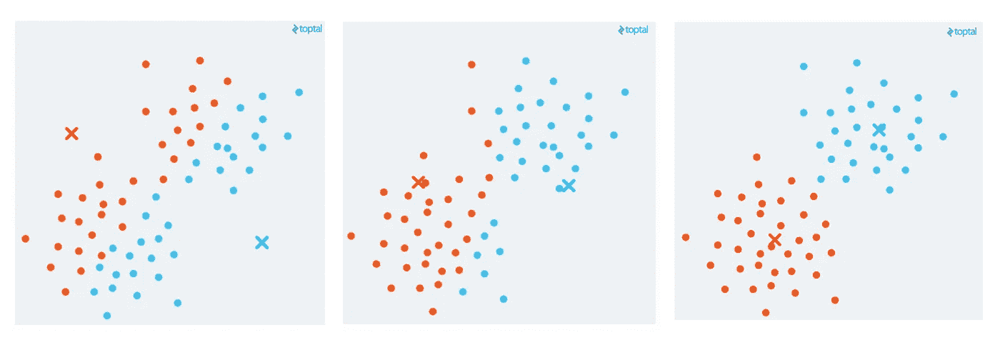
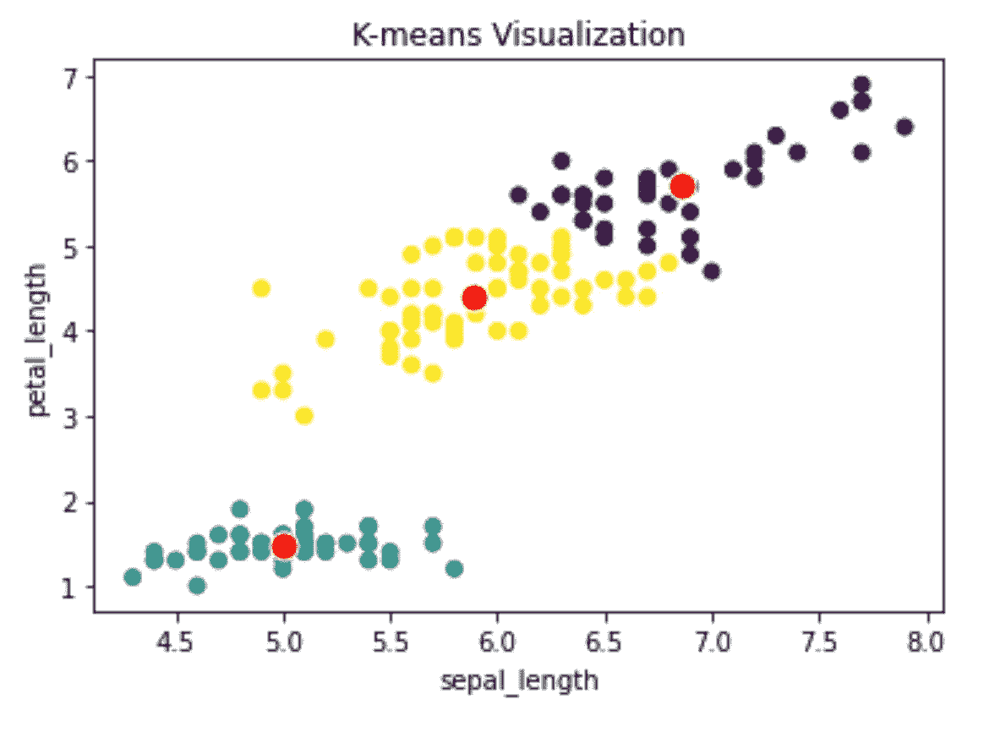

# k-均值聚类从零开始

> 原文：<https://pub.towardsai.net/k-means-clustering-from-scratch-4e357ac4716f?source=collection_archive---------1----------------------->

## [机器学习](https://towardsai.net/p/category/machine-learning)

## 从头开始实现，了解最强大的聚类算法之一！



K-Means 算法动画

大家好！

今天，让我们深入研究最著名的聚类算法:K-Means。

但是首先，什么是集群？聚类是一种将数据对象分成组的机器学习技术。

为了实现良好的聚类，我们需要两件事情:

1.  来自一个集群的对象彼此非常相似/接近(高**类内**相似度)
2.  集群确实不同于/远离其他集群(低**类间**相似性)。



良好聚类的示例

这里，聚类彼此远离(低**类间**相似性)，并且在每个聚类内，数据点接近(高**类内**相似性)。可以说是很好的聚类！

> 注意:像[K-最近邻](https://medium.com/k-nearest-neighbors-from-scratch-633dfbeac740)一样，K-Means 需要选择它的“K”个质心作为函数的输入。

在这篇文章中，我们将使用 *iris-dataset* ，因为它对于初学者和聚类问题来说是一个众所周知的数据集。

*iris 数据集*呈现了 3 种花:



虹膜数据集的三个种类

我们的目标是创建 3 个集群，每个物种一个。如果算法表现良好，它会将来自同一物种的花分组在一起。

然后，我们将能够通过让算法将新的数据点分配给其中一个簇来预测一种新的花的种类。

# **K 均值算法**

那么它是如何工作的呢？

K 均值算法(也称为劳埃德算法)由 3 个主要步骤组成:

*   将 *K* 形心放置在随机位置(这里 *K* =3)
*   将所有数据点分配到最近的质心(使用欧几里德距离)
*   计算新的质心作为聚类中所有点的平均值

一旦质心停止从一次迭代移动到另一次迭代(我们说算法收敛)，我们停止算法并返回每个数据点的指定聚类。

现在，让我们编码吧！

**1。在随机位置放置 K 个质心**

放置质心意味着创建一个新的数据点。一种简单的方法是选择数据集的一个随机点，并将质心放在同一个位置。

因此，我们可以创建一个空列表，并用与数据集中的随机点相同的信息存储我们的 *K* =3 个质心。

> 注意:这个函数是算法的第一步，只被调用一次。

**2。将所有数据点分配到最近的质心**

我们现在要比较每个点与 3 个质心的距离，并将数据点分配给最近的质心。

> 例如，更靠近质心 *K* =1 的所有点将被分配给聚类‘1’。

为此，我们为每个数据点创建一个列表(*dist _ point _ cluster*)来存储到 3 个质心的距离。

然后，使用 *argmin() NumPy* 函数，我们访问最近的质心并将其存储——即其编号 *K -* 到我们的*赋值*列表中。

一旦所有数据点都被分配到它们最近的聚类，我们返回*分配*列表，并且…步骤 2 完成！

**3。计算新的质心，作为集群中所有点的平均值**

要将我们的质心放在聚类的中心，我们必须计算聚类中所有数据点的平均值，并将质心放在这个位置。

渐渐地，这个函数会把我们的质心带到最终的聚类中间。



K-均值中连续迭代的可视化

> 注意:如果您觉得某些点不属于正确的聚类，请不要担心。我们使用所有特征来计算距离，但是在 2D 空间中绘制结果。这样我们就失去了信息，绘图也没有显示出对真实距离的准确估计。

新的质心等于分配给它们的所有数据点的平均值。

对于每个 *K* =3 个质心，我们遍历所有数据点并查看它们的聚类分配。如果它们属于我们在当前循环(I)中查看的 *K* 簇，我们将它们添加到 *pt_cluster* 列表中。然后， *K* =i 的新质心是 *pt_cluster 中数据点的平均值。*

我们的 *new_centroids()* 函数返回 K=3 *new_centroids 的列表。我们完成了第三步。*

太好了！

现在我们只需要运行算法，直到它收敛。

但是我们怎么知道它已经收敛了呢？两个选项:

1.  它达到最大迭代次数(定义为我们算法的输入)
2.  两次迭代之间的**误差**小于我们的容许水平(定义为我们算法的输入)

但是这里的错误是什么呢？在 K-means 中，误差是指数据点和质心之间的距离。

对于这个例子，我们选择我们的最大迭代次数， *max_iter* = 100，以及容差水平， *tol* = 0.001。

容差水平是两次连续迭代的误差平方和(SSE)之差。

如果质心移动不多，SSE 的差值将接近 0，如果小于 0.001，那么我们的算法已经收敛。我们可以停止执行并返回最终结果。

> 注:停止标准(或公差水平)定义如下:

```
**if** np.absolute(all_sse[it] - all_sse[it-1])/all_sse[it-1] <= tol
```

所以现在，我们有一个额外的步骤要做:创建一个为每次迭代返回 SSE 的函数。

**4。计算停止准则的误差平方和。**

为此，我们遍历每个数据点，并计算与其指定质心的距离(*即*误差)。我们将误差平方，并将其添加到*误差*列表中。通过对所有误差求和，我们得到 SSE。

就是这样！

我们现在可以在主 K-Means 函数中调用我们的 4 个函数。

我们可以返回函数的结果:

*   分配(每个数据点的聚类数列表- 0 到 2)
*   每个簇的质心
*   每次迭代的 SSE
*   迭代次数

k-均值主函数

您可以通过绘制由分类编号着色的质心和数据点来可视化您的结果。



搞定了。我们刚刚用 4 个简单的步骤实现了 K-Means 算法。

> 注意:完整的代码可以在我的 GitHub 上找到，[这里](https://github.com/Theob0t/Medium/blob/master/K-means-implementation.ipynb)。

如果你喜欢钻研最著名的聚类算法背后的数学，请随意查看我在[K-最近邻](https://medium.com/ai-in-plain-english/k-nearest-neighbors-from-scratch-633dfbeac740)上的帖子。

**感谢阅读！**