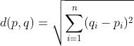
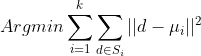

# k-均值聚类从零开始

> 原文：<https://pub.towardsai.net/k-means-clustering-from-scratch-efd629435987?source=collection_archive---------0----------------------->

## [机器学习](https://towardsai.net/p/category/machine-learning)

## NumPy 是你所需要的

在 [Unsplash](https://unsplash.com?utm_source=medium&utm_medium=referral) 上由[h·海尔林](https://unsplash.com/@heyerlein?utm_source=medium&utm_medium=referral)拍摄的照片

> 一个算法必须被看到才会被相信——唐纳德·克努特

# 概观

机器学习科学可以大致分为两类:

*   [监督学习](https://en.wikipedia.org/wiki/Supervised_learning)
*   [无监督学习](https://en.wikipedia.org/wiki/Unsupervised_learning)

在这篇博文中，我们将实现一个流行的无监督学习算法，k-means 聚类。

这种流行的算法使用数值距离度量将数据划分到聚类中。

# 算法

假设我们有一堆观察结果，我们想要将“相似的”观察结果分割在一起。我们将使用下面的算法来实现我们的目标。

## *K 均值算法*

*输入:k(聚类数)，D(数据点)*

1.  *选择随机 k 个数据点作为初始聚类均值*
2.  *将 D 中的每个数据点关联到最近的质心。
    这将把数据分成 k 个簇。*
3.  *重新计算质心*
4.  *重复步骤 2 和步骤 3，直到数据点的聚类成员不再有变化
    。*

让我们更详细地看看上面的算法。

我们首先将每个数据点随机分配给一个聚类。然后，我们计算每组聚类的均值。

之后，我们继续计算每个点和聚类平均值之间的平方[欧几里德距离](https://en.wikipedia.org/wiki/Euclidean_distance)。然后，我们根据数据点和每个聚类的聚类均值之间的最小平方欧几里德距离，为每个数据点分配一个聚类。

两点 p 和 q 之间的欧几里德距离([来源](https://arachnoid.com/latex/))

然后重新计算聚类平均值，我们继续根据平方欧几里德距离重新分配每个数据点，直到没有数据点的聚类分配发生变化。

如果你问一个统计学家，她/他可能会告诉你，我们正试图最小化**类内平方和(WCSS)。现在让我们试着用 Python 实现这个算法。**

类内平方和。([来源](https://arachnoid.com/latex/))

# 履行

尽管 Python 中有许多 k-means 算法的库实现，但为了提供一种有指导意义的方法，我决定只使用 Numpy。Numpy 是 Python 中用于数值计算的流行库。

## 代码走查

我们首先创建一个名为`Kmeans`的类，并向它传递一个构造函数参数`k`。这个参数是一个**超参数**。超参数是用户在训练机器学习算法之前设置的参数。在我们的例子中，这是我们希望将数据划分到的集群总数。我们还向构造函数添加了两个属性，`means`存储聚类的平均值，`_cluster_ids`存储聚类的 id 值。

然后我们创建一个名为`cluster_ids`的方法，作为集群 id 的 get 方法。`@property`是一个函数装饰器。要了解更多信息，请查看这篇文章。另一个叫做`_init_centroid`的方法被创建来**随机分配**每个数据点到一个集群。

`_cluster_means`计算我们聚类的平均值。它接受一个包含数据的 Numpy 数组和另一个将集群 id 作为输入的 Numpy 数组。我们使用一个临时数组`temp`来存储我们的特征和集群 id。然后，我们计算每个集群中每个数据点的平均值，并将其作为数组返回。

注意，可能有一些集群可能没有任何数据(因为我们最初是随机分配集群的)。因此，如果有一个没有数据的聚类，我们随机选择一个观察值作为该聚类的一部分。

`_compute_cluster`是确定哪个聚类的均值最接近数据点的方法。`np.linalg.norm()`方法计算**欧几里德距离**。我们对此求平方以获得**类内平方和。**

最后，我们创建了协调集群过程的 fit 方法。

`fit()`方法中的步骤:

1.  我们首先将每个观察初始化为一个集群。我们还创建了一个零数组来存储新的集群 id。
2.  然后，我们使用函数`itertools.count()`创建一个无限循环，并计算聚类平均值。
3.  然后，我们根据聚类平均值和每个数据点之间的平方距离分配新的聚类 id。
4.  然后，我们检查是否有任何数据点改变了聚类。如果是，那么我们使用新的聚类 id 来重新计算聚类均值。
5.  重复步骤 2 到 4，直到没有数据点改变聚类。

好了，伙计们！您已经成功创建了自己的能够对数据进行聚类的 k 均值聚类类。以下是几个数据集的一些结果:

## 形象化

# 选择 k 的值

由于 k 是一个超参数，我们必须有一些方法来选择 k 的最佳值。一个流行的方法是[肘方法](https://en.wikipedia.org/wiki/Elbow_method_(clustering)#:~:text=In%20cluster%20analysis%2C%20the%20elbow,number%20of%20clusters%20to%20use.)。

简而言之，肘法绘制了一条聚类数相对于解释变异百分比的曲线。通过遵循收益递减的[定律，由肘方法产生的曲线被从业者用来确定最优的集群数量。](https://en.wikipedia.org/wiki/Diminishing_returns)

如果添加一个额外的聚类没有显著改善 k 的变化，我们选择坚持当前的聚类数。

# 提示和优化

以下是一些确保获得良好聚类的技巧:

1.  **删除非数字特征** :
    数据可能有表示为数字特征的非数字(分类)特征。这些数字并不具有一定的数量价值，它们可能被用作一个群体的标签。例如，如果我们正在处理一个人口数据集，一个名为“性别”的列可能具有代表男性和女性的值 0 和 1。我们必须小心移除这些特征，因为它们没有任何量化值，因此会扭曲我们算法的“距离”概念。
2.  **特征缩放:** 数值型数据会有不同的范围。具有巨大范围的特定特征可能对我们的聚类目标函数产生不利影响。与其他要素相比，具有较大范围值的要素将在聚类过程中占据主导地位。因此，对我们的数据进行缩放至关重要，以便每个特征的贡献与算法成比例。
3.  **更好的初始化:** 在我们的算法中，我们将初始聚类随机分配给数据。由于这种固有的随机性，我们的算法可能不总是提供好的聚类。有几种方法可以改进设置初始聚类的标准。对于这个任务， [k-means++算法是一个流行的选择。](https://en.wikipedia.org/wiki/K-means%2B%2B)
4.  **不同的算法:** 有一些算法是 k-means 算法的变体，它们在处理诸如异常值之类的某些约束时更健壮。一个这样的算法是 [k-medoids](https://en.wikipedia.org/wiki/K-medoids) 。k-medoids 算法使用 [L1 距离](https://en.wikipedia.org/wiki/Taxicab_geometry)而不是 L2 距离(欧几里德距离)。有许多其他的聚类算法对于特定的应用是有用的，例如层次聚类、基于密度的聚类、模糊聚类等。

# 结论

我希望你们都喜欢这篇博文。更多关于数据科学的文章，请查看我在 medium 上的其他帖子。请随时在 [LinkedIn](https://www.linkedin.com/in/sayarbanerjee/) 上与我联系。这篇博文的代码在我的 [Github](https://github.com/Sayar1106/TowardsDataSciencecodefiles/blob/master/Kmeansfromscratch/kmeans.py) 上。

# 参考

 [## 7.数据集加载实用程序-sci kit-了解 0.23.1 文档

### sklearn.datasets 包嵌入了一些小的玩具数据集，如入门部分所介绍的。这个包裹…

scikit-learn.org](https://scikit-learn.org/stable/datasets/index.html#datasets)  [## k 均值聚类

### k-means 聚类是一种矢量量化的方法，它起源于信号处理，目的是划分 n。

en.wikipedia.org](https://en.wikipedia.org/wiki/K-means_clustering)  [## 从头开始的数据科学，第二版

### 要真正学习数据科学，你不仅要掌握工具——数据科学库、框架、模块和…

www.oreilly.com](https://www.oreilly.com/library/view/data-science-from/9781492041122/)