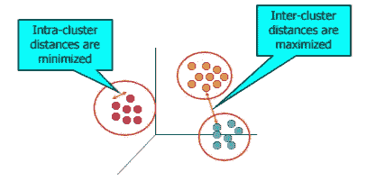
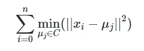
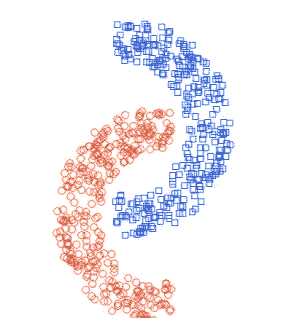
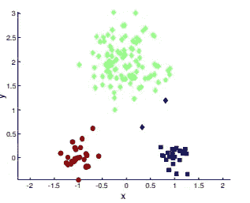
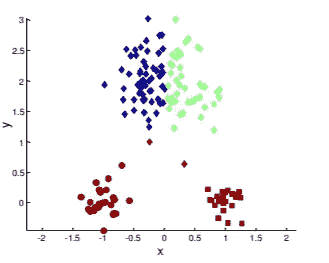
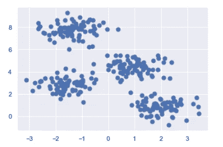
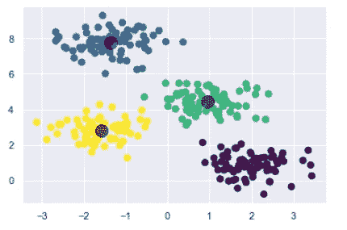

# 简而言之，k-均值聚类

> 原文：<https://pub.towardsai.net/k-means-clustering-in-a-nutshell-26b0ca9b9ef1?source=collection_archive---------1----------------------->


Raj shri bharat KS 在 [Unsplash](https://unsplash.com?utm_source=medium&utm_medium=referral) 上拍摄的照片

## [机器学习](https://towardsai.net/p/category/machine-learning)

## 最简单的聚类算法

K-means 是一个 ***无监督聚类*** 机器学习模型。
在*无监督学习*中，数据集不包含用于训练数据的*目标*值。*聚类*是一种将相似数据点分组的技术。因此，当我们没有目标变量时，以及当机器问题是分组相似的数据时，使用 K-means。

这可以通过聚类来实现，使得同一聚类中的点之间的距离，称为**聚类内距离**最小*，而不同聚类中的点之间的距离，称为**聚类间距离**最大*。**

****

**集群内距离和集群间距离**

****在本文中，我们将深入了解 K-means 及其变体，并通过一个例子来展示它。****

**文章的流程如下**

1.  **K-means 的目标**
2.  **K-means 背后的算法**
3.  **K 均值的局限性**
4.  **k-表示++的意思**
5.  **k-水母类**
6.  **履行**

**让我们开始吧！**

# **K-means 的目标**

**K-means 算法将一组 *X* 的 *N* 个样本分成 *K* 个不相交的聚类 *C* ，每个聚类由样本的*均值μⱼ* 来描述。这些平均值通常被称为簇“*质心*”；注意，一般来说，它们不是来自 *X* 的点，尽管它们生活在同一个空间。**

**K-means 算法旨在选择最小化**惯性**或**组内平方和标准**的质心:**

****

**K-均值的目标函数**

# **K-means 背后的算法**

**使用劳埃德算法解决 k-means 问题。它包括以下步骤**

****步骤 1:初始化**
我们从给定的数据集中随机选择 K 个点作为 K 个质心**

****步骤 2:赋值**
基于步骤 1 中的质心，我们将数据点分组为簇。对于数据集中的每个点，我们将该点分组到聚类中，聚类的质心与数据点的距离最小**

****步骤 3:更新**
根据步骤 2 中获得的聚类数据点，我们计算质心并用这个新值更新质心**

****第四步:迭代和终止** 迭代第二步和第三步，直到质心收敛，即在一次迭代中质心不变时终止**

# ***K 均值的局限性:***

*   **K-means 在异构集群(即*不同大小和密度*的集群)方面存在问题。并且还具有*非球形*(非凸形)结构**

****

**非球状结构**

*   **k 均值*受到异常值*的严重影响**
*   **质心聚类*不可解释*。为了克服这个问题，我们使用了 K-means 的一个小变体，称为 **K-Medoids****
*   **K-means 对初始化敏感。当我们遇到如下图所示的聚类问题时。我们期望该算法将所有绿色数据点聚类成单个聚类，所有蓝色数据点聚类成单个聚类，所有红色数据点聚类成单个聚类。**

**********

理想聚类、最优聚类、次优聚类** 

**尽管我们使用相同的超参数 K 来执行 K-means，但是我们有相等的概率得到完全不同的中心和最右边的结果**

**为了避免这样的聚类结果，我们使用 K-means++算法。**

# ****K-means++****

**K-means 算法和 K-means++算法的区别在于，我们聪明地选择质心，而不是随机初始化质心。**

****第一步:初始化**
我们从给定的数据集中随机选择一个数据点作为质心。然后，对于每个数据点，我们计算最近的质心(第一次迭代中的唯一质心)之间的距离，比方说“d”，并以与该距离 d 成比例的概率选取更多的质心，迭代直到我们得到 K 个质心。**

****步骤 2:赋值**
基于步骤 1 中的质心，我们将数据点分组为簇。对于数据集中的每个点，我们将该点分组到聚类中，聚类的质心与数据点的距离最小。**

****步骤 3:更新**
根据步骤 2 中获得的聚类数据点，我们计算质心并用这个新值更新质心。**

****第四步:迭代和终止** 迭代第二步和第三步，直到质心收敛，即在一次迭代中质心不变时终止。**

# **k-水母类**

**K-means 算法和 K-medoids 算法之间的区别在于，我们没有使用来自空间中所有点的集合的质心，而是添加了质心必须属于数据集的条件。因此，通过观察质心，即数据集中的数据点，我们可以解释结果。实施 K-Medoids 涉及的步骤如下:**

****第一步:初始化**
我们从给定的数据集中随机选取一个数据点作为质心。然后，对于每个数据点，我们计算最近的质心(第一次迭代中的唯一质心)之间的距离，比方说“d”，并以与该距离 d 成比例的概率选取更多的质心，迭代直到我们得到 K 个质心。**

****第二步:赋值**
基于第一步中的质心，我们将数据点分组。对于数据集中的每个点，我们将该点分组到聚类中，该聚类的质心距离数据点的距离最小(这些质心称为**质心**)**

****步骤 3:更新** *用非 medoid 数据点交换每个簇的* medoid。计算损失，如果损失增加，取消互换。**

****步骤 4:迭代和终止** 对所有聚类中的所有数据点重复步骤 3。**

# **K-means 的实现**

**让我们通过可视化来理解结果。创建具有四个聚类的数据集。**

```
**from sklearn.datasets.samples_generator import make_blobs
X, y_true = make_blobs(n_samples=300, centers=4,
                       cluster_std=0.60, random_state=0)
plt.scatter(X[:, 0], X[:, 1], s=50)**
```

****

**原始资料**

**在任何数据集上应用 K-means 只是一行代码。感谢 Sklearn！**

```
**from sklearn.cluster import KMeans
kmeans = KMeans(n_clusters=4)
kmeans.fit(X)
y_kmeans = kmeans.predict(X)**
```

**让我们绘制应用 K-均值后的结果。**

```
**plt.scatter(X[:, 0], X[:, 1], c=y_kmeans, s=50, cmap='viridis')centers = kmeans.cluster_centers_
plt.scatter(centers[:, 0], centers[:, 1], c='black', s=200, alpha=0.5)**
```

****

**聚类数据集**

**在上面的图中，黄色、绿色、蓝色、紫色中的每个点都被分成相应的组，每个组中的深色大点是该组的质心。**

# **优势:**

1.  **平均复杂度由 O(k n T)给出，其中 n 是样本数，T 是迭代次数。实际上，k-means 算法非常快(目前最快的聚类算法之一)**
2.  **该算法易于理解**
3.  **它可以很好地扩展到大量的样本**

# **应用:**

*   **图象分割法**
*   **通过聚类相似的数据，手动标记这些数据点所需的时间和精力可以大大减少**
*   **大型数据集概述**
*   **对相关问题进行分组，例如对相似的客户进行分组，对相关的文档进行分组，对具有相似波动的股票进行分组**

**谢谢你的阅读。以后我会写更多初学者友好的帖子。请在[媒体](https://medium.com/@ramyavidiyala)上关注我，以便了解他们。我欢迎反馈，可以通过 Twitter [ramya_vidiyala](https://twitter.com/ramya_vidiyala) 和 LinkedIn [RamyaVidiyala](https://www.linkedin.com/in/ramya-vidiyala-308ba6139/) 联系我。快乐学习！**