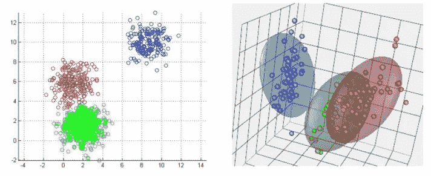
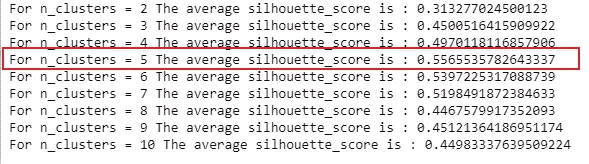
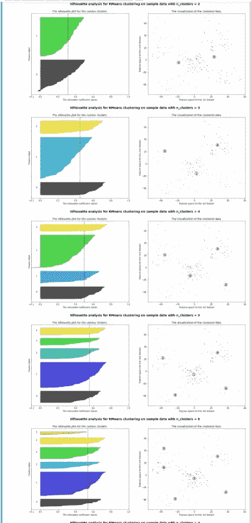
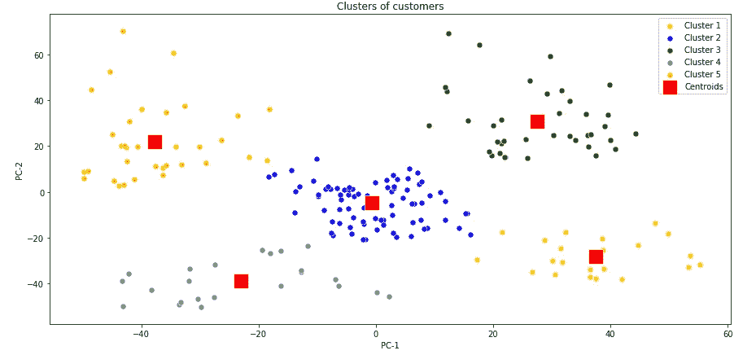
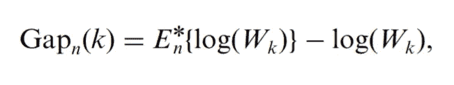
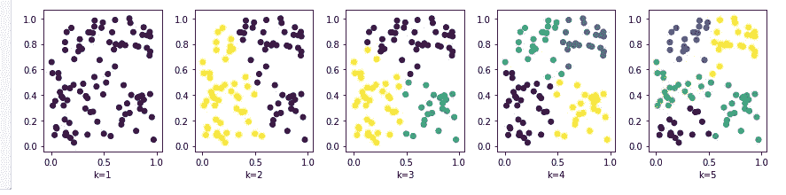
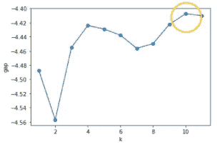
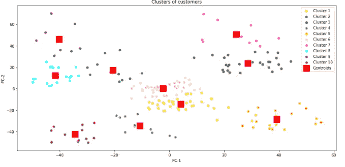
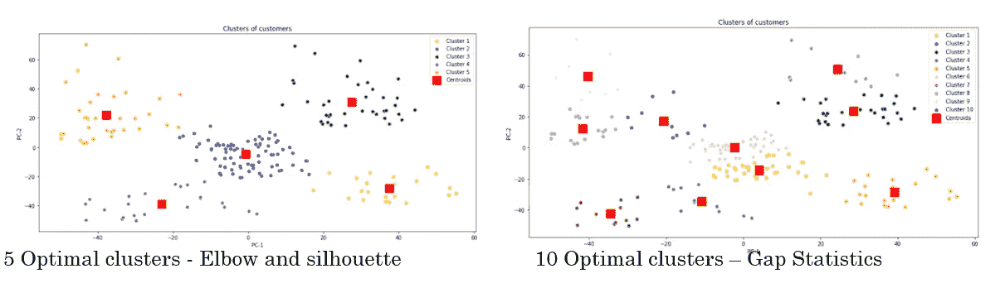

# k-均值聚类:寻找最佳聚类的技术

> 原文：<https://pub.towardsai.net/k-means-clustering-techniques-to-find-the-optimal-clusters-7eea5431a4fb?source=collection_archive---------0----------------------->

## [机器学习](https://towardsai.net/p/category/machine-learning)

## 使用肘方法、轮廓评分和间隙统计在 K-Means 聚类中查找最佳聚类。

在本文中，您将了解

*   什么是 K-Means 聚类？
*   K-Means 是如何工作的？
*   K-均值聚类的应用
*   K-Means 聚类在 Python 中的实现
*   使用肘方法、轮廓分数和间隙统计寻找最佳聚类


作者图片

> K-Means 聚类是一种简单、流行但功能强大的无监督机器学习算法。**一种迭代算法，为一个未标记的数据集寻找具有相似特征的数据组，并将其分成簇**。

**K-Means 算法旨在根据定义的聚类数 K 获得内聚的聚类。它通过最小化**总的类内变化(称为**类内平方和** (WCSS)来创建内聚的紧凑聚类。

K-Means 算法**从随机选择的指定簇数的质心**开始。质心是群集的中心。必须有策略地选择**质心**，因为不同的位置会产生不同的结果。

然后**算法通过将每个数据点分配给一个聚类，基于它与所有其他聚类相比与特定聚类的接近程度，迭代地改进质心位置**。数据点与质心的接近程度基于它们的欧几里德平方距离。

K-Means 聚类可以使用以下任何一种距离度量

*   欧几里得距离
*   曼哈顿距离
*   平方欧几里得距离
*   余弦距离



资料来源:https://stanford.edu/~cpiech/cs221/handouts/kmeans.html

一旦所有的数据点都被分配到一个聚类中，计算新的质心并将其放入每个聚类中。基于新的质心，根据其与质心的接近程度，查找是否需要将任何数据点重新分配给新的聚类。

**K-Means 通过在**之间交替来迭代地寻找一个聚类的最佳质心

*   **根据数据点与当前质心的接近程度将数据点分配给聚类，以及**
*   **基于数据点到聚类的当前分配重新计算质心。**

当出现以下情况时，K-Means 算法会停止聚类优化

*   **当聚类的数据点不再变化时，聚类质心已经稳定，或者**
*   **算法已经完成了指定次数的迭代。**

k-均值算法用于

*   **像欺诈检测一样的异常检测**
*   **分割像客户分割、图像分割**
*   **数据挖掘**

## **K-Means 的实现**

[商城客户数据集](https://www.kaggle.com/shwetabh123/mall-customers)

读取数据框中的 CSV 文件，将分类变量转换为数值数据类型，然后使用 PCA(主成分分析)降低维度

```
# Import the required libraries
**import numpy as np 
import pandas as pd 
import matplotlib.pyplot as plt
import seaborn as sns
from sklearn.cluster import KMeans
from sklearn.preprocessing import LabelBinarizer
from sklearn.decomposition import PCA**# Read he dataset into a dataframe
**dataset = pd.read_csv('Mall_Customers.csv',index_col='CustomerID')**# Drop duplicates
**dataset.drop_duplicates(inplace=True)**# Converting categorical column Genre to onehot vector
**label_binarizer = LabelBinarizer()**

#use LabelBinarizer for gender
**label_binarizer_output = label_binarizer.fit_transform( dataset['Genre'])**#Adding the categorical and the main dataframe into one dataframe
**result_df = pd.DataFrame(label_binarizer_output, columns=['Gender_1'])
dataset_1= pd.concat([dataset, result_df], axis=1, join='inner')**# Creating the input variable
**X= dataset_1.iloc[:, [1,2,3,4]].values**# reducing the input dimension using PCA
**reduced_data = PCA(n_components=2).fit_transform(X)**
```

当我们运行 KMeans 时，我们需要提供 **n_clusters，它表示要形成的最佳聚类数**和要为数据集生成的质心数。

```
**kmeans = KMeans(init="k-means++", n_clusters=5, n_init=4)
kmeans.fit(X)**
```

***寻找最优聚类的最好方法是什么？***

对于 KMeans 聚类算法，有 3 种常用的方法来查找最佳聚类。

## **肘法**

在肘方法中，对不同数量的聚类运行 K-Means 算法，以找到每个数据点到聚类质心的平方和，也称为**聚类内平方和。**

绘制 WCSS 以及 K 个簇的数量。**在 WCSS 开始变平或突然下降的图上拾取 K 值，再增加一个集群也没有明显改善，形成一个弯头**。肘形被认为是数据集最佳聚类的指示符。

```
# Using the elbow method to find the optimal number of clusters
**max_k=11** # max no. of clusters to be evaluated
**wcss = []
for i in range(1, max_k):
    kmeans = KMeans(n_clusters = i, init = 'k-means++', random_state = 42)
    kmeans.fit(reduced_data)**
    # inertia method returns wcss for that model
    **wcss.append(kmeans.inertia_)**#plotting the data 
**plt.figure(figsize=(5,3))
sns.lineplot(range(1, max_k), wcss,marker='o',color='red')
plt.title('The Elbow Method')
plt.xlabel('Number of clusters')
plt.ylabel('WCSS')
plt.show()**
```


肘形法-圆圈显示数据集的最佳聚类数。

## **剪影评分**

**侧影得分是检查聚类紧密度的另一个指标，以确定聚类是否良好**。

轮廓分数**像肘方法一样计算平均聚类内距离**以及平均最近聚类。这表示与所有其他聚类质心相比，数据点与其自己的聚类有多相似。因此，**轮廓分数测量同一个聚类的紧密度和同其他聚类的分离度**。

**如果所有数据点的轮廓得分的值相当高，则给出聚类的最佳值**。剪影得分使用闵可夫斯基距离或欧几里德距离，其值的范围为[-1，1]

以下代码改编自[https://sci kit-learn . org/stable/auto _ examples/cluster/plot _ k means _ silhouette _ analysis . html #](https://scikit-learn.org/stable/auto_examples/cluster/plot_kmeans_silhouette_analysis.html#)

代码被修改以使用通过 PCA 减少的数据维度

```
**from sklearn.metrics import silhouette_samples, silhouette_score
import matplotlib.cm as cm
for n_clusters in range(2, max_k):**
    # Create a subplot with 1 row and 2 columns
    **fig, (ax1, ax2) = plt.subplots(1, 2)
    fig.set_size_inches(18, 7)**# The 1st subplot is the silhouette plot
    # The silhouette coefficient can range from -1, 1 but in this example all
    # lie within [-0.1, 1]
    **ax1.set_xlim([-0.1, 1])**
    # The (n_clusters+1)*10 is for inserting blank space between silhouette
    # plots of individual clusters, to demarcate them clearly.
    **ax1.set_ylim([0, len(reduced_data) + (n_clusters + 1) * 10])**# Initialize the clusterer with n_clusters value and a random generator
    # seed of 10 for reproducibility.
    **clusterer = KMeans(n_clusters=n_clusters, random_state=10)
    cluster_labels = clusterer.fit_predict(reduced_data)**# The silhouette_score gives the average value for all the samples.
    # This gives a perspective into the density and separation of the formed
    # clusters
    **silhouette_avg = silhouette_score(reduced_data, cluster_labels)**
   ** print("For n_clusters =", n_clusters,"The average silhouette_score is :", silhouette_avg)**# Compute the silhouette scores for each sample
    **sample_silhouette_values = silhouette_samples(reduced_data, cluster_labels)****y_lower = 10**
    **for i in range(n_clusters):**
        # Aggregate the silhouette scores for samples belonging to
        # cluster i, and sort them
        **ith_cluster_silhouette_values = \
            sample_silhouette_values[cluster_labels == i]****ith_cluster_silhouette_values.sort()****size_cluster_i = ith_cluster_silhouette_values.shape[0]
        y_upper = y_lower + size_cluster_i****color = cm.nipy_spectral(float(i) / n_clusters)
        ax1.fill_betweenx(np.arange(y_lower, y_upper),
                          0, ith_cluster_silhouette_values,
                          facecolor=color, edgecolor=color, alpha=0.7)**# Label the silhouette plots with their cluster numbers at the middle
       ** ax1.text(-0.05, y_lower + 0.5 * size_cluster_i, str(i))**# Compute the new y_lower for next plot
      **  y_lower = y_upper + 10**  # 10 for the 0 samples**ax1.set_title("The silhouette plot for the various clusters.")
    ax1.set_xlabel("The silhouette coefficient values")
    ax1.set_ylabel("Cluster label")**# The vertical line for average silhouette score of all the values
   ** ax1.axvline(x=silhouette_avg, color="red", linestyle="--")****ax1.set_yticks([])  # Clear the yaxis labels / ticks
    ax1.set_xticks([-0.1, 0, 0.2, 0.4, 0.6, 0.8, 1])**# 2nd Plot showing the actual clusters formed
    **colors = cm.nipy_spectral(cluster_labels.astype(float) / n_clusters)
    ax2.scatter(reduced_data[:, 0], reduced_data[:, 1], marker='.', s=30, lw=0, alpha=0.7,
                c=colors, edgecolor='k')**# Labeling the clusters
   ** centers = clusterer.cluster_centers_**
    # Draw white circles at cluster centers
   ** ax2.scatter(centers[:, 0], centers[:, 1], marker='o',
                c="white", alpha=1, s=200, edgecolor='k')****for i, c in enumerate(centers):
        ax2.scatter(c[0], c[1], marker='$%d$' % i, alpha=1,
                    s=50, edgecolor='k')****ax2.set_title("The visualization of the clustered data.")
    ax2.set_xlabel("Feature space for the 1st feature")
    ax2.set_ylabel("Feature space for the 2nd feature")****plt.suptitle(("Silhouette analysis for KMeans clustering on sample data "
                  "with n_clusters = %d" % n_clusters),
                 fontsize=14, fontweight='bold')****plt.show()**
```



轮廓分数-显示 5 是聚类的最佳数量

侧影图推断，对于给定的数据，5 是最佳聚类的良好选择。通过存在具有高于平均轮廓分数的聚类和轮廓图大小的适当波动来评估最佳聚类。



***肘法和剪影评分均给出最优聚类为 5***

以最佳分类为 5 运行 KMeans，然后在 reduced_data 上使用最佳分类绘制散点图，以可视化分类

```
# Fitting K-Means to the dataset
**kmeans = KMeans(n_clusters = 5, init = 'k-means++', random_state = 42)
y_kmeans = kmeans.fit_predict(reduced_data)**#Visualising the clusters
**plt.figure(figsize=(15,7))
sns.scatterplot(reduced_data[y_kmeans == 0, 0], reduced_data[y_kmeans == 0, 1], color = 'yellow', label = 'Cluster 1',s=50)
sns.scatterplot(reduced_data[y_kmeans == 1, 0], reduced_data[y_kmeans == 1, 1], color = 'blue', label = 'Cluster 2',s=50)
sns.scatterplot(reduced_data[y_kmeans == 2, 0], reduced_data[y_kmeans == 2, 1], color = 'green', label = 'Cluster 3',s=50)
sns.scatterplot(reduced_data[y_kmeans == 3, 0], reduced_data[y_kmeans == 3, 1], color = 'grey', label = 'Cluster 4',s=50)
sns.scatterplot(reduced_data[y_kmeans == 4, 0], reduced_data[y_kmeans == 4, 1], color = 'orange', label = 'Cluster 5',s=50)****sns.scatterplot(kmeans.cluster_centers_[:, 0], kmeans.cluster_centers_[:, 1], color = 'red', 
                label = 'Centroids',s=300,marker=',')
plt.grid(False)
plt.title('Clusters of customers')
plt.xlabel('PC-1')
plt.ylabel('PC-2')
plt.legend()
plt.show()**
```



## **差距统计**

间隙统计是另一种确定最佳聚类数的流行技术，可以应用于任何聚类方法。

**差距统计的概念是将数据上的聚类惯性与其在适当的空参考数据集下的期望值进行比较。**零参考数据集可以从正态分布或均匀分布中采样。**K 的最佳选择是使数据集的类内惯性和空引用数据集之间的差距统计最大化的值。**



来源:[https://statweb.stanford.edu/~gwalther/gap](https://statweb.stanford.edu/~gwalther/gap)

**以下代码灵感来源于[https://glowingpython . blogspot . com/2019/01/a-visual-introduction-to-gap-statistics . html](https://glowingpython.blogspot.com/2019/01/a-visual-introduction-to-gap-statistics.html)**

**空引用数据集是一组均匀分布的点**

```
**from sklearn.datasets import make_blobs
from sklearn.metrics import pairwise_distances**# creating a uniform distributed null refernced dataset
**reference = np.random.rand(100, 2)
plt.figure(figsize=(12, 3))
for k in range(1,6):
    kmeans = KMeans(n_clusters=k)
    a = kmeans.fit_predict(reference)
    plt.subplot(1,5,k)
    plt.scatter(reference[:, 0], reference[:, 1], c=a)
    plt.xlabel('k='+str(k))
plt.tight_layout()
plt.show()**
```

**由于这些点是均匀分布的，KMeans 算法会将这些点均匀地分成 K 个聚类，即使它们之间没有分离**

****

**使用 KMeans 聚集的空引用统一分布数据集**

```
**def compute_inertia(a, X):
    W = [np.mean(pairwise_distances(X[a == c, :])) for c in np.unique(a)]
    return np.mean(W)****def compute_gap(clustering, data, k_max=5, n_references=5):
    if len(data.shape) == 1:
        data = data.reshape(-1, 1)**
    # The Null Reference dataset that is uniformly distributed
   ** reference = np.random.rand(*data.shape)
    reference_inertia = []**

    # Calculate the WCSS for the null refrenced data
   **for k in range(1, k_max+1):
        local_inertia = []
        for _ in range(n_references):
            clustering.n_clusters = k
            assignments = clustering.fit_predict(reference)
            local_inertia.append(compute_inertia(assignments, reference))
        reference_inertia.append(np.mean(local_inertia))** 
    # Calculate the WCSS for the data
    **ondata_inertia = []
    for k in range(1, k_max+1):
        clustering.n_clusters = k
        assignments = clustering.fit_predict(data)
        ondata_inertia.append(compute_inertia(assignments, data))**

    # Calculate the gao statistics between the WCSS for the null referenced data and the WCSS for the data
   ** gap = np.log(reference_inertia)-np.log(ondata_inertia)
    return gap, np.log(reference_inertia), np.log(ondata_inertia)** **gap, reference_inertia, ondata_inertia = compute_gap(KMeans(), reduced_data, k_max)**
**plt.plot(range(1, k_max+1), gap, '-o')
plt.ylabel('gap')
plt.xlabel('k')**
```

****

**间隙统计根据数据上的**群集惯性和空参考数据之间的最大间隙，给出群集的最佳数量为 10。****

**对 10 个分类运行 KMeans，然后在散点图中显示这些分类。**

```
# Visualising the clusters
**plt.figure(figsize=(15,7))
sns.scatterplot(reduced_data[y_kmeans == 0, 0], reduced_data[y_kmeans == 0, 1], color = 'yellow', label = 'Cluster 1',s=50)
sns.scatterplot(reduced_data[y_kmeans == 1, 0], reduced_data[y_kmeans == 1, 1], color = 'blue', label = 'Cluster 2',s=50)
sns.scatterplot(reduced_data[y_kmeans == 2, 0], reduced_data[y_kmeans == 2, 1], color = 'green', label = 'Cluster 3',s=50)
sns.scatterplot(reduced_data[y_kmeans == 3, 0], reduced_data[y_kmeans == 3, 1], color = 'grey', label = 'Cluster 4',s=50)
sns.scatterplot(reduced_data[y_kmeans == 4, 0], reduced_data[y_kmeans == 4, 1], color = 'orange', label = 'Cluster 5',s=50)
sns.scatterplot(reduced_data[y_kmeans == 5, 0], reduced_data[y_kmeans == 5, 1], color = 'pink', label = 'Cluster 6',s=50)
sns.scatterplot(reduced_data[y_kmeans == 6, 0], reduced_data[y_kmeans == 6, 1], color = 'magenta', label = 'Cluster 7',s=50)
sns.scatterplot(reduced_data[y_kmeans == 7, 0], reduced_data[y_kmeans == 7, 1], color = 'cyan', label = 'Cluster 8',s=50)
sns.scatterplot(reduced_data[y_kmeans == 8, 0], reduced_data[y_kmeans == 8, 1], color = 'purple', label = 'Cluster 9',s=50)
sns.scatterplot(reduced_data[y_kmeans == 9, 0], reduced_data[y_kmeans == 9, 1], color = 'brown', label = 'Cluster 10',s=50)
sns.scatterplot(kmeans.cluster_centers_[:, 0], kmeans.cluster_centers_[:, 1], color = 'red', 
                label = 'Centroids',s=300,marker=',')
plt.grid(False)
plt.title('Clusters of customers')
plt.xlabel('PC-1')
plt.ylabel('PC-2')
plt.legend()
plt.show()**
```

********

## **结论:**

**k-均值聚类是一种**

*   ****一种无监督的机器学习算法****
*   ****为无标签数据集寻找具有相似特征的数据组的迭代算法****

**确定最佳聚类的常用技术**

*   ****肘形法**:WCSS 突然开始变平再加一簇也没有明显改善，形成肘形。**
*   ****轮廓得分**:测量同一个聚类的紧密度和与其他聚类的分离度**
*   ****差距统计:**数据集和空引用数据集的类内惯性的最大差距是均匀分布的。**

## **参考资料:**

**【https://stanford.edu/~cpiech/cs221/handouts/kmeans.html **

**[](https://docs.microsoft.com/en-us/azure/machine-learning/algorithm-module-reference/k-means-clustering) [## K-Means 聚类:模块参考- Azure 机器学习

### 本文描述了如何使用 Azure 机器学习设计器中的 K-Means 聚类模块来创建一个

docs.microsoft.com](https://docs.microsoft.com/en-us/azure/machine-learning/algorithm-module-reference/k-means-clustering) 

[https://arxiv.org/ftp/arxiv/papers/1912/1912.00643.pdf](https://arxiv.org/ftp/arxiv/papers/1912/1912.00643.pdf)

[](https://scikit-learn.org/stable/auto_examples/cluster/plot_kmeans_silhouette_analysis.html) [## 在 KMeans clustering - scikit-learn 上使用剪影分析选择聚类数…

### 剪影分析可用于研究所得聚类之间的分离距离。剪影情节…

scikit-learn.org](https://scikit-learn.org/stable/auto_examples/cluster/plot_kmeans_silhouette_analysis.html) 

[r . TiB shirani、G. Walther 和 T. Hastie(斯坦福大学，2001 年)](https://statweb.stanford.edu/~gwalther/gap)通过 gap statistics 估计数据集中的聚类数。

[https://glowingpython . blogspot . com/2019/01/a-visual-introduction-to-gap-statistics . html](https://glowingpython.blogspot.com/2019/01/a-visual-introduction-to-gap-statistics.html)**