# k-均值简化

> 原文：<https://pub.towardsai.net/k-means-simplified-68cd6f8b19a8?source=collection_archive---------4----------------------->

## [数据科学](https://towardsai.net/p/category/data-science)，[机器学习](https://towardsai.net/p/category/machine-learning)

## K-均值聚类简介及数值例子

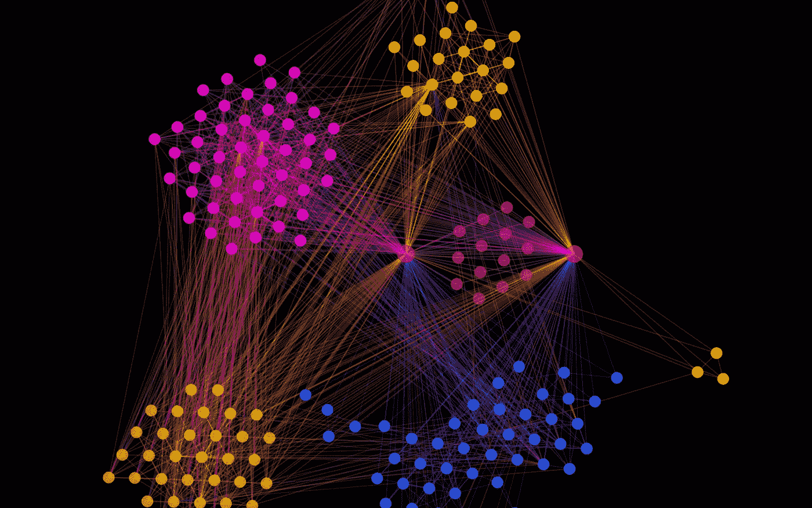

来源:[http://graph alchem . github . io/Alchemy/images/features/cluster _ team . png](http://graphalchemist.github.io/Alchemy/images/features/cluster_team.png)

# 什么是集群？

聚类是将一组数据对象(或观察值)分组为子集的过程。每个子集是一个集群，使得集群中的对象彼此相似，但不同于其他集群中的对象。聚类通常用于研究数据集，以识别其中的潜在模式或创建一组特征。

聚类有时被称为自动分类。因为群集是同一群集内彼此相似而与其他群集中的数据不相似的一组数据，所以数据群集可被视为隐式类。这里的区别在于聚类可以自动找到分组。这是集群的一个明显优势。

聚类已经被广泛应用于许多应用中，其中之一就是商业智能。在商业智能中，聚类可用于将大量客户组织成组，其中组内的客户具有非常相似的特征。通过这样做，可以更容易地为增强客户关系管理制定商业策略。

在这种情况下，不同的聚类方法可以在同一数据集上生成不同的聚类。分组不是由人执行的，而是由聚类算法如 K-means 执行的。因此，聚类是有用的，因为它可以发现数据中以前未知的组。

# 什么是 K-means？

K-means 是一种用于执行聚类的众所周知的算法。k-means 的思想是我们假设在我们的数据集中有 k 个组。然后，我们尝试将数据分成这 k 个组。每个组由一个称为质心的点来描述。聚类的质心是该聚类内的点的平均值。

# K-means 实际上是如何工作的？

首先，它随机创建 k 个质心，其中 k 是我们的目标集群的编号。基于样本和聚类质心之间的欧几里德距离，将每个样本分配给与其最相似的聚类。然后，它使用指定样本的平均值更新每个质心。然后使用更新后的质心重新分配所有样本。迭代继续进行，直到赋值稳定，或者新赋值和前一个迭代赋值之间没有差别。k-means 过程总结如下:

1.  选择 k 个簇的数量。
2.  初始化 k 个质心。
3.  根据欧氏距离将每个样本分配到最近的质心。
4.  使用指定样本的平均值更新每个聚类的新质心。
5.  将每个样本重新分配给新的质心。如果发生了任何重新分配，重复步骤 4，否则停止迭代。

# 例子

这是一个包含 10 个样本的虚拟数据集:

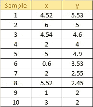

照片作者:我

使用散点图绘制数据集:

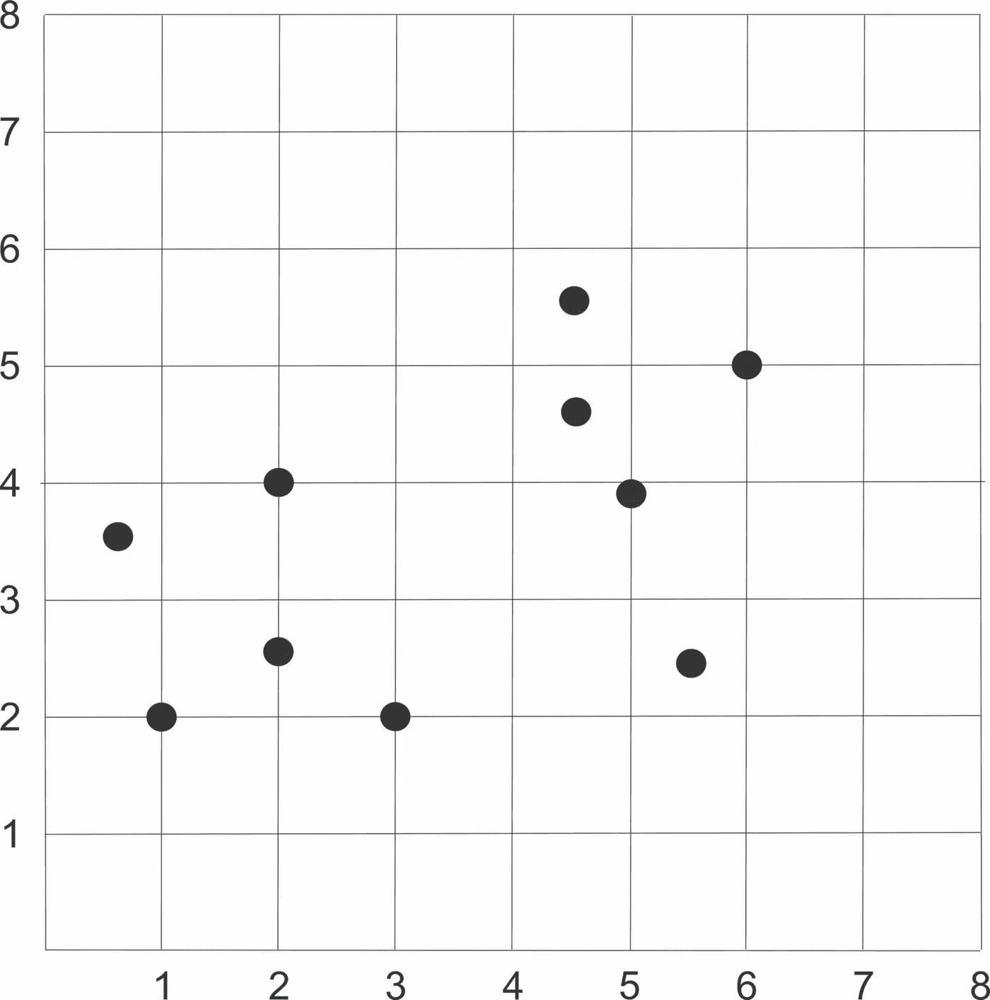

照片作者:我

## 步骤 1:选择 K 个簇的数量

假设我们想将数据分成两个集群。

## 步骤 2:初始化质心

初始化两个随机质心:

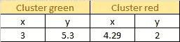

照片作者:我

使用散点图绘制数据集:

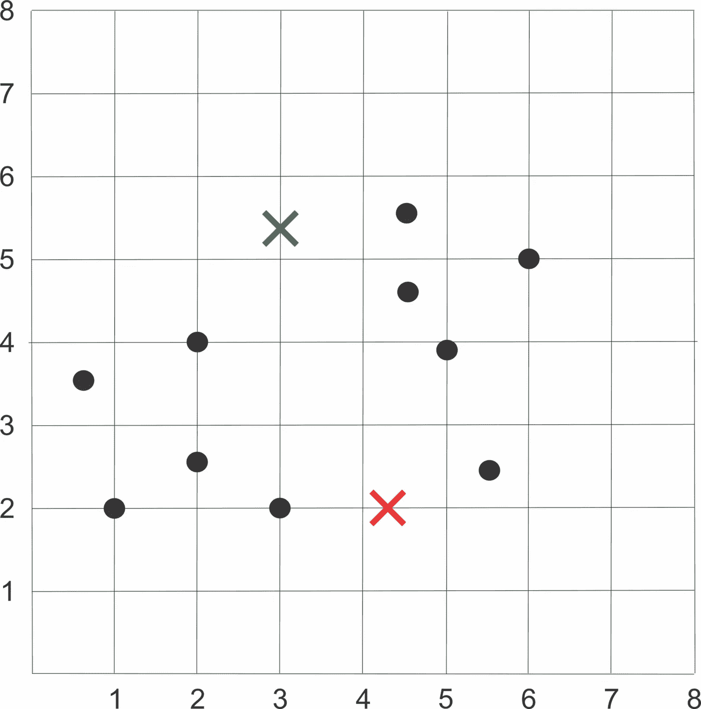

照片作者:我

## 步骤 3:将每个样本分配到最近的质心

然后，我们使用以下公式计算每个样本和每个质心之间的欧几里德距离:

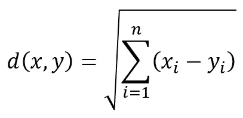

照片作者:我

当前质心:

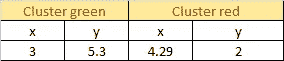

照片作者:我

将该公式应用到我们的数据中，我们得到如下结果:

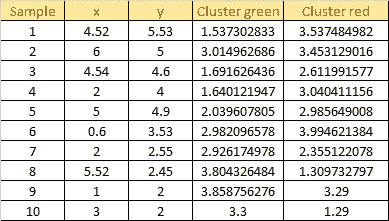

照片作者:我

根据之前获得的欧几里德距离，将每个样本分配到最近的质心。

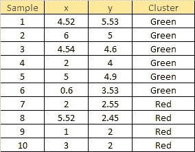

照片作者:我

使用散点图绘制数据集:

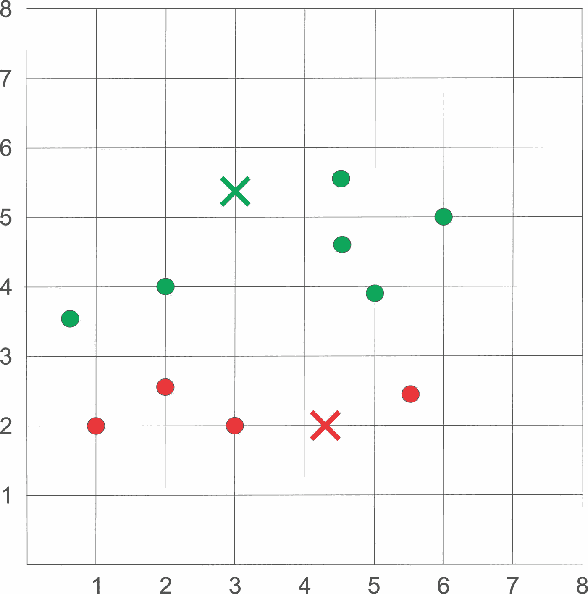

照片作者:我

## 步骤 4:更新新的质心

然后，我们使用每个聚类中指定样本的平均值来更新质心。

照片作者:我

使用散点图绘制数据集:

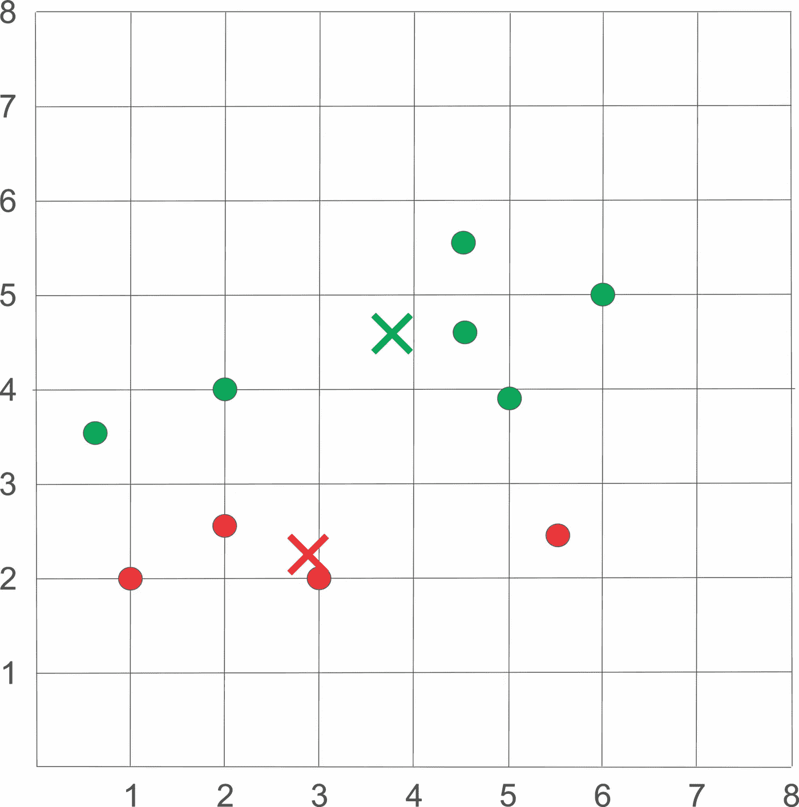

照片作者:我

## 步骤 5:将每个样本重新分配给新的质心。如果发生了任何重新分配，返回到步骤 4，否则停止迭代。

计算每个样本和每个新质心之间的欧几里德距离。
当前质心:

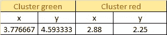

照片作者:我

每个样本和每个质心之间的距离:

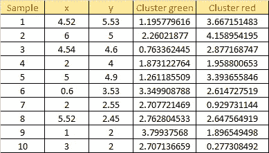

照片作者:我

根据之前获得的欧几里德距离，将每个样本分配到最近的质心:

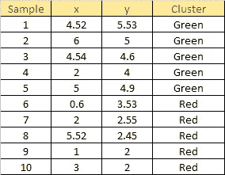

照片作者:我

使用散点图绘制数据集:

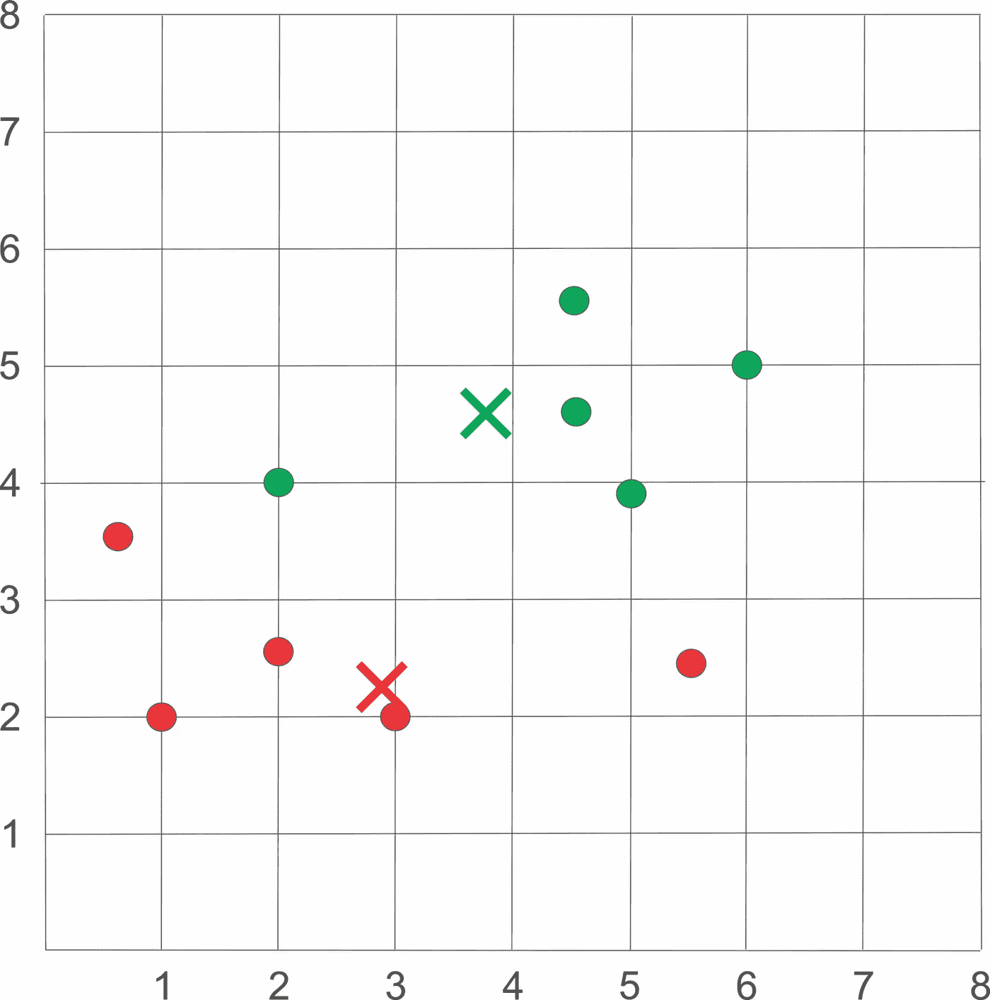

照片作者:我

检查重新分配:

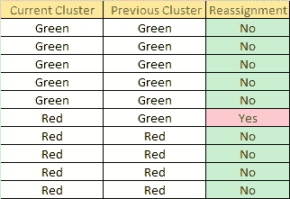

照片作者:我

发生了 1 次重新分配，因此我们返回到步骤 4。使用每个聚类中指定样本的平均值更新质心:

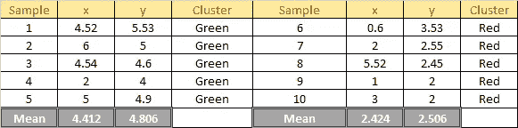

照片作者:我

使用散点图绘制数据集:

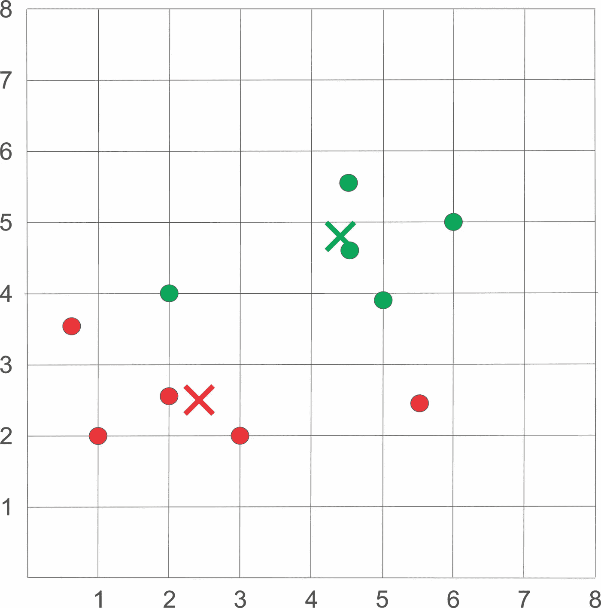

照片作者:我

计算每个样本和每个新质心之间的欧几里德距离。
当前质心:

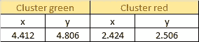

照片作者:我

每个样本和每个质心之间的距离:

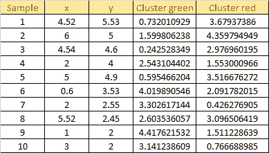

照片作者:我

根据之前获得的欧几里德距离，将每个样本分配到最近的质心:

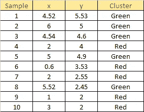

照片作者:我

使用散点图绘制数据集:

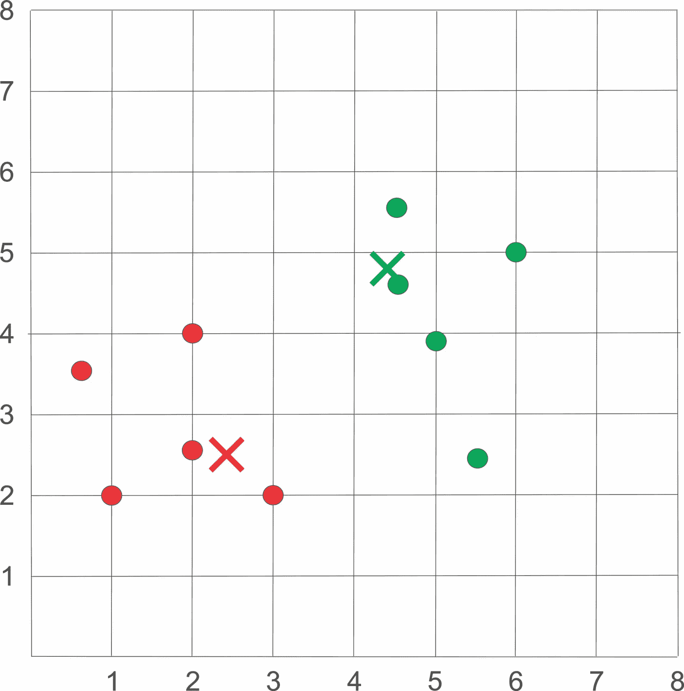

照片作者:我

检查重新分配:

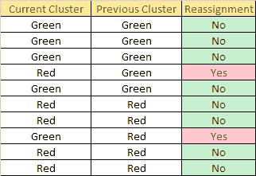

照片作者:我

发生了 2 次重新分配，所以我们回到步骤 4。使用每个聚类中指定样本的平均值更新质心:

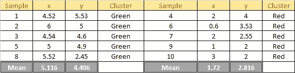

照片作者:我

使用散点图绘制数据集:

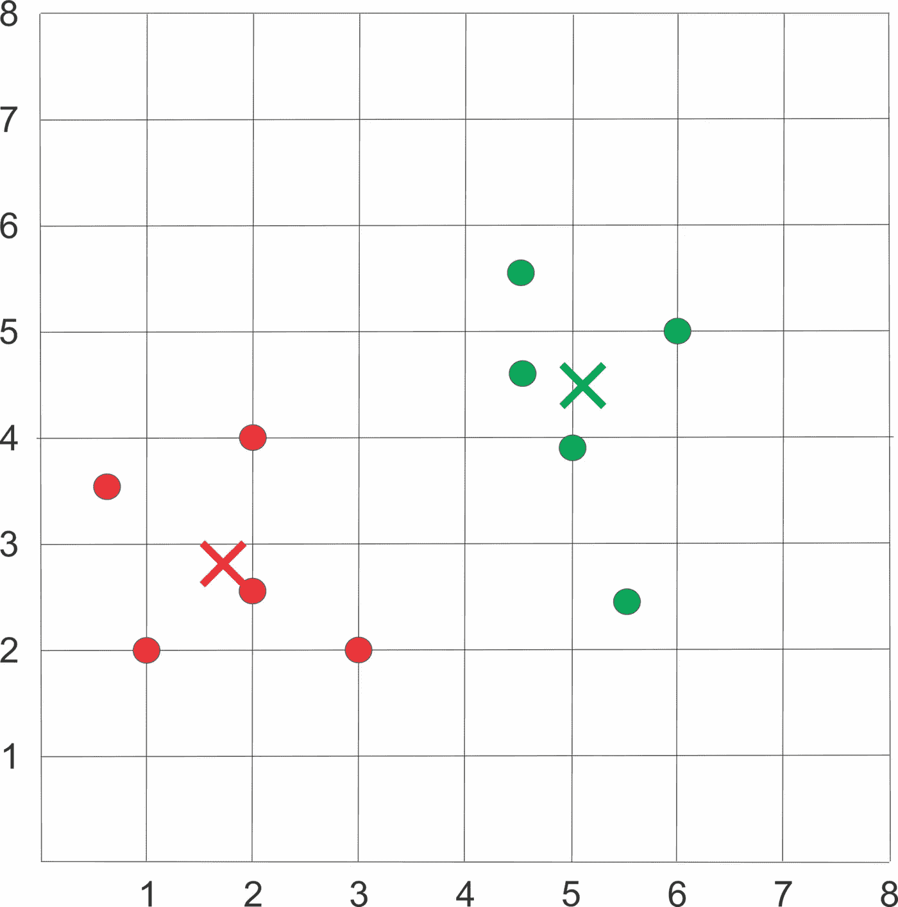

照片作者:我

计算每个样本和每个新质心之间的欧几里德距离。
当前质心:

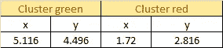

照片作者:我

每个样本和每个质心之间的距离:

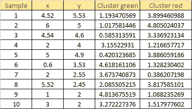

照片作者:我

根据之前获得的欧几里德距离，将每个样本分配到最近的质心:

照片作者:我

使用散点图绘制数据集:

照片作者:我

检查重新分配:

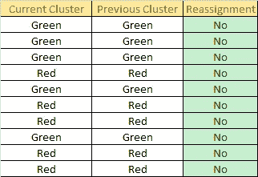

照片作者:我

没有赋值发生，所以我们停止迭代，得到最终结果如下:

照片作者:我

使用散点图绘制数据集:

最终结果，照片由我拍摄

# k-均值劣势

k-means 算法不能保证收敛到全局最优，并且经常终止于局部最优。结果将高度依赖于初始质心。为了获得更好的结果，通常使用不同的初始质心和不同数量的 k 个聚类来多次运行 k-means 算法。

# 参考

[1] J. Han，M. Kamber，和 J. Pei，[数据挖掘概念和技术](https://www.amazon.com/Data-Mining-Concepts-Techniques-Management-ebook-dp-B0058NBJ2M/dp/B0058NBJ2M/ref=mt_other?_encoding=UTF8&me=&qid=)(2011)
【2】，[什么是聚类分析？](https://sungsoo.github.io/2015/05/01/what-is-cluster-analysis.html) (2015)