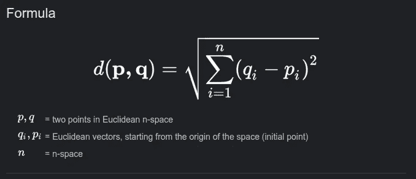
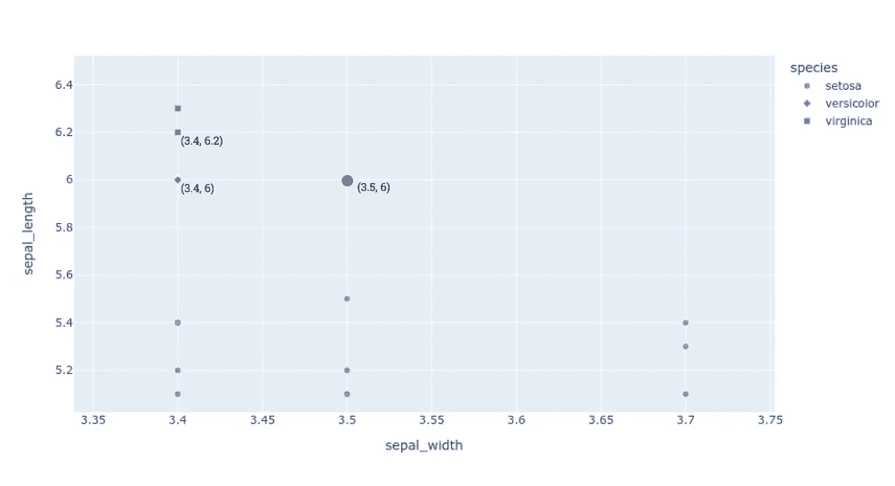
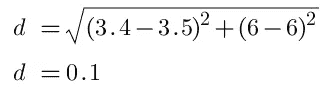

# k-最近邻算法——简单概述

> 原文：<https://pub.towardsai.net/k-nearest-neighbors-algorithm-a-simple-overview-e0114059d19c?source=collection_archive---------3----------------------->

K-最近邻(KNN)是最容易理解的机器学习算法之一。像许多其他算法一样，KNN 受到人类推理的启发。

什么搭配？

想象一下，你手里拿着一个你从未见过的蓝色玻璃瓶。你滑倒了，突然从大约 5 英尺的地方掉到下面的水泥地上。在瓶子落地之前，你最确定的知道一件事，瓶子要碎了。你怎么知道的，尽管你从来没见过这个瓶子？你在过去经历过大多数类型的玻璃刹车容易。当瓶子从你手中滑落时，你的大脑立刻将过去的经历和这件事联系起来。

如果瓶子从不到 2 英尺的高度掉到外面长满草的地面上，你可能会预测到玻璃不会碎。你的大脑会将这种情况与过去类似的经历进行比较，并挑选出最常发生的情况，这也是在 KNN 发生的情况。

# KNN 是如何工作的？

这相当简单。该算法检查给定对象周围最近的“k”个邻居，并从该选择中预测重复次数最多的类。看看下面的图片。我们让 k = 4。

不同品种鸢尾花对其萼片长度和萼片宽度的散点图。

这里，不同种类的鸢尾花是根据它们的萼片长度和宽度绘制的。观察该图，可以看到基于这两个特征的物种之间的明显区别。现在，给了我们一朵新花(图中紫色的点)，需要识别物种。

K-NN 寻找最近的数据点。如果 K = 4，则根据它们到新点的距离确定最近的 4 个问题，如图所示，最大发生类作为预测给出。在这种情况下，4 个中有 2 个是 virginica，Setosa 和 Versicolor 各有一个。因此，新的点被预测为一种属于海滨锦鸡儿属的花。

*注*:与大多数机器学习算法在提供训练数据时进行训练不同，KNN 只是存储了这些数据，而没有进行任何实际的训练。只有在预测阶段才进行计算来识别最近的邻居并确定类别。正因为如此，KNN 被称为“**懒学习者**”。

# 距离是如何计算的？

有几种计算距离的方法。欧几里德距离是一种流行的方法，而曼哈顿，闵可夫斯基和汉明距离方法也可以使用。计算欧几里德距离的公式如下所示。

欧几里德距离公式。

现在让我们考虑虹膜的例子，应用欧几里德公式计算两点之间的距离。

虹膜数据散点图特写。

新点(紫色)和最接近的杂色样本(红色)之间的欧几里德距离可以按如下所示计算。

# 我们如何找到 k 的最佳值？

K 的最佳值不能预先确定，需要反复试验。对于每种情况，这取决于所使用的数据。

通常，K 值越大，类之间的边界越不明显，但这也会降低噪声对分类的影响。具有大的 K 值也使得计算更加密集，并且可能增加偏差。

选择 K 的一些方法是，如果类的数量(n)是 2，则选择奇数，或者设置 k=sqrt(n)。一个好的 K 值也可以通过交叉验证来确定。

# KNN 算法的利弊

KNN 是非常有利的，因为它易于实现，并且不需要建立模型、调整几个参数或做出额外的假设。它可以很好地用于分类、回归以及搜索。但是，随着数据量的增加，这种算法会变得非常慢。