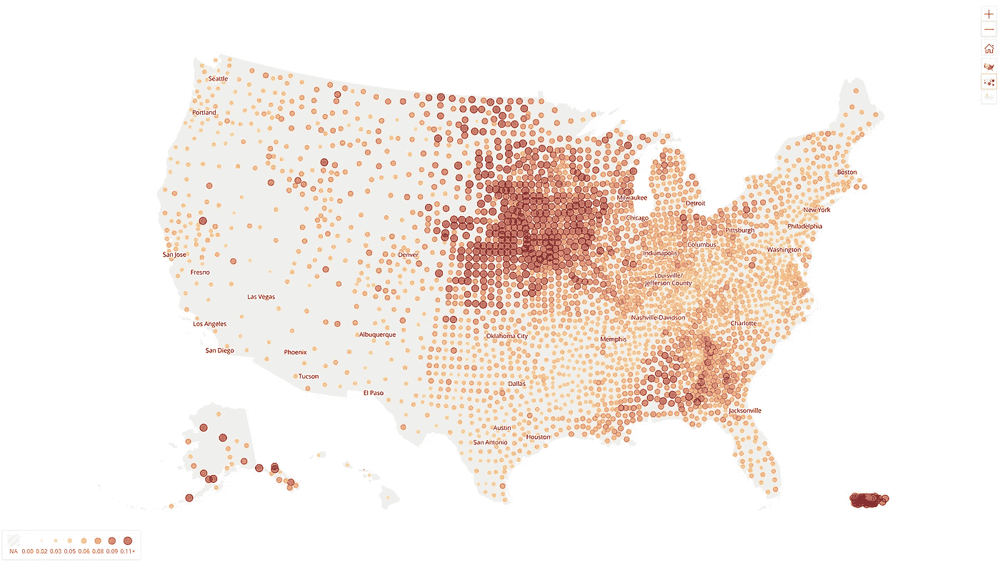
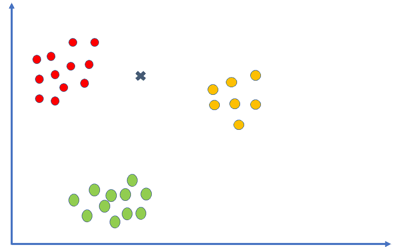
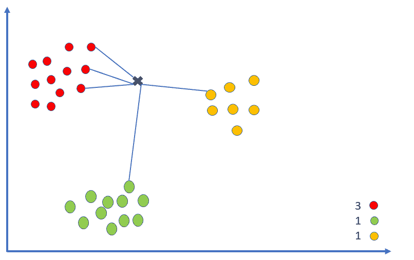
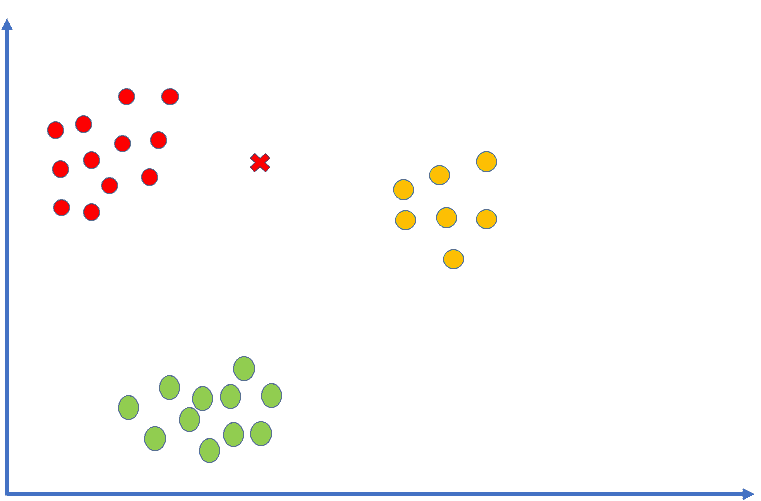
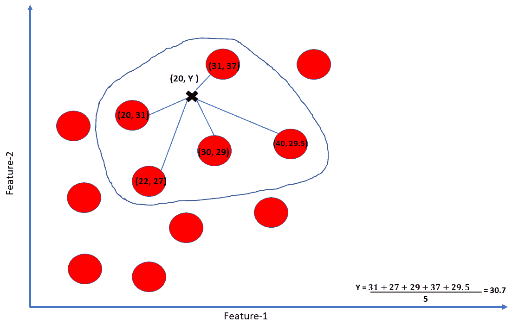
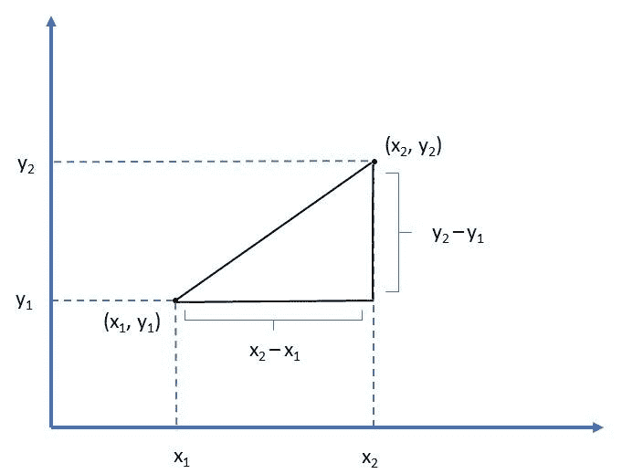
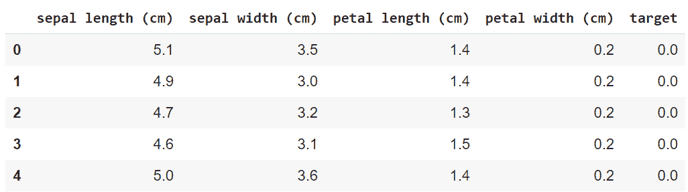
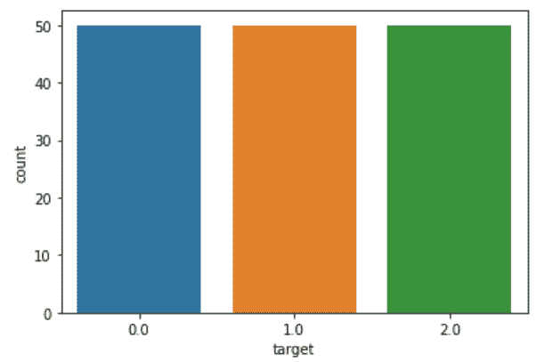
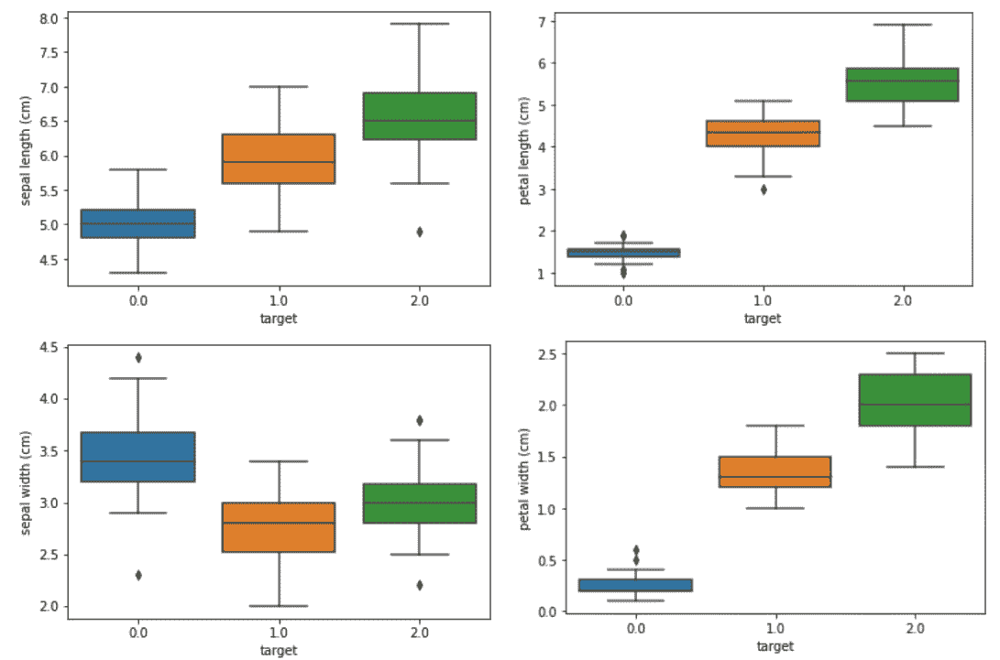
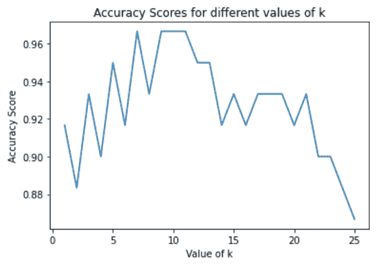

# k 近邻(KNN)算法教程—机器学习基础

> 原文：<https://pub.towardsai.net/k-nearest-neighbors-knn-algorithm-tutorial-machine-learning-basics-ml-ec6756d3e0ac?source=collection_archive---------0----------------------->



这张图片是卡耐基梅隆大学 [Delphi 研究小组](https://delphi.cmu.edu/)的[开源项目](https://github.com/cmu-delphi/www-covidcast)的 [COVIDCAST](https://covidcast.cmu.edu/) 应用程序的截图。

## [机器学习](https://towardsai.net/p/category/machine-learning)、[编辑](https://towardsai.net/p/category/editorial)、[教程](https://towardsai.net/p/category/tutorial)

## 潜入 K-最近邻，一个基本的经典机器学习(ML)算法

**作者:** [苏扬·希罗](https://www.linkedin.com/in/sujan-shirol/)，[胡斯娜·萨伊迪](https://www.linkedin.com/in/husnasayedi/)，[罗伯托·伊里翁多](https://mktg.best/vguzs)

[](https://members.towardsai.net) [## 加入我们吧↓ |面向人工智能成员|数据驱动的社区

### 加入人工智能，成为会员，你将不仅支持人工智能，但你将有机会…

members.towardsai.net](https://members.towardsai.net) 

> 鸣谢:这项工作由苏扬·希罗尔领导，胡斯娜·萨耶迪监督，罗伯特·伊里翁多审核和编辑。我们使用自然语言优化来改善读者对本文的体验和感受。请让我们知道你是否有任何反馈，你是否希望看到更多的这种优化。**除非另有说明，所有图片均来自作者。**

The k-nearest neighborhood algorithm，俗称 KNN 算法，是一种简单而有效的分类和回归监督 [**机器学习算法**](https://news.towardsai.net/mla) 。这篇文章将涵盖 KNN 算法，它的应用，优缺点，它背后的数学，以及它在 Python 中的实现。请务必在 [**Google Colab**](https://colab.research.google.com/drive/1MI6EBfMRZTneiymgezTVUvz6xfOGZozy?usp=sharing) 或[**Github**](https://github.com/towardsai/tutorials/tree/master/k-nearest-neighbors)**上查看本教程的整个实现，以帮助您阅读。**

**让我们来理解分类和回归的含义:分类从我们还是孩子的时候就已经形成了。而我们说的第一个词可能是“爸爸”或“妈妈”婴儿怎么知道他们的“妈妈”或“爸爸”是谁？我们可能看过视频，或者从父母那里听说过，他们是多么高兴和激动地教我们如何识别他们。他们以前每天都互相指指点点，直到我们明白其中的区别。**

**因此，这种互相指着对方让我们学习的方法被称为监督学习。从根本上来说， [**监督学习**](https://news.towardsai.net/mla#bc24) 是学习一个函数，这个函数根据例子，输入-输出对，把一个输入映射到一个输出[9]。**

**婴儿进行分类的特征最有可能是面部毛发和声音，这些被称为非独立**变量/输入**，独立**变量/输出**是二元的，几乎可以说是或不是。这整个过程可以被称为模型训练，我们将学习更复杂的方法来以机器可以理解的方式实现这一过程。类似地，当独立变量/输出是一个常量值时，它被称为回归问题。**

# **什么是 K 近邻(KNN)算法？**

**KNN 算法是一种主要的经典机器学习算法，它专注于从新的**未分类/未标记的**数据点到现有的**已分类/已标记的**数据点的距离。不管什么原因，把它想成是在一个学年的中间进入一所学院的过程。正如我们所看到的，学生之间可能已经形成了志同道合的群体，我们找出自己适合什么样的群体只是时间问题——特别是，我们会觉得与哪个群体更有联系，或者换句话说，与哪个群体的距离更小。**

****

**图 1:我们的示例数据集中的三种花的颜色，红色、黄色和绿色。**

**我们已经从数据集中标记了数据点。我们将把它们绘制在二维图上；这些数据点属于用红色、绿色和黄色表示的三个类别，如图 1 所示。**

**接下来，我们将考虑由黑色十字标记表示的新的未标记数据点。这使得需要从三种颜色中确定这个新数据点属于哪一类。首先，我们取一个随机值，即 k 值。k 值表示要从新的未标记数据点中寻找的最近点的数量。将 k 值视为 5。接下来，我们计算从未标记的数据点到图上每个数据点的距离，并选择前 5 个最短距离。**

****

**图 2:测量数据集类别之间的距离。**

**在前 5 个最接近的数据点中，3 个属于红色类别，1 个属于绿色类别，1 个属于黄色类别。这些被称为新数据的 k(5)个最近邻。现在很明显，新的数据点属于红色类别，因为它的大多数最近的邻居来自红色类别。**

****

**图 3:查看新数据点如何属于示例数据集中的红色类别。**

**类似地，在回归问题中，目标是预测新数据点的值，而不是它所属的类别。再次举例说明，绘制一个由给定数据集中的数据点组成的二维图形。由于它是一个二维图形，每个数据点有两个特征。x 轴表示特征 1，y 轴表示特征 2。**

**接下来，我们引入一个新的数据点，它只有 feature-1 的值是已知的，我们需要预测 feature-2 的值。我们取 k 值为 5，并从新数据点得到最近的 5 个相邻点。新数据点的特征-2 的预测值是 5 个最近邻点的特征-2 的平均值。**

****

**图 4:我们的例子引入了一个新的数据点来说明 k 近邻(KNN)算法。**

# **何时使用 KNN？**

1.  **KNN 算法可以与最精确的模型竞争，因为它做出高度精确的预测。因此，我们可以将 KNN 算法用于要求高精度但不需要人类可读模型的应用[11]。**
2.  **当为我们的任务提供的数据集很小时。**
3.  **当数据被正确标注时，预测值将在给定的标注中。如果存在类别 1、类别 2 和类别 3，那么预测的类别应该是其中之一，而不是任何其他类别。**
4.  **KNN 用于解决回归、分类或搜索问题**

# **使用 KNN 的利与弊**

## **赞成的意见**

*   **该算法简单易行，因为它只需要两个参数:k 值和距离函数。**
*   **一个好的 k 值将使算法对噪声具有鲁棒性。**
*   **它学习非线性决策边界。**
*   **给定的数据几乎没有任何假设。唯一假定的是邻近/相似的实例属于同一类别。**
*   **这是一种非参数方法。不需要模型装配/培训。数据不言自明。**
*   **由于不需要模型训练，因此很容易更新数据集。**

## **骗局**

*   **对于大型数据集效率低下，因为必须计算每个点的距离，每次算法遇到新的数据点时都会循环。**
*   **KNN 假设相似的数据点彼此接近。因此，模型容易受到异常值的影响。即使在新数据属于不同类别的情况下，来自特定类别的一些异常值也可以将新数据吸引到该类别。**
*   **它不能处理不平衡的数据。当数据不平衡时，属于一个特定类别的数据比其他类别的数据多得多；算法会有偏差。所以需要明确处理。**
*   **如果我们的数据集需要一个很大的 K，这将增加算法的计算开销。**

# **深入 KNN 背后的数学**

**如上所述，该算法计算从新数据点到每个现有数据点的距离。问题是，距离是如何测量的？有三种方法，我们将在本书中讨论。**

****

**图 5:闵可夫斯基距离的表示。**

## **闵可夫斯基距离:**

**a)闵可夫斯基距离是赋范向量空间中的广义距离函数。向量空间必须满足以下要求:**

1.  ****零矢量:**零矢量长度为 0**
2.  ****标量因子:**一个矢量乘以一个标量只改变长度，不改变方向**
3.  ****三角形不等式:**任意两点间的最短距离是一条直线。**

****

**图 6:闵可夫斯基距离的公式。**

**b)在某些情况下，**

1.  **当 p=1 时——这是曼哈顿距离**
2.  **当 p=2 时，这是欧几里德距离**
3.  **当 p =无穷大时，这是切比雪夫距离**

## **欧几里得距离**

**在数学中，欧几里得空间中两点之间的欧几里得距离是两点之间线段的长度。它可以使用勾股定理从点的笛卡尔坐标中计算出来，因此有时被称为勾股距离[10]。**

**为了计算二维平面上两点(x1，y1)和(x2，y2)之间的距离，我们使用以下公式:**

****

**图 7:欧几里德距离公式。**

## **曼哈顿距离**

**曼哈顿距离的计算类似于欧几里德距离的计算，唯一的区别是我们取绝对值，而不是取平方差之和的平方根。通过取绝对值，我们不是像欧几里得距离那样计算两点之间的最短距离。**

**从根本上来说，**欧几里德距离**代表**“从一点飞到另一点”，**，而**曼哈顿距离**是**“在一个城市中沿着小路或公路从一点行进到另一点”**。**

****

**图 8:曼哈顿距离公式。**

**然而，最有可能的是，用于计算距离的方法是欧几里德距离公式。其中一个原因是，欧几里德距离可以计算任何维度上的距离，而曼哈顿可以找到垂直平面上的元素。**

# **如何为 K 选择合适的值？**

**选择 K 对于每个数据集都是唯一的。没有计算最佳 K 值的标准统计方法。我们想选择一个能减少误差的 K 值。随着 K 的增加，由于平均或多数投票，我们的预测变得更加稳定。然而，如果 K 太大，那么错误率将再次增加，因为它将使模型欠拟合。换句话说，小 K 产生低偏差和高方差(更高的复杂性)，而大 K 产生高偏差和低方差。也就是说，有几种不同的方法可以尝试:**

1.  ****领域知识:**如前所述，K 高度依赖于数据。例如，如果分析一个独特的花卉物种数据集，很容易看出 K 应该是花卉物种的特定数量。**
2.  ****交叉验证:**这种众所周知的技术在比较 K 值范围的精度测量中是有用的，例如，K 是从 1 到 10 的值。这种技术需要将训练集分成测试/验证集来调整 K 以找到最佳值。**
3.  ****平方根:**当对数据缺乏领域知识时，可以尝试的一个简单方法是对训练集中的数据点数求平方根。**

# **KNN 在 Python 中的实现**

**为了实现 KNN 算法，我们将使用虹膜数据集。鸢尾数据集是三个相关物种的鸢尾花的形态学变化的集合:刚毛鸢尾、杂色鸢尾和海滨鸢尾。观察到的形态变异是萼片长度、萼片宽度、花瓣长度和花瓣宽度。**

**Sklearn 是一个 Python 库，具有各种分类、回归和聚类算法。它还保存虹膜数据集作为样本数据。我们将导入必要的库，如 NumPy、Pandas 和 matplotlib。**

```
import numpy as npimport pandas as pdimport matplotlib.pyplot as pltimport seaborn as snsfrom sklearn.model_selection import train_test_splitfrom sklearn.neighbors import KNeighborsClassifierfrom sklearn.model_selection import cross_val_scorefrom sklearn.datasets import load_irisiris = load_iris()
```

**下表显示了我们在 Pandas 数据帧中获得前 5 行数据后的样子。目标值为 0.0、1.0 和 2.0，分别代表 Setosa、Versicolor 和 Virginica。**

****

**图 9:显示熊猫数据帧中前 5 行数据的表格。**

**由于 KNN 对异常值和不平衡数据非常敏感，因此检查和处理异常值和不平衡数据非常重要。通过绘制目标变量的计数图来检查不平衡数据，每种花类型有 50 个样本。因此，数据完全平衡。**

**`sns.countplot(x=’target’, data=iris)`**

****

**图 10:**

**通过使用箱线图检查异常值，似乎没有多少异常值需要处理。**

```
for feature in [‘sepal length (cm)’, ‘sepal width (cm)’, ‘petal length (cm)’, ‘petal width (cm)’]:sns.boxplot(x=’target’, y=feature, data=iris)plt.show()
```

****

**图 11:**

**接下来，我们将数据分为训练集和测试集，以衡量模型的准确性。该模型将在训练集上进行训练，该训练集是随机选择的 60%的原始数据，然后用剩余 40%的原始数据的测试集进行评估。在将其分成训练集和测试集之前，有必要将**特征/从属**和**目标/独立**变量分开。**

```
X = iris.drop([‘target’], axis=1)y = iris[‘target’]X_train, X_test, y_train, y_test = train_test_split(X, y, test_size=0.4, random_state=0)
```

**构建 k 值为 1 的初始模型，这意味着在对新数据点进行分类时将只考虑 1 个最近邻。在内部，将计算从新数据点到所有数据点的距离，然后按照从最小到最大的顺序以及它们各自的类别进行排序。由于 k 值为 1，排序数组中第一个实例的类(目标值)将决定新的数据类。正如我们所看到的，我们获得了 91.6%的正确率。但是，需要选择最佳 k 值。**

```
knn = KNeighborsClassifier(n_neighbors=1)knn.fit(X_train, y_train)print(knn.score(X_test, y_test))Output: 0.9166666666666666
```

**为了通过交叉验证方法找到最佳 k 值，我们在这种情况下计算范围从 1 到 26 的 k 值的准确度，并选择最佳 k 值。准确度分数大约在 86%到 96%之间。正如所观察到的，准确度分数从低值开始，在某个点达到峰值，在一段时间内保持大致恒定，然后再次下降。分数在一段时间内保持恒定的范围可被视为给定数据集的最佳 k 值。**

```
k_range = list(range(1,26))scores = []for k in k_range:knn = KNeighborsClassifier(n_neighbors=k)knn.fit(X_train, y_train)y_pred = knn.predict(X_test)scores.append(metrics.accuracy_score(y_test, y_pred))plt.plot(k_range, scores)plt.xlabel(‘Value of k’)plt.ylabel(‘Accuracy Score’)plt.title(‘Accuracy Scores for different values of k’)plt.show()
```

****

**图 12:**

**引入一个新的未标记数据点，我们需要预测的类是花类型，它属于基于其形态学特征的类别。我们将构建 k 值为 11 的模型。**

```
knn = KNeighborsClassifier(n_neighbors=11)
knn.fit(iris.drop([‘target’], axis=1), iris[‘target’])X_new = np.array([[1, 2.9, 10, 0.2]])prediction = knn.predict(X_new)print(prediction)if prediction[0] == 0.0:print(‘Setosa’)elif prediction[0] == 1.0:print(‘Versicolor’)else:print(‘Virginica’)Output: [2.]Virginica
```

# **KNN 应用**

**从预测流行病[2]和经济到信息检索[4] [5]，推荐系统[3]，数据压缩和医疗保健[1]，k-最近邻(KNN)算法已经成为这些应用的基础。众所周知，KNN 是最简单的监督机器学习算法之一，正如我们已经讨论过的，它的实现主要用于回归和分类任务。**

**k-最近邻算法最重要的一个用例是推荐系统[3] [6]。一个简单的谷歌搜索为我们提供了几篇有前途的文章来实现使用 KNN 的推荐系统[7]，这主要是由于 KNN 对一组特定项目传播相似推荐的能力。**

**例如，想象一下，我们让一组用户对电影有不同的伪随机兴趣。推荐系统比较用户的简档以发现一组用户是否具有相似的品味。之后，假设两个用户在比较期间对两个或更多的项目有相似的品味。在这种情况下，第一用户喜欢的项目可能对第二用户来说是令人愉快的。**

**类似地，KNN 可以在分类任务中使用[8]。**

# **结论**

**KNN 是一种高效、简单、易于实现的监督机器学习算法，可用于分类和回归问题。该模型通过计算离预测点最近的选定数量的样本 K 的距离来起作用。**

**对于一个分类问题，标签变成了最近的 K 个点的多数票。对于回归问题，标签成为最近的 K 个点的平均值。每当进行预测时，模型都会搜索整个训练集，以找到 K 个最相似的示例来标记原始预测点。**

**这种算法的主要缺点是，随着数据数量的增加，计算费用和时间也会增加。然而，如果我们正在处理的数据集是一个适当大小的数据集(如虹膜数据集)，KNN 是一个简单而直接的算法，因为不需要建立模型，调整参数，或对模型做任何额外的假设。**

****免责声明:**本文所表达的观点均为作者个人观点，不代表与作者(直接或间接)相关的任何公司的观点。这项工作并不打算成为最终产品，而是当前思想的反映，同时也是讨论和改进的催化剂。**

****除非另有说明，所有图片均来自作者。****

**经由[发布**走向 AI** 发布](https://towardsai.net/)**

# **资源**

**[](https://github.com/towardsai/tutorials/tree/master/k-nearest-neighbors) [## k-最近邻教程

### AI 相关教程。免费访问其中任何一个→https://towardsai.net/editorial-toward sai/教程

github.com](https://github.com/towardsai/tutorials/tree/master/k-nearest-neighbors) [](https://colab.research.google.com/drive/1MI6EBfMRZTneiymgezTVUvz6xfOGZozy?usp=sharing) [## k 近邻—谷歌联合实验室

colab.research.google.com](https://colab.research.google.com/drive/1MI6EBfMRZTneiymgezTVUvz6xfOGZozy?usp=sharing) 

[**Youtube 教程**](https://www.youtube.com/watch?v=otolSnbanQk) 。

# 参考

[1]使用 KNN 分类算法预测新冠肺炎可能性，(2021)。检索于 2021 年 1 月 14 日，来自[https://assets . research square . com/files/RS-70985/v2 _ stamped . pdf](https://assets.researchsquare.com/files/rs-70985/v2_stamped.pdf)

[2]基于推特数据分类的流感 KNN 算法预测模型，Kavitha 等人，(2021)。检索于 2021 年 1 月 14 日，来自[http://ijseas.com/volume1/v1i7/ijseas20150712.pdf](http://ijseas.com/volume1/v1i7/ijseas20150712.pdf)

[3] Subramaniyaswamy，v .，& Logesh，R. (2017 年)。基于用户偏好挖掘的自适应 KNN 推荐系统。*无线个人通信*， *97* (2)，2229–2247。DOI:10.1007/s 11277–017–4605–5

[4]《信息检索导论》，克里斯·曼宁和潘杜·纳亚克，斯坦福大学，(2021)。检索于 2021 年 1 月 14 日，来自[https://web . Stanford . edu/class/cs 276/讲义/讲师 12-textcat.pdf](https://web.stanford.edu/class/cs276/handouts/lecture12-textcat.pdf)

[5]最近邻搜索。(2021).检索于 2021 年 1 月 14 日，来自[https://en.wikipedia.org/wiki/Nearest_neighbor_search](https://en.wikipedia.org/wiki/Nearest_neighbor_search)

[6]基于协同过滤的推荐系统，郑文，斯坦福大学，(2021)。检索于 2021 年 1 月 14 日，来自[http://cs 229 . Stanford . edu/proj 2008/Wen-recommendationsystembasedoncollaborative filtering . pdf](http://cs229.stanford.edu/proj2008/Wen-RecommendationSystemBasedOnCollaborativeFiltering.pdf)

[7]使用 KNN 的推荐系统——谷歌搜索。(2021).检索于 2021 年 1 月 14 日，来自[https://mktg.best/a1t-9](https://mktg.best/a1t-9)

[8]K-最近邻算法。(2021).2021 年 1 月 14 日检索，来自[https://en.wikipedia.org/wiki/K-nearest_neighbors_algorithm](https://en.wikipedia.org/wiki/K-nearest_neighbors_algorithm)

[9]“监督学习”。2021.En.Wikipedia.Org。[https://en . Wikipedia . org/wiki/Supervised _ learning # cite _ note-1。](https://en.wikipedia.org/wiki/Supervised_learning#cite_note-1.)

[10]“欧几里得距离”。2021.En.Wikipedia.Org。https://en . Wikipedia . org/wiki/Euclidean _ distance #:~:text = In % 20 数学% 2C % 20 欧几里得% 20 距离，被称为% 20 毕达哥拉斯% 20 距离。

[11]“IBM 知识中心”。2021.Ibm.Com。[https://www . IBM . com/support/knowledge center/SSCJDQ/com . IBM . swg . im . dash db . analytics . doc/doc/r _ KNN _ usage . html](https://www.ibm.com/support/knowledgecenter/SSCJDQ/com.ibm.swg.im.dashdb.analytics.doc/doc/r_knn_usage.html.)

**元数据:** {knn 算法} {knn 分类器} {knn in r } {knn in python } { sklearn KNN } {knn 回归} {knn 聚类} {knn 分类器 sklearn} {knn 监督} { KNN 分类} {knn vs k 均值} { KNN 算法示例} { KNN 过拟合}**