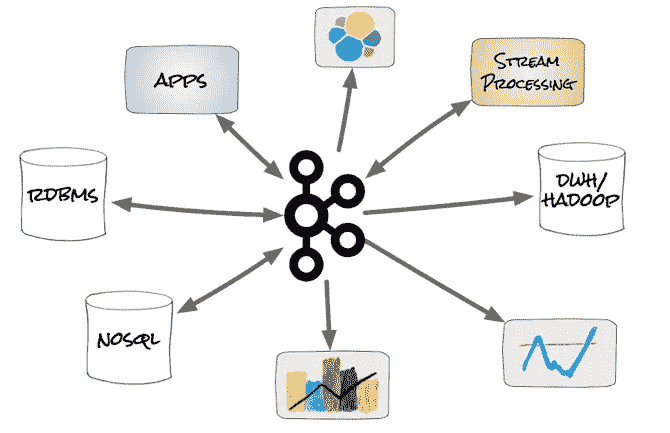
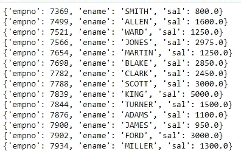
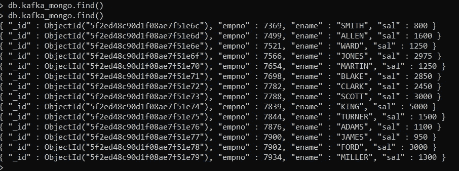

# Kafka Python 数据处理

> 原文：<https://pub.towardsai.net/kafka-python-data-processing-25584415f7ab?source=collection_archive---------0----------------------->

## [编程](https://towardsai.net/p/category/programming)

本文的目标是从 Oracle DB 表中读取数据，并将 JSON 格式的记录推送到 Kafka Broker，然后从 Kafka Broker 中读取消息，并将 JSON 消息插入 MongoDB 集合。
这个博客包含一个基本的 ETL 消息传递系统构建，使用 Oracle 作为源，Kafka 作为中间件，MongoDB 作为目标。

这是我的卡夫卡系列的第三个博客，前两个博客链接包含了卡夫卡的概念细节，链接如下:

> [https://medium . com/forward-artificial-intelligence/getting-started-with-Apache-Kafka-初学者-教程-d38e3634706c？source = friends _ link&sk = 2b 98454 c 001 FB 88527 fff 8c 2217947 e 2](https://medium.com/towards-artificial-intelligence/getting-started-with-apache-kafka-beginners-tutorial-d38e3634706c?source=friends_link&sk=2b98454c001fb88527fff8c2217947e2)
> 
> [https://medium . com/forward-人工智能/diving-deep-into-Kafka-29160 f32d 408？source = friends _ link&sk = 0 cf 78 cc 0 ee 1ef 12 f 0 BAC 1634 e 71d 1550](https://medium.com/towards-artificial-intelligence/diving-deep-into-kafka-29160f32d408?source=friends_link&sk=0cf78cc0ee1ef12f0bac1634e71d1550)



卡夫卡 ETL 生态系统

1.  **连接 Oracle 并提取数据:**

```
#import required librariesfrom json import dumps
import json
from kafka import KafkaProducer
import cx_Oracleconn = cx_Oracle.connect('scott/scott@oracle')
cursor=conn.cursor()
query='select empno,ename,sal from emp'result=cursor.execute(query)
data=[]#convert data into JSON format
for row in result:
    data.append({'empno':row[0], 'ename':row[1], 'sal':row[2]})conn.close()for records in data:
    print(records)
```



Oracle 数据

由于 MongoDB 接受 JSON 格式的数据，我们将把数据转换成 JSON 键值格式。

**2。创建一个生产者并向 Kafka Broker 推送消息:**

```
producer = KafkaProducer(bootstrap_servers=[‘localhost:9092’],
 value_serializer=lambda x:json.dumps(x).encode(‘utf-8’))#push message to kafka topic mongo_poc
try:
 for val in data:
 producer.send(‘mongo_poc’,val)
except Exception as e:
 print(e)
```


卡夫卡的信息

> 消息采用键值对格式

**3。创建一个消费者并将记录插入到 MongoDB:**

```
#import required libraries
from kafka import KafkaConsumerfrom json import loads
import json
from pymongo import MongoClient#mongodb connection details
client = MongoClient(‘localhost:27017’)
db=client.mydb#write Kafka consumer
consumer = KafkaConsumer(‘mongo_poc’,
 bootstrap_servers=[‘localhost:9092’],
 auto_offset_reset=’earliest’,
 enable_auto_commit=True,
 group_id=’my-group’,
 consumer_timeout_ms=1000,
 value_deserializer=lambda x: loads(x.decode(‘utf-8’)))#read messages from Kafka and insert into mongodb collection named kafka_mongofor message in consumer:
 msg = message.value
 print(msg)
 db.kafka_mongo.insert(msg)
 consumer.commit()
```



MongoDB 文档

MongoDB 集合可以被解释为一个 RDBMS 表。MongoDB 中的每个记录都被称为文档。所以一个 Oracle 记录就是 MongoDB 文档。

*使用 find()* 方法查询收藏- kafka_mongo

> 访问我的 MongoDB 博客了解基本的 CRUD 操作，链接如下:[https://mongocrud . blogspot . com/2020/03/MongoDB-CRUD-operations . html](https://mongocrud.blogspot.com/2020/03/mongodb-crud-operations.html)

万岁，我们已经成功读取了来自 Kafka Broker 的消息，并将其插入到 MongoDB 集合中。

# 总结:

使用 cx_Oracle 的 Python Oracle 连接

JSON 数据创建

使用 Kafka Producer 推送消息

Kafka 消费者将数据插入 MongoDB 集合

感谢所有人阅读我的博客，如果你喜欢我的内容和解释，请在 medium 上关注我并分享你的反馈，这将永远帮助我们所有人提高我们的知识。