# 使用僧侣的卡纳达 MNIST 分类法

> 原文：<https://pub.towardsai.net/kannada-mnist-classification-using-monk-157ab4c4db1e?source=collection_archive---------1----------------------->

## 图像处理

**卡纳达语**是德拉维甸语四种主要语言(超过 70 种)中第二古老的一种，主要由印度西南部的卡纳塔克邦的人和与卡纳塔克邦接壤的邦(即马哈拉施特拉邦、安得拉邦、泰米尔纳德邦、特伦甘纳邦、喀拉拉邦和果阿)的语言少数群体使用，也有海外的卡纳提人使用。这种语言在 T4 大约有 4400 万母语使用者，他们被称为 Kannadigas。也是印度共和国的官方语言之一，卡纳塔克邦的 ***官方和行政语言*** 。

卡纳达语是印度南部和中部一些最强大的帝国的宫廷语言，例如查鲁克亚王朝、拉什特拉库塔王朝、维贾亚纳加拉帝国和霍伊萨拉帝国。最古老的卡纳达语碑文是在哈尔米地的小社区发现的，可以追溯到大约公元 450 年。

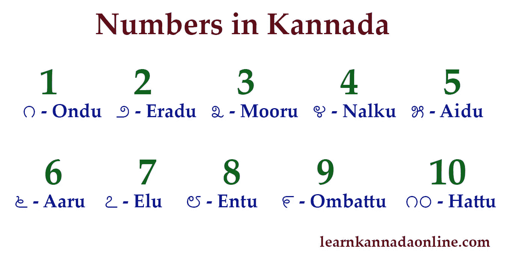

来源: [Blogspot](https://2.bp.blogspot.com/-e13ee8EcKxU/Wl7dQ32q44I/AAAAAAAAAB4/um6EcQ9gq0YL9un_WWQNpw_d_uTvrDpBgCLcBGAs/s1600/numbers-kannada1.jpg)

# 修道士

[Monk](https://github.com/Tessellate-Imaging/monk_v1) 是一个低代码深度学习工具，是计算机视觉的统一包装器。

# 僧侣特征

*   低代码
*   主要深度学习框架的统一包装器——Keras、PyTorch、Mxnet-gluoncv
*   语法不变包装器

# Monk 使能

*   对深度学习实验进行创建、管理和版本控制。
*   比较不同训练指标的实验。
*   快速找到最佳超参数。

# 目标

*   用模型做实验
*   了解使用 Monk 有多简单

# 目录

*   关于数据集
*   将给定数据集转换成所需格式
*   安装 Monk
*   正在导入 PyTorch 后端
*   创建和管理实验
*   模型列表-查看 Monk 后端支持的其他模型
*   快速模式训练-加载数据和模型
*   训练分类器
*   在测试图像上运行推理

## 关于数据集

数据集可以在 [Kaggle](https://www.kaggle.com/c/Kannada-MNIST) 上获得。数据文件`train.csv`和`test.csv`包含卡纳达文字中从 0 到 9 的手绘数字的灰度图像。

每幅图像高 28 像素，宽 28 像素，总共 784 像素。每个像素都有一个与之关联的像素值，表示该像素的亮度或暗度，数字越大表示越暗。该像素值是 0 到 255 之间的整数，包括 0 和 255。

## 将给定数据集转换成所需格式

这里我们将图像的像素值转换成一个图像，并存储在各自的文件夹中。

让我们从读取 CSV 文件开始，如下所示。

```
$ train = pd.read_csv('/kaggle/input/Kannada-MNIST/train.csv')
$ test = pd.read_csv('/kaggle/input/Kannada-MNIST/test.csv')
$ sample_submission = pd.read_csv('/kaggle/input/Kannada-MNIST/sample_submission.csv')
```

探索训练、测试和样本提交数据框架。

```
$ train.head()
```

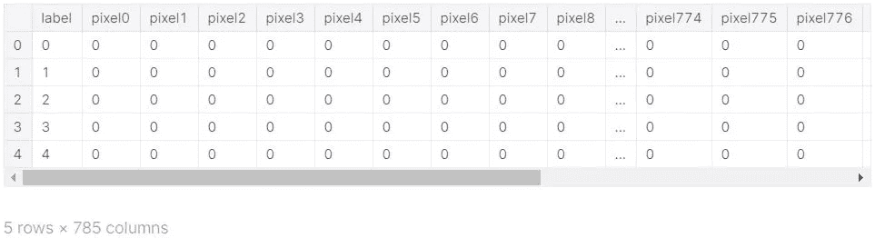

训练数据帧

```
$ test.head()
```

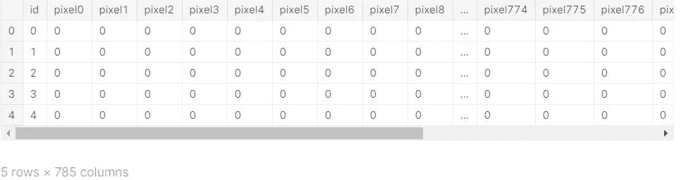

测试数据帧

让 X_train 包含像素值，Y_train 包含相应的标签。

```
$ X_train=train.drop('label',axis=1)
$ Y_train=train.label
```

探索 X 列车和 Y 列车

```
$ X_train.head()
```

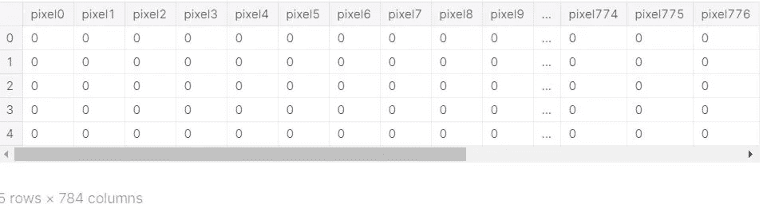

x _ 火车

```
$ Y_train.head()
```

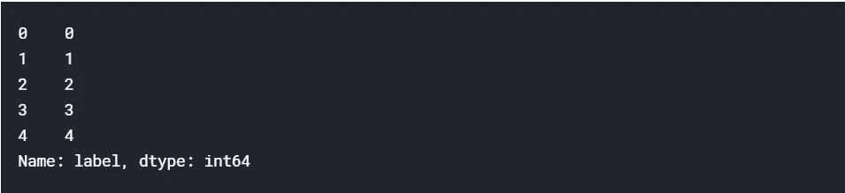

y _ 火车

```
$ test=test.drop('id',axis=1)
```

探索它

```
$ test.head()
```

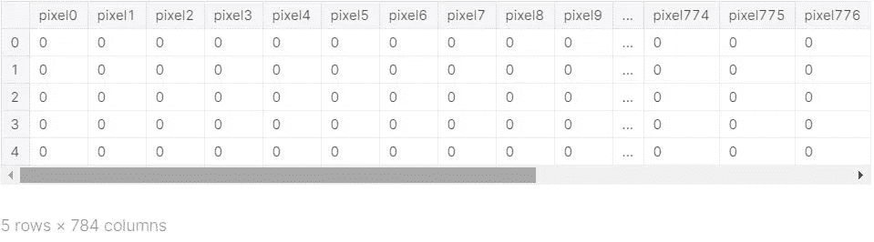

试验

```
$ X_train=X_train/255
$ test=test/255
```

重塑像素值以获得 28*28 像素值的数组来形成图像

```
$ X_train=X_train.values.reshape((-1,28,28,1))
$ test=test.values.reshape((-1,28,28,1))
```

可视化 2D 数组中的一个元素

```
$ plt.imshow(X_train[0][:,:,0])
$ plt.title(Y_train[0])
```

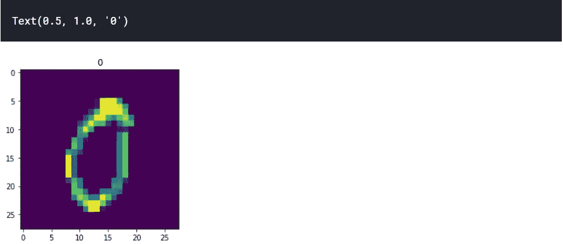

形象化

创建两个用于测试和训练的文件夹来保存图像

```
$ ! mkdir trainIm testIm
```

将给定的像素值转换成图像并存储它们

```
$ lengthX_train = X_train.shape[0]
$ for i in range(lengthX_train):
$     array = X_train[i][:,:,0].astype(np.uint8)
$     img = Image.fromarray(array)
$     img = img.convert("L")
$     fn = "/kaggle/working/trainIm/TrainImg**{}**.png".format(i)
$     img.save(fn)
$
$ lengthtest = test.shape[0]
$ for i in range(lengthtest):
$     array = test[i][:,:,0].astype(np.uint8)
$     img = Image.fromarray(array)
$     img = img.convert("L")
$     fn = "/kaggle/working/testIm/TestImg**{}**.png".format(i)
$     img.save(fn)
```

创建包含训练图像标签的 CSV 文件

```
$ train_label = pd.DataFrame(columns = ['image_id_path', 'Label'])
$
$ for index,row in Y_train.iteritems():
$    *#print(row)*
$    *#print(index)*
$    pathname = "TrainImg**{}**.png".format(index)
$    train_label.loc[index,'image_id_path']=pathname
$    train_label.loc[index,'Label']=row
$
$ train_label.to_csv("train.csv", index=False)
```

第一步完成了。

## 安装 Monk

```
$ !git clone [https://github.com/Tessellate-Imaging/monk_v1.git](https://github.com/Tessellate-Imaging/monk_v1.git)
```

*   如果使用 Kaggle 安装，请使用以下命令

```
$ !cd monk_v1/installation/Misc && pip install -r requirements_kaggle.txt
```

*   如果使用 Colab，请使用以下命令安装

```
$ !cd monk_v1/installation/Misc && pip install -r requirements_colab.txt
```

*   使用本地系统或云时，根据 OS 和 CUDA 版本选择需求文件

```
$ !cd monk_v1/installation/Linux && pip install -r requirements_cu9.txt
```

有关安装的更多信息，请访问 [Github-repo](https://github.com/Tessellate-Imaging/monk_v1/tree/master/installation) 。

引进和尚

```
*$ # Monk*
$ import os
$ import sys
$ sys.path.append("monk_v1/monk/");
```

*   **使用 mxnet**后端

```
$ from gluon_prototype import prototype
```

*   要使用 Keras 后端

```
$ from keras_prototype import prototype
```

*   使用 Pytorch 后端

```
$ from pytorch_prototype import prototype
```

注意:我用过 PyTorch 后端。

## 创建和管理实验

*   提供项目名称
*   提供一个实验名称
*   对于特定数据，创建单个项目
*   在每个项目中，可以创建多个实验
*   每个实验都有不同的超参数

```
$ gtf = prototype(verbose=1);
$ gtf.Prototype("Kannada-MNIST", "Using_Pytorch_Backend");
```

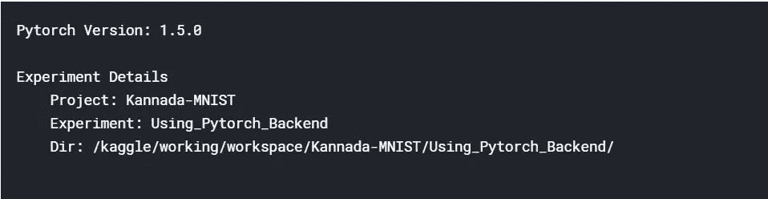

这将按照以下结构工作区创建文件和目录

|

| — — —卡纳达语-MNIST 语(项目名称可以不同)

```
|
            |
            |-----Using_Pytorch_Backend (Experiment name can be different)
                        |
                        |-----experiment-state.json
                        |
                        |-----output
                                |
                                |------logs (All training logs and graphs saved here)
                                |
                                |------models (all trained models saved here)
```

## 型号列表

看看 Monk 的后端还支持哪些模型

```
$ gtf.List_Models()
```

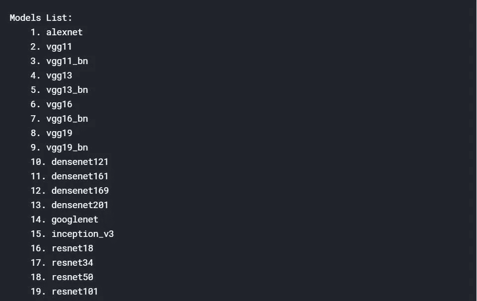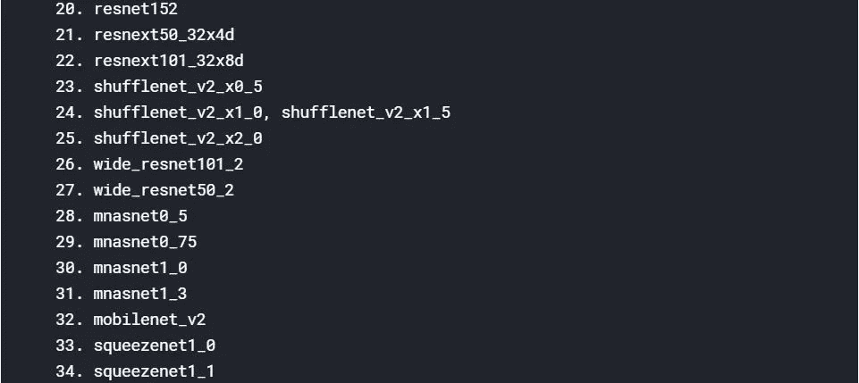

## 加载数据和模型

关于在 [Github](https://github.com/Tessellate-Imaging/monk_v1#4) 上快速加载数据和模型的文档。

Github 上的 Monk 教程。

## 快速模式训练

*   使用默认功能
*   数据集路径
*   型号名称
*   次数

```
$ gtf.Default(dataset_path="/kaggle/working/trainIm/",
            path_to_csv="/kaggle/working/train.csv", *# updated csv file* 
            model_name="resnet50", 
            freeze_base_network=False,
            num_epochs=20);
```

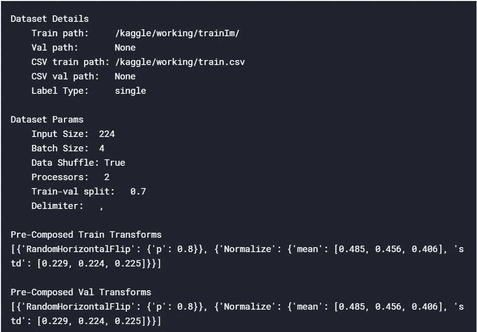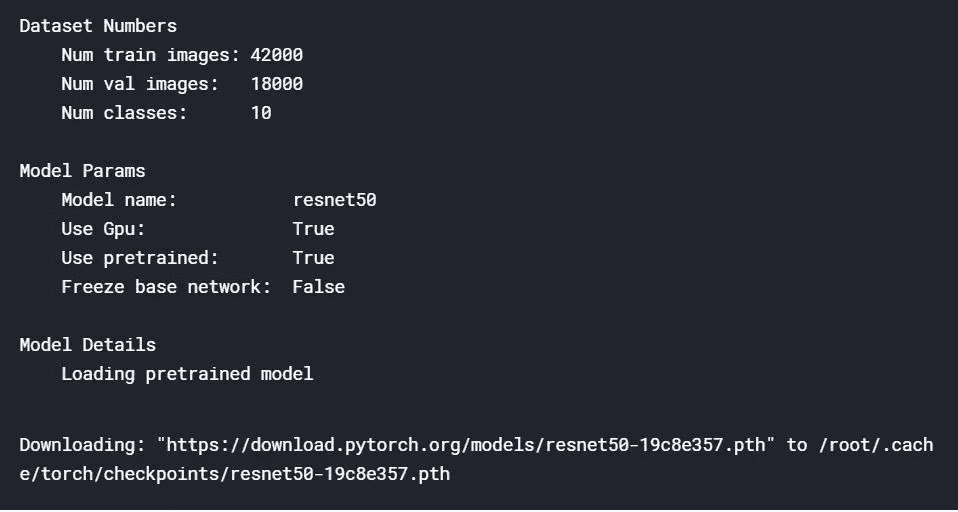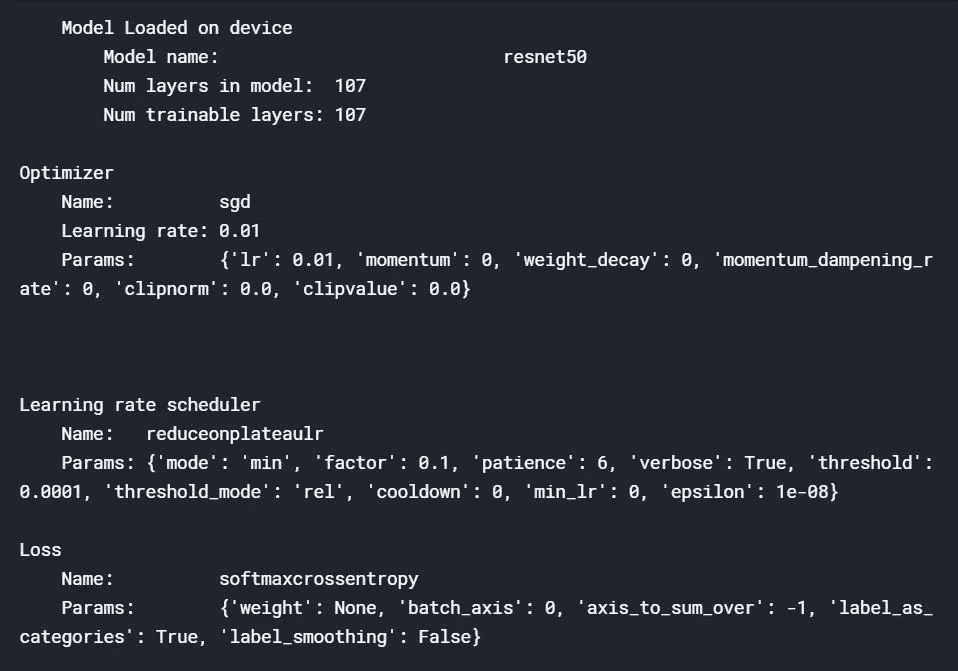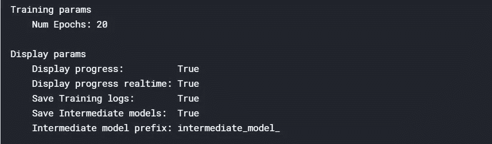

上面的图像是前一个单元格的输出

## 训练分类器

```
*$ #Start Training*
$ gtf.Train();
*$ #Read the training summary generated once you run the cell and training is completed*
```

我将只附上培训总结。

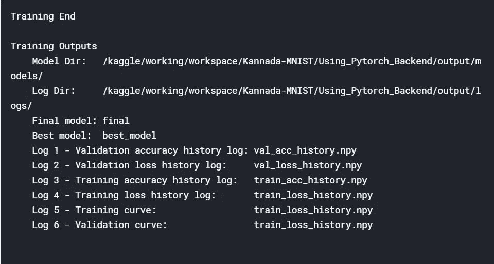

培训总结

## 在测试图像上运行推理

以推理模式加载实验

*   将标志 eval_infer 设置为真

```
$ gtf = prototype(verbose=0);
$ gtf.Prototype("Kannada-MNIST", "Using_Pytorch_Backend", eval_infer=True);
```

## 选择图像并运行推理

```
$ img_name = "/kaggle/working/testIm/TestImg1.png";
$ predictions = gtf.Infer(img_name=img_name);
$ print(predictions)
$ print(predictions['predicted_class'])
```

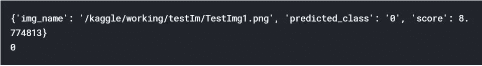

## 对所有测试图像进行推理

```
$ from tqdm import tqdm_notebook as tqdm
$ for i in tqdm(range(len(sample_submission))):
$    img_name = "/kaggle/working/testIm/TestImg**{}**.png".format(i)
$    
$    *#Invoking Monk's inferencing engine inside a loop*
$    predictions = gtf.Infer(img_name=img_name, return_raw=True);
$    x = predictions['predicted_class']
$    sample_submission["id"][i] = i;
$    sample_submission["label"][i] = x;
```

探索

```
$ sample_submission.head()
```

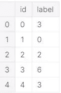

```
$ sample_submission.to_csv("submission.csv", index=False);
```

# 检验

*   [和尚 _ 物体 _ 探测](https://github.com/Tessellate-Imaging/Monk_Object_Detection)

低代码、易于安装的对象检测管道的一站式存储库。

*   [和尚 _ 鬼](https://github.com/Tessellate-Imaging/Monk_Gui)

基于 Monk 库的深度学习和计算机视觉图形用户界面

*   [py torch _ 教程](https://github.com/Tessellate-Imaging/Pytorch_Tutorial)

一套关于 PyTorch 函数和例子的 jupyter 笔记本

我是 Monk library 的开源贡献者。

你可以在[卡格尔](https://www.kaggle.com/sinchubhat/kannada-mnist-using-monk)上找到启动密码。

请随意在 [Github-repo](https://github.com/Tessellate-Imaging/monk_v1) 上提出问题。

## 参考

【1】卡纳达语维基百科[https://en.wikipedia.org/wiki/Kannada](https://en.wikipedia.org/wiki/Kannada)MNIST

[2]卡纳达语，大英百科全书，[https://www.britannica.com/topic/Kannada-language](https://www.britannica.com/topic/Kannada-language)