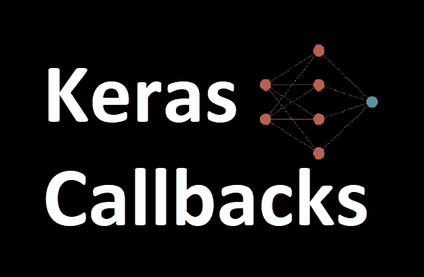

# Keras 回调教程有效训练你的神经网络

> 原文：<https://pub.towardsai.net/keras-callbacks-tutorial-for-training-your-neural-networks-efficiently-fa51dc0d792f?source=collection_archive---------4----------------------->

> 神经网络的训练可能需要几个小时甚至几天才能完成。所以我们需要一些功能来监视和控制我们的模型。因为在数小时或数天的训练后，如果一个模型崩溃了，那么所有的训练时间都浪费了。一旦我们选择了一些纪元并且开始训练，我们可能需要停止训练以避免过度拟合，或者如果我们已经实现了一些最小损失，并且如果它在之后增加，我们需要停止训练等等。,.因此，一旦培训开始，我们必须需要一些功能来监视和控制我们的模型，这就是本文所要讨论的内容— **回调**

在一般定义中，回调是 Keras 中的一个对象，它可以在训练的各个阶段执行操作。



图片由 Muttineni Sai Rohith 提供

可以在一个时期开始或结束之前、在一个批处理之前或之后调用回调，等等。我们可以使用回调来提前停止，定期将我们的模型保存到磁盘，在训练期间查看内部状态并获得模型的统计数据，在每批训练后写日志，等等。,

**回调用法:**

1.  定义回调

```
#EarlyStopping
early_stop = tf.keras.callbacks.EarlyStopping(
    monitor='val_loss', min_delta=0.001, patience=3, verbose=1,
    mode='min'
)#ModelCheckpoint
checkpoint = ModelCheckpoint(filepath ,monitor='val_loss',       
                  mode='min',save_best_only=True,verbose=1
                 )
```

如果您现在没有得到它们，请不要担心，我们将在下面详细介绍它们。

2.将回调传递给 model.fit()

```
model.fit(X_train,y_train,epochs=10,validation_data=(X_test,y_test),
callbacks = [early_stop, checkpoint]) 
```

让我们来看看一些最常用的回调。

## ***模型检查点:***

我们使用这个回调来定期保存我们的模型，这样如果我们的训练意外崩溃，我们就不会浪费我们的训练时间。此外，我们可以利用中间的最佳存储权重，并在以后加载它们，以从保存的状态继续训练。

语法:

```
tf.keras.callbacks.ModelCheckpoint(
    filepath,
    monitor = "val_loss",
    verbose = 0,
    save_best_only = False,
    save_weights_only = True,
    mode = "auto",
    save_freq="epoch",
    options=None,
    initial_value_threshold=None,
    **kwargs
)
```

***filepath*** —保存模型的位置
***monitor***—需要监视的指标例如:(" val_loss "、" val_accuracy "、" loss "、" accuracy ")
***verbose***—如果为 1，则在采取回调操作时显示一条消息，反之亦然；如果为 0
***save _ best _ only***—如果为真，则保存
***save _ weights _ only***—如果为 True，则只保存权重。
***模式***——(“自动”、“最小”、“最大”)对于精度，应该是“最大”，对于损耗，应该是“最小”。如果是“auto ”,它可以通过使用度量的名称来推断模式。
***save _ freq***—如果“epoch”为每一个 epoch 保存，否则为整数 n，每第 n 批后保存。

## **T43【终结】安南 **

当出现 NaN 丢失时，此回调将终止训练。

```
tf.keras.callbacks.TerminateOnNaN()
```

## [提前停止](https://muttinenisairohith.medium.com/keras-earlystopping-callback-to-train-the-neural-networks-perfectly-2a3f865148f7):

EarlyStopping 是在训练神经网络时使用的回调，它为我们提供了使用大量训练时期的优势，并且一旦模型的性能在验证数据集上停止改善，就停止训练。

```
tf.keras.callbacks.EarlyStopping(
    monitor="val_loss",
    min_delta=0,
    patience=0,
    verbose=0,
    mode="auto",
    baseline=None,
    restore_best_weights=False,
)
```

关于提前停止的详细解释，请参考我下面的文章—

[](https://muttinenisairohith.medium.com/keras-earlystopping-callback-to-train-the-neural-networks-perfectly-2a3f865148f7) [## Keras 早期停止回调以完美训练神经网络

### 早期停止是一种帮助您在训练神经网络时避免过拟合和欠拟合的方法。

muttinenisairohith.medium.com](https://muttinenisairohith.medium.com/keras-earlystopping-callback-to-train-the-neural-networks-perfectly-2a3f865148f7) 

## ReduceLROnPlateau

如果没有改善，这种回调会降低学习率(lr)。模型通常受益于降低学习率。使用这个回调将监控指定的度量，如果“耐心”的历元数没有改善，学习率将会降低。

语法:

```
tf.keras.callbacks.ReduceLROnPlateau(
    monitor="val_loss",
    factor=0.1,
    patience=10,
    verbose=0,
    mode="auto",
    min_delta=0.0001,
    cooldown=0,
    min_lr=0,
    **kwargs
)
```

***监控*** —必须监控的指标，例如:(" val_loss "、" val_accuracy "、" loss "、" accuracy")
***因子—*** 学习率将降低的因子。`new_lr = lr * factor`。
***耐心—***lr 降低后无改善的时期数 ***冗长*** —如果为 1，则在采取回调动作时显示一条消息，反之如果为 0
***模式*** —(“自动”、“最小”、“最大”)对于精确度，应该为“最大”，对于损耗，应该为“最小”。如果是“auto ”,它可以通过使用度量的名称来推断模式。
***min _ delta***—用于只关注一个显著的变化。
***冷却***——lr 降低后恢复正常运行前等待的周期数。
***min_lr —*** 学习率上下限。

# 学习率计划程序

一个简单的回调函数用于调整一段时间后的学习速率。我们可以编写一个函数来根据时期或某些条件改变学习速率，并可以将它作为参数传递给这个回调函数。

带有示例的语法:

```
def scheduler(epoch, lr):
     if epoch % 10 == 0:
        return lr * tf.math.exp(-0.1)callback = tf.keras.callbacks.LearningRateScheduler(scheduler)
```

这将改变每 10 个时期的学习率。

# 张量板

它是 Tensorflow 提供的可视化工具。这个回调允许我们可视化关于训练过程的信息，如度量、训练图、激活函数直方图和其他梯度分布。要使用 tensorboard，我们首先需要设置一个 log_dir 来保存 tensorboard 文件。

```
log_dir="logs"
tensorboard_callback = tf.keras.callbacks.TensorBoard(
log_dir=log_dir, histogram_freq=1, write_graph=True)
```

***log_dir —*** 保存文件的目录
***histogram _ freq—***计算直方图和渐变图的历元频率
***write _ graph—***是否需要在张量板上显示和可视化图形

我们已经讨论了几次回访。还有其他的回调，比如

*   ***备份和恢复—*** 备份和恢复特定的训练状态
*   ***remote monitor—***回调用于将事件流式传输到服务器
*   ***CSVLogger —*** 将 epoch 结果流式传输到 CSV 文件的回调。
*   ***lambda Callback—***回调用于动态创建简单的自定义回调。
*   ***progbar logger—***将指标打印到标准输出的回调。

这就是 Keras 试镜的意义。确保下次在训练神经网络时使用它们。

如果你喜欢这篇文章，去我的 feed 看看我的其他文章。它们可能会有帮助。

参考资料:

*   [https://keras.io/api/callbacks/](https://keras.io/api/callbacks/)

快乐编码…