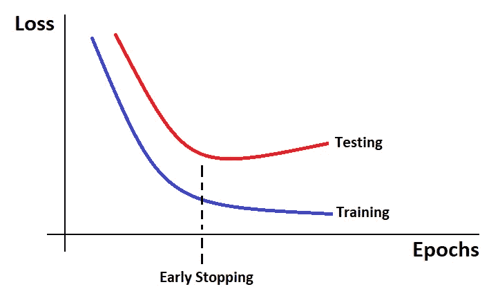
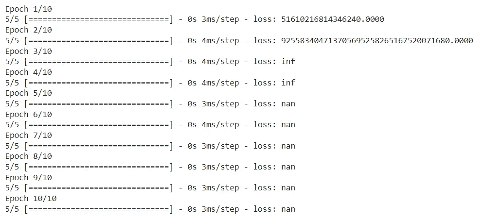
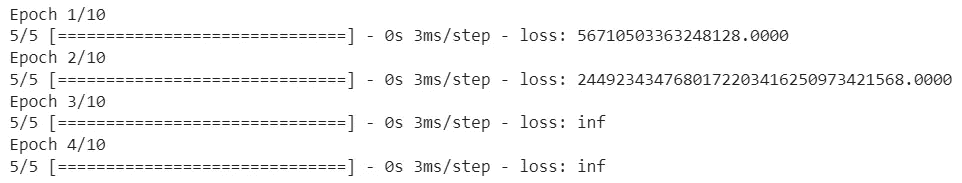
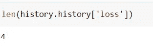

# Keras 早期停止回调以完美训练神经网络

> 原文：<https://pub.towardsai.net/keras-earlystopping-callback-to-train-the-neural-networks-perfectly-2a3f865148f7?source=collection_archive---------1----------------------->

> 在 Arrowverse 系列中，当 Arrow 对 Flash 说“接受你自己的建议，戴上面具”，“你可以更好”时，我想，如果我们在神经网络中有一些相同的功能，模型可以在训练时接受它自己的建议，并相应地调整时期，这将会更好，并使选择时期数量的生活变得容易。Keras 已经提供了这种方法，这也是我们这篇文章的目的

神经网络中的一个问题是在训练时选择时期的数量，太多的时期将使模型过拟合，而太少的时期可能导致欠拟合。



照片由 Muttineni Sai Rohith 拍摄

EarlyStopping 是在训练神经网络时使用的回调，它为我们提供了使用大量训练时期的优势，并且一旦模型的性能在验证数据集上停止改善，就停止训练。

**提前停止有多有用？**

为了理解这一点，我们先来看一个例子

```
model = tf.keras.models.Sequential([tf.keras.layers.Dense(10)])model.compile(tf.keras.optimizers.SGD(), loss='mse')history = model.fit(np.arange(100).reshape(5, 20), np.zeros(5), epochs=10, batch_size=1,verbose=1)
```

因此，在上面的例子中，我们正在考虑一个带有一些随机数据的小型神经网络。这些数据毫无意义，而且最有可能的是，无论有多少个历元，模型性能都不会提高。

我们可以在输出中看到—



输出

因此，使用 EarlyStopping 回调，我们可以编写一个神经网络，这样当模型的性能没有改善时，训练就会停止

```
callback = tf.keras.callbacks.EarlyStopping(monitor='loss', patience=3)model = tf.keras.models.Sequential([tf.keras.layers.Dense(10)])model.compile(tf.keras.optimizers.SGD(), loss='mse')history = model.fit(np.arange(100).reshape(5, 20), np.zeros(5), epochs=10, batch_size=1, callbacks=[callback],verbose=1)
```



输出

我们可以看到我们的训练在 4 个时期后停止了。

```
len(history.history['loss']) #Number of Epochs
```



输出

我们已经看到了早期停止是如何通过监控模型性能来帮助停止训练的。现在想象一种情况，我们不知道需要多少个历元来获得特定数据的一些好的准确性。在这种情况下，EarlyStopping 为我们提供了一个优势，即设置一个较大的值作为时期数，并将耐心值设置为 5 或 10，以便通过监控性能来停止训练。

**重要提示:**

即使我们可以使用训练损失和准确性，如果我们有可以在训练期间评估的验证数据，早期停止是有意义的。基于这种验证数据的表现，我们将停止训练。

语法:

```
model.fit(train_X, train_y, validation_split=0.3,callbacks=EarlyStopping(monitor=’val_loss’), patience=3)
```

所以从上面的例子来看，如果验证损失连续 3 个时期没有减少，那么训练将被停止。

**提前停止的参数:**

```
tf.keras.callbacks.EarlyStopping(
    monitor="val_loss",
    min_delta=0,
    patience=0,
    verbose=0,
    mode="auto",
    baseline=None,
    restore_best_weights=False,
)
```

以上是早期停止可用的语法和参数以及默认值。让我们一个一个地详细介绍:

***监控*** —要监控的指标，例如:“val_loss”、“val_accuracy”

***min_delta*** —被视为改进的受监控指标的最小变化。

***耐心*** —训练后没有进步的次数将被停止

***verbose****——(0 或 1)* 1 代表 true，表示回调动作时显示消息。

***模式*** *—(“自动”、“最小”、“最大”)*在“最小”模式下，当监控指标停止下降时，训练将停止。在“最大”模式下，当监控指标停止增加时，训练将停止。在“自动”模式下，方向是从度量的名称中自动推断出来的。

***基线—*** 受监视度量的基本值。如果监控的指标没有显示出超过基线值的改善，训练将会停止。例如:如果监控的指标是 val_accuracy，patience=10，baseline = 50，那么如果 val_accuracy 在前 10 个时期不超过 50，训练将停止。

***restore _ best _ weights****—是否从具有被监控度量的最佳值的时期恢复模型权重。如果为 False，则使用在最后一步训练中获得的模型权重。*

*因此，通过使用 restore_best_weights，我们可以保存来自具有最佳性能的时期的模型权重，并在其上使用它。*

*所以在结束这篇文章之前，让我提供另一个例子来演示提前停止的语法*

```
*early_stopping = EarlyStopping(
                              patience=10,
                              min_delta=0.001,                               
                              monitor="val_loss",
                              restore_best_weights=True
                              )model_history = model.fit(X_train, y_train, batch_size=64, epochs = 100, validation_data = (X_test,y_test), steps_per_epoch= X_train.shape[0] // batch_size, callbacks=[early_stopping])*
```

*所以在上面的例子中，我们使用了一些训练数据和验证数据。并且如果在任何 10 个连续时期之后或者在任何 10 个连续时期中，我们的模型的度量“val_loss”没有减少至少 0.001 的值，则我们的回调(EarlyStopping)将停止训练。*

*这就是今天文章的内容。我希望下次你训练你的神经网络模型时，使用 EarlyStopping 回调。*

*快乐编码…*