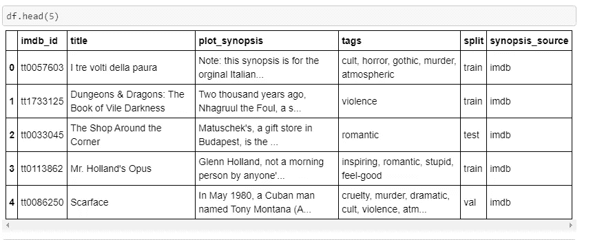
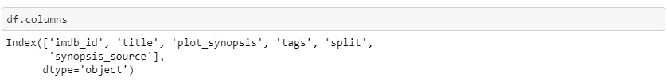
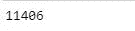
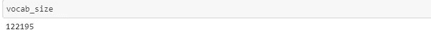
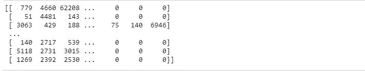
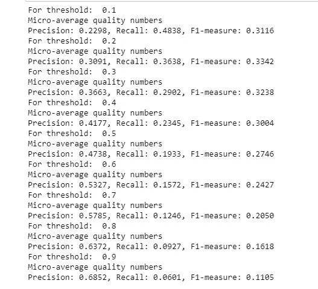
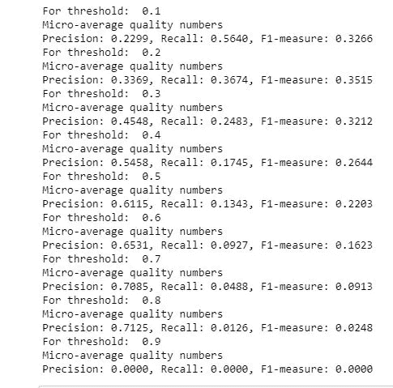

# 多标签文本分类的 Keras

> 原文：<https://pub.towardsai.net/keras-for-multi-label-text-classification-86d194311d0e?source=collection_archive---------0----------------------->


[https://pix abay . com/photos/wintry-dawn-secret-light-trees-4532412/](https://pixabay.com/photos/wintry-dawn-secret-light-trees-4532412/)

## [机器学习](https://towardsai.net/p/category/machine-learning)

## 使用 Keras 进行多标签文本分类的 CNN 和 LSTMs 体系结构

多标签分类可能会变得很棘手，而使用 Keras 中的预建库使其工作变得更加棘手。这个博客有助于使用[CNN](https://towardsdatascience.com/applied-deep-learning-part-4-convolutional-neural-networks-584bc134c1e2)和[lstm](https://towardsdatascience.com/illustrated-guide-to-lstms-and-gru-s-a-step-by-step-explanation-44e9eb85bf21)的多标签分类的工作架构。

传统上，多标签分类被用于预测电影概要中的标签、预测 YouTube 视频上的标签等。


[IMDB 网站上的电影流派标签。](https://www.imdb.com/title/tt7286456/?pf_rd_m=A2FGELUUNOQJNL&pf_rd_p=2aa3b559-b3ee-42e7-a17a-c09997710b8c&pf_rd_r=NBBHYD1GYWMXHMYMBSK4&pf_rd_s=center-3&pf_rd_t=15061&pf_rd_i=homepage&ref_=hm_pks_bfc_lk1)

# **让我们定义一下什么是多标签分类？**

[多标签](https://en.wikipedia.org/wiki/Multi-label_classification)分类是多类分类的推广，多类分类是将实例准确分类到两个以上类别中的一个类别的单标签问题，在多标签问题中，对实例可以被分配到多少个类别没有限制，即在用于训练的输出数据中可以有一个、两个或多个标签。

**使用的度量:**

[F1 得分](https://scikit-learn.org/stable/modules/generated/sklearn.metrics.f1_score.html) : F1 得分是使用精确度和召回率的调和平均值计算的。

```
F1 Score = 2 * (precision * recall) / (precision + recall)
```

该 F1 分数被微平均以将其用作多类分类的度量。它通过计算真阳性、假阳性、真阴性和假阴性的值来计算。在这种情况下，所有预测输出都是列索引，默认情况下按排序顺序使用。

```
**def** f1micro(y_true, y_pred):
    **return** tf.py_func(f1_score(y_true, y_pred,average='micro'),tf.double)
```

# **数据及其理解:**

[本图使用的](https://www.kaggle.com/cryptexcode/mpst-movie-plot-synopses-with-tags)数据取自[卡格尔](https://www.kaggle.com/cryptexcode/mpst-movie-plot-synopses-with-tags)MPST——电影剧情简介数据。

```
df = pd.read_csv(r'F:\mpst_full_data.csv', delimiter=',')
nRow, nCol = df.shape
df.head(5)
```



数据集中的前 5 行



# 数据清理

```
**import** **re**

**def** decontracted(phrase):
    *# specific*
    phrase = re.sub(r"won't", "will not", phrase)
    phrase = re.sub(r"can\'t", "can not", phrase)

    *# general*
    phrase = re.sub(r"n\'t", " not", phrase)
    phrase = re.sub(r"\'re", " are", phrase)
    phrase = re.sub(r"\'s", " is", phrase)
    phrase = re.sub(r"\'d", " would", phrase)
    phrase = re.sub(r"\'ll", " will", phrase)
    phrase = re.sub(r"\'t", " not", phrase)
    phrase = re.sub(r"\'ve", " have", phrase)
    phrase = re.sub(r"\'m", " am", phrase)
    **return** phrasestopwords= set(['br', 'the', 'i', 'me', 'my', 'myself', 'we', 'our', 'ours', 'ourselves', 'you', "you're", "you've",\
            "you'll", "you'd", 'your', 'yours', 'yourself', 'yourselves', 'he', 'him', 'his', 'himself', \
            'she', "she's", 'her', 'hers', 'herself', 'it', "it's", 'its', 'itself', 'they', 'them', 'their',\
            'theirs', 'themselves', 'what', 'which', 'who', 'whom', 'this', 'that', "that'll", 'these', 'those', \
            'am', 'is', 'are', 'was', 'were', 'be', 'been', 'being', 'have', 'has', 'had', 'having', 'do', 'does', \
            'did', 'doing', 'a', 'an', 'the', 'and', 'but', 'if', 'or', 'because', 'as', 'until', 'while', 'of', \
            'at', 'by', 'for', 'with', 'about', 'against', 'between', 'into', 'through', 'during', 'before', 'after',\
            'above', 'below', 'to', 'from', 'up', 'down', 'in', 'out', 'on', 'off', 'over', 'under', 'again', 'further',\
            'then', 'once', 'here', 'there', 'when', 'where', 'why', 'how', 'all', 'any', 'both', 'each', 'few', 'more',\
            'most', 'other', 'some', 'such', 'only', 'own', 'same', 'so', 'than', 'too', 'very', \
            's', 't', 'can', 'will', 'just', 'don', "don't", 'should', "should've", 'now', 'd', 'll', 'm', 'o', 're', \
            've', 'y', 'ain', 'aren', "aren't", 'couldn', "couldn't", 'didn', "didn't", 'doesn', "doesn't", 'hadn',\
            "hadn't", 'hasn', "hasn't", 'haven', "haven't", 'isn', "isn't", 'ma', 'mightn', "mightn't", 'mustn',\
            "mustn't", 'needn', "needn't", 'shan', "shan't", 'shouldn', "shouldn't", 'wasn', "wasn't", 'weren', "weren't", \
            'won', "won't", 'wouldn', "wouldn't"])
```

上面定义的函数“decontracted”从数据框中提取一个文本列，并删除所有 HTML 标签和特殊字符。

在下面给出的代码片段中，数据集中提供的情节提要已经被清除。

```
**from** **tqdm** **import** tqdm
preprocessed_synopsis = []
*# tqdm is for printing the status bar*
**for** sentance **in** df['plot_synopsis'].values:
    sentance = re.sub(r"http\S+", "", sentance)
    sentance = BeautifulSoup(sentance, 'lxml').get_text()
    sentance = decontracted(sentance)
    sentance = re.sub("\S*\d\S*", "", sentance).strip()
    sentance = re.sub('[^A-Za-z]+', ' ', sentance)
    *# https://gist.github.com/sebleier/554280*
    sentance = ' '.join(e.lower() **for** e **in** sentance.split() **if** e.lower() **not** **in** stopwords)
    preprocessed_synopsis.append(sentance.strip())df['preprocessed_plots']=preprocessed_synopsis
```

# **培训和测试拆分**

在数据集的输出标签中，电影类型使用“，”分隔，在[一次性编码](https://towardsdatascience.com/tagged/one-hot-encoder)之前已经清除。因此，在从输出标签中删除空格后，数据被分成训练和测试数据集。

```
**def** remove_spaces(x):
    x=x.split(",")
    nospace=[]
    **for** item **in** x:
        item=item.lstrip()
        nospace.append(item)
    **return** (",").join(nospace)df['tags']=df['tags'].apply(remove_spacetrain=df.loc[df.split=='train']
# cv=df.loc[df.split=="val"]
# cv=cv.reset_index()
train=train.reset_index()
test=df.loc[df.split=='test']
test=test.reset_index()
```

# 为培训和测试准备标签

由于这是一个多标签分类，所以输出标签需要一个热编码。为此，我们使用了使用 sci-kit learn 方法的[单词袋](https://scikit-learn.org/stable/modules/feature_extraction.html)技术。

```
vectorizer = CountVectorizer(tokenizer = **lambda** x: x.split(","), binary='true')
y_train = vectorizer.fit_transform(train['tags']).toarray()
y_test=vectorizer.transform(test['tags']).toarray()
```

**输入序列的最大长度**

```
**def** max_len(x):
    a=x.split()
    **return** len(a)
In [23]:max(df['plot_synopsis'].apply(max_len))
```



绘图的最大长度

**词汇量**

```
vect=Tokenizer()
vect.fit_on_texts(train['plot_synopsis'])
vocab_size = len(vect.word_index) + 1
print(vocab_size)
```



# **使用 LSTMs 建模**

1.  **填充并使所有输入序列长度相同，准备输入序列**

```
encoded_docs_train = vect.texts_to_sequences(train['preprocessed_plots'])
max_length = vocab_size
padded_docs_train = pad_sequences(encoded_docs_train, maxlen=1200, padding='post')
print(padded_docs_train)
```



```
encoded_docs_test =  vect.texts_to_sequences(test['preprocessed_plots'])
padded_docs_test = pad_sequences(encoded_docs_test, maxlen=1200, padding='post')
encoded_docs_cv = vect.texts_to_sequences(cv['preprocessed_plots'])
padded_docs_cv = pad_sequences(encoded_docs_cv, maxlen=1200, padding='post')
```

**2。定义模型:**对于这个问题，我们使用[嵌入层](https://keras.io/layers/embeddings/)作为第一层，使用 71(唯一标签总数)维密集层作为输出层。

```
model = Sequential()
*# Configuring the parameters*
model.add(Embedding(vocab_size, output_dim=50, input_length=1200))
model.add(LSTM(128, return_sequences=**True**))  
*# Adding a dropout layer*
model.add(Dropout(0.5))
model.add(LSTM(64))
model.add(Dropout(0.5))
*# Adding a dense output layer with sigmoid activation*
model.add(Dense(n_classes, activation='sigmoid'))
model.summary()out[]:_________________________________________________________________
Layer (type)                 Output Shape              Param #   
=================================================================
embedding_6 (Embedding)      (None, 1200, 50)          4939100   
_________________________________________________________________
lstm_4 (LSTM)                (None, 1200, 128)         91648     
_________________________________________________________________
dropout_6 (Dropout)          (None, 1200, 128)         0         
_________________________________________________________________
lstm_5 (LSTM)                (None, 64)                49408     
_________________________________________________________________
dropout_7 (Dropout)          (None, 64)                0         
_________________________________________________________________
dense_5 (Dense)              (None, 71)                4615      
=================================================================
Total params: 5,084,771
Trainable params: 5,084,771
Non-trainable params: 0
```

为什么最后致密层是 Sigmoid 而不是 Softmax？

在上述架构的最后一层，使用 sigmoid 函数代替 softmax。与 Softmax 相比，使用 sigmoid 的优势在于一个大纲可能有许多可能的类型。使用 Softmax 函数意味着一种风格出现的概率取决于其他风格的出现。但是对于这个应用程序来说，我们需要一个函数来给出流派出现的分数，这将独立于任何其他电影流派的出现。

[](https://www.depends-on-the-definition.com/guide-to-multi-label-classification-with-neural-networks/) [## python 中神经网络的多类多标签分类指南

### 通常在机器学习任务中，一个样本有多个可能的标签，但这些标签并不相互排斥。这个…

www.depends-on-the-definition.com](https://www.depends-on-the-definition.com/guide-to-multi-label-classification-with-neural-networks/) 

**3** 。**使用‘Adam’作为优化器和二进制交叉熵作为损失函数的训练。**

```
model.compile(optimizer='adam', loss='binary_crossentropy')
history = model.fit(padded_docs_train, y_train,
                    class_weight='balanced',
                    epochs=5,
                    batch_size=32,
                    validation_split=0.1,
                    callbacks=[])
```

4.模型的分析和 f1 微分数的计算:模型中的最终密集层具有 71(独特电影类型的总数)个维度。输出中的每个维度都有一个介于 0 和 1 之间的分数，0 是任何流派最不可能的分数，1 是最好的分数。

已经定义了阈值矩阵，其值在 0.1 到 0.9 的范围内。然后，我们对预测的输出运行一个循环，并将其与阈值进行比较，只有当标签的相应值大于阈值时才选择标签。

这在两个方面有所帮助:

1.  选择最佳阈值，并使用它来预测标签。
2.  通过比较每次迭代中预测的标签和测试数据集中的原始标签，计算微观平均 F1 分数。

```
predictions=model.predict([padded_docs_test])
thresholds=[0.1,0.2,0.3,0.4,0.5,0.6,0.7,0.8,0.9]**for** val **in** thresholds:
    pred=predictions.copy()

    pred[pred>=val]=1
    pred[pred<val]=0

    precision = precision_score(y_test, pred, average='micro')
    recall = recall_score(y_test, pred, average='micro')
    f1 = f1_score(y_test, pred, average='micro')

    print("Micro-average quality numbers")
    print("Precision: **{:.4f}**, Recall: **{:.4f}**, F1-measure: **{:.4f}**".format(precision, recall, f1)) 
```



不同阈值的 F1 分数表示 F1 度量分数如何随不同阈值而变化。它按照预期的那样进行-非常大或非常小的阈值给出了较低的 F1 度量得分值，因为当基于较低的阈值选择标签时，选择了太多的标签，这降低了 F1 度量得分，而当阈值变得非常大时，几乎没有标签被选择，从而降低了性能度量。

# **使用 CNN 建模:**

1.  第一步与我们在上面的 LSTMs 模型中所做的一样。这里的第一层也是一样的，我们使用了一个嵌入层，后面是完全连接的层。人们可以使用其他变化和层的深度，也可以尝试不同的辍学值。

```
model = Sequential()
model.add(Embedding(vocab_size, 71, input_length=1200))
model.add(Conv1D(64, 3, activation='sigmoid'))
model.add(Conv1D(100, 3, activation='sigmoid'))
model.add(Conv1D(100, 3, activation='sigmoid'))
*# model.add(Dropout(0.70))* model.add(Conv1D(48, 3, activation='sigmoid'))
model.add(Flatten())
model.add(Dense(71))

model.summary()out[]:_________________________________________________________________
Layer (type)                 Output Shape              Param #   
=================================================================
embedding_5 (Embedding)      (None, 1200, 71)          8675845   
_________________________________________________________________
conv1d_5 (Conv1D)            (None, 1198, 64)          13696     
_________________________________________________________________
conv1d_6 (Conv1D)            (None, 1196, 100)         19300     
_________________________________________________________________
conv1d_7 (Conv1D)            (None, 1194, 100)         30100     
_________________________________________________________________
conv1d_8 (Conv1D)            (None, 1192, 48)          14448     
_________________________________________________________________
flatten_2 (Flatten)          (None, 57216)             0         
_________________________________________________________________
dense_9 (Dense)              (None, 71)                4062407   
=================================================================
Total params: 12,815,796
Trainable params: 12,815,796
Non-trainable params: 0
_________________________________________________________________
```

使用 adam 优化器和二进制交叉熵进行训练。

```
model.compile(optimizer='adam', loss='binary_crossentropy')
model.fit(padded_docs_train, y_train,
                        epochs=10,
                        verbose=**False**,
                        validation_data=(padded_docs_test, y_test),
                        batch_size=16)predictions=model.predict([padded_docs_test])
**for** val **in** thresholds:
    print("For threshold: ", val)
    pred=predictions.copy()

    pred[pred>=val]=1
    pred[pred<val]=0

    precision = precision_score(y_test, pred, average='micro')
    recall = recall_score(y_test, pred, average='micro')
    f1 = f1_score(y_test, pred, average='micro')

    print("Micro-average quality numbers")
    print("Precision: **{:.4f}**, Recall: **{:.4f}**, F1-measure: **{:.4f}**".format(precision, recall, f1))
```



对于非常高或非常低的阈值值，度量分数也呈现较低的趋势。

# 结论:

在这篇博客中，我们尝试了两种架构，即 LSTMs 和 CNN，然后使其适用于多标签分类问题。我们从数据探索开始，然后使用词汇表的大小定义模型。一旦模型被训练，我们使用不同的阈值，然后基于在测试数据集上给出最佳 F1 微分数的阈值分数来选择标签。

*连接阿曼:https://www.linkedin.com/in/aman-s-32494b80*

**参考文献:**

完整笔记本参考此处:[https://github . com/sawarn 69/MPST-电影-剧情-提要/blob/master/LSTMs % 20 tag % 20 from % 20 Synopsis . ipynb](https://github.com/sawarn69/MPST-Movie-Plot-Synopsis/blob/master/LSTMs%20Tag%20from%20Synopsis.ipynb)

www.appliedaicourse.com

[https://towards data science . com/multi-class-text-classification-with-lstm-1590 bee 1 BD 17](https://towardsdatascience.com/multi-class-text-classification-with-lstm-1590bee1bd17)

[](https://blog.mimacom.com/text-classification/) [## 使用 Keras 执行多标签文本分类

### 文本分类是应用机器学习的常见任务。无论是问答平台上的问题，还是支持…

blog.mimacom.com](https://blog.mimacom.com/text-classification/) 

[https://stack abuse . com/python-for-NLP-multi-label-text-classification-with-keras](https://stackabuse.com/python-for-nlp-multi-label-text-classification-with-keras/)