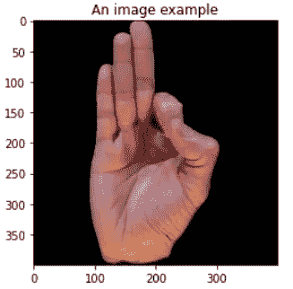
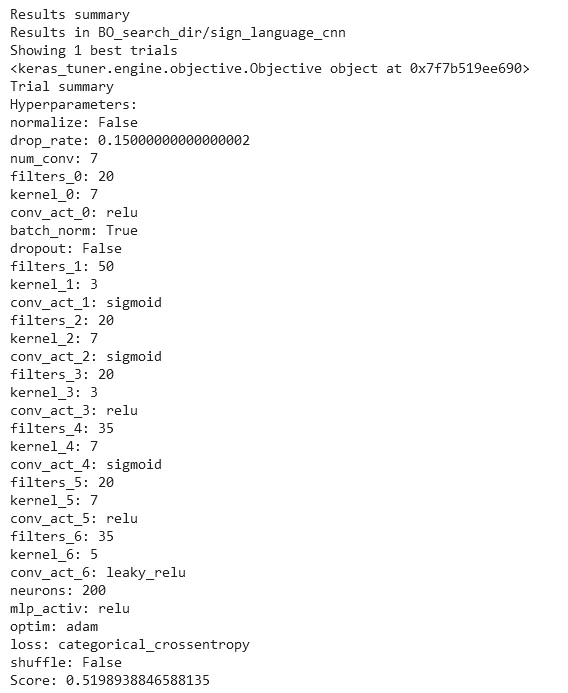

# 停止使用网格搜索！关于 Keras 调谐器的完整实用教程

> 原文：<https://pub.towardsai.net/keras-tuner-tutorial-hyperparameter-optimization-tensorflow-keras-computer-vision-example-c9abbdad9887?source=collection_archive---------0----------------------->

深度神经网络自动超参数调谐实用教程。autoML 教程。


由[维里·伊万诺娃](https://unsplash.com/@veri_ivanova?utm_source=medium&utm_medium=referral)在 [Unsplash](https://unsplash.com?utm_source=medium&utm_medium=referral) 拍摄的照片

## 内容:

1.  介绍
2.  加载数据
3.  Keras 调谐器的基础知识
4.  将所有这些放在一起(代码解释)
5.  执行超参数搜索
6.  提取和训练最佳模型
7.  额外收获:一些提示和技巧
8.  最后的想法

# 介绍

在本文中，您不仅将学习如何使用 KerasTuner，还将学习其他教程中没有包括的一些**技巧，例如单独调整每个层中的参数，或者与优化器一起调整学习速率，由于某些限制，这并不简单，等等。同时使用 37 个类别的手语计算机视觉数据集。**

即使是专家也经常陷入试错程序的兔子洞，直到他们为自己的神经网络找到一个好的超参数组合。 **Keras-Tuner** 是一款工具，可以帮助你优化你的神经网络，找到一个接近最优的超参数集。在幕后，它利用高级搜索和优化方法，如超波段搜索和贝叶斯优化。您只需要定义搜索空间，Keras-Tuner 会负责费力的调优过程！

你在考虑加入 Medium 吗？使用我的链接支持我的博客之旅。我会得到一半的奖励，不增加你的费用:)

[](https://medium.com/@poulinakis.kon/membership) [## 通过我的推荐链接加入 Medium-Konstantinos Poulinakis

### 阅读深度学习，数据科学，技术和媒体上的想法。您的会员费直接支持…

medium.com](https://medium.com/@poulinakis.kon/membership) 

# 一个深入实际的例子

我们就赶紧跳着练吧！

## 加载数据

让我们假设我们想要在图像分类数据集上训练 CNN。我们将展示如何利用 KerasTuner 轻松优化我们的神经网络。

首先，用 pip 安装 Keras-Tuner 库并导入必要的库。如果您不想从 pip 输出，使用`-q`标志进行安静安装。

```
!pip install keras-tuner --upgrade
import keras_tuner
from tensorflow import keras
from keras import backend as K
from tensorflow.keras import layers, losses
import numpy as np
import matplotlib.pyplot as plt
import os
```

接下来，我们需要加载一些数据来处理。我选择使用[美国手语(ASL)数据集](https://www.kaggle.com/datasets/ayuraj/asl-dataset)，该数据集在 [CCO](https://creativecommons.org/publicdomain/zero/1.0/) 许可下可在 Kaggle 上获得。它包含代表美国手语的 400x400 RGB 手势图像。它有一个完整的 37 类，每类 70 张图片。我们将训练一个 CNN 模型来对这些手势进行分类。



由于数据集已经基于类构建在文件夹中，加载数据集最简单的方法是使用`keras.utils.image_dataset_from_directory` 实用程序。用`directory` 参数指定父目录路径，并使用`labels=’inferred’`根据文件夹名自动加载标签。使用`label_mode='categorical'`标签作为一个热点向量加载。如果你想让洗牌重现，你可以设置一个`seed`，否则，根本不要使用种子选项。

```
BATCH_SIZE = 64
train_data = keras.utils.image_dataset_from_directory(
                  directory="../input/asl-dataset/asl_dataset",
                  labels= 'inferred',
                  label_mode='categorical',
                  color_mode='rgb',
                  batch_size=BATCH_SIZE,
                  seed=777,
                  shuffle=True,
                  image_size=(400, 400) )p
```

现在使用下面的函数将 `tf.data.dataset`项分成训练值测试子集。我对这个数据集使用 0.7–0.15–0.15 分割规则。

将 tf.data.Dataset 拆分成 train-val-test 并打印它们的元素

数据集加载已完成。让我们进入激动人心的部分！

## Keras 调谐器的基础知识

在进入更复杂的代码之前，我们需要理解 Keras-Tuner 的工作流程。

1.  我们定义了一个`build()` 函数，它接受一个参数 **hp** ( `keras_tuner.Hyperparameter` object)。在里面，我们定义了我们的模型架构和超参数搜索空间。
2.  为了定义一个搜索空间， **hp** object 提供了 4 种方法。`hp.Choice()`、`hp.Int()`、`hp.Float()`和`hp.Boolean()`。`hp.Choice()`方法是最通用的，它接受一系列 str、int、float 或 boolean 值，但所有这些值必须具有相同的类型。其他方法是不言自明的。这里有一些直观的例子

```
# defining the number of neurons in a fully connected layer
units = hp.Choice(name="neurons", values=[150, 200])
# defining the number of neurons dynamically with the hp.Int method
units = hp.Int(name="neurons", min=100, max=200, step=10)
# defining the dropout rate
dropout = hp.Int(name="dropout", min=0.0, max=0.3, step=0.05)
# Automatically assign True/False values.
shuffle = hp.Boolean("shuffle", default=False)
```

3.初始化负责搜索超参数空间的调谐器。Keras-Tuner 提供了 3 种不同的搜索策略，随机搜索，贝叶斯优化和超波段。对于所有的调谐器，我们需要指定一个超级模型、一个要优化的度量、一个计算预算和一个可选的保存结果的目录。有关每个调谐器接受的参数的更多详细信息，请随时查看相关的[文档](https://keras.io/api/keras_tuner/tuners/)。下面是一个超波段调谐器的例子。

```
tuner = keras_tuner.Hyperband(
                       hypermodel=MyHyperModel(),
                       objective = "val_accuracy", #optimize val acc
                       max_epochs=50, #for each candidate model
                       overwrite=True,  #overwrite previous results
                       directory='hyperband_search_dir', #Saving dir
                       project_name='sign_language_cnn')
```

4.执行搜索。该命令将启动搜索。您需要提供用于训练和评估被搜索模型的训练和验证数据。

```
tuner.search(x=train_data, 
             max_trials=50,  # Max num of candidates to try
             validation_data=val_data,
             batch_size=BATCH_SIZE)
```

# 把所有的放在一起

以上都有很多种结合方式。下面介绍的方法提供了很大的灵活性。

首先，我们定义一个继承自`keras_tuner.HyperModel`的超级模型类，并定义 build 和 fit 方法。

通过 build 方法，我们开发了我们的架构，并使用 **hp** 参数来设置超参数搜索空间。我们还编译我们的模型并返回它。

fit 方法接受 hp 参数、要训练的模型、训练数据`x` ，并且还传递将被传递到 keras `model.fit()`方法中的`*args`和`**kwargs`。`**kwargs`应该总是传递给`model.fit()`，因为它包含了模型保存的回调和可选的 tensorboard 插件。

> 在我们的超级模型类中定义一个`fit()`方法给了你在训练过程中搜索参数的灵活性，而不仅仅是在构建过程中。

超模类。在类内部，我们定义模型和搜索空间。

> 以上网络和参数仅供展示之用。您可以随意定制网络和搜索空间，因为它更适合您的应用。

## **来细说一下:**

在第 3–5 行，我们开始构建 Keras 模型并添加一个调整大小层。在第 7–8 行，我们使用`hp.Boolean`来评估是否最好添加一个标准化层，而在第 10 行，我们为辍学率定义了不同的可能值。

**第 12–17 行**稍微复杂一点。我们动态地指定我们的模型应该有多少卷积层**，同时为每一层定义不同的超参数空间。**本质上，我们从 7 到 8 设置 conv 层的数量，并且对于每一层，我们独立地搜索最优的滤波器数量、核大小和激活函数。我们通过在字符串`name=f”kernel_{i}”`中使用索引 I，为循环中的每次迭代使用不同的`name`参数来实现这一点。这给了我们很大的灵活性，允许我们极大地扩展搜索空间。然而，要小心，因为可能的组合可能会变得非常大，并且需要大量的计算能力。

> 在循环中使用`name=f”kernel_{i}”`指定可调变量的名称，允许您为每个层上的每个参数定义不同的搜索空间。

在第 18–22 行中，我们在 conv 块中添加(或不添加)漏失和批量标准化层。我们在 28–31 中也做了同样的工作，但针对的是全连接层。

在第 24–27 行，我们添加了一个展平层，后面是可搜索数量的全连接层，每个层都有不同的参数要优化，类似于第 12–17 行。

在第 36–39 行，我们编译了我们的模型，但是优化器的选择和要使用的 loss 仍然是一个可搜索的超参数。Keras 调谐器的一个限制是它不接受除 int、float、str 或 boolean 之外的变量。因此，我们不能在 choice 方法中传递`keras.optimizer`对象。这将我们的超参数搜索限制在优化器和损失函数上，Keras 已经给了它们一个字符串别名，例如 `keras.optimizers.Adam() -> 'adam'`。

**由于上述限制，如何调整学习速率并不简单。在第 41–43 行，我们以一种“黑客”的方式完成了**。

> 下面的代码允许您更改优化器的超参数，比如学习率，甚至当您调优不同的优化器时，keras tuner 没有以直接的方式提供这些参数。
> 
> `from keras import backend as K`
> `learning rate = hp.Choice('lr', [0.03, 0.01, 0.003])`
> `K.set_value(model.optimizer.learning_rate, learning_rate)`

在第 48–53 行，我们定义了超级模型类的`fit(self, hp, model,x, *args, **kwargs)`方法。正如您可能观察到的，我们将惠普定义为一个论点。**这也允许我们在训练过程中调整超参数值。**作为一个例子，我在每个时期之前使用了训练数据的混洗。确保将`add**kwargs`作为一个参数，因为它包含了在搜索过程中保存模型的回调函数(以及可选的 tensorboard 插件)。

通过运行下面几行作为测试，确保一切正常工作

```
classes = 37
hp = keras_tuner.HyperParameters()
hypermodel = MyHyperModel()
model = hypermodel.build(hp, classes)
hypermodel.fit(hp, model, np.random.rand(BATCH_SIZE, 400, 400,3),
               np.random.rand(BATCH_SIZE, classes))
```

# 执行超参数搜索

假设一切正常，现在是初始化搜索的时候了。在下面的代码中，我使用了贝叶斯优化策略。这是 AutoML 中最好的搜索方法之一。

传递一个超级模型对象，将目标设置为您希望优化的指标(例如“val_accuracy”、“train_loss”)，并使用`max_trials` 参数和保存模型的路径来定义计算预算。

```
tuner = keras_tuner.BayesianOptimization(
                        hypermodel=MyHyperModel(),
                        objective = "val_accuracy",
                        max_trials =10, #max candidates to test
                        overwrite=True,
                        directory='BO_search_dir',
                        project_name='sign_language_cnn')
```

要开始搜索，执行下面的命令，就可以开始了。当你喝咖啡休息的时候，Keras-Tuner 会处理剩下的事情。

```
# epochs defines how many epochs each candidate model
# will be trained for. The more the better, but slower.
tuner.search(x=train_data, epochs=10,
             validation_data=val_data)
```

一旦你喝完咖啡，或者一旦搜索完成，你可以用`tuner.results_summary(1)`访问搜索结果。您可以看到为每个超参数选择了哪个值，以及最佳模型在其训练期间获得的验证分数。



调谐器结果 _ 摘要的输出。由于搜索策略的随机性，结果可能会有所不同。

要自动提取和构建最佳候选模型，请运行下面几行。如果您想要提取多个表现最佳的模型，而不仅仅是第一个，请更改 `tuner.get_best_hyperparameters(5)`中的数字。

```
# Get the top 2 hyperparameters.
best_hps = tuner.get_best_hyperparameters(1)
# Build the model with the best hp.
h_model = MyHyperModel()
model = h_model.build(best_hps[0])
```

接下来，我们必须在完整的数据集上为多个时期训练这个模型。**您还可以传递回调函数**，例如提前停止、保存最佳模型和学习速率调度程序。

用回调函数训练模型

一旦你的模型被训练，绘制学习图用于检查和评估测试数据集。如果您满意，保存模型以供以后部署使用

`model.load_weights(‘Net_weights.h5’)
model.evaluate(test_data)
model.save(‘Best_model’)`

# 额外收获:一些提示和技巧

1.  如果你的数据集非常大，搜索时间太长，你可以在搜索过程中只使用一小部分进行训练，比如 30%。这通常会在很短的时间内提供相似的结果。然后你可以在全套上重新训练最好的模型。
2.  为了加快搜索过程，您可以减少每个候选人接受训练的时期数。然而，这可能会降低搜索优化的精度，因为倾向于在早期表现更好的候选人将会进一步进步，即使他们的表现在后来饱和。尝试在时间和结果精度之间找到最佳平衡点。
3.  在搜索过程中可能出现的一个问题是您将耗尽磁盘空间。在搜索过程中，优化器会自动将所有模型保存在项目目录中，但不会动态删除被丢弃的模型。这将快速加载磁盘内存，并可能导致崩溃，特别是如果您正在 Kaggle 或 Google Colab 上运行代码。这是一个报告的问题[ [1](https://github.com/keras-team/keras-tuner/issues/288) ][ [2](https://github.com/keras-team/keras-tuner/issues/481) ]，开发者已经在 Keras 调谐器库中将其标记为增强。如果出现“磁盘空间不足”错误，请考虑限制搜索空间或将搜索分成多个较小的搜索。最后，如果您在本地环境中工作，请确保在每次搜索后丢弃“坏”模型。

# 最后的想法

在本教程中，我们探索了 Keras 调谐器工具的使用。这个工具允许我们优化我们的网络架构(层数、神经元数等)..)以及它们的超参数(例如，激活函数、优化器、损耗等..).

与手动或网格搜索方法相比，KerasTuner 中实施的搜索策略允许进行更快、更容易的微调。利用搜索方法，如贝叶斯优化或超波段搜索，不仅会节省你的时间，而且通常情况下，你会得到一个比没有它们更好的模型。

# 参考

[1] Keras 调谐器文档，【https://keras-team.github.io/keras-tuner/ 

[2]贾斯珀·斯诺克，雨果·拉罗歇尔，瑞安·p·亚当斯，
*实用贝叶斯优化机器学习算法，(2012)，*[https://arxiv.org/abs/1206.2944](https://arxiv.org/abs/1206.2944)

[3]李，贾米森，德萨沃，罗斯塔米扎德，塔尔沃卡，*超波段:一种基于 Bandit 的超参数优化方法(2018)，*[14](https://arxiv.org/abs/1603.06560)

*如果你学到了一些有用的东西，请关注我，获取更多深度学习内容和技术教程。使劲鼓掌也让我感觉很棒:)*

如果你愿意支持我，你可以使用我的链接成为 Medium 的一员。我会得到一半的奖励，不需要你额外付费:)

[](https://medium.com/@poulinakis.kon/membership) [## 通过我的推荐链接加入 Medium-Konstantinos Poulinakis

### 阅读深度学习，数据科学，技术和媒体上的想法。您的会员费直接支持…

medium.com](https://medium.com/@poulinakis.kon/membership) 

*感谢阅读，随时联系！*

**我的链接:** [中](https://medium.com/@poulinakis.kon)|[*LinkedIn*](https://www.linkedin.com/in/konstantinos-poulinakis-4554821a3/)*|[GitHub](https://github.com/Poulinakis-Konstantinos)*