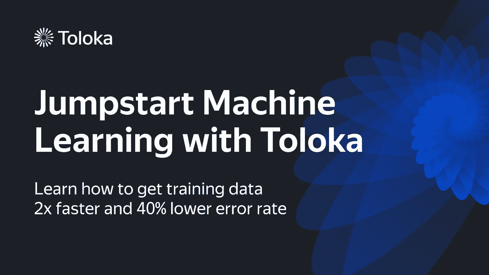

# 关键 ML 概念，AI 是怎么造出来的，NNs 能思考吗？还有+！

> 原文：<https://pub.towardsai.net/key-ml-concepts-how-was-ai-coined-can-nns-think-and-32c2ad1f09f4?source=collection_archive---------2----------------------->

## [**迅**](https://towardsai.net/p/category/newsletter)

## 人工智能(AI)时事通讯《走向 AI #16》

***如果你阅读这封邮件有困难，请在*** [***网络浏览器***](http://news.towardsai.net/n21) ***上查看。***

每个人。我们希望你一切都好。在这一期，我们深入到一个令人兴奋的小抄，概述了关键的机器学习概念，人工智能(AI)的历史，神经网络可以思考吗？、从文本中创造艺术的演变以及数据科学就业市场趋势。

这一期是托洛卡·艾带给你的:

[**to loka App Service**](https://toloka.ai/toloka-app-services?utm_source=tai&utm_medium=nslt&utm_campaign=1011)是无监督数据标注的优质级交钥匙解决方案。当您选择 Toloka 应用服务时，我们会为您提供从项目设置到质量控制的一切服务。我们的解决方案非常适合图像、视频、网页和文本的分类，以及从网站和对象选择中提取信息。 [**了解更多**](https://toloka.ai/toloka-app-services?utm_source=tai&utm_medium=nslt&utm_campaign=1011)

你可能已经注意到我们已经稍微改变了时事通讯的格式。我们希望获得您对是否喜欢这种新形式的反馈，以及您的任何反馈。因此，无论如何，请随时给我们留言**。我们希望收到您的来信。**

**好吧，我们开始吧。**

****机器学习小抄:** Google 软件工程师 [**Frank Dai**](https://www.linkedin.com/in/soulmachine/) 等众多投稿人整理出了一份非常技术性、透彻性、意义重大的 [**机器学习小抄**](https://github.com/soulmachine/machine-learning-cheat-sheet) ，里面包含了许多经典的机器学习方程式和图表。它是有用的，因为它包括许多 ML 的关键概念，以及作为机器学习工作面试的资产。**

****人工智能(AI)起源:**早在 1955 年，由约翰·麦卡锡、马文·明斯基、纳撒尼尔·罗彻斯特、克劳德·香农、艾伦·纽厄尔、希尔伯特·西蒙、威廉·考茨等许多杰出科学家领导的一群研究人员发起了人工智能项目。该项目最初被称为“ [**”，是关于人工智能**](http://jmc.stanford.edu/articles/dartmouth/dartmouth.pdf) 的达特茅斯夏季研究项目的提案，并于同年 8 月 31 日发表——这是一段令人激动的技术历史。**

****神经网络能思考吗？:**最近，由安德里亚·巴尼诺、简·巴拉格尔和查尔斯·布伦德尔领导的一群 DeepMind 科学家发表了一篇名为“ [**PonderNet:学会思考**](https://arxiv.org/pdf/2107.05407.pdf) ”的科学论文，其中谈到了一种新的算法，让神经网络在对复杂任务做出决定之前“思考”或“思考一会儿”——类似于人类和计算机的思维方式。**

****从文本中创造艺术:**你可能已经熟悉 Open AI 的一个非凡项目，名为 [**DALL-E**](https://openai.com/blog/dall-e/) ，它展示了神经网络如何从文本中生成图像。但是，**艺术呢？**Berkeley AI 的本科生研究员 Charlie Snell 最近发表了一篇关于“ [**异梦:一个新兴的艺术场景**](https://ml.berkeley.edu/blog/posts/clip-art/) ”的博客，深入探讨了艺术如何可以用不同类型的模型来创作，如 CLIP、DALL-E、VQ-甘、StyleGAN 等。—揭示基于剪辑的生成艺术发展的里程碑**

****数据科学就业市场趋势:**我们更新了关于 [**数据科学就业市场趋势**](https://towardsai.net/p/data-science/current-data-science-job-market-trend-analysis-future-4184f03a04ca) 的工作，在这里，我们根据 3000 多个与数据相关的职位发布，深入探讨并展示了当今在 2021 年获得数据职位所需的最关键技能。如果有你想看的东西，我们希望收到你的反馈。**

**我们非常感谢你的时间。如果你喜欢时事通讯？如果你还没有订阅 或 [**与你的朋友和同事分享**](http://news.towardsai.net/o21) ，请考虑订阅 [**。这是真诚的感谢。**](https://towardsai.net/subscribe)**

**感谢您的阅读！直到下一次，**

**萨瑞[和**走向艾**和](https://towardsai.net/about)**

> ***往期请查看我们的* [***艾讯***](https://towardsai.net/p/category/newsletter) ***存档*** *。***

> **[**加入 25000 位数据领袖**](https://towardsai.net/subscribe) 上《走向 AI》简讯。这是免费的，我们不发垃圾邮件，我们也不会分享你的电子邮件地址。及时了解人工智能领域的最新工作。从研究到项目和想法。如果您正在建立一个人工智能相关的产品或服务，我们邀请您考虑成为 [**赞助商**](https://sponsors.towardsai.net) **。****

** [## 赞助商|了解如何成为《走向人工智能》的赞助商

### 无论你是想以一种吸引读者的方式突出你的产品，吸引高度相关的小众受众，还是…

sponsors.towardsai.net](https://sponsors.towardsai.net/)  [## 店铺↓ |走向 AI

### 发布最好的技术、科学和工程|社论→https://towardsai.net/p/editorial |订阅→…

ws.towardsai.net](https://ws.towardsai.net/shop)  [## 加入我们吧↓ |面向人工智能成员|数据驱动的社区

### 向着 AI 加入。通过成为会员，你不仅将支持人工智能，但你将有机会…

members.towardsai.net](https://members.towardsai.net/) 

*哪里关注我们:*

*[***脸书***](https://www.facebook.com/towardsAl/)***】|***[***推特***](https://twitter.com/towards_ai?lang=en)***]|***[***insta gram***](https://www.instagram.com/towards_ai/)***]|***[***LinkedIn***](https://www.linkedin.com/company/towards-artificial-intelligence)***