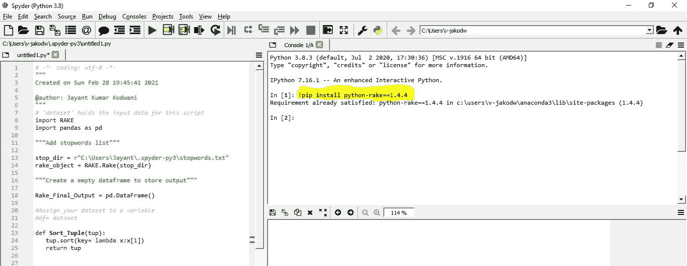
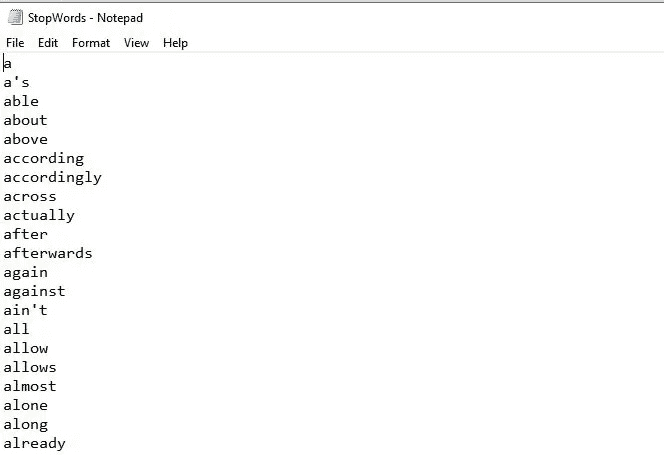
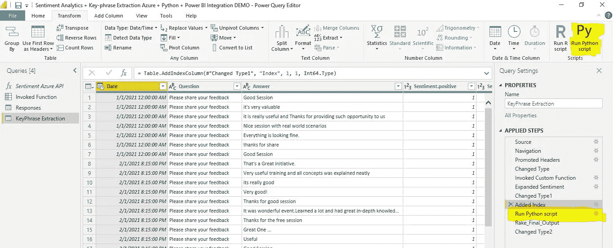
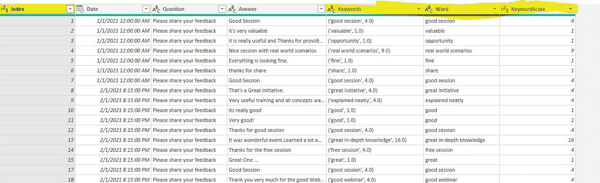
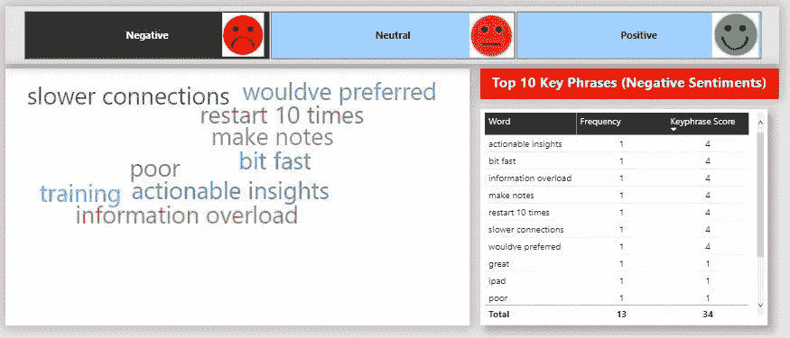
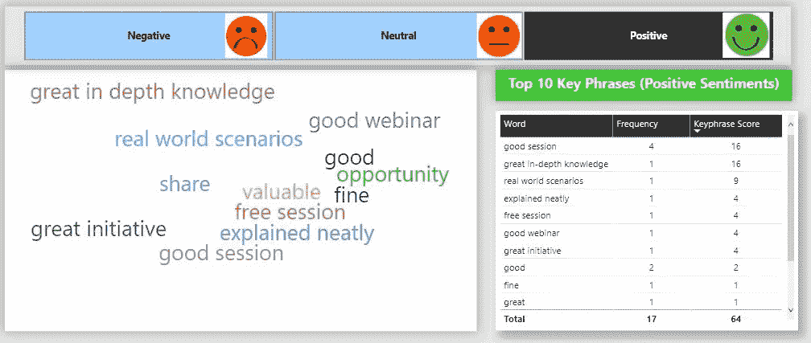

# 关键词提取和可视化:Python 和微软 Power BI

> 原文：<https://pub.towardsai.net/key-phrase-extraction-and-visualization-python-and-power-bi-4b459c7fa426?source=collection_archive---------3----------------------->

## [自然语言处理](https://towardsai.net/p/category/nlp)

# 发现非结构化文本中的见解

在 Python 和 Power BI 集成中实现 RAKE 算法


关键词提取，照片由 [Rabie Madaci](https://unsplash.com/@rbmadaci?utm_source=medium&utm_medium=referral) 在 [Unsplash](https://unsplash.com?utm_source=medium&utm_medium=referral) 上拍摄

我们生活在一个数据成为新货币的时代！这使得大型科技巨头成为世界上最富有的公司。未来几十年最好的投资将是对数据的投资。那么，这些公司用这些数据做什么呢？任何人如何处理来自脸书邮报、Twitter 或 Linkedin 的文本和非结构化数据？对于门外汉来说，扫描或采样听起来可能是个好主意，但是，数据科学家知道采样的风险以及逐文本、逐行、逐词扫描文本的痛苦😬。这就是数据专家使用 ***“关键短语提取”的地方。***

> ***关键短语提取*** 是评估非结构化文本并返回关键短语列表的技能。例如，给定输入文本“食物很美味，有很棒的员工”，服务返回主要话题:“食物”和“很棒的员工”。

# 我们将讨论什么？

在这个故事中，我们将使用 Python 中的 RAKE 算法对一组样本数据提取关键短语，然后在 Microsoft Power BI 中可视化。

以下是我们将使用的示例数据的链接: [**示例数据**](https://github.com/jayantkodwani/AI-Text-Analytics/blob/main/Sentiment%20Analysis%20using%20Azure%20Text%20Analytics%20%26%20Power%20BI/Sample%20Data%20for%20Sentiment%20Analysis.xlsx)

# 耙子是什么？

RAKE 是快速自动关键词提取算法的缩写，它是一种独立于领域的关键词提取算法，通过分析单词出现的频率及其与文本中其他单词的共现来尝试确定文本主体中的关键短语。

# 所需资源

*   Python 实例(即 Spyder)
*   微软商务智能桌面(专业版许可)
*   (可选)Microsoft Azure 订阅(免费试用或付费)将关键短语与情感相关联。

# 你准备好了吗？？我们开始吧🏄

# 步骤 1:安装 RAKE 包并存储停用词表

**1.1 安装:**打开 Python 实例(即 Spyder🐍)并发出下面的命令来安装 rake 包。

```
!pip install python-rake==1.4.4
```



在 Spyder Python 实例中安装 RAKE 算法包

**1.2 创建停用词列表:**停用词是通常对文本分析没有帮助的词，并且通常在所有信息系统中被丢弃，也不包括在各种文本分析中，因为它们被认为是无意义的。被认为带有与文本相关的含义的词被描述为带有的**内容，并被称为**内容词**。您可以在此下载 [**停用词表**](https://github.com/jayantkodwani/AI-Text-Analytics/blob/main/Key%20Phrase%20Extraction%20and%20Visualization/StopWords.txt) 并根据您的需求进行定制。将其保存在所需位置，并复制用于配置 Python 脚本的路径。**



停用词示例

# 步骤 2:打开 Power BI，导入数据并配置 Python 脚本

**2.1 Power BI 数据导入:**打开 Power BI 桌面的新实例> >从 Excel 导入数据( [**样本数据**](https://github.com/jayantkodwani/Text-Analytics/blob/main/Sentiment%20Analysis%20using%20Azure%20Text%20Analytics%20%26%20Power%20BI/Sample%20Data%20for%20Sentiment%20Analysis.xlsx) **)** > >浏览样本数据文件> >导入数据> >调用 Power 查询编辑器中的“运行 Python 脚本”(在 Transform 下)



在超级查询编辑器中调用“运行 Python 脚本”

**2.2 准备您的 Python 脚本:**您可以使用下面的 Python 脚本，并通过替换**第 11 行**中的停用词列表的路径对其进行自定义。

此外，您可以通过修改**第 31 行**中的计数来指定/限制要提取的关键短语的数量(即*将[-1:]替换为[-5:]以从 1 个文本输入中获得最多 5 个关键短语)*

完成定制后，您可以应用脚本并展开**“Rake _ Final _ Output”**数据集。您可以**保存并关闭**Power Query 编辑器来应用脚本。这是为关键短语及其分数添加新字段后数据集的外观。



含关键词和分数的 Power BI 数据集

# 步骤 3: Power BI 集成和可视化

现在是我们都喜欢的有趣的部分，可视化！💝

为了使关键短语形象化，我建议使用单词云☁️和表格，最好使用[情感分析](https://towardsdatascience.com/analyzing-and-visualizing-sentiments-from-unstructured-raw-data-c263ba96cc2c)😃，这样你就可以把关键短语与积极、中立和消极的情绪联系起来。

您可以[下载一个示例 Power BI 模板](https://github.com/jayantkodwani/AI-Text-Analytics/blob/main/Key%20Phrase%20Extraction%20and%20Visualization/Sentiment%20Analytics%20%2B%20Key-phrase%20Extraction%20Azure%20%2B%20Python%20%2B%20Power%20BI%20Integration%20DEMO.pbix)，它集成了情感分析和关键短语提取，所有这些都打包在 Power BI 中。

正如你在下面的例子中看到的，我们有“*十大负面情绪关键词”*，其中“**连接变慢**”和“**重启 10 次”**等短语与负面情绪直接相关😢



具有负面情绪相关性的词云

同样，我们有“*十大积极情绪关键短语*”，其中类似于**“解释清楚”**和**“知识渊博”**的短语与积极情绪直接相关😃。



具有正面情感相关性的词云

# 结论

我们学到了📘如何应用 RAKE 算法提取关键短语并整合 Microsoft Power BI 中的分析以开发可视化。

您可以使用其他数据集并定制代码，看看什么最适合您的用例！👍

发现了一种不同的关键短语提取方法。请放在评论里！

# 参考

[1][https://docs . Microsoft . com/en-us/azure/cognitive-services/text-analytics/tutorials/tutorials-power-bi-key-phrases](https://docs.microsoft.com/en-us/azure/cognitive-services/text-analytics/tutorials/tutorial-power-bi-key-phrases)

[2][https://towards data science . com/analyzing-and-visualizing-opinions-from-unstructured-raw-data-c 263 ba 96 cc 2c](https://towardsdatascience.com/analyzing-and-visualizing-sentiments-from-unstructured-raw-data-c263ba96cc2c)

[3]数据来源:作者手工编制