# 用于分类和回归的 KNN 算法:Scikit- Learn 实践

> 原文：<https://pub.towardsai.net/knn-algorithm-for-classification-and-regression-hands-on-with-scikit-learn-4c5ec558cdba?source=collection_archive---------0----------------------->

## [机器学习](https://towardsai.net/p/category/machine-learning)

## Google Colab 和 Python

```
Table of Contents:A — KNN for classification
***1\. Import Libraries
2\. Build a dataset
3\. Explore Dataset
4\. Setting variables for ML
5\. Split data into train and test* 6\. Building the model
*7\. Finding best k value
8\. Model Complexity
9\. Plotting decision boundaries***B — KNN for regression
***1\. Import Libraries***
...
**6\. Building the model
*7\. Finding best k value
8\. Model Complexity***C — Advantages and Disadvantages of KNN
**AdvantagesDisadvantages**
```

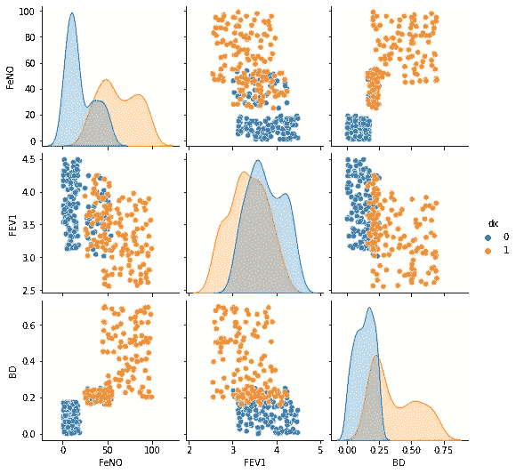

k 近邻算法是机器学习中最简单的算法之一。这是一种为输入数据集中最近邻的聚类分配一个点的聚类算法。该算法可用于将 k-最近邻问题近似为分类任务，其中 k 是最近邻的数量。它还可以用于回归任务，通过找到相关邻居的平均差异。

## A — KNN 分类:

当使用 KNN 进行分类任务，并且 k=1 时，我们的模型简单地从数据集中搜索更接近我们想要分类的值的数据点。如果我们选择 k=3、k=5 或 K= *n* ，模型将搜索更接近我们想要分类的值的 3、5 或 *n* 个值。然后，我们的值被分配给具有更多值的类。

***例 1:*** 对于 k=7，模型发现，从与我们的值比较接近的 7 个点中，有 3 个来自类 0，4 个来自类 1。在这种情况下，我们的值将被分配给类 1。

***例 2:*** 对于 k=6，模型发现，在最接近我们值的 6 个点中，有 3 个来自类 0，3 个来自类 1。在这种情况下，模型将根据我们的值和每个类的三个点计算中值欧氏距离。我们的值将被分配给具有较低欧几里德距离的类。

## **动手:**

***1。导入库:***

正如机器学习中的任何其他项目一样，第一件事是导入必要的库:

```
#Import Libraries:from random import random
from random import randint
import numpy as np
import pandas as pdimport matplotlib.pyplot as plt
import seaborn as snsfrom sklearn.model_selection import train_test_split
from sklearn.neighbors import KNeighborsClassifierfrom mlxtend.plotting import plot_decision_regions
```

***2。建立数据集:***

接下来，我将创建一个假数据集用于此任务。您可以出于学习目的进行同样的操作，或者如果您正在处理现实世界中的问题，也可以使用您的数据。

```
#Fabricating variables:#Creating values for FeNO with 3 classes:
FeNO_0 = np.random.randint(1,20, 100)
FeNO_1 = np.random.randint(25,55, 100)
FeNO_2 = np.random.randint(45, 100, 100)#Creating values for FEV1 with 3 classes:
FEV1_0 = [np.random.uniform(3.12,4.50) for _ in range(100)]
FEV1_1 = [np.random.uniform(2.98,4.25) for _ in range(100)]
FEV1_2 = [np.random.uniform(2.55,3.99) for _ in range(100)]#Creating values for Bronco Dilation with 3 classes:
BD_0 = [np.random.uniform(0,0.180) for _ in range(100)]
BD_1 = [np.random.uniform(0.160,0.250) for _ in range(100)]
BD_2 = [np.random.uniform(0.200,0.700) for _ in range(100)]#Creating labels variable with two classes (1)Disease (0)No disease:
not_asma = np.zeros((150,), dtype=int)
asma = np.ones((150,), dtype=int)
```

请注意，我已经用三个类创建了三个变量，而 label 变量只有两个类。这是有目的的，通过添加一些具有两个类特征的条目，在数据集中制造一些复杂性。

现在是时候将这三类变量连接成一个变量了:

```
#Concatenate classes into one variable:
FeNO = np.concatenate([FeNO_0, FeNO_1, FeNO_2])
FEV1 = np.concatenate([FEV1_0, FEV1_1, FEV1_2])
BD = np.concatenate([BD_0, BD_1, BD_2])
dx = np.concatenate([not_asma, asma])
```

现在创建一个数据帧并将变量添加到数据帧中:

```
#Create DataFrame:
df = pd.DataFrame()#Add variables to DataFrame:
df['FeNO'] = FeNO.tolist()
df['FEV1'] = FEV1.tolist()
df['BD'] = BD.tolist()
df['dx'] = dx.tolist()
```

要检查数据帧，只需键入:

```
df
```

您将看到一个名为 df 的数据帧，有 300 行和 4 列:

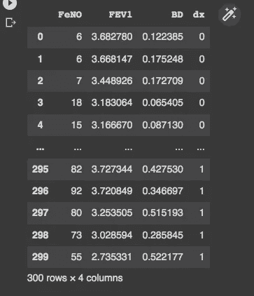

***3。探索数据集:***

探索我们的数据集和变量之间的关系:

```
#Exploring dataset:# left
sns.pairplot(df, kind="scatter", hue="dx")
plt.show()# right: you can give other arguments with plot_kws.
sns.pairplot(df, kind="scatter", hue="dx")
plt.show()
```


***4。设置变量:***

在机器学习项目中，我们通常将包含特征的数据集称为 ***X*** ，将标签数组称为 ***y*** 。创建我们的 ***X*** 和 ***y*** 变量:

```
X = df.drop('dx', axis=1)
y = df['dx']
```

我们可以通过键入 ***X*** 来检查是否一切正常:

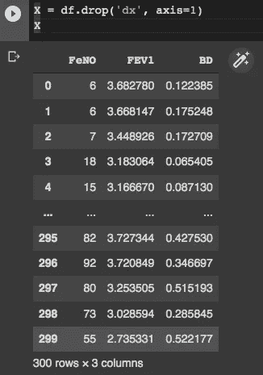

和 ***y*** :

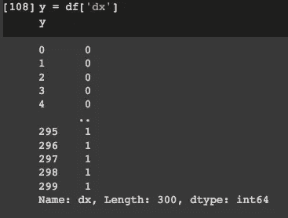

***5。将数据分成训练和测试:***

现在，我们将把数据分为训练和测试两部分。这很重要，因为我们将用一个训练子集来训练我们的模型，并用一个测试子集来测试模型的准确性。Scikit-Lear 有一个我们将使用的 **train_test_split** 函数。我们将 80%的数据用于训练，20%用于测试(用 test_size=0.20 表示):

```
X_train, X_test, y_train, y_test = train_test_split(X, y, test_size=0.20)
```

**6。建立模型:**

现在是时候构建模型并将数据传递给模型了。我们从 k=1 开始。

```
clf = KNeighborsClassifier(n_neighbors=1)
clf.fit(X_train, y_train)
```

我们可以从模型中看到一些预测:

```
clf.predict(X_test)
```

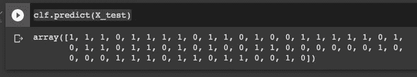

要评估模型:

```
clf.score(X_test, y_test)
```

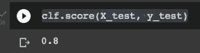

***7。寻找最佳 k:***

我们可以看到我们的模型精度为 0.80。不错，但我们可以尝试不同的 k 数。为了寻找最佳的 k 数，我们尝试不同的随机 k，或者我们可以建立一个图表，绘制不同的 k 值和模型精度。在这种情况下，我将尝试 1 到 30 之间的 k 值。

```
training_accuracy = []
test_accuracy = []# try n_neighbors from 1 to 30.
neighbors_settings = range(1, 31)for n_neighbors in neighbors_settings:
    # build the model
    clf = KNeighborsClassifier(n_neighbors=n_neighbors)
    clf.fit(X_train, y_train)
    # record training set accuracy
    training_accuracy.append(clf.score(X_train, y_train))
    # record generalization accuracy
    test_accuracy.append(clf.score(X_test, y_test))plt.plot(neighbors_settings, training_accuracy, label="training accuracy")
plt.plot(neighbors_settings, test_accuracy, label="test accuracy")
plt.legend()
```

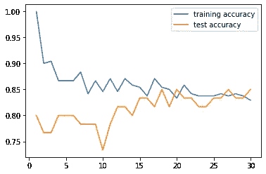

通过图形检查，k=20 似乎具有最好的测试精度。所以我们建立了 k=20 的模型:

```
clf = KNeighborsClassifier(n_neighbors=20)
clf.fit(X_train, y_train)
clf.predict(X_test)
clf.score(X_test, y_test)
```

现在我们的分数是 0.82，略高于 0.8。

**8。模型复杂度:**

使用 k=20 而不是 k=1 增加了我们模型的准确性。KNN 的另一个重要方面是，k 值较高的模型复杂度较低。因此，通过使用更高的 k，我们不仅提高了模型的准确性，而且降低了复杂性。

***9。绘制决策边界:***

决策边界图最适用于只有两个要素的数据。我们的数据有三个特征，但我们仍然可以通过选择使用哪些特征来绘制决策边界。

第一步是将我们的数据集存储为 CSV 格式，并使用 pandas 再次导入它:

```
df.to_csv('data.csv', index = False)
data = pd.read_csv('data.csv')
```

现在，我们将构建一个函数来创建另一个模型并绘制决策边界。有了这三个变量，我们可以构建三个不同的图。对于这个例子，我将 FEV1 和 BD 作为特征:

```
def knn_comparison(data,k):
    x = data[['FEV1','BD',]].values
    y = data['dx'].astype(int).values
    clf = KNeighborsClassifier(n_neighbors=k)
    clf.fit(x,y)
    print(clf.score(x,y)) #Plot decision region:
    plot_decision_regions(x,y,clf=clf, legend=2) #Adding axes annotations:
    plt.xlabel('X_train')
    plt.ylabel('y_train')
    plt.title('KNN with k='+str(k))
    plt.show()
```

要构建模型和情节，只需调用函数:

```
knn_comparison(data,20)
```

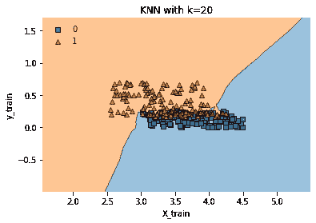

## B —用于回归的 KNN:

KNN 算法也可以用于回归。如果 K=1，回归值将是数据集中最近点的值。如果 k=n 且 n>1，则回归值将是我们的值与数据集中 n 个点之间的欧氏距离的平均值。

***1。导入库:***

我们还需要一个:

```
from sklearn.neighbors import KNeighborsRegressor
```

由于我们将使用相同的数据集，我们可以直接跳到第 6 步。

***6。*建筑模型:**

为了构建模型，我们将遵循与分类中非常相似的步骤，从 k=1 开始:

```
reg = KNeighborsRegressor(n_neighbors=1)
reg.fit(X_train, y_train)
reg.predict(X_test)
reg.score(X_test, y_test)
```

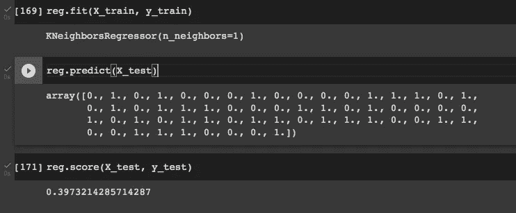

我们模特的分数是 0.40 左右，很差。我们将努力找到最佳的 k 值，并改进我们的模型预测。

**第七期*。寻找最佳 k 值:***

```
training_accuracy = []
test_accuracy = []# try n_neighbors from 1 to 30.
neighbors_settings = range(1, 31)for n_neighbors in neighbors_settings:
    # build the model
    reg = KNeighborsRegressor(n_neighbors=n_neighbors)
    reg.fit(X_train, y_train)
    # record training set accuracy
    training_accuracy.append(reg.score(X_train, y_train))  
    # record generalization accuracy
    test_accuracy.append(reg.score(X_test, y_test))plt.plot(neighbors_settings, training_accuracy, label="training accuracy")
plt.plot(neighbors_settings, test_accuracy, label="test accuracy")
plt.legend()
```

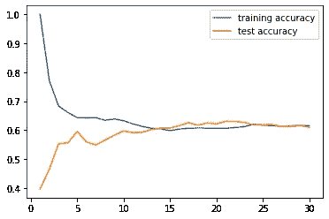

分析图表，k=22 似乎是一个最佳值。

```
reg = KNeighborsRegressor(n_neighbors=22)
reg.fit(X_train, y_train)
reg.predict(X_test)
reg.score(X_test, y_test)
```

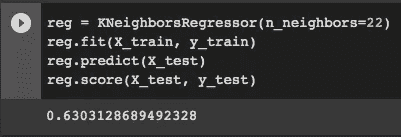

正如所料，增加 k 值，增加了模型得分，现在大约为 0.63，比 0.39 好得多。

***8。模型复杂度:***

与分类类似，增加回归模型中的 k 数会降低模型的复杂性。考虑更多的邻居，至少是令人窒息的预测。

## KNN 的优势和劣势

和所有其他算法一样，KNN 算法有优点也有缺点。其中一些是:

***优点:***
——简单的 ML 模型；
-易于理解并向非技术人员解释；
-易于工程化(仅针对 k 进行调整)；
-在尝试更复杂的模型之前最好考虑一下。

***缺点:***
——对于非常大的数据集执行速度较慢；无法处理和表现许多特征。

## 结论

在机器学习项目中，KNN 是一种简单易行的算法，尤其是当我们有一小组特征要分析，并且我们的数据被分成固定数量的类别时。在本文中，您将找到完成项目所需的全部内容，包括构建、评估和设计模型的 python 代码，以及在需要时构建图形可视化。

感谢您的阅读！

如果你喜欢这篇文章，别忘了关注我，这样你就能收到关于新出版物的所有更新。

**其他如果:**想了解更多，可以通过[我的推荐链接](https://cdanielaam.medium.com/membership)订阅 Medium 会员。它不会花你更多的钱，但会支付我一杯咖啡。

**其他:**感谢阅读！