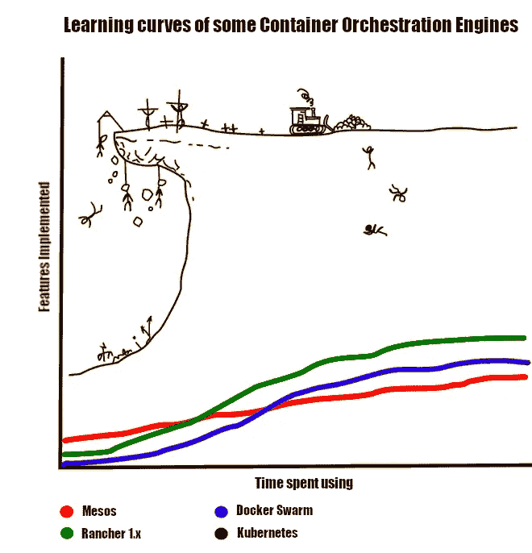
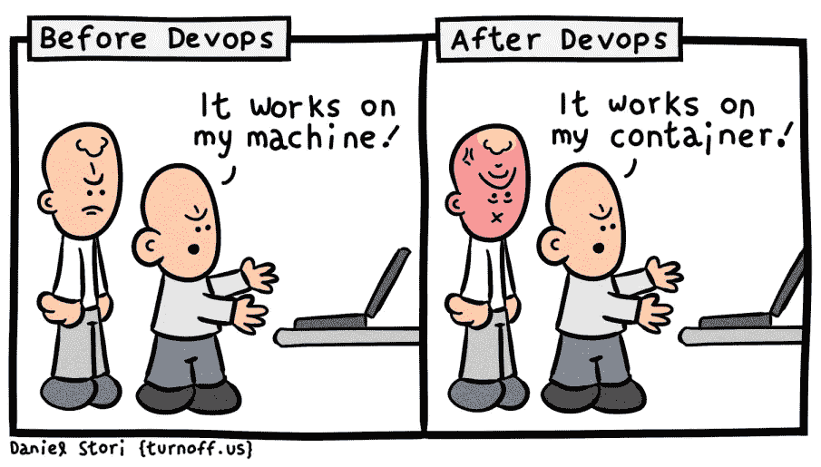
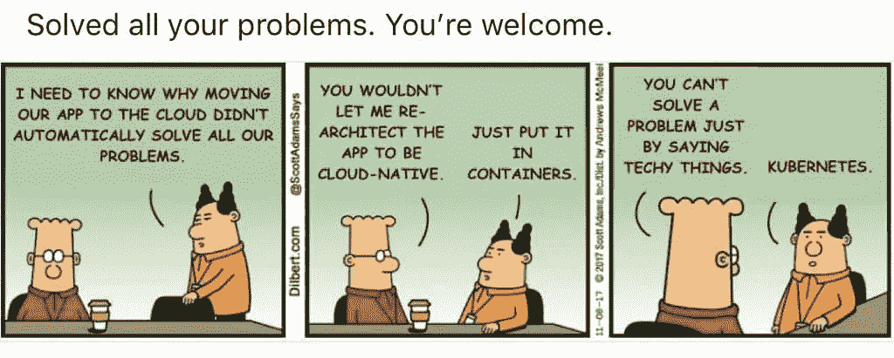
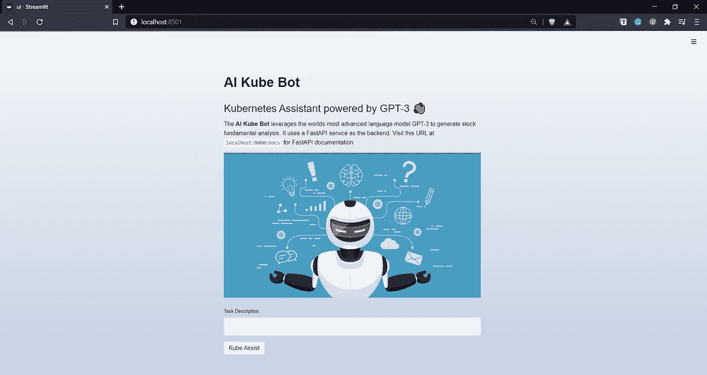
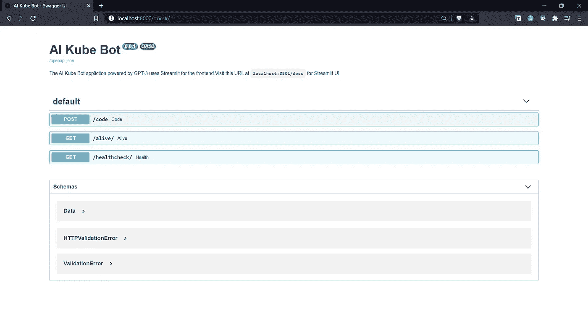

# Kubernetes 通过 GPT-3 轻松实现

> 原文：<https://pub.towardsai.net/kubernetes-made-easy-with-gpt-3-6fb7b2a1f31?source=collection_archive---------1----------------------->

## [自然语言处理](https://towardsai.net/p/category/nlp)

## 利用世界上最先进的语言模型，从简单的英语中自动生成 Kubernetes 命令。

没有编排的行动只是倦怠；Kubernetes 是一个高效的容器编排！

# 先决条件

我以文章的形式收集了这些点，请按照相同的顺序浏览下面的文章，将这些点连接起来，并了解智能 **Kube Bot** 背后的关键技术栈:

1.  [FastAPI——超越烧瓶的美妙方式！](https://medium.com/towards-artificial-intelligence/fastapi-the-spiffy-way-beyond-flask-b00f4f883e1d)
2.  [Streamlit —革命性的数据应用创建](https://medium.com/towards-artificial-intelligence/streamlit-revolutionizing-data-app-creation-e269177d9112)
3.  [GPT-3 简介](/email-assistant-powered-by-gpt-3-ba39dfe999d3)

# 什么是 Kubernetes？

Kubernetes 是一个开源的容器编排平台，支持容器化工作负载和服务的声明式配置和自动化部署。它有一个庞大的、快速增长的生态系统。Kubernetes 的服务、支持和工具随处可见。它最初是由谷歌在 2014 年开发的，当时谷歌需要一种新的方式来大规模运行每周数十亿个容器。

> **Kubernetes 只是编排和管理容器工作流程，就像编排珠子以制作完美的项链一样。**

## 什么是容器？

容器类似于虚拟机，但是它们具有宽松的隔离属性，以便在应用程序之间共享操作系统(OS)。因此，容器被认为是轻量级的。与 VM 类似，容器有自己的文件系统，共享 CPU、内存、进程空间等等。因为它们与底层基础设施相分离，所以它们可以跨云和操作系统发行版进行移植。

> 容器将软件打包成标准化的单元，用于开发、运输和部署。

容器是捆绑和运行应用程序的好方法。在生产环境中，您需要管理运行应用程序的容器，并确保没有停机。例如，如果一个容器关闭，另一个容器需要启动。如果这种行为由一个系统来处理，不是更容易吗？

## 库伯内特来救援了！

Kubernetes 为您提供了一个完美运行分布式系统的框架。它负责您的应用程序的扩展和负载平衡，并为您提供嵌入了故障保护机制的存储协调功能。

# 是什么让 GPT-3 成为一个好的候选者？

问问任何一位 DevOps 工程师，记住用于部署和维护 Kubernetes 集群的 Kubernetes 命令是什么感觉，以及准确编写一个部署文件是什么感觉，在这个部署文件中可能会出现上百种错误。你总是会得到相同的答案:Kubernetes 就像一个海洋，没有办法穿过去！

GPT-3 可以通过少量的训练来学习和做事情，这与在大型语料库上训练 NLP 模型的传统方式相反，传统方式是困难的、耗时的和昂贵的。只要输入一些你要完成的任务的例子，它就能生成出人意料的类似人类的文本。启动 GPT-3 API，让它像 DevOps 工程师一样思考，实际上可以让模型生成准确的 Kubernetes 命令和部署文件。

**由 GPT-3 驱动的 AI Kube Bot** 负责所有繁重的工作，你只需要用简单的英语提供任务描述，就可以在 YAML 生成复杂而准确的部署文件。

# 应用程序演练

现在我将带您一步一步地了解 AI Kube Bot 应用程序:

在创建任何 GPT-3 应用程序时，首先要考虑的是培训提示的设计和内容。提示设计是启动 GPT-3 模型以给出有利的上下文响应的最重要的过程。

> *根据经验，在设计训练提示时，你的目标应该是从模型中获得零反应，如果这不可能，就用几个例子，而不是提供一个完整的语料库。训练提示设计的标准流程应该是这样的:* ***零投→少投→基于语料库的启动。***

Streamlit 支持的 UI(全部用 Python 编写)

FastAPI 的魔力→即时 API 文档

为了设计 AI Kube Bot 应用程序的培训提示，我使用了以下培训提示结构:

*   **描述:**通过添加一两行关于其功能的内容，对 Kube 机器人应该做的事情进行初步描述。
*   **自然语言(英语):**这个组件包含了对 Kubernetes 助手将要执行的任务的一行简单描述。它有助于 GPT-3 理解上下文，以便生成适当的 Kubernetes 命令和部署代码。
*   **输出:**该组件包括 Kubernetes 命令或部署代码，对应于作为 GPT-3 模型输入提供的英文描述。

让我们看一个实际例子，以真正理解 GPT-3 在从纯英语语言生成 Kubernetes 命令和部署代码方面的能力。在下面的例子中，我们将通过向 AI Kube 机器人提供最少的指令来生成 YAML 文件。

# 结论

OpenAI 的 GPT-3 不同于 21 世纪的任何其他人工智能模型，它吸引了公众的注意力。GPT 3 号在以接近人类的效率和准确性执行一系列一般性任务方面的纯粹灵活性使其如此令人兴奋。最后，我们可以看到一个明显的新兴趋势，即基于 GPT 3 的应用程序允许用户仅使用自然语言命令来创建代码或设计数字产品，这预示着无代码应用程序的美好未来。

# 参考

1.  [https://en.wikipedia.org/wiki/GPT-3](https://en.wikipedia.org/wiki/GPT-3)
2.  https://openai.com/blog/openai-api
3.  【https://kubernetes.io/docs/home 
4.  [https://www.docker.com/resources](https://www.docker.com/resources/)

如果你想了解更多，或者想让我写更多关于这个主题的东西，请随时联系我们。

我的社交链接:[LinkedIn](https://www.linkedin.com/in/shubhamsaboo/)|[Twitter](https://twitter.com/Saboo_Shubham_)|[Github](https://github.com/Shubhamsaboo)

*如果你喜欢这篇文章或觉得它有帮助，请花一分钟按一下拍手按钮，它会增加文章对其他媒体用户的可见性。*