# L1 和 L2 规范和正规化

> 原文：<https://pub.towardsai.net/l1-and-l2-norms-and-regularization-c50353e6423?source=collection_archive---------4----------------------->

## [数据科学](https://towardsai.net/p/category/data-science)

## 了解什么是 l1 和 l2 向量范数，以及它们与 l1 和 l2 正则化的关系

由[马库斯·斯皮斯克](https://unsplash.com/@markusspiske?utm_source=medium&utm_medium=referral)在 [Unsplash](https://unsplash.com?utm_source=medium&utm_medium=referral) 上拍摄的照片

大多数(如果不是全部)数据科学家都熟悉 l1 和 l2 正则化。然而，可能不太明显的是，为什么它们被称为 l1 和 l2 正则化，以及它们到底是如何工作的。

在本文中，我们将了解 l1 和 l2 向量范数，并简要讨论它们如何与正则化回归中的 l1 和 l2 正则化相关。

## 向量范数

向量范数指的是可以测量向量大小的不同方法。例如，假设我们正在处理一个具有一个特征的线性回归问题， **β1** 。因此，这个问题有两个参数: **β0** (截距)，和 **β1** 。让我们给这两个参数赋值 1。这些参数的值在一个二维向量中， **β** :

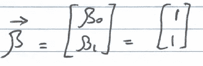

*关于线性代数概念的复习，请查看:*

 [## 用于机器学习的线性代数

### 用于机器学习的线性代数概念综述

towardsdatascience.com](https://towardsdatascience.com/linear-algebra-for-machine-learning-22f1d8aea83c) 

## l2 规范

测量矢量大小最常用的方法是取其 l2 范数，也称为欧几里德范数。这种方法也是我们最熟悉的，因为它测量的是从原点到矢量顶点的笛卡尔距离。*这类似于用勾股定理求直角三角形斜边的长度。*

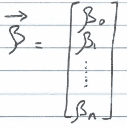

为了找到上述 n 维向量的 l2 范数，我们使用以下等式:

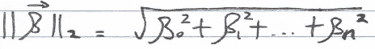

> 注意 l2 范数的符号，它包括向量名称两边的双条，以及数字 2 下标。

因此，我们上面的二维参数向量 **β** 的 l2 范数如下，其包括用于 **β0** 和 **β1** 的参数值 1:

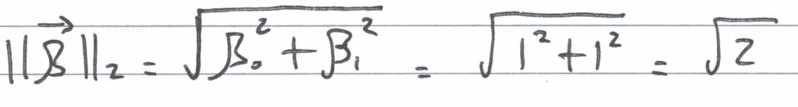

从原点到向量的距离，或其 l2 范数，是 2 的平方根。如果我们用 l2 范数等于 2 的平方根来画每一个向量，我们最终得到一个圆，半径等于 2 的平方根。

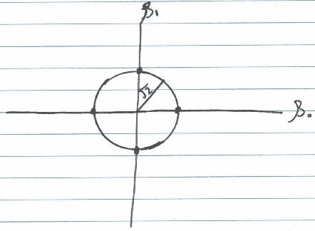

> 这应该是有意义的，因为以原点为圆心的圆有等式:
> a + b = c，其中 c 是半径。

## l1 范数

另一种计算矢量大小的方法是取其 l1 范数，也称为曼哈顿范数。

为了找到 n 维向量的 l1 范数，我们将所有向量参数的绝对值求和如下:

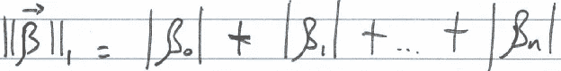

> 注意 l1 范数的符号，它包括向量名称两边的双条，以及数字 1 下标。

因此，上面我们的二维参数向量 **β** 的 l1 范数，以及两个参数 **β0** 和 **β1** 的值 1，如下所示:

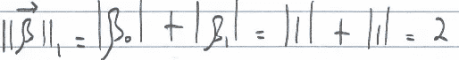

正如我们在上面看到的，l1 范数等于 2。如果我们用 l1 范数等于 2 来绘制每个向量，我们最终会得到一个菱形。

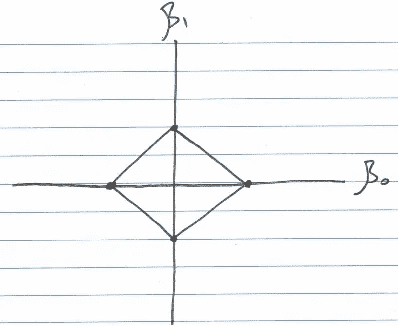

## l1 和 l2 规范与 l1 和 l2 正则化的关系

正则化是一种用于减少过度拟合的技术。换句话说，在低偏差的情况下，当模型过度适应训练数据时，方差将会很高(由于偏差-方差的权衡)，因为模型不会很好地推广到看不见的数据。正则化技术，如 l1 和 l2 正则化，将降低模型的复杂性，从而减少过拟合。

例如，在普通最小二乘(OLS)回归中，目标是最小化残差的平方:

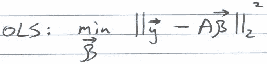

> 注意平方和基本上是如何取残差的 l2 范数平方的。

在正则化回归中，代价函数中增加了一个惩罚项。换句话说，增加了一些约束。要么参数向量的 l1 范数被约束(如在 l1 或 lasso 回归中)，要么参数向量的 l2 范数被约束(如在 l2 或岭回归中)。因此，它们被称为 l1 和 l2 正则化。

*注意:推导这些约束优化问题的以下 lasso 和 ridge 回归目标函数涉及拉格朗日乘数的使用，这可能会在以后的文章中介绍。*

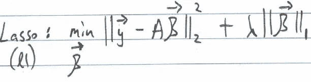

在 l1 回归(也称为 lasso 回归)中，约束条件是我们希望参数向量(包括我们的参数)的 l1 范数等于或低于特定值。换句话说，我们希望最小化成本函数，**，只要**作为 l1 范数低于某个值。

> 正如我们之前看到的，绘制特定 l1 模值的所有向量会给出一个菱形。因此，我们的参数值必须在这个菱形上或之内。

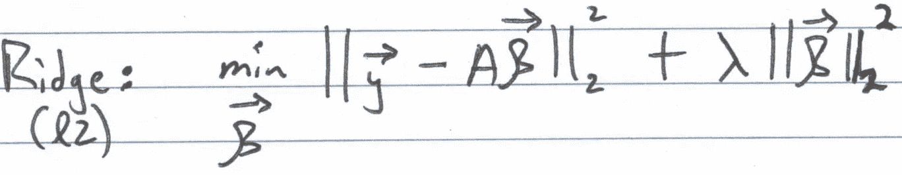

在 l2 正则化中，我们希望参数向量的 l2 范数被约束在某个值或低于某个值。因此，参数向量必须在圆上或圆内(如上所示)。

> 注意:当只有两个参数时，不应使用 l1 和 l2 正则化。这里的目标只是简单直观地理解它们与 l1 和 l2 规范的关系。

如果你喜欢阅读这样的故事，并想支持我成为一名作家，考虑注册成为一名媒体会员。每月 5 美元，你可以无限制地阅读媒体上的故事。如果你用我的 [*链接*](https://lmatalka90.medium.com/membership) *注册，我会赚一小笔佣金。*

 [## 通过我的推荐链接加入媒体——卢艾·马塔尔卡

### 阅读卢艾·马塔尔卡的每一个故事(以及媒体上成千上万的其他作家)。您的会员费直接支持…

lmatalka90.medium.com](https://lmatalka90.medium.com/membership) 

*了解什么是 l1 和 l2 规范将为真正理解 l1 和 l2 正则化希望实现的目标奠定基础。感谢您的阅读！*