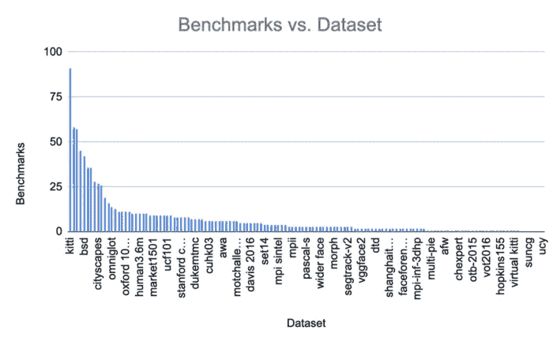

# 缺乏良好的计算机视觉基准数据集是一个问题——让我们来解决这个问题！

> 原文：<https://pub.towardsai.net/lacking-good-computer-vision-benchmark-datasets-is-a-problem-lets-fix-that-c1f7eaf13f69?source=collection_archive---------2----------------------->

## [计算机视觉](https://towardsai.net/p/category/computer-vision)

照片由[克里斯汀·休姆](https://unsplash.com/@christinhumephoto?utm_source=unsplash&utm_medium=referral&utm_content=creditCopyText)在 [Unsplash](https://unsplash.com/s/photos/laptop?utm_source=unsplash&utm_medium=referral&utm_content=creditCopyText) 上拍摄

数据往往介于最先进的计算机视觉机器学习项目和另一项实验之间。不幸的是，没有广泛采用的行业标准来选择最佳和最相关的基准。

想象一下，如果您正在开发一种新的计算机视觉算法，您将如何为您的算法选择正确的基准？你会自己收集它吗？找到引用最多的基准？你如何处理许可或*许可*问题？您在哪里托管这些大型数据集？

由于在选择一个好的基准时所涉及到的所有复杂因素，您通常无法获得您的模型应该能够达到的结果。随着计算机视觉数据集不再是简单的猫和狗，随着计算机视觉生成的数据量在数量和复杂性上的增长，这个问题只会增加。目前，数据集变得越来越复杂，包括来自复杂任务的图像，如汽车在城市中行驶。

反思你如何为你的下一个机器学习任务寻找完美的计算机视觉数据集，可以让你大大改善你的计算机模型的结果。事实就是如此，因为拥有正确的**数据集基准**使您能够评估和比较机器学习方法，以找到最适合您项目的方法。

在机器学习中，基准测试是比较工具和平台以确定行业中性能最佳的技术的实践。基准测试用于使用特定的指标来测量性能，产生一个度量，然后与其他机器学习方法进行比较。

# 拥有正确的数据集基准意味着什么？

现在，您可能会问自己，有没有好的或坏的数据集基准，以及如何识别它们呢？这两个都是机器学习社区中重要而被低估的问题。

在这篇博文中，我们将回答这些问题，以确保在你为打造完美的机器学习模型而投入的所有研究和工作之后，它能够发挥出它的潜力！

## 良好的基准

最近，许多公开可用的真实世界和模拟基准数据集出现在一系列不同的来源中。然而，这些来源之间作为标准的组织和采用是不一致的，因此，许多现有的基准缺乏多样性，无法有效地对计算机视觉算法进行基准测试。

好的基准数据集允许你在直接和公平的比较中评估几种机器学习方法。然而，这些基准测试的一个常见问题是它们不是真实世界的准确描述。

因此，在流行的计算机视觉基准中排名靠前的方法，在创建它们的数据或实验室之外进行测试时，其性能低于平均水平。简而言之，许多数据集基准并不是对现实的准确描述。

好的计算机视觉基准数据集将反映您正在开发的模型的真实世界应用的设置。 [ObjectNet](https://objectnet.dev/objectnet-a-large-scale-bias-controlled-dataset-for-pushing-the-limits-of-object-recognition-models.pdf) 是一个有目的地创建图像库的例子，以避免在流行的图像数据集中发现偏见。ObjectNet 创建背后的意图是反映人工智能算法在现实世界中面临的现实。

毫不奇怪，当几个最好的对象检测器在 ObjectNet 上测试时，它们遇到了显著的性能下降，这表明*需要更好的数据集基准来评估计算机视觉系统。*

## 糟糕的基准

如果好的计算机视觉基准数据集提供了真实世界的公平表示，您能猜出坏的计算机视觉基准数据集的特征吗？

主要包含在理想条件下拍摄的图像的基准会产生对完美和不现实条件的偏差。因此，他们无法处理现实世界中的混乱。

例如，使用 ImageNet 进行的数据集基准测试偏向于您在博客中找到的在线对象图片，而不是真实世界中的图片。

因此，尽管 ImageNet 是计算机视觉的流行数据集，但其数据库中的图像并不能充分代表现实，因此，ImageNet 不是最佳的计算机视觉基准数据集。

# 存在哪些类型的数据集基准？

[马约菲](https://unsplash.com/@mayofi?utm_source=unsplash&utm_medium=referral&utm_content=creditCopyText)在 [Unsplash](https://unsplash.com/s/photos/investment?utm_source=unsplash&utm_medium=referral&utm_content=creditCopyText) 上的照片

对于不同的任务，有许多类型的数据集基准。例如，分割、场景理解和图像分类都需要不同类型的基准。

虽然您现在已经知道如何自己区分好的基准和坏的基准，但是我们希望为您提供一个列表，其中列出了一些用于细分、分类和场景理解的最佳基准。

希望有了这些列表，你可以马上用你的计算机视觉模型来启发这个世界*和*有一个比较基准的参考，以便更好地将基准分为好或坏。

## 用于细分的最佳数据集基准

*   Berkeley 分割数据集和基准([链接](https://www2.eecs.berkeley.edu/Research/Projects/CS/vision/bsds/))
*   KITTI 语义分割基准([链接](http://www.cvlibs.net/datasets/kitti/eval_semseg.php?benchmark=semantics2015#:~:text=Semantic%20Segmentation%20Evaluation,conform%20with%20The%20Cityscapes%20Dataset.))。查看[测试](https://app.activeloop.ai/activeloop/kitti_test)、[训练](https://app.activeloop.ai/activeloop/kitti_train)和[验证](https://app.activeloop.ai/activeloop/kitti_validation) KITTI 数据集的轮毂等效物。

## 分类的最佳数据集基准

*   ObjectNet 基准图像分类([链接](https://paperswithcode.com/sota/image-classification-on-objectnet#:~:text=ObjectNet%20is%20a%20test%20set,for%20rotation%2C%20background%20and%20viewpoint.))

## 场景理解的最佳数据集基准

*   ADE20K val 上的场景理解([链接](https://paperswithcode.com/sota/scene-understanding-on-ade20k-val-1))
*   语义场景理解上的场景理解挑战被动驱动和地面实况定位([链接](https://paperswithcode.com/sota/scene-understanding-on-semantic-scene))

# 为什么数据集基准如此重要？

由于有如此多类型的数据集基准，为每个数据集创建足够高标准的基准是可以理解的**挑战**。

然而，这样做是至关重要的，因为这些基准可以让你看到你的机器学习方法如何在已经被接受为标准的基准数据集中学习模式。

> 但是，当涉及到机器学习技术的性能时，您如何确保您正在使用的基准是正确的测量工具呢？

众所周知，拥有一个准确描述现实的计算机视觉数据集是一项挑战，因为数据集缺乏多样性，并且通常在理想条件下描绘图像或视频。

也许为了制作更好的计算机视觉机器学习模型，我们需要在制作数据集基准时在组织之间进行更多的合作。另外，最受欢迎的数据集有许多基准，而不太知名的数据集几乎没有基准。

上面直方图中展示的趋势展示了流行数据集如何拥有更多基准。由于缺乏基准，局限于最受欢迎的数据集，这使得获取模型上使用的数据集的**多样性**和**精确**描述变得更加困难。

然而，数据集优化公司 [Activeloop](https://www.activeloop.ai/) 是一个用于创建一组集中且多样化的基准数据集的解决方案。

Activeloop 等工具通过数据集的集中存储和版本控制支持数据集协作，允许工程师创建最佳的计算机视觉数据集基准，以开发他们的下一个最先进的模型！

此外，很难从非结构化数据中获得有价值的见解，因为没有存储非结构化数据集的行业标准。Activeloop 的简单性允许许多人使用它，因此它正在成为存储非结构化数据集的行业标准。它的流行使它成为协作创建数据集基准的明显工具。

此外，Activeloop 不需要花费数小时甚至数天的时间来预处理数据集，它允许您高效地集中执行一次预处理步骤，然后上传到 Activeloop 供其他人用来进行基准测试。

显然，从非结构化数据中产生的业务洞察力正变得越来越有价值。然而，随着计算机视觉数据生成的增加，计算机视觉基准无法以相同的速率生成。

为了继续开发最先进的计算机视觉机器学习项目，机器学习开发者之间必须进行有效的合作，以制定更好的计算机视觉基准。Activeloop 可以促进这种高效的协作。