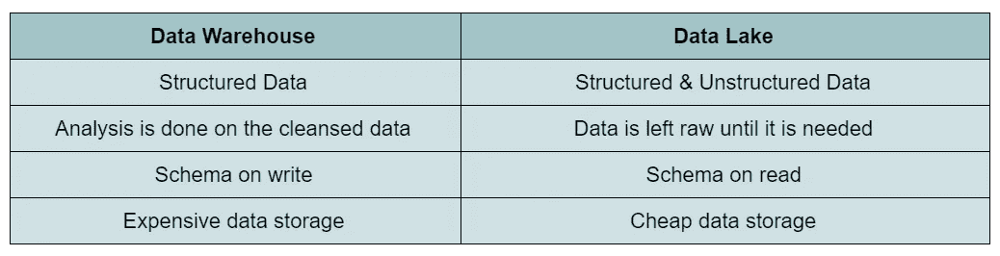
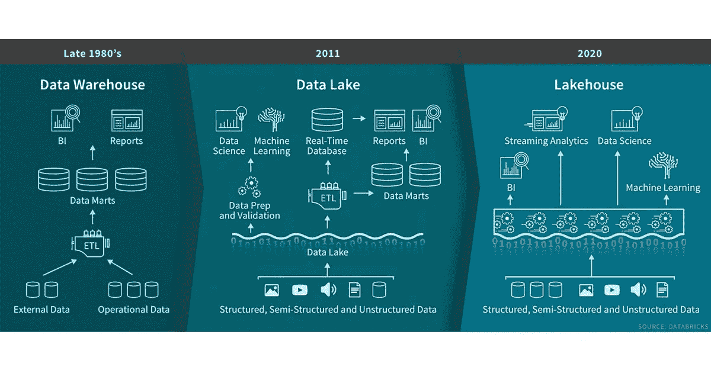
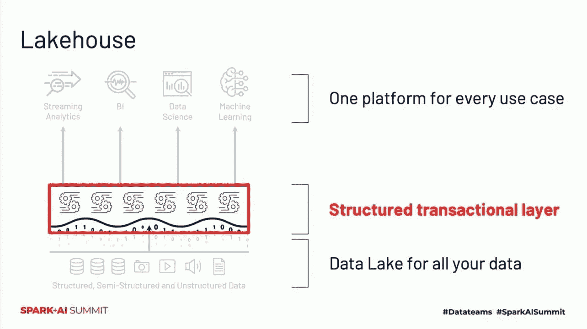

# 湖屋和数据湖的演变

> 原文：<https://pub.towardsai.net/lakehouse-and-the-evolution-of-data-lake-762cf81d0fa1?source=collection_archive---------0----------------------->

## [数据工程](https://towardsai.net/p/category/data-engineering)

## 简化数据基础架构并加速创新

数据库矢量由 [Vecteezy](https://www.vecteezy.com/free-vector/database)

数据存储的历史可以追溯到 20 世纪 50 年代，那时穿孔卡被用来存储计算机产生的数据。从那以后发生了很多变化，这篇文章将涵盖该行业的最新趋势之一，Lakehouse。

图片由[https://www.pickpik.com/](https://www.pickpik.com/)

在我们深入了解什么是 Lakehouse 以及如何从中受益之前，让我们先快速了解一下目前广泛使用的两种数据管理范例。

# 数据仓库

数据仓库的体系结构是在 20 世纪 80 年代开发的，用于支持公司的决策过程。核心概念依赖于以聚合和粒度两种格式处理和存储历史数据。

> **聚合数据**包含高级信息，按组汇总并显示总计、平均值或总和等度量；**粒度数据**包含与业务分析相关的最低细节级别的信息。

这些数据随后被 BI 工具使用，在 BI 工具中，高管和其他员工可以以报告和图表的形式可视化和分析数据。

# 数据湖

随着大数据的出现，不得不重新思考数据仓库等传统架构。由于数据来自不同的来源、不同的格式，并且通常数量更大，因此需要出现一种新的范式来填补这一空白。在数据湖中，数据以原始格式存储，只有在出现业务问题时才会被查询，检索相关数据，然后进行分析以帮助回答问题。数据存储在像亚马逊 S3 这样的云存储中，它已经成为世界上最大和最具成本效益的存储系统之一，因为它可以以低成本存储几乎无限量的原生格式的数据。

图片来自作者

# 莱克豪斯:两个世界中最好的

像任何新兴技术一样，数据湖开始暴露出它的一些弱点。数据库的一些关键功能缺失，不支持事务，难以实施数据质量，并且它依赖于**最终一致性**模型而不是**强一致性**模型。

> **最终一致性**依赖于这样一个概念，即如果没有对给定的数据记录进行新的更新，最终对该记录的所有访问将返回最后更新的值，而**强一致性**提供最新的数据，但代价是高延迟。

Databricks 今年早些时候宣布，Lakehouse 是一个新的范例，它融合了两个世界的精华，包括它们的名字。

Lakehouse 的主要目标是将数据仓库的关键特性引入数据湖模型，为了实现这一目标，我们有了一个新的框架，Delta Lake。

Delta Lake 是一个开源框架，其功能是作为 Apache Spark 和其他大数据平台的存储层。它是由 Databricks 开发的，已被阿里巴巴、迈克菲、尼尔森、Tableau、Talend 和易贝等公司采用。

三角洲湖给湖边小屋带来酸交易的支持。它保证了存储系统的原子性和持久性。

> 在计算机科学中， **ACID** (原子性、一致性、隔离性、持久性)是数据库**事务**的一组属性，旨在保证数据有效性，而不管错误、电源故障和其他灾难。— [维基百科](https://en.wikipedia.org/wiki/ACID)

具体来说，Delta Lake 通过[日志存储 API](https://github.com/delta-io/delta/blob/master/src/main/scala/org/apache/spark/sql/delta/storage/LogStore.scala) 执行事务操作，而不是直接访问存储系统，以便对存储系统实施三个因素:

*   **原子可见性:**确保文件整体可见或者完全不可见。
*   **互斥:**确保只有一个写入者能够在最终目的地创建或重命名文件。
*   **一致列表:**确保一旦一个文件被写入一个目录，该目录的所有未来列表必须返回该文件。

# 支持的存储系统

Delta Lake 为 HDFS、亚马逊 S3 和 Azure 存储服务内置了 [**LogStore**](https://github.com/delta-io/delta/tree/master/src/main/scala/org/apache/spark/sql/delta/storage) 实现。

# 集成

您可以从 Apache Spark 和其他数据处理系统访问增量表。使用*清单文件支持从外部表中读取。*在这个文件中，有一个为查询一个表而读取的数据文件列表。

以下是当前可用的集成列表:

*   **转眼间**
*   **雅典娜**
*   **红移光谱**(实验)
*   **雪花**(实验)
*   **阿帕奇蜂巢**

关于如何使用清单文件和查询增量表设置集成的更多信息可以在 https://docs.delta.io/latest/integrations.html[找到](https://docs.delta.io/latest/integrations.html)

# 湖边小屋建筑

https://databricks.com/图片由[提供](https://databricks.com/)

数据湖和湖屋的主要区别是增加了一个结构化的事务层。

图片由 [SparkAISummit](https://databricks.com/sparkaisummit) 提供

# 最后的想法

在这篇文章中，我们可以看到随着技术变得越来越便宜，公司需要快速适应这种不断变化的环境，技术已经发展了多少，创新的步伐正在加快。让我们看看下一个范式出现需要多长时间。

# 参考资料:

*   基思·d·福特(2018 年 4 月 19 日)。数据仓库的简史。从 https://www.dataversity.net/brief-history-data-warehouse/[取回](https://www.dataversity.net/brief-history-data-warehouse/)
*   本·洛里卡等人(2020 年 1 月 30 日)。什么是湖边小屋？检索自[https://databricks . com/blog/2020/01/30/what-is-a-data-lake house . html](https://databricks.com/blog/2020/01/30/what-is-a-data-lakehouse.html)
*   聚合和粒度信息。检索自[https://www . cese . NSW . gov . au/effective-practices/using-data-with-confidence-main/aggregate-granular](https://www.cese.nsw.gov.au/effective-practices/using-data-with-confidence-main/aggregate-granular)
*   saurabh . v([2017 年 7 月 16 日](https://hackernoon.com/archives/2017/07/16))分布式数据库中的最终 vs 强一致性。检索自[https://hacker noon . com/finally-vs-strong-consistency-in-distributed-databases-282 fdad 37 cf 7](https://hackernoon.com/eventual-vs-strong-consistency-in-distributed-databases-282fdad37cf7)
*   酸(2020 年 10 月 13 日)。维基百科。从 https://en.wikipedia.org/wiki/ACID[取回](https://en.wikipedia.org/wiki/ACID)
*   三角洲湖(2020)。delta[源代码]。[https://github.com/delta-io/delta](https://github.com/delta-io/delta)
*   三角洲湖(2020)。存储配置。从 https://docs.delta.io/latest/delta-storage.html[取回](https://docs.delta.io/latest/delta-storage.html)