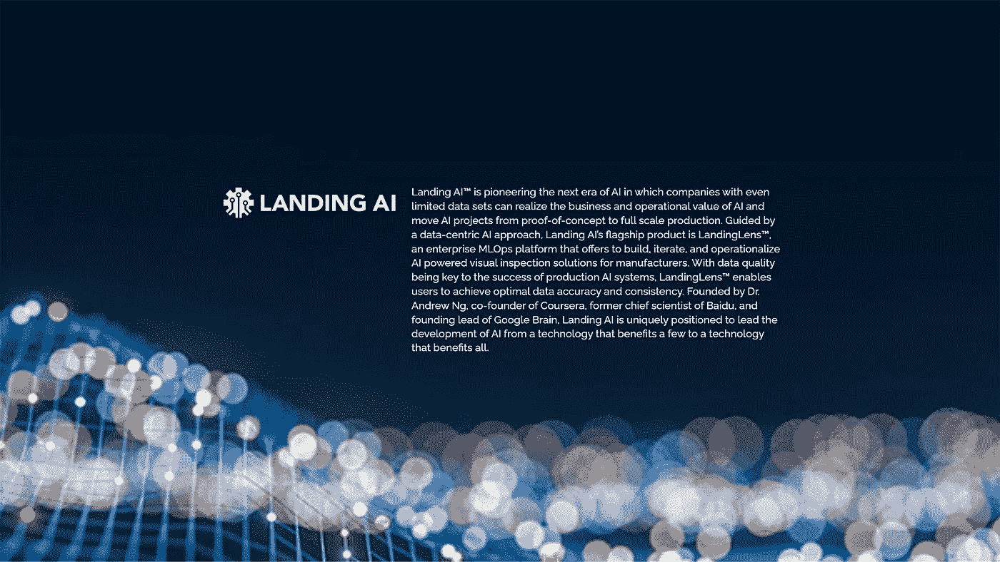
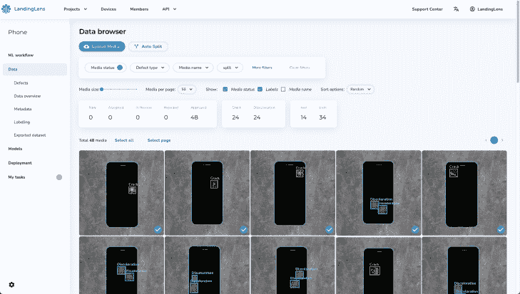

# Landing AI 在 MLOps 平台的 A 轮融资中获得 5700 万美元

> 原文：<https://pub.towardsai.net/landing-ai-secures-57m-on-series-a-for-mlops-platform-4bbb54582731?source=collection_archive---------5----------------------->

来源:[落地 AI](https://landing.ai/)

## [新闻](https://towardsai.net/p/category/news)

## 人工智能在传统行业卷起袖子，登陆人工智能的 MLOps 平台

加利福尼亚州 PALO 阿尔托，2021 年 11 月 8 日— [Landing AI](https://landing.ai/) ，该公司提供工具，使在制造业中构建和部署人工智能系统比以往任何时候都更快更容易，今天宣布获得由 McRock Capital 领投的 5700 万美元 A 轮融资，McRock Capital 是第一家专门专注于工业物联网的投资公司。

此外，总部位于纽约的全球私募股权和风险投资公司 Insight Partners、Taiwania Capital、加拿大养老金计划投资委员会(CPP Investments)、英特尔资本、三星 Catalyst 基金、远东集团的 DRIVE Catalyst、Walsin Lihwa 和 AI 基金都参与了该轮投资。

“人工智能的落地将释放工业物联网的力量，一次一家公司，一家工厂，一条生产线。”

由人工智能梦想家吴恩达领导的 Landing AI 开发了 LandingLens，这是一个快速、易用的企业 MLOps 平台。它应用人工智能和深度学习来帮助制造商解决视觉检查问题，更可靠地发现产品缺陷，并产生商业价值。

Landing AI 认为，人工智能的下一个时代是所有公司都享受人工智能好处的时代——不仅仅是谷歌和脸书这样的消费互联网公司——而是制造业、医疗保健和农业等传统行业。为了做到这一点，Landing AI 表示，各行业应该采用一种新的以数据为中心的方法来构建人工智能，确保数据传达他们需要人工智能学习的内容。使用以数据为中心的人工智能技术，人工智能的应用将不再依赖于大数据，而是依赖于实体实际拥有的数据，而这些数据往往是有限的。

“你并不总是需要大数据来赢得人工智能。Landing AI 的创始人兼首席执行官 Ng 表示:“你需要好的数据来教会人工智能你想让它学习的东西。“当你只有 50 个数据点时，为 5000 万个数据点构建的 AI 不起作用。通过将机器学习带给每个人，无论他们的数据集大小如何，下一个人工智能时代将对所有行业产生现实影响。”

来源:[落地 AI](https://landing.ai/)

以数据为中心的落地 AI 方法对于让 LandingLens 快速易用也至关重要。设计数据的过程，而不是人工智能软件，为制造商提供了一种有效的方式来教会人工智能模型做什么。领域专家现在可以建立一个人工智能系统并将其投入生产，而不仅仅是人工智能专家。例如，领域专家只需点击几下鼠标，就可以完成训练神经网络的工作，而不是写几页代码。这种无代码/低代码的以数据为中心的平台使新用户能够在不到一天的时间内构建高级人工智能模型。使用 LandingLens，过去需要一年多时间的视觉检测项目只需几周即可完成。

“落地人工智能将释放工业物联网的力量，一次一家公司，一家工厂，一条生产线，”McRock Capital 的联合创始人兼管理合伙人斯科特·麦克唐纳(Scott MacDonald)说。“我们与像安德鲁这样坚持不懈的企业家合作，他们为大型工业市场带来了变革性的数字技术。”作为融资的一部分，麦克唐纳已经加入了 Landing AI 董事会。

“制造业的数字化现代化正在快速发展，预计到 2023 年将达到 3000 亿美元，”Insight Partners 董事总经理乔治·马修(George Mathew)表示。“人工智能落地的机会和需求正在爆炸式增长。它将打开目标机器视觉项目的未开发部分，解决质量、效率和输出问题。我们期待在下一阶段登陆人工智能的激动人心的旅程中发挥作用。”

Landing AI 正处于强劲的增长轨道上，客户正在受益。“与 Landing AI 合作可以提高我们质检流程的可靠性和效率，这对我们公司的发展非常重要。QuantumScape 联合创始人兼首席技术官 Tim Holme 表示:“使用像 LandingLens 这样的尖端深度学习工具，使我们的团队能够更快地行动，专注于开发和商业化我们的下一代电池。

新投资将用于加速产品创新，并在 Landing AI 内部发展工程和运营团队，包括工程、产品、销售和营销。要加入 Landing AI 团队，请前往[https://landing.ai/careers/](https://landing.ai/careers/)，要安排 LandingLens 的演示，请点击[这里](https://landing.ai/request-demo/)。

来源: [**落地 AI**](https://landing.ai/news/landing-ai-secures-funding-to-unlock-power-of-small-datasets-unleashing-next-era-of-ai/)

 [## 帮助将人工智能和技术初创公司扩展到企业|走向人工智能

### 《走向人工智能》每月通过我们的定制软件为数百万科技读者提供服务。我们拥有成千上万的人工智能和…

sponsors.towardsai.net](https://sponsors.towardsai.net/)  [## 加入我们吧↓ |面向人工智能成员|数据驱动的社区

### 加入人工智能，成为会员，你将不仅支持人工智能，但你将有机会…

members.towardsai.net](https://members.towardsai.net/)  [## 店铺↓ |走向 AI

### 全球领先的 AI &科技新闻&媒体公司

towardsai.net](https://towardsai.net/shop)