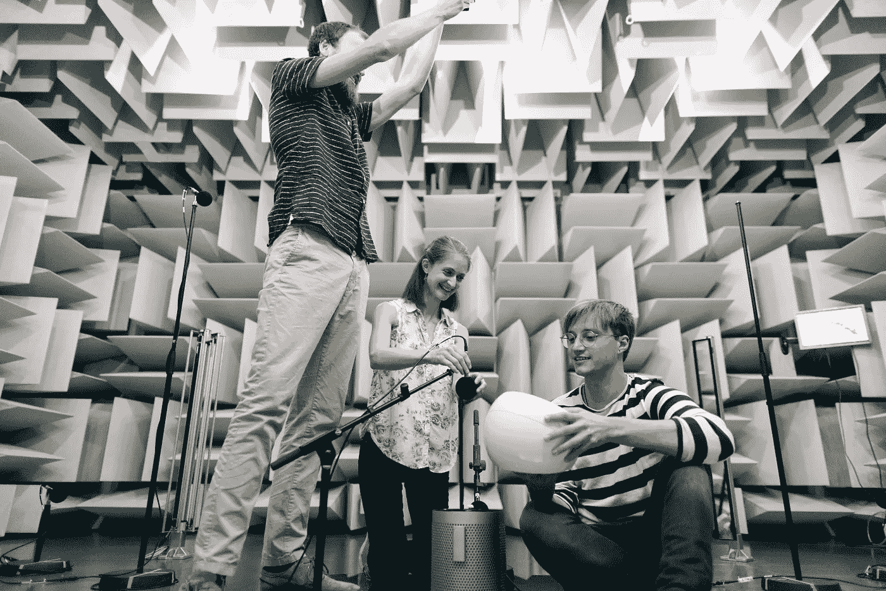

# 大型语言模型(LLM):最重要方法的前三名

> 原文：<https://pub.towardsai.net/large-language-models-llms-top-3-of-the-most-important-methods-f7d92a2aa05a?source=collection_archive---------1----------------------->

## 确保您正在训练或使用的大型语言模型(LLM)提供最佳输出和结果的 3 个要求

由 Pexels 的[this is 工程](https://www.pexels.com/@thisisengineering/)

大型语言模型(LLM)目前适用于自然语言特定的实现，如机器翻译、语音识别和文本生成。LLM 基于大量数据进行训练，可以由许多层组成。

例 1: Google Translate 是一个大型语言模型，使用人工智能将一种语言翻译成另一种语言。它支持 100 多种语言，可以处理每种语言的多种方言。基本上，Google Translate 对 LLM 的使用为语言之间的翻译提供了信息。此外，因为许多用户每天都与它进行交互，所以模型会不断更新。

更详细地说:当有人使用谷歌翻译时，谷歌服务器将使用其内部算法调用的 LLM 来找到在含义和语法规则方面与输入的句子最可能匹配的句子。因此，该模型会将这个结果实时返回给用户，以便他们可以在说完或写完之后立即看到他们的翻译文本。

来自 Pexels 的 [ThisIsEngineering](https://www.pexels.com/@thisisengineering/)

例子 2:生成性对抗网络已经被用来创建与真实图像无法区分的虚假图像——即使是人类也无法区分。

更详细地说:生成性对抗网络采用两个神经网络，一个生成器和一个鉴别器[1]，并使它们相互对抗，直到生成器创建令人信服的输出，或者直到鉴别器不再能够以高置信度辨别哪个输出是假的或不是。

示例 3:考虑 OpenAI 的 GPT，作为行业 LLM 的一种转换能力，允许用户针对特定语言的用例与其进行交互。

更详细地说:GPT 代表“生成性预训练转换器”，能够在对任何数据集进行训练之前，根据给定的上下文为单词确定某些概率函数(与 LSTMs 或长短期记忆等其他方法相比，它在学习速度方面非常有效)。

无需解释，众所周知，Siri 和 Alexa 也是 LLM。

来自 Pexels 的 [ThisIsEngineering](https://www.pexels.com/@thisisengineering/)

# LLM 要成功必须具备哪些条件？

实现 LLM 需要满足三个一般条件:

1.大量数据的存在来训练他们的模型。

2.LLM 有许多层神经元，可以学习数据中的复杂模式。

3.LLM 针对特定任务进行了优化，如机器翻译、图像字幕和语音识别。因此，准确的结果需要正确的特性和用例。

# **存在大量数据来训练他们的模型**

LLM 使用大量数据来训练它们的模型，通过使用特定的方法来最有效地利用这些数据。一种方法被称为迁移学习，它允许模型从其他相关任务中学习，并更好地概括新数据。另一种方法是自我监督的预训练[2]，它使用未标记的数据来学习一般的表示，这些表示可以针对带有标记数据的特定任务进行微调。最后，集成多个模型通过减少对训练集的过度拟合和增加对噪声或非分布输入的鲁棒性来参与提高性能。

LLM 需要能够在不牺牲太多准确性的情况下进行计算缩放的算法，以便有效地使用大量训练数据。可扩展机器学习算法的一些示例包括随机梯度下降(SGD)、并行化 SGD (PSGD)和分布式 PSGD。举例来说，用这些可扩展算法训练的每个时期在数据集大小方面具有线性运行时间，通过录音来控制训练时间(即使数据集变得更大)。

来自 Pexels 的 [ThisIsEngineering](https://www.pexels.com/@thisisengineering/)

# **LLM 在给出提示学习数据中的复杂模式之前，首先需要多层神经元。**

大型语言模型由于其设计的功能而具有各种层次的神经元，经过专门训练以理解数据中的复杂模式。较深层的神经元比较浅层的神经元能学习多边复杂模式。

作为一个典型的例子，一个大的语言模型可以知道某些单词经常一起使用，并且这些单词的顺序很重要。它还可以学习哪些主题显示出一起出现的趋势，以及不同的词类如何相互关联。这些关系可以通过在大量文本数据上训练神经网络来学习。网络训练的数据越多，它就能更好地学习这些复杂的模式。

# **LLM 针对特定任务进行了优化。**

通过调整层数、每层神经元数和所用激活函数的类型，LLM 可以针对特定任务进行优化。一个恰当的例子是，设计用来预测句子中下一个单词的语言模型可能比设计用来从头生成新句子的语言模型使用更少的层和每层神经元。此外，所使用的激活功能的类型可以根据期望的任务进行调整；sigmoid 或 softmax 激活[3]在许多情况下用于分类任务，而校正线性单位(ReLU)激活[4]可用于生成任务。

由 Pexels 的[this is 工程](https://www.pexels.com/@thisisengineering/)

**离别的思念**

LLM 通过考虑单词的上下文允许更准确的预测。一个恰当的例子，一个语言模型，会预测单词“the”更可能出现在名词之前而不是动词之后。此外，LLM 可以帮助消除同音异义词和多义词(具有多个含义的单词)的歧义。也就是说，如果我们在“钱”的上下文中看到“银行”这个词，我们可以合理地肯定它指的是金融机构，但如果我们在“河”的上下文中看到它，我们可以合理地肯定它指的是自然特征。同时，LLM 通过利用语言中的冗余来提高数据压缩率。给定一个句子，比如“我看见戴夫和他的狗在外面玩捡东西”，一个语言模型可能会选择简单地表示为“我看见约翰了。”

如果您有任何编辑/修改建议或关于进一步扩展此主题的建议，请考虑与我分享您的想法。

# **另外，请考虑订阅我的每周简讯:**

 [## 周日报告#1

### 设计思维与 AI 的共生关系设计思维能向 AI 揭示什么，AI 又能如何拥抱…

pventures.substack.com](https://pventures.substack.com/) 

**我写了以下与这篇文章相关的内容:他们可能和你有相似的兴趣:**

# **新的 NLP 模型 Minerva 的性能如何优于 GPT-3**

 [## 一个新的 NLP 模型 Minerva 如何比 GPT-3 表现得更好

### 自然语言处理的进步正在解决数学和许多其他定量推理问题。

pub.towardsai.net](/how-minerva-a-new-nlp-model-performs-better-than-gpt-3-f7713458b59b) 

# **16 个开源的用于情感分析的 NLP 模型；一个上升到顶部**

 [## 16 个用于情感分析的开源 NLP 模型；一个在顶端升起

### 介绍 16 款车型，深入了解风格。

pub.towardsai.net](/16-open-source-nlp-models-for-sentiment-analysis-one-rises-on-top-b5867e247116) 

# **NLP 的未来是量子物理学**

 [## NLP 的未来是量子物理学

### 但是，它已经在这里了。

pub.towardsai.net](/the-future-of-nlp-is-quantum-physics-37e3673e82bc) 

# **设计思维与人工智能的共生关系**

 [## 设计思维与人工智能的共生关系

### 设计思维能向 AI 揭示什么，AI 如何拥抱设计思维。

uxdesign.cc](https://uxdesign.cc/the-symbiotic-relationship-between-design-thinking-and-ai-ac38db258209) 

*参考文献。*

*1。生成对抗网络:综述。(未注明)。IEEE Xplore。检索到 2022 年 7 月 22 日，来自*[*【https://ieeexplore.ieee.org/abstract/document/8253599】*](https://ieeexplore.ieee.org/abstract/document/8253599)

*2。Reed，C. J .，Yue，x .，Nrusimha，a .，s .，Vijaykumar，v .，Mao，r .，Li，b .，Zhang，s .，Guillory，d .，Metzger，s .，Keutzer，k .，&# 38；t .达雷尔(2021 年 3 月 23 日)。自我监督预训练改进了自我监督预训练。ArXiv.Org。*[*https://arxiv.org/abs/2103.12718*](https://arxiv.org/abs/2103.12718)

*3。陈，丁，王，陈，&# 38；陈(2021 年 9 月 14 日)。探索知识提炼与逻辑匹配的关系。ArXiv.Org。*[*https://arxiv.org/abs/2109.06458*](https://arxiv.org/abs/2109.06458)

*4。Sudjianto，a .，Knauth，w .，Singh，r .，Yang，z .，&# 38；张(2020 年 11 月 8 日)。揭开深层 relu 网络的黑盒:可解释性、诊断性和简化。ArXiv.Org。*[【https://arxiv.org/abs/2011.04041】T21](https://arxiv.org/abs/2011.04041)