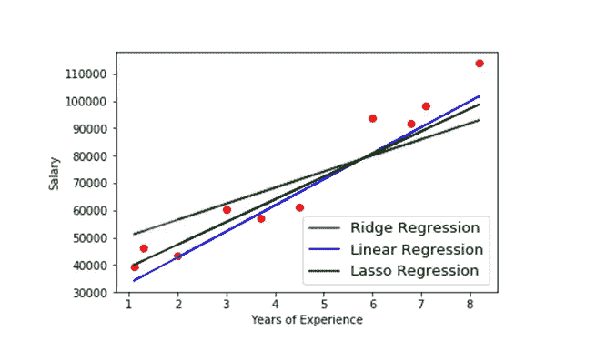
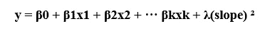
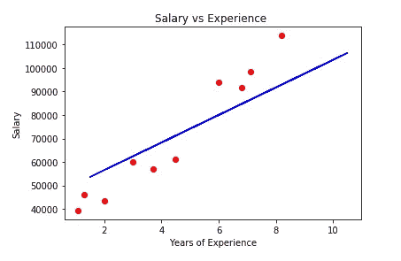
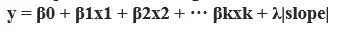
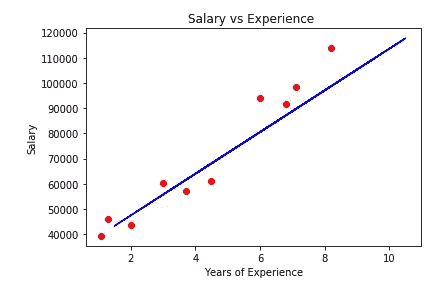
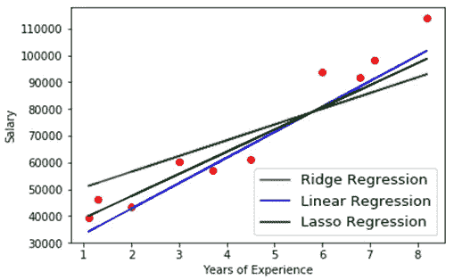
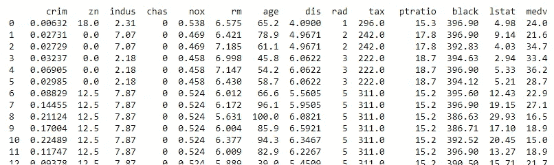
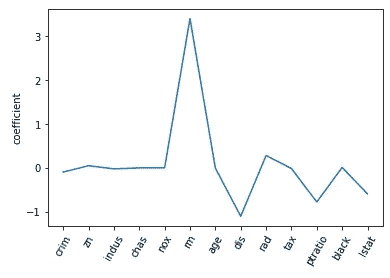
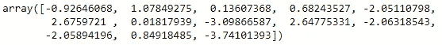

# 套索(l1)和脊(l2)正则化技术

> 原文：<https://pub.towardsai.net/lasso-l1-and-ridge-l2-regularization-techniques-33b7f12ac0b?source=collection_archive---------2----------------------->

## [编程](https://towardsai.net/p/category/programming)

## 用于减少过度拟合的技术



作者的照片

## **山脊和套索回归简介**

脊和套索回归的必要性是什么？

当我们用最佳拟合线创建线性模型并进入测试阶段时，由于变化增加，我们的模型过度拟合，因此它在未来不会很好地工作，也不会提供适当的精度。因此，为了减少过度拟合，脊和套索回归就出现了。两者都是强大的技术，但略有不同，用于创建这样的模型，这些模型是有效的并且在计算上适合以减少过拟合。

## **正规化**

这是一个对类别进行分类并提供附加信息以防止过度拟合的过程。线性回归是一种众所周知的标准回归方法，它假设输入变量和目标变量之间存在线性关系。它是线性回归的附加部分，包括在训练期间向损失函数添加惩罚。因此简称为 ***正则化线性回归*** 。

换句话说，它是一种用于减少过度拟合的方法或技术，以便我们可以适当地进行模型预测。

正则化给出了两种技术 L1(套索回归)和 L2(岭回归)。

## **岭回归:**

线性回归的正则化版本称为岭回归。它用于拟合数据，并将权重保持在较小的范围内，以便训练过程轻松进行。

它执行 L2 正则化，这意味着它添加等价于系数大小的平方的罚值，该罚值可以由下面给出的公式给出:

岭回归方程由下式给出:



其中 y 是目标变量，x1，x2…xk 是预测变量。

λ(斜率)是罚项，其中λ是偏转度。

通过限制预测变量的系数来偏离简单回归拟合线，但这绝不会使它们为零。



假设一个非常流行的数据集工资-经验的例子，使用λ= 100 显示岭回归图。

注意:随着α的增加，系数的大小减少到 0，但不是 0。

自变量向 0 移动。

**岭回归的优势**

*   降低了具有大量系数的模型的复杂性
*   计算费用也降低了。
*   它在存在高度相关的特征时工作良好。

**缺点**

模型解释能力意味着它会将系数缩小到非常接近零，但不完全是零。

## **拉索回归(L1)**

套索回归是线性回归的收缩型版本，其中数据点向中心点收缩。它用于显示高度多重共线性的模型。Lasso 回归的工作原理是自动化模型选择的某些部分，即特征提取。

套索完全形式是“最小绝对收缩和选择操作符”。

lasso 回归方程为:



其中 y 是目标变量，x1，x2…xk 是预测变量。

λ(斜率)是罚项，其中λ是偏转度。

Lasso 回归也可以通过使变量的系数为零来消除变量，从而消除与其他预测变量具有高协方差的变量。**套索回归**与岭回归的区别仅在于惩罚项。



假设一个非常流行的数据集 salary-experience 使用λ= 10000 显示岭回归图。

**拉索回归的优势**

*   降低模型复杂性，即过度拟合。
*   还通过使高度相关的特征为零来充当特征选择。
*   因此，计算能力也被降低，以使其成为合适的模型。

**劣势**

(一)不能进行分组选择。

(ii)小的α值给出了显著的稀疏性。



上图显示了所有三个回归的比较。

**这是两个回归的代码，在 Google colab 中的可用住房数据集上实现。**

```
import pandas as pdBHNames= [‘crim’,’zn’,’indus’,’chas’,’nox’,’rm’,‘age’,’dis’,’rad’,’tax’,’ptratio’,’black’,’lstat’,’medv’]url=’https://archive.ics.uci.edu/ml/machine-learning-databases/housing/housing.data'data = pd.read_csv(url, delim_whitespace=True, names=BHNames)print(data.head(20))
```



```
from sklearn.model_selection import train_test_splitX = data.drop(‘medv’, axis = 1)print(‘X shape = ‘,X.shape)#output:
X shape =  (506, 13)Y = data[‘medv’]print(‘Y shape = ‘,Y.shape)#output:
Y shape =  (506,)from sklearn import linear_model
import matplotlib.pyplot as pltnames = data.drop(‘medv’, axis =1).columns
```

**拉索回归将从本节**开始工作

```
lasso = linear_model.Lasso(alpha=0.2)lasso_coef = lasso.fit(X,Y).coef_plt.plot(range(len(names)),lasso_coef )plt.xticks(range(len(names)), names, rotation=60)plt.ylabel(“coefficient”)plt.show()
```



**岭回归将从这里开始。**

```
#For Ridgefrom sklearn.preprocessing import StandardScalerscaler = StandardScaler()x_std = scaler.fit_transform(X)from sklearn.linear_model import Ridgeridge = Ridge(alpha=0.2)model = ridge.fit(x_std,Y).coef_model
```



## **结论**

本文介绍了岭回归和套索回归这两种强有力的正则化技术，它们使我们的模型具有适当的预测能力。

我希望你喜欢这篇文章。通过我的 [LinkedIn](https://www.linkedin.com/in/data-scientist-95040a1ab/) 和 [twitter](https://twitter.com/amitprius) 联系我。

# 推荐文章

[1。NLP —零到英雄与 Python](https://medium.com/towards-artificial-intelligence/nlp-zero-to-hero-with-python-2df6fcebff6e?sk=2231d868766e96b13d1e9d7db6064df1)
2。 [Python 数据结构数据类型和对象](https://medium.com/towards-artificial-intelligence/python-data-structures-data-types-and-objects-244d0a86c3cf?sk=42f4b462499f3fc3a160b21e2c94dba6)3 .[Python 中的异常处理概念](/exception-handling-concepts-in-python-4d5116decac3?source=friends_link&sk=a0ed49d9fdeaa67925eac34ecb55ea30)
4。[为什么 LSTM 在深度学习方面比 RNN 更有用？](/deep-learning-88e218b74a14?source=friends_link&sk=540bf9088d31859d50dbddab7524ba35)
5。[神经网络:递归神经网络的兴起](/neural-networks-the-rise-of-recurrent-neural-networks-df740252da88?source=friends_link&sk=6844935e3de14e478ce00f0b22e419eb)
6。[用 Python](https://medium.com/towards-artificial-intelligence/fully-explained-linear-regression-with-python-fe2b313f32f3?source=friends_link&sk=53c91a2a51347ec2d93f8222c0e06402)
7 全面讲解了线性回归。[用 Python](https://medium.com/towards-artificial-intelligence/fully-explained-logistic-regression-with-python-f4a16413ddcd?source=friends_link&sk=528181f15a44e48ea38fdd9579241a78)
充分解释了 Logistic 回归 8。[concat()、merge()和 join()与 Python](/differences-between-concat-merge-and-join-with-python-1a6541abc08d?source=friends_link&sk=3b37b694fb90db16275059ea752fc16a)
的区别 9。[与 Python 的数据角力—第一部分](/data-wrangling-with-python-part-1-969e3cc81d69?source=friends_link&sk=9c3649cf20f31a5c9ead51c50c89ba0b)
10。[机器学习中的混淆矩阵](https://medium.com/analytics-vidhya/confusion-matrix-in-machine-learning-91b6e2b3f9af?source=friends_link&sk=11c6531da0bab7b504d518d02746d4cc)