# 分类模型的套索(L1)与岭(L2)与弹性网正则化

> 原文：<https://pub.towardsai.net/lasso-l1-vs-ridge-l2-vs-elastic-net-regularization-for-classification-model-409c3d86f6e9?source=collection_archive---------0----------------------->

## 通过比较套索正则化、脊正则化和弹性网正则化的性能在它们之间进行选择


由[诺德伍德主题](https://unsplash.com/@nordwood?utm_source=medium&utm_medium=referral)在 [Unsplash](https://unsplash.com?utm_source=medium&utm_medium=referral) 拍摄的照片

LASSO(最小绝对收缩和选择算子)也称为 L1 正则化，Ridge 也称为 L2 正则化。弹性网是套索和脊的结合。这三种都是机器学习中常用的纠正过度拟合的技术。

在本教程中，我们将介绍

*   套索(L1)，山脊(L2)，弹力网有什么区别？
*   如何使用 Python `sklearn`为分类模型运行 LASSO？
*   分类模型如何运行 Ridge？
*   分类模型如何运行弹性网？
*   如何比较套索、脊、弹力网的性能？

**本岗位资源:**

*   YouTube[上的视频教程](https://www.youtube.com/watch?v=PAOkp9CEn58&list=PLVppujud2yJrTGSjtN7j8gqCthOVyyk4W&index=1)
*   Python 代码在帖子最后。点击[此处](https://mailchi.mp/a30206d20b9a/in5ymnmlkv)为笔记本。
*   关于[过拟合校正的更多视频教程](https://www.youtube.com/playlist?list=PLVppujud2yJrTGSjtN7j8gqCthOVyyk4W)
*   更多关于[过度拟合修正](https://medium.com/@AmyGrabNGoInfo/list/overfitting-correction-2fb2052285d6)的博文

我们开始吧！

# 第 0 步:套索(L1) vs 山脊(L2) vs 弹力网

在第 0 步中，我们将讨论套索、脊和弹性网的区别。

套索和脊正则化通过缩小模型的系数来校正过度拟合。在模型训练过程中，不是最小化模型训练误差，而是最小化模型训练误差加上惩罚项。LASSO 和 Ridge 对于惩罚项有不同的计算算法。弹性网的惩罚项是 LASSO 和 Ridge 算法的组合。

*   惩罚项有一个参数叫做λ。它控制着惩罚的力度。

> 当λ等于 0 时，罚项等于 0。所以这个模型是一个没有正则化的模型。
> 
> 当λ增加时，罚项值增加，模型系数值减少。
> 
> 当λ趋于无穷大时，模型系数收缩到接近 0。模型只剩下截距，它预测每个数据点的平均值。

*   LASSO 的罚项是罚参数λ乘以系数的绝对值之和。因为 LASSO 的系数可能会缩小到零，所以它可用于自动特征选择。
*   Ridge 根据系数的平方和缩小模型系数。Ridge 不会将模型系数缩小到零。
*   弹性网的惩罚项是 LASSO 和岭回归的惩罚项的组合。它将一些系数设置为零，但数量小于 LASSO。

# 步骤 1:导入库

第一步，让我们导入本教程所需的 Python 库。

我们将在本教程中使用乳腺癌数据集，因此需要导入来自`sklearn`的`datasets`。`pandas`和`numpy`被导入进行数据处理。`matplotlib`是为了可视化，`StandardScaler`是为了数据标准化。

对于模型训练，我们导入了 train_test_split 和 LogisticRegression。

对于模型性能评估，我们导入了`plot_confusion_matrix`、`classification_report`、`log_loss`、`roc_curve`、`roc_auc_score`。

```
# Dataset
from sklearn import datasets# Data processing
import pandas as pd
import numpy as np# Visualization
import matplotlib.pyplot as plt# Standardize the data
from sklearn.preprocessing import StandardScaler# Model and performance evaluation
from sklearn.model_selection import train_test_split
from sklearn.linear_model import LogisticRegression
from sklearn.metrics import plot_confusion_matrix, classification_report, log_loss, roc_curve, roc_auc_score
```

# 第二步:读入数据

在第二步中，来自`sklearn`库的乳腺癌数据被加载并转换成熊猫数据帧。

```
# Load the breast cancer dataset
data = datasets.load_breast_cancer()# Put the data in pandas dataframe format
df = pd.DataFrame(data=data.data, columns=data.feature_names)
df['target']=data.target# Check the data information
df.info()
```

信息摘要显示数据集有 569 条记录和 31 列。

```
<class 'pandas.core.frame.DataFrame'>
RangeIndex: 569 entries, 0 to 568
Data columns (total 31 columns):
 #   Column                   Non-Null Count  Dtype  
---  ------                   --------------  -----  
 0   mean radius              569 non-null    float64
 1   mean texture             569 non-null    float64
 2   mean perimeter           569 non-null    float64
 3   mean area                569 non-null    float64
 4   mean smoothness          569 non-null    float64
 5   mean compactness         569 non-null    float64
 6   mean concavity           569 non-null    float64
 7   mean concave points      569 non-null    float64
 8   mean symmetry            569 non-null    float64
 9   mean fractal dimension   569 non-null    float64
 10  radius error             569 non-null    float64
 11  texture error            569 non-null    float64
 12  perimeter error          569 non-null    float64
 13  area error               569 non-null    float64
 14  smoothness error         569 non-null    float64
 15  compactness error        569 non-null    float64
 16  concavity error          569 non-null    float64
 17  concave points error     569 non-null    float64
 18  symmetry error           569 non-null    float64
 19  fractal dimension error  569 non-null    float64
 20  worst radius             569 non-null    float64
 21  worst texture            569 non-null    float64
 22  worst perimeter          569 non-null    float64
 23  worst area               569 non-null    float64
 24  worst smoothness         569 non-null    float64
 25  worst compactness        569 non-null    float64
 26  worst concavity          569 non-null    float64
 27  worst concave points     569 non-null    float64
 28  worst symmetry           569 non-null    float64
 29  worst fractal dimension  569 non-null    float64
 30  target                   569 non-null    int64  
dtypes: float64(30), int64(1)
memory usage: 137.9 KB
```

目标变量分布显示数据集中 63%的 1 和 37%的 0。因此，1 表示患者患有乳腺癌，0 表示患者没有乳腺癌。

```
# Check the target value distribution
df['target'].value_counts(normalize=True)1    0.627417
0    0.372583
Name: target, dtype: float64
```

# 步骤 3:训练测试分割

在步骤 3 中，我们将数据集分成 80%的训练数据集和 20%的测试数据集。`random_state`使随机分割结果可重复。

```
# Train test split
X_train, X_test, y_train, y_test = train_test_split(df[df.columns.difference(['target'])], df['target'], test_size=0.2, random_state=42)# Check the number of records in training and testing dataset.
print(f'The training dataset has {len(X_train)} records.')
print(f'The testing dataset has {len(X_test)} records.')
```

训练数据集有 455 条记录，测试数据集有 114 条记录。

```
The training dataset has 455 records.
The testing dataset has 114 records.
```

# 第四步:标准化

标准化是将要素重新调整到相同的比例。它通过提取平均值并除以标准差来计算。标准化后，每个特征的均值和单位标准差为零。

标准化应该只适用于训练数据集，以防止测试数据集信息泄露到训练过程中。然后，使用来自训练数据集的拟合结果来标准化测试数据集。

有不同类型的定标器。`StandardScaler`和`MinMaxScaler`是最常用的。对于有离群值的数据集，我们可以使用`RobustScaler`。

在本教程中，我们将使用`StandardScaler`。

```
# Initiate scaler
sc = StandardScaler()# Standardize the training dataset
X_train_transformed = pd.DataFrame(sc.fit_transform(X_train),index=X_train.index, columns=X_train.columns)# Standardized the testing dataset
X_test_transformed = pd.DataFrame(sc.transform(X_test),index=X_test.index, columns=X_test.columns)# Summary statistics after standardization
X_train_transformed.describe().T
```

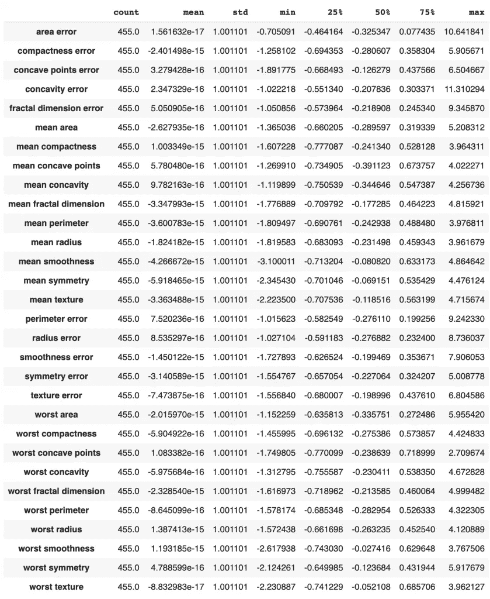

数据标准化—图片来自 GrabNGoInfo.com

我们可以看到，使用`StandardScaler`后，所有特征的均值和单位标准差都为零。

让我们也获得标准化之前的训练数据的汇总统计，我们可以看到，均值和标准差在尺度上可以有很大的不同。例如，面积误差的平均值为 40，标准差为 47。另一方面，紧密度误差具有大约 0.023 的平均值和 0.019 的标准偏差。

```
# Summary statistics before standardization
X_train.describe().T
```

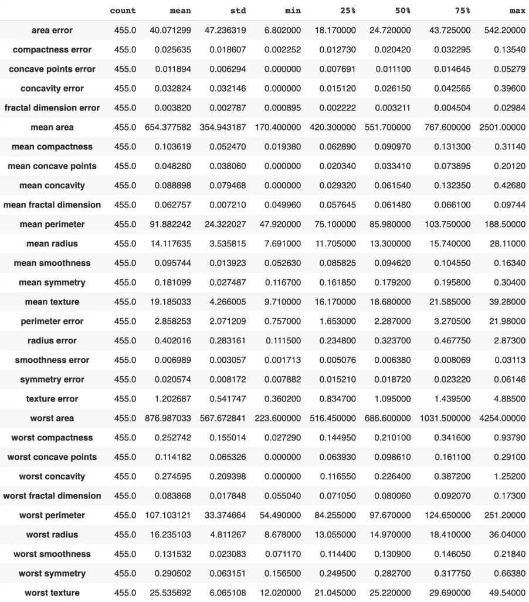

数据标准化之前—图片来自 GrabNGoInfo.com

# 步骤 5:无正则化的逻辑回归

在第 5 步中，我们将创建一个没有正则化的逻辑回归作为基线模型。

`sklearn`中的逻辑回归默认使用岭正则化。当检查 LogisticRegression()的默认超参数值时，我们看到了`penalty='l2'`，这意味着使用了 L2 正则化。

```
# Check default values
LogisticRegression()LogisticRegression(C=1.0, class_weight=None, dual=False, fit_intercept=True,
                   intercept_scaling=1, l1_ratio=None, max_iter=100,
                   multi_class='auto', n_jobs=None, penalty='l2',
                   random_state=None, solver='lbfgs', tol=0.0001, verbose=0,
                   warm_start=False)
```

我们需要将`penalty`从`l2`改为‘无’,以获得没有正则化的模型。运行基线逻辑回归模型后，我们还使用`.predict`预测了测试数据集，并使用`.predict_proba`计算了预测概率。

```
# Run model
logistic = LogisticRegression(penalty='none', random_state=0).fit(X_train_transformed, y_train)# Make prediction
logistic_prediction = logistic.predict(X_test_transformed)# Get predicted probability
logistic_pred_Prob = logistic.predict_proba(X_test_transformed)[:,1]
```

得到预测值和预测概率后，就准备检查模型性能了！

首先，我们来看看 ROC 曲线。我们得到的曲线下面积值为 0.9818。

```
# Get the false positive rate and true positive rate
fpr,tpr, _=roc_curve(y_test,logistic_pred_Prob)# Get auc value
auc=roc_auc_score(y_test,logistic_pred_Prob)# Plot the chart
plt.plot(fpr,tpr,label="area="+str(auc))
plt.legend(loc=4)
```


无正则化 ROC 曲线的 Logistic 回归——来自 GrabNGoInfo.com 的图像

该模型的对数损失值为 2.02。

```
# Caclulate log loss
log_loss(y_test,logistic_pred_Prob)2.0150517046435854
```

混淆矩阵显示 1 个假阳性和 6 个假阴性。

```
# Confusion matrix
plot_confusion_matrix(logistic, X_test_transformed, y_test)
```

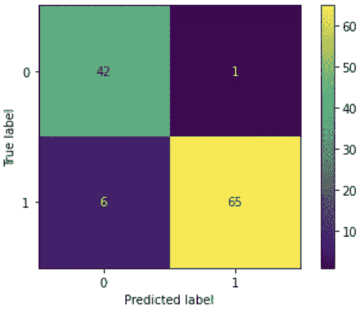

无正则化混淆矩阵的逻辑回归——来自 GrabNGoInfo.com 的图像

总共 7 个不正确的预测对应于 0.939 的准确度。

我们不希望在乳腺癌预测中遗漏任何实际的癌症患者，也不介意出现一些假阳性，因此召回率将是最需要关注的指标。召回率才是真正的阳性率。它测量模型捕获的实际癌症患者的百分比。我们可以看到，逻辑回归给出了 0.915 的召回值，这意味着 91.5%的实际癌症患者被捕获。

```
# Performance report
print(classification_report(y_test, logistic_prediction, digits=3))precision    recall  f1-score   support 0      0.875     0.977     0.923        43
           1      0.985     0.915     0.949        71 accuracy                          0.939       114
   macro avg      0.930     0.946     0.936       114
weighted avg      0.943     0.939     0.939       114
```

接下来，让我们检查模型的系数。根据它们的绝对值，我将模型系数从高到低排序，我们可以看到顶部变量的系数在几百。

```
# Model coefficients
LogisticCoeff = pd.concat([pd.DataFrame(X_test_transformed.columns),
                           pd.DataFrame(np.transpose(logistic.coef_))], axis = 1)
LogisticCoeff.columns=['Variable','Coefficient']
LogisticCoeff['Coefficient_Abs']=LogisticCoeff['Coefficient'].apply(abs)
LogisticCoeff.sort_values(by='Coefficient_Abs', ascending=False)
```

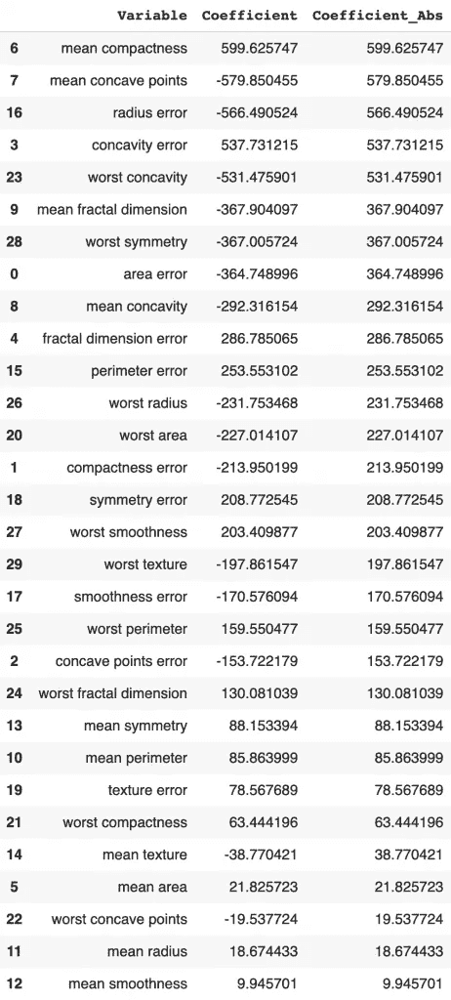

无正则化系数的逻辑回归-来自 GrabNGoInfo.com 的图像

# 第六步:套索

在第 6 步，套索模型用于运行相同的分析。

`penalty='l1'`表示应用套索正则化。

`solver`是优化问题中使用的算法。有不同类型的解算器。对于小型数据集，“liblinear”是一个不错的选择，而“sag”和“saga”对于大型数据集更快。

```
# Run model
lasso = LogisticRegression(penalty='l1', solver='liblinear', 
                           random_state=0).fit(X_train_transformed, y_train)# Make prediction
lasso_prediction = lasso.predict(X_test_transformed)# Get predicted probability
lasso_pred_Prob = lasso.predict_proba(X_test_transformed)[:,1]
```

LASSO 的 ROC/AUC 值为 0.9967，高于逻辑回归值 0.9818。

```
# Get the false positive rate and true positive rate
fpr,tpr, _= roc_curve(y_test,lasso_pred_Prob)# Get auc value
auc = roc_auc_score(y_test,lasso_pred_Prob)# Plot the chart
plt.plot(fpr,tpr,label="area="+str(auc))
plt.legend(loc=4)
```

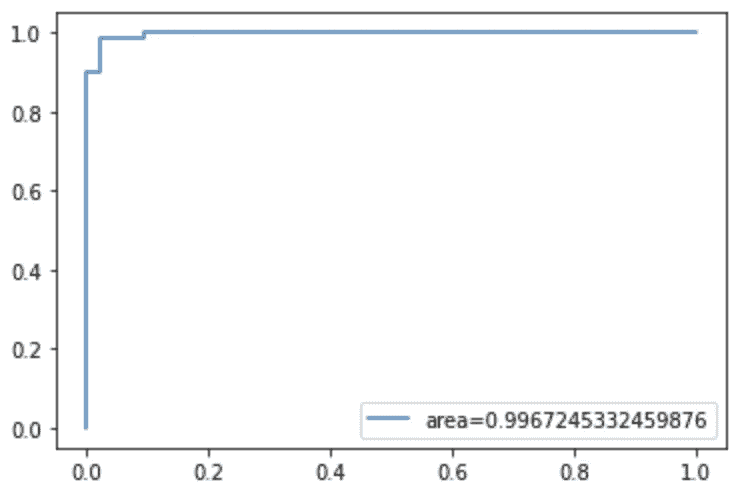

使用套索正则化 ROC 曲线的逻辑回归—来自 GrabNGoInfo.com 的图像

对数损失从基线逻辑回归的 2.015 下降到 0.0685。这是一个显著的进步！

```
# Calculate log loss
log_loss(y_test,lasso_pred_Prob)0.06846705785516008
```

混淆矩阵显示相同的假阳性计数 1，但是假阴性计数从 6 减少到 2。

```
# Confusion matrix
plot_confusion_matrix(lasso, X_test_transformed, y_test)
```


使用 LASSO 正则化混淆矩阵的逻辑回归-来自 GrabNGoInfo.com 的图像

由于假阴性计数的减少，准确率从 0.939 提高到 0.974。召回值从 0.915 增加到 0.972。

```
# Performance report
print(classification_report(y_test, lasso_prediction, digits=3))precision    recall  f1-score   support 0      0.955     0.977     0.966        43
           1      0.986     0.972     0.979        71 accuracy                          0.974       114
   macro avg      0.970     0.974     0.972       114
weighted avg      0.974     0.974     0.974       114
```

与逻辑回归系数相比，拉索系数下降了很多。因此，大约一半的特征的系数为零。

所以 LASSO 给了我们一个性能更好的更简单的模型。

```
# Model coefficients
lassoCoeff = pd.concat([pd.DataFrame(X_test_transformed.columns),
                       pd.DataFrame(np.transpose(lasso.coef_))], axis = 1)
lassoCoeff.columns=['Variable','Coefficient']
lassoCoeff['Coefficient_Abs']=lassoCoeff['Coefficient'].apply(abs)
lassoCoeff.sort_values(by='Coefficient_Abs', ascending=False)
```

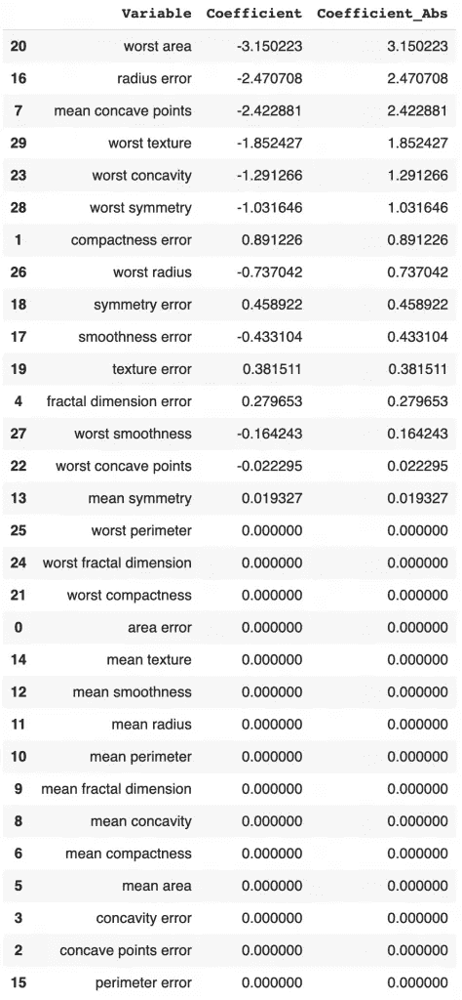

使用套索正则化系数的逻辑回归-来自 GrabNGoInfo.com 的图像

# 山脊

在第 7 步中，我们将通过将惩罚改为 l2 来运行岭回归。

```
# Run model
ridge = LogisticRegression(penalty='l2', random_state=0).fit(X_train_transformed, y_train)# Make prediction
ridge_prediction = ridge.predict(X_test_transformed)# Get predicted probability
ridge_pred_Prob = ridge.predict_proba(X_test_transformed)[:,1]# Get the false positive rate and true positive rate
fpr,tpr, _= roc_curve(y_test,ridge_pred_Prob)# Get auc value
auc = roc_auc_score(y_test,ridge_pred_Prob)# Plot the chart
plt.plot(fpr,tpr,label="area="+str(auc))
plt.legend(loc=4)
```

ROC/AUC 值为 0.9974，略高于 LASSO 的 0.9967。

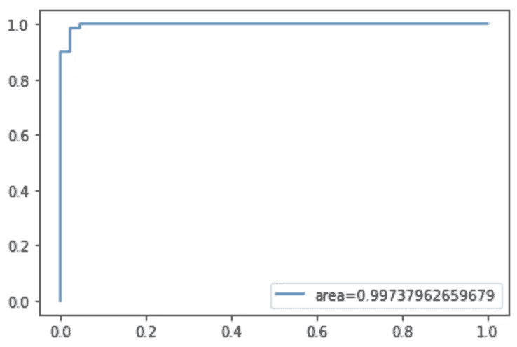

基于岭正则化 ROC 曲线的 Logistic 回归——来自 GrabNGoInfo.com 的图像

对数损失从 LASSO 回归的 0.0685 下降到 0.0601。这也是一个进步。

```
# Calculate log loss
log_loss(y_test,ridge_pred_Prob)0.06014109569918717
```

混淆矩阵显示相同的假阳性计数 2 和假阴性计数 1。

虽然错误预测的总数是 3，与 LASSO 回归相同，但岭回归具有更好的性能，因为假阴性减少了 1。

```
# Confusion matrix
plot_confusion_matrix(ridge, X_test_transformed, y_test)
```

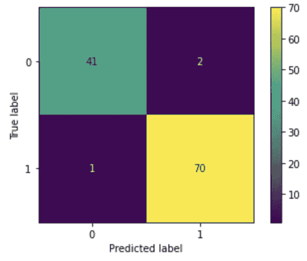

基于岭正则化混淆矩阵的 Logistic 回归——来自 GrabNGoInfo.com 的图像

因为 LASSO 和 Ridge 之间不正确预测的数量相同，所以精度相同，为 0.974。因为假阴性计数从 2 减少到 1，召回值从 0.972 增加到 0.986。

```
# Performance matrix
print(classification_report(y_test, ridge_prediction, digits=3))precision    recall  f1-score   support 0      0.976     0.953     0.965        43
           1      0.972     0.986     0.979        71 accuracy                          0.974       114
   macro avg      0.974     0.970     0.972       114
weighted avg      0.974     0.974     0.974       114
```

与 LASSO 回归系数相比，Ridge 系数略有下降。有些特征的系数接近于零，但没有一个等于零。

```
# Model coefficients
ridgeCoeff = pd.concat([pd.DataFrame(X_test_transformed.columns),
                       pd.DataFrame(np.transpose(ridge.coef_))], axis = 1)
ridgeCoeff.columns=['Variable','Coefficient']
ridgeCoeff['Coefficient_Abs']=ridgeCoeff['Coefficient'].apply(abs)
ridgeCoeff.sort_values(by='Coefficient_Abs', ascending=False)
```

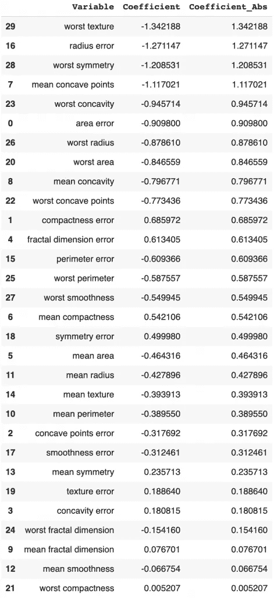

具有岭正则化系数的 Logistic 回归——来自 GrabNGoInfo.com 的图像

基于性能对比，我们可以看到，Ridge 的性能比 LASSO 略好，但 LASSO 的模型比 Ridge 更简单。

# 弹性网

在第 8 步中，我们将通过将惩罚改为`'elasticnet'`来运行弹性净回归。`l1_ratio=0.5`意味着弹性网使用 50%的套索和 50%的脊。

```
# Run model
elasticNet = LogisticRegression(penalty='elasticnet', solver='saga', l1_ratio=0.5, random_state=0).fit(X_train_transformed, y_train)# Make prediction
elasticNet_prediction = elasticNet.predict(X_test_transformed)# Get predicted probability
elasticNet_pred_Prob = elasticNet.predict_proba(X_test_transformed)[:,1]# Get the false positive rate and true positive rate
fpr,tpr, _ = roc_curve(y_test,elasticNet_pred_Prob)# Get auc value
auc = roc_auc_score(y_test,elasticNet_pred_Prob)# Plot the chart
plt.plot(fpr,tpr,label="area="+str(auc))
plt.legend(loc=4)
```

弹性网的 ROC/AUC 值为 0.9974，与岭回归大致相同。

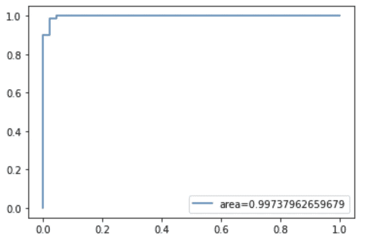

弹性网正则化 ROC 曲线的 Logistic 回归——来自 GrabNGoInfo.com 的图像

对数损失从岭回归的 0.0601 下降到 0.0597。这是一个微小的进步。

```
# Calculate log loss
log_loss(y_test,elasticNet_pred_Prob)0.05970787798591165
```

混淆矩阵显示同样的假阴性计数为 1，假阳性计数从 2 减少到 1。

```
# Confusion matrix
plot_confusion_matrix(elasticNet, X_test_transformed, y_test)
```


使用弹性网正则化混淆矩阵的逻辑回归——来自 GrabNGoInfo.com 的图像

因为与 LASSO 和 Ridge 相比，错误预测的数量减少了，所以准确性从 0.974 增加到 0.982。召回值相同，为 0.986。

```
# Performance report
print(classification_report(y_test, elasticNet_prediction, digits=3))precision    recall  f1-score   support 0      0.977     0.977     0.977        43
           1      0.986     0.986     0.986        71 accuracy                          0.982       114
   macro avg      0.981     0.981     0.981       114
weighted avg      0.982     0.982     0.982       114
```

对于某些要素，山脊的系数被设置为零，但系数为 0 的要素数量小于 LASSO。

```
# Model coefficients
elasticNetCoeff = pd.concat([pd.DataFrame(X_test_transformed.columns),
                             pd.DataFrame(np.transpose(elasticNet.coef_))], axis = 1)
elasticNetCoeff.columns=['Variable','Coefficient']
elasticNetCoeff['Coefficient_Abs']=elasticNetCoeff['Coefficient'].apply(abs)
elasticNetCoeff.sort_values(by='Coefficient_Abs', ascending=False)
```

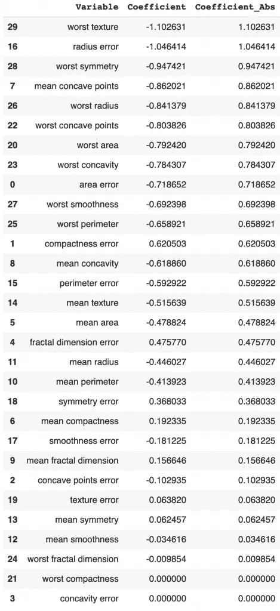

具有弹性网络正则化系数的逻辑回归——来自 GrabNGoInfo.com 的图像

# 步骤 9:将所有代码放在一起

```
###### Step 1: Import Libraries# Dataset
from sklearn import datasets# Data processing
import pandas as pd
import numpy as np# Visualization
import matplotlib.pyplot as plt# Standardize the data
from sklearn.preprocessing import StandardScaler# Model and performance evaluation
from sklearn.model_selection import train_test_split
from sklearn.linear_model import LogisticRegression
from sklearn.metrics import plot_confusion_matrix, classification_report, log_loss, roc_curve, roc_auc_score ###### Step 2: Read In Data# Load the breast cancer dataset
data = datasets.load_breast_cancer()# Put the data in pandas dataframe format
df = pd.DataFrame(data=data.data, columns=data.feature_names)
df['target']=data.target# Check the data information
df.info()# Check the target value distribution
df['target'].value_counts(normalize=True) ###### Step 3: Train Test Split# Train test split
X_train, X_test, y_train, y_test = train_test_split(df[df.columns.difference(['target'])], df['target'], test_size=0.2, random_state=42)# Check the number of records in training and testing dataset.
print(f'The training dataset has {len(X_train)} records.')
print(f'The testing dataset has {len(X_test)} records.') ###### Step 4: Standardization# Initiate scaler
sc = StandardScaler()# Standardize the training dataset
X_train_transformed = pd.DataFrame(sc.fit_transform(X_train),index=X_train.index, columns=X_train.columns)# Standardized the testing dataset
X_test_transformed = pd.DataFrame(sc.transform(X_test),index=X_test.index, columns=X_test.columns)# Summary statistics after standardization
X_train_transformed.describe().T# Summary statistics before standardization
X_train.describe().T ###### Step 5: Logistic Regression With No Regularization# Check default values
LogisticRegression()# Run model
logistic = LogisticRegression(penalty='none', random_state=0).fit(X_train_transformed, y_train)# Make prediction
logistic_prediction = logistic.predict(X_test_transformed)# Get predicted probability
logistic_pred_Prob = logistic.predict_proba(X_test_transformed)[:,1]# Get the false positive rate and true positive rate
fpr,tpr, _=roc_curve(y_test,logistic_pred_Prob)# Get auc value
auc=roc_auc_score(y_test,logistic_pred_Prob)# Plot the chart
plt.plot(fpr,tpr,label="area="+str(auc))
plt.legend(loc=4)# Caclulate log loss
log_loss(y_test,logistic_pred_Prob)# Confusion matrix
plot_confusion_matrix(logistic, X_test_transformed, y_test)# Performance report
print(classification_report(y_test, logistic_prediction, digits=3))# Model coefficients
LogisticCoeff = pd.concat([pd.DataFrame(X_test_transformed.columns),pd.DataFrame(np.transpose(logistic.coef_))], axis = 1)
LogisticCoeff.columns=['Variable','Coefficient']
LogisticCoeff['Coefficient_Abs']=LogisticCoeff['Coefficient'].apply(abs)
LogisticCoeff.sort_values(by='Coefficient_Abs', ascending=False) ###### Step 6: LASSO# Run model
lasso = LogisticRegression(penalty='l1', solver='liblinear', random_state=0).fit(X_train_transformed, y_train)# Make prediction
lasso_prediction = lasso.predict(X_test_transformed)# Get predicted probability
lasso_pred_Prob = lasso.predict_proba(X_test_transformed)[:,1]# Get the false positive rate and true positive rate
fpr,tpr, _= roc_curve(y_test,lasso_pred_Prob)# Get auc value
auc = roc_auc_score(y_test,lasso_pred_Prob)# Plot the chart
plt.plot(fpr,tpr,label="area="+str(auc))
plt.legend(loc=4)# Calculate log loss
log_loss(y_test,lasso_pred_Prob)# Confusion matrix
plot_confusion_matrix(lasso, X_test_transformed, y_test)# Performance report
print(classification_report(y_test, lasso_prediction, digits=3))# Model coefficients
lassoCoeff = pd.concat([pd.DataFrame(X_test_transformed.columns),pd.DataFrame(np.transpose(lasso.coef_))], axis = 1)
lassoCoeff.columns=['Variable','Coefficient']
lassoCoeff['Coefficient_Abs']=lassoCoeff['Coefficient'].apply(abs)
lassoCoeff.sort_values(by='Coefficient_Abs', ascending=False) ###### Step 7: Ridge# Run model
ridge = LogisticRegression(penalty='l2', random_state=0).fit(X_train_transformed, y_train)# Make prediction
ridge_prediction = ridge.predict(X_test_transformed)# Get predicted probability
ridge_pred_Prob = ridge.predict_proba(X_test_transformed)[:,1]# Get the false positive rate and true positive rate
fpr,tpr, _= roc_curve(y_test,ridge_pred_Prob)# Get auc value
auc = roc_auc_score(y_test,ridge_pred_Prob)# Plot the chart
plt.plot(fpr,tpr,label="area="+str(auc))
plt.legend(loc=4)# Calculate log loss
log_loss(y_test,ridge_pred_Prob)# Confusion matrix
plot_confusion_matrix(ridge, X_test_transformed, y_test)# Performance matrix
print(classification_report(y_test, ridge_prediction, digits=3))# Model coefficients
ridgeCoeff = pd.concat([pd.DataFrame(X_test_transformed.columns),pd.DataFrame(np.transpose(ridge.coef_))], axis = 1)
ridgeCoeff.columns=['Variable','Coefficient']
ridgeCoeff['Coefficient_Abs']=ridgeCoeff['Coefficient'].apply(abs)
ridgeCoeff.sort_values(by='Coefficient_Abs', ascending=False) ###### Step 8: Elastic Net# Run model
elasticNet = LogisticRegression(penalty='elasticnet', solver='saga', l1_ratio=0.5, random_state=0).fit(X_train_transformed, y_train)# Make prediction
elasticNet_prediction = elasticNet.predict(X_test_transformed)# Get predicted probability
elasticNet_pred_Prob = elasticNet.predict_proba(X_test_transformed)[:,1]# Get the false positive rate and true positive rate
fpr,tpr, _ = roc_curve(y_test,elasticNet_pred_Prob)# Get auc value
auc = roc_auc_score(y_test,elasticNet_pred_Prob)# Plot the chart
plt.plot(fpr,tpr,label="area="+str(auc))
plt.legend(loc=4)# Calculate log loss
log_loss(y_test,elasticNet_pred_Prob)# Confusion matrix
plot_confusion_matrix(elasticNet, X_test_transformed, y_test)# Performance report
print(classification_report(y_test, elasticNet_prediction, digits=3))# Model coefficients
elasticNetCoeff = pd.concat([pd.DataFrame(X_test_transformed.columns),pd.DataFrame(np.transpose(elasticNet.coef_))], axis = 1)
elasticNetCoeff.columns=['Variable','Coefficient']
elasticNetCoeff['Coefficient_Abs']=elasticNetCoeff['Coefficient'].apply(abs)
elasticNetCoeff.sort_values(by='Coefficient_Abs', ascending=False)
```

# 摘要

在本教程中，我们介绍了

*   套索(L1)，山脊(L2)，弹力网有什么区别？
*   如何为分类模型运行 LASSO？
*   分类模型如何运行 Ridge？
*   分类模型如何运行弹性网？
*   如何比较套索、脊、弹力网的性能？

我们可以看到，正则化比不使用正则化显著提高了模型性能。

在三种正则化算法中，弹性网的性能最好，其次是岭和套索回归。然而，并非所有数据集都是如此。因此，我建议为您的项目尝试所有三种算法，进行超参数调优，并选择最适合您的数据集的算法。

更多教程可在 GrabNGoInfo [YouTube 频道](https://www.youtube.com/channel/UCmbA7XB6Wb7bLwJw9ARPcYg)和 GrabNGoInfo.com[网站](https://grabngoinfo.com/tutorials/)上获得

# 推荐教程

*   [GrabNGoInfo 机器学习教程盘点](https://medium.com/grabngoinfo/grabngoinfo-machine-learning-tutorials-inventory-9b9d78ebdd67)
*   [用于异常检测的单级 SVM](https://medium.com/p/one-class-svm-for-anomaly-detection-6c97fdd6d8af)
*   [使用 Python 中的 Prophet 进行多时间序列预测的 3 种方法](https://medium.com/p/3-ways-for-multiple-time-series-forecasting-using-prophet-in-python-7a0709a117f9)
*   [使用 Python 实现不平衡分类的四种过采样和欠采样方法](https://medium.com/p/four-oversampling-and-under-sampling-methods-for-imbalanced-classification-using-python-7304aedf9037)
*   [利用 Python 中的 Prophet 进行具有季节性和假日效应的多元时间序列预测](https://medium.com/p/multivariate-time-series-forecasting-with-seasonality-and-holiday-effect-using-prophet-in-python-d5d4150eeb57)
*   [如何检测离群值|数据科学面试问答](https://medium.com/p/how-to-detect-outliers-data-science-interview-questions-and-answers-1e400284f6b4)
*   [利用 Python 中的 Prophet 进行时间序列异常检测](https://medium.com/p/time-series-anomaly-detection-using-prophet-in-python-877d2b7b14b4)
*   [如何用谷歌 Colab 笔记本使用 R](https://medium.com/p/how-to-use-r-with-google-colab-notebook-610c3a2f0eab)

# 参考

*   [套索回归解释](https://www.youtube.com/watch?v=NGf0voTMlcs)
*   [岭回归解释](https://www.youtube.com/watch?v=Q81RR3yKn30)
*   [sklearn 关于逻辑回归的文档](https://scikit-learn.org/stable/modules/generated/sklearn.linear_model.LogisticRegression.html)
*   [标准定标器上的 sklearn 文档](https://scikit-learn.org/stable/modules/generated/sklearn.preprocessing.StandardScaler.html)

[](https://medium.com/@AmyGrabNGoInfo/membership) [## 通过我的推荐链接加入媒体-艾米 GrabNGoInfo

### 作为一个媒体会员，你的会员费的一部分会给你阅读的作家，你可以完全接触到每一个故事…

medium.com](https://medium.com/@AmyGrabNGoInfo/membership)