# 简单解释了潜在扩散(用神奇宝贝)

> 原文：<https://pub.towardsai.net/latent-diffusion-explained-simply-with-pok%C3%A9mon-3ebe15a3a019?source=collection_archive---------0----------------------->

## 从文本到图像，图像到图像和修复-潜在的扩散革命。

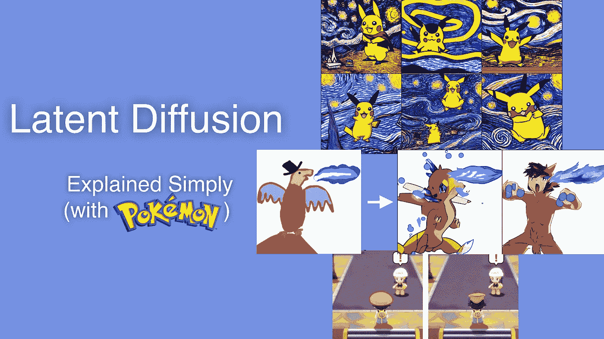

在过去的几个月里，潜在扩散一直是人们关注的焦点，人们根据文本提示生成各种各样的图像。

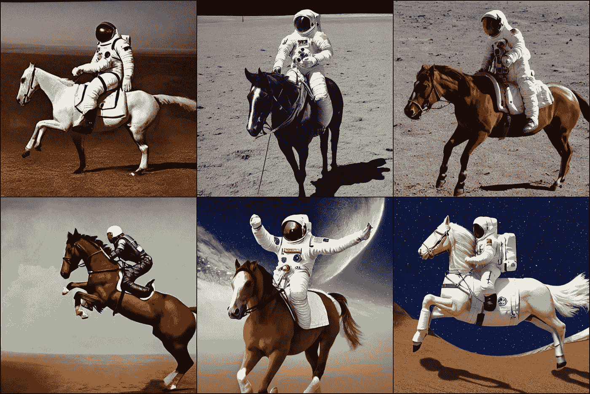

使用稳定扩散生成的图像，提示“一张宇航员骑马的照片”

看到如此高的质量，你会想这项技术将来会有什么用途。我说的不仅仅是图像。想象一个程序性构建的 3D 世界，玩家在游戏中探索一个区域，设计新的酶，比如说，纯粹基于描述来消化塑料，甚至根据科学论文产生假设/问题/修正(每个博士生的梦想)。

通过这篇文章，我想深入挖掘这些模型，并(试图)解释它们是如何工作的(与神奇宝贝)。最后，您应该对输入文本提示后发生的事情有了直观的理解。我的结构有点不同于平时:首先，介绍主题，然后是一些视觉效果和直觉，最后是更深入的解释。正如那句名言所说:

> “如果你不能简单地解释它，你就不够了解它”

为什么是神奇宝贝？因为你可能很熟悉这些游戏，而且有可能你喜欢玩这些游戏。此外，它相对来说是小众的，因此它应该将模型推出其“舒适区”(即潜在空间中人口较少的部分)。

如果你想玩玩这个模型，试试这里的演示:

 [## 稳定扩散——稳定的拥抱面空间

### 发现由社区制作的令人惊叹的 ML 应用程序

huggingface.co](https://huggingface.co/spaces/stabilityai/stable-diffusion) 

或者，您可以使用搜索引擎 Lexica([https://Lexica . art](https://lexica.art))浏览生成的图像集合

让我们深入了解一些使用案例！

# 文本到图像

**文本到图像**可能是潜在扩散模型最著名的应用(至少根据我的 Twitter 消息)。很像条件 VAE，我们使用文本提示(y)根据分布 p(z|y)有条件地生成，从而作为潜在空间区域的向导。

我用“皮卡丘”做了实验，我想模型应该看过它的照片。此外，我还插入了文森特·梵高的《星夜》和加那利群岛的位置提示。前者应该推动模型绘制一个符合艺术风格的 2D 皮卡丘，而后者作为一个真实世界的位置，可能会产生一个 3D 皮卡丘。

## 结果

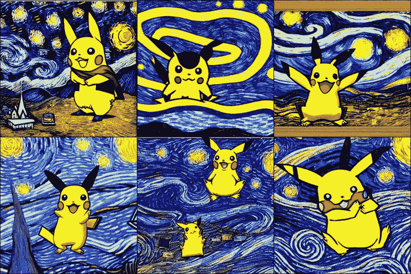

提示:“星夜画中的一只皮卡丘冲浪”

这相当漂亮——即使考虑到皮卡丘偶尔的畸形。第一张照片可能是我最喜欢的，因为它甚至拿起了教堂般的建筑，并添加了一个领域。

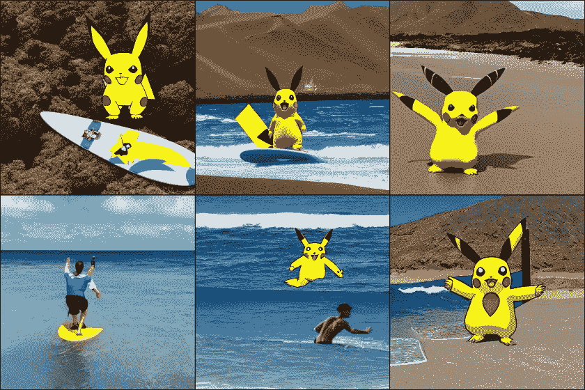

提示:“加那利群岛的皮卡丘冲浪”

在得到冲浪板和水方面肯定更成功。一个有趣的细节是在加那利群岛的一些图片中的沙丘:

大加那利岛的沙丘——布莱恩·李摄影 [https://bryanli.io](https://bryanli.io)

## 它是如何工作的

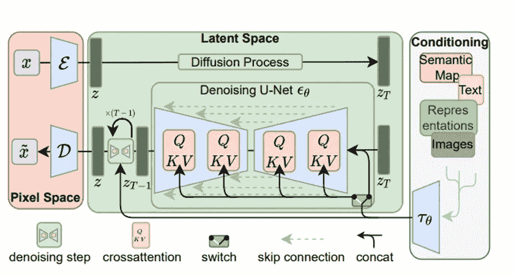

输入 y 由特定域编码器(tau_theta)预处理，以产生表示 tau_theta(y)。

由 tau_theta 编码的调节步骤，用于调节生成过程。图片来自 https://arxiv.org/abs/2112.10752

基本的 UNet 架构是通过交叉注意力层实现的，这意味着在 UNet 的每个单元，注意力被计算，然后传递到后面的层。

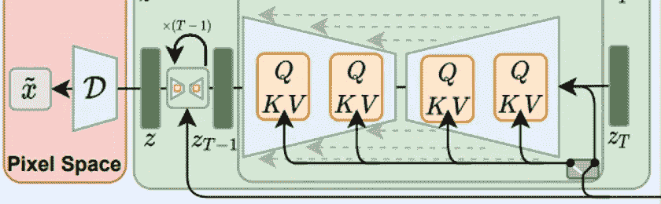

注意力通常用查询、键、值术语来表达。这里，这些值将通过考虑域特定编码器 tau_theta(y)的输出来修改，如此:

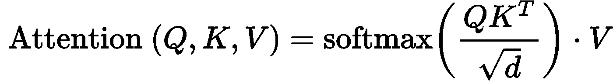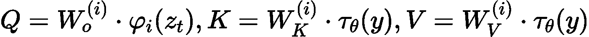

这意味着我们正在对提示进行编码，以调节去噪步骤，从而输出符合描述的图像。

# 图像到图像

这个任务非常类似于**文本到图像**。然而，输入是作为提示的图像。然后使用特定于域的编码器 tau_theta(y)对图像进行编码，并将其像文本一样输入到模型中。除了图像之外，您还可以输入文本提示来进一步指导生成过程。

## 结果

我对模型的输入是:

1.  "火型神奇宝贝吐出蓝色火焰."
2.  这个涂鸦(我知道，看起来很可怕):

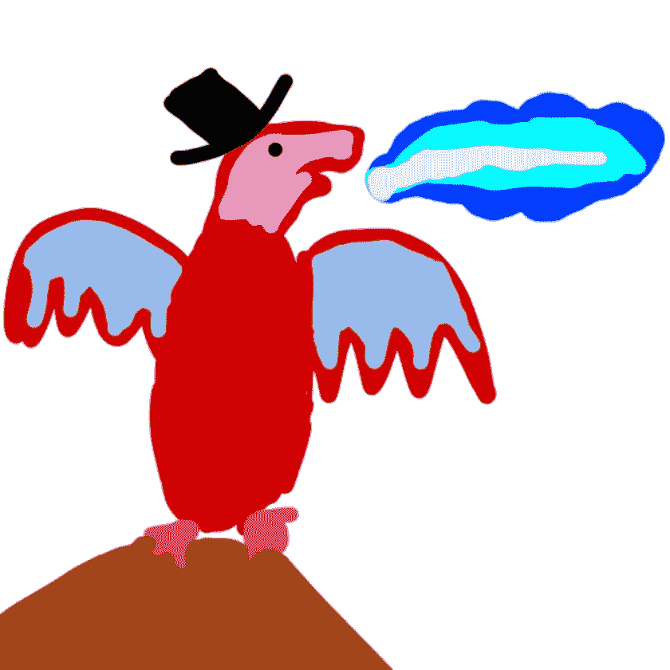

涂鸦输入。

结果让我大吃一惊:

生成的图像设置–强度 0.8–n _ ITER 30，并提示“一个火型口袋妖怪吐蓝火”

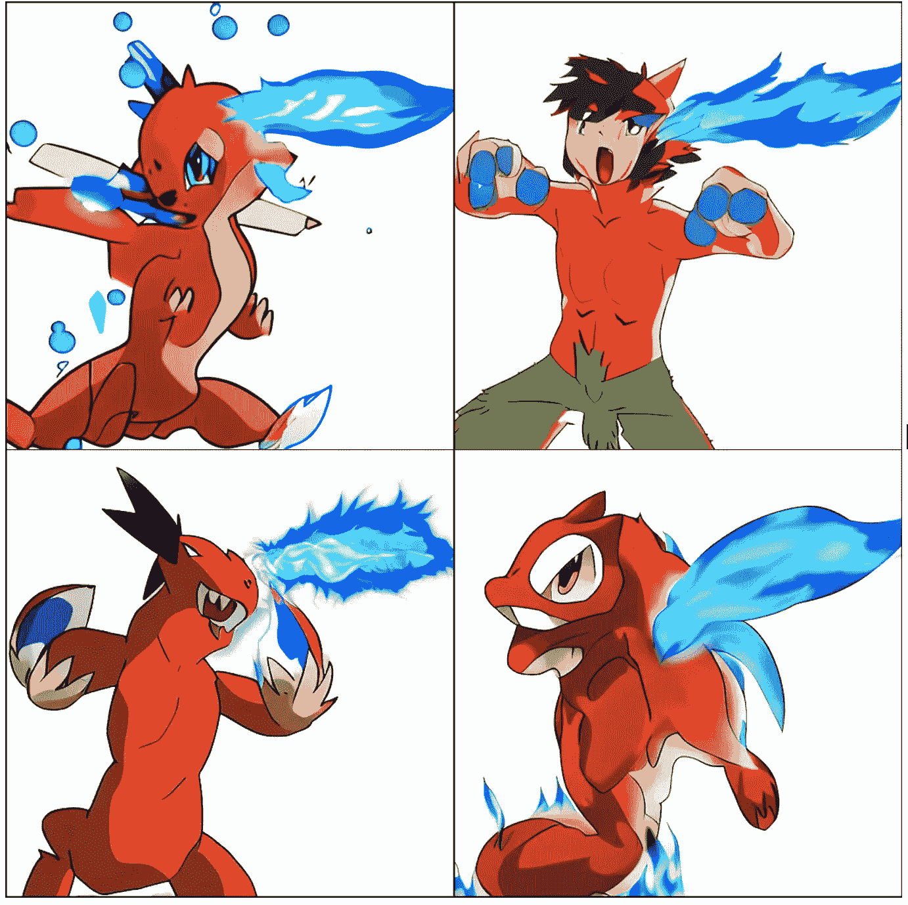

来自上面 GIF 的静态样本。

这些大多数看起来像神奇宝贝，其中几个集成了蓝色的火焰。

可惜他们都没有把拓法特当拓法特用(这个可以怪我的画图技术)，但是大部分都用了头上的黑色。

# 修补

**修补**是根据蒙版移除或替换图像中的对象。我记得早在 2010 年(或者可能更早)，当 Photoshop 将它作为“愈合画笔”的一部分发布时，我感到非常惊讶。

你猜对了，潜在扩散模型也可以用于此。HuggingFace 有一个非常直观的用户界面，您可以在图像本身上绘制遮罩:

 [## 用 fffiloni 修复稳定扩散 CPU - a 拥抱人脸空间

### 发现由社区制作的令人惊叹的 ML 应用程序

huggingface.co](https://huggingface.co/spaces/fffiloni/stable-diffusion-inpainting) 

## 结果

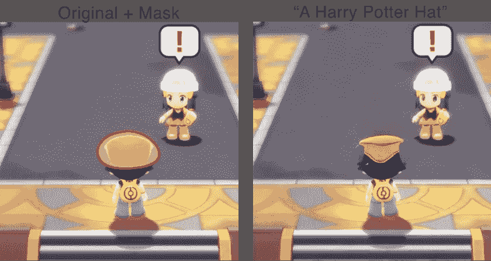

输入左边的图像和蒙版。右边生成的图像。

这顶帽子看起来有点像哈利波特分院帽的压扁版本——在人工智能的防御中，我们确实给了它一个相当小的面具。我还喜欢它适应了视频游戏的风格。

还有一些其他因素需要注意:

1.  有人试图固定帽子周围的地板。这并不惊人，但这是一个开始。
2.  在生成的图像中，黎明的眼睛显得更暗，几乎是空洞的。她的嘴也微微变了形。我认为这是由于在编码和解码步骤中丢失了信息

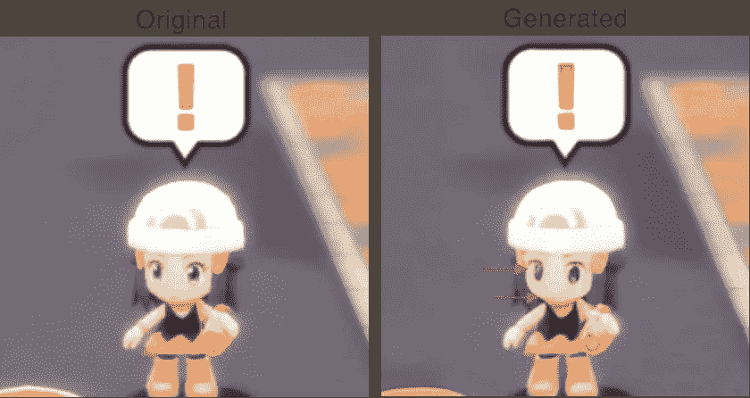

从上一张图片放大

最后，我还试图创造一个新角色:

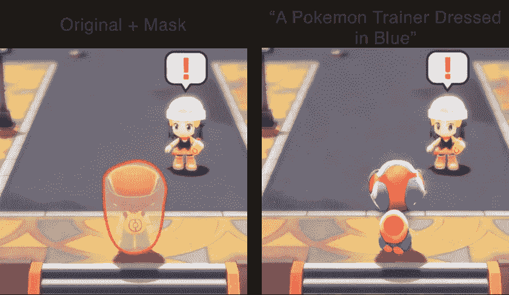

输入左边的图像和蒙版。右边生成的图像。

它有一个背包，一顶形状怪异的帽子和腿。“蓝色”提示被部分用于裤子和帽子。

## 它是如何工作的

与**图像到图像**非常相似，在**修复**过程中，我们修改了蒙版区域(**未知区域**)，同时保持图像的其余部分(**已知区域**))固定不变。与其他模型一样，我们可以输入一个文本提示，它将被编码并与图像的已知区域一起传递。然后，模型将使用符合区域形状和文本提示的图像来填充未知区域。

前面，我提到了潜在表示在计算和速度上的优势。对于**修复**，潜在扩散模型至少比**快 2.7 倍**，弗雷歇初始距离(FID) 增加了**1.6 倍。该度量量化了真实图像和生成图像之间的分布差异(平均值和标准偏差),而不是逐像素度量。这个想法是，它试图模仿图像之间相似性的“感知”。**

# 其他用途

该论文介绍了潜在扩散模型可以使用的其他方式:图像**超分辨率**和**布局到图像合成**。

**图像超分辨率**是从低分辨率图像生成高分辨率图像的过程。它在生物医学应用中特别有用，如 MRI 扫描。我怀疑，如果不进行任何再培训，这种模式能否有效地用于此类任务。然而，对于普通图像，结果在视觉上是令人愉快的:

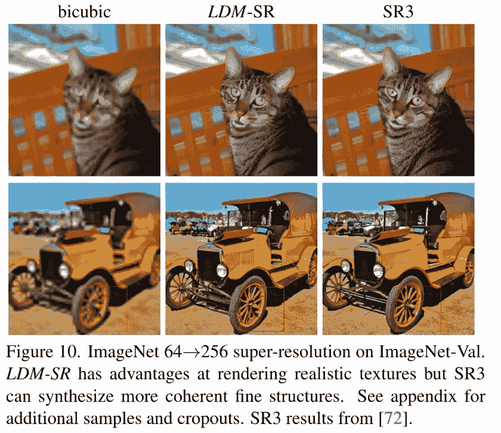

图片来自原论文[https://arxiv.org/abs/2112.10752](https://arxiv.org/abs/2112.10752)

**布局到图像合成**旨在生成符合边界框的图像，该边界框指导图像特定位置元素的生成。这是一个例子:

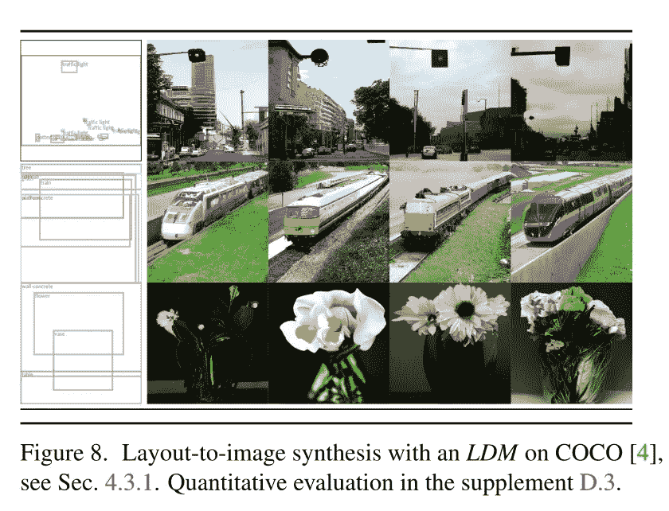

图片来自原论文[https://arxiv.org/abs/2112.10752](https://arxiv.org/abs/2112.10752)

# 局限性和道德考量

1.  一个非常直观的限制是，在没有任何关于主题的先验知识的情况下，该模型无法生成图像。例如，如果不知道星空是什么样子，就不可能生成与之相关的图像。有趣的是，是否可以纯粹基于文本描述而不用梵高的任何画作来生成相似的图像。
2.  人工智能模型的潜在滥用可能会产生重大的社会影响，例如，创建与垃圾邮件/新闻或攻击性图像相关的虚假图像。原始存储库有几个 NSFW 过滤器，用于隐藏攻击性图像，并在图像上放置不可见的水印，尽管鉴于该模型的开源性质，绕过它并非不可能。
3.  这些模型特别容易受到语言偏见的影响，并可能在生成图像时显示出来。因此，人工智能有可能误解提示并生成潜在的无关图像。
4.  这种模型已经被用于生成艺术，甚至赢得了艺术比赛(而评委不知道这是人工智能生成的)。这应该被允许吗？还有，你会对(只)使用潜在扩散模型的艺术比赛感兴趣吗？

 [## 一个人工智能在比赛中打败了人类艺术家。接下来会是他们的工作吗？

### 听听接下来的内容:TBD:上个月，一件名为“空间剧院”的艺术品(法语是“空间歌剧”的意思)

slate.com](https://slate.com/technology/2022/09/ai-artists-colorado-art-competition-midjourney.html) 

# 结论

在这篇文章中，我介绍了潜在扩散模型的三种用途:**文本到图像**、**图像到图像**和**修复**。我探索了(在神奇宝贝的上下文中)如何使用这些技术来生成图像以及每个生成的图像的特殊细节。

还有其他方式可以使用这些模型，例如用于图像超分辨率和布局到图像的合成。如果你想对这篇博文的某些部分进行更精确的解释，我强烈推荐原文:

 [## 利用潜在扩散模型的高分辨率图像合成

### 通过将图像形成过程分解为去噪自动编码器、扩散模型…

arxiv.org](https://arxiv.org/abs/2112.10752) 

或者这篇博文:

 [## 什么是扩散模型？

### 更新于 2021-09-19:强烈推荐这篇由宋洋(作者…

lilianweng.github.io](https://lilianweng.github.io/posts/2021-07-11-diffusion-models/#what-are-diffusion-models) 

*免责声明:*本帖所有生成的图片均由 stable diffusion(和我)使用官方 GitHub 代码创建:

 [## GitHub-CompVis/stable-diffusion:一个潜在的文本到图像的扩散模型

### 由于与 Stability AI 和 Runway 的合作，稳定的扩散成为可能，并建立在我们以前的…

github.com](https://github.com/CompVis/stable-diffusion) 

如果你发现任何错误或不准确，请随时评论/联系我，我会更新文章(并在特别感谢部分包括你)。